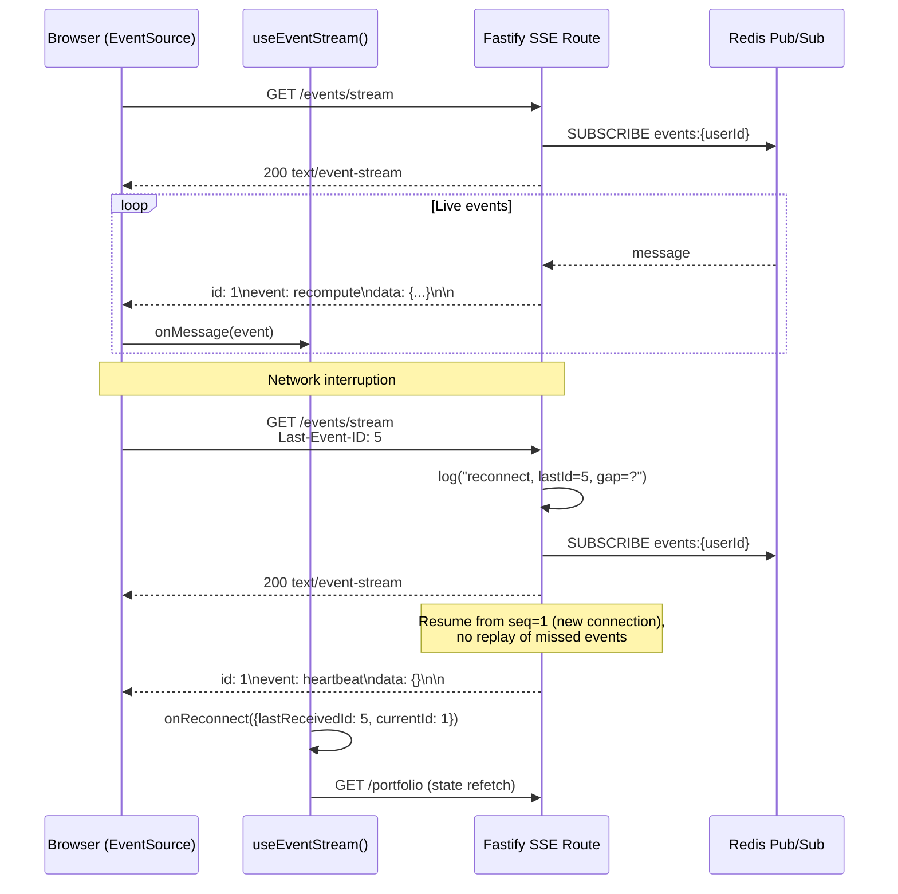
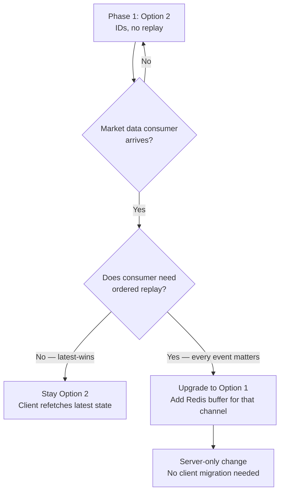

# Debate Result: lastEventId Gap Recovery Depth

Date: 2026-03-23

## Contested Question

How deep should the `lastEventId` reconnection gap recovery be implemented in the phase 1 SSE infrastructure (KZO-113)?

## Team

| Role | Perspective |
|------|------------|
| **Architect** | System design, forward-compatibility, migration cost |
| **Backend Engineer** | Implementation cost, Redis memory, operational complexity |
| **Frontend Engineer** | Client behavior, EventSource semantics, hook design |

## Round 1: Opening Positions

### Architect

**Position:** Option 2 — Protocol-compliant but shallow (IDs but no replay)

**Defense:**

1. **Wire format stability is the real investment.** The SSE `id:` field is part of the wire protocol between server and client. Adding it later (Option 3 to Option 1/2) requires coordinated changes: the Fastify route must start emitting `id:` lines, and the `useEventStream()` hook must be updated to expect them. Option 2 locks the wire format now at near-zero cost. Option 3 creates a mandatory migration when any of the five roadmap consumers needs IDs.

2. **Forward-compatible by construction.** Option 2 produces the exact same wire format as Option 1. The only difference is server-side: whether a buffer exists behind the `Last-Event-ID` header. Adding replay later (upgrading Option 2 to Option 1) is a purely server-side change — no client update, no protocol version bump, no feature flag. This is the cheapest possible upgrade path.

3. **Observable gap metrics for free.** With Option 2, the server receives `Last-Event-ID` on reconnect and knows the current sequence number. The gap size (`current - lastEventId`) is a free operational metric. Option 3 provides zero reconnection telemetry — you cannot even measure how often clients miss events or how large the gaps are. This data informs whether to invest in Option 1 for market data consumers.

4. **The previous debate already committed to this.** Implementation constraint #5 from the SSE infrastructure debate says "lastEventId for reconnection gap recovery." Option 3 violates this prior decision. Option 2 fulfills the spirit (IDs are present, gap is acknowledged) without over-investing in buffer infrastructure that no current consumer needs.

### Backend Engineer

**Position:** Option 2 — Protocol-compliant but shallow (IDs but no replay)

**Defense:**

1. **The implementation delta between Option 2 and Option 3 is trivial.** Looking at the codebase, the SSE route will write `data:` lines to `reply.raw`. Adding `id: ${seq}\n` before each `data:` line is one string interpolation. Parsing `Last-Event-ID` from the request header is `req.headers["last-event-id"]`. Total cost: ~5 lines of code. This is not a meaningful engineering investment to debate.

2. **The implementation delta between Option 2 and Option 1 is NOT trivial.** Option 1 requires: (a) a Redis list per user channel (`LPUSH` + `LTRIM` for circular buffer), (b) TTL management on those lists (events expire, but `LTRIM` does not expire individual entries — need `EXPIRE` on the key), (c) replay logic on reconnect (`LRANGE` the buffer, filter events after `Last-Event-ID`, write them to the stream before resuming live), (d) buffer size tuning per consumer type (recompute events are small, market data events could be large), (e) memory monitoring — the current Redis footprint is minimal (quote cache with 30s TTL, idempotency keys with 24h TTL). Adding per-user event buffers with unknown retention adds an unbounded dimension.

3. **No current consumer benefits from replay.** Recompute is synchronous and sub-second. If the client misses a "recompute complete" event during a reconnect, it can simply re-fetch the current state via `GET /portfolio`. The cascade recompute (KZO-114) status is convergent — the final state is what matters, not the intermediate events. Replay adds complexity for a consumer that does not need it.

4. **Redis connection budget matters.** The SSE infrastructure already adds a second Redis connection (pub/sub cannot share with the command connection). Option 1 would use the command connection for buffer reads on every reconnect, adding load to the same connection that serves quote cache and idempotency. Option 2 does not touch the command connection on reconnect.

### Frontend Engineer

**Position:** Option 2 — Protocol-compliant but shallow (IDs but no replay)

**Defense:**

1. **EventSource sends `Last-Event-ID` automatically — the client already does its part.** The browser `EventSource` API stores the last received `id:` value and includes it as `Last-Event-ID` on reconnection. This is not optional behavior — it happens if and only if the server sends `id:` fields. With Option 2, the browser does the right thing for free. With Option 3, the browser has nothing to send, and the `useEventStream()` hook would need to be redesigned later when IDs are added.

2. **The `useEventStream()` hook design is cleaner with IDs.** With IDs present, the hook can expose a `lastEventId` ref for debugging and stale-detection logic. The reconnect handler can log "reconnected, missed events from #{lastId} to #{currentId}" which is valuable for frontend observability. Without IDs, the hook is simpler but dumber — it cannot distinguish "reconnected with no gap" from "reconnected after missing 50 events."

3. **Client-side gap recovery is straightforward and already the pattern.** The existing `api.ts` client uses `getJson()` for state fetching. On SSE reconnect, the hook fires an `onReconnect` callback, the consuming component calls `getJson("/portfolio")` to refresh state, and continues receiving live events. This is the same pattern React Query / SWR use for stale-while-revalidate. No new client infrastructure needed.

4. **Option 3 is a false economy for the frontend.** Saving 2 lines on the server (`id:` field emission) costs the frontend a protocol migration later. When market data consumers arrive, the hook's `onmessage` handler must suddenly handle the new `id` field, the reconnect logic changes, and every test mock must be updated. With Option 2, the wire format is stable from day one.

## Round 2: Rebuttals

### Architect

**Responding to the strongest counterargument: "Option 1 is needed for market data — why not build it now?"**

No one argued for Option 1 in Round 1, but I want to preemptively address why not to jump to it. The argument would be: "The previous debate said five consumers are coming, market data needs gap recovery, so build the buffer now."

The rebuttal: **we do not yet know the buffer semantics for market data.** Quote refresh (KZO-87) publishes "new EOD snapshot available" — is the right behavior to replay 3 missed "snapshot available" events, or to replay just the latest one? Bar ingestion (KZO-85/86) publishes "daily bar for AAPL ingested" — should replay deduplicate by symbol? Provider health (KZO-91) publishes status changes — should replay compact to latest status per provider?

Building a generic circular buffer now means guessing at compaction and deduplication semantics for consumers that do not exist yet. Option 2 defers that decision until we have real consumer requirements, while locking the wire protocol so the upgrade is invisible to clients.

**Position unchanged: Option 2.**

### Backend Engineer

**Responding to the strongest counterargument: "The 5-line delta means Option 2 vs Option 3 doesn't matter — just do Option 3 for purity."**

This argument says: if the server does not replay, why bother with IDs? The client refetches state on reconnect regardless.

The rebuttal is operational. With Option 3:
- You cannot measure reconnection frequency per user.
- You cannot measure gap size (how many events were missed).
- You cannot alert on degraded connections (a client that reconnects every 2 seconds is probably behind a flaky proxy).
- You cannot make a data-driven decision about when to invest in Option 1.

With Option 2, the server logs `INFO reconnect userId=abc lastEventId=42 currentSeq=47 gap=5` on every reconnect. This is free telemetry. The Redis command connection is not touched. The only cost is a per-connection `let seq = 0` counter and one header read.

Furthermore, looking at the existing persistence code, the `PostgresPersistence` class already manages Redis keys with structured prefixes (`quote:`, `idempotency:`). A future buffer would follow the same pattern (`events:{userId}`). Option 2 does not preclude or complicate that future work. Option 3 does not either, but Option 3 loses the telemetry.

**Position unchanged: Option 2.**

### Frontend Engineer

**Responding to the strongest counterargument: "EventSource handles reconnection automatically — why does the frontend care about IDs?"**

This argument says: EventSource reconnects regardless of whether IDs are present. The reconnect behavior is the same. So the frontend is unaffected by Option 2 vs Option 3.

The rebuttal is about **hook API design and test stability.** The `useEventStream()` hook needs to handle three scenarios:

1. **Initial connection** — open EventSource, start receiving events.
2. **Reconnection** — EventSource auto-reconnects, fire `onReconnect` callback.
3. **Gap detection** — know whether events were missed during reconnect.

With Option 2, the hook's `onopen` handler can compare `eventSource.url` params or track the last received ID internally. The `onReconnect` callback can be typed as `(gap: { lastReceived: number; resumedAt: number }) => void`, giving consumers enough information to decide whether to refetch.

With Option 3, the hook's `onReconnect` callback is `() => void` — it knows a reconnect happened but not whether events were missed. Every consumer must defensively refetch on every reconnect, even if the reconnect was instantaneous with no gap. This is wasteful for the common case (reconnect after a brief network blip with zero missed events).

With Option 2, the hook can say "gap was 0, no refetch needed" vs "gap was 5, refetch." This is a meaningful UX optimization — unnecessary refetches cause loading spinners and state flicker.

**Position unchanged: Option 2.**

## Vote Tally

| Role | Vote |
|------|------|
| Architect | **Option 2** |
| Backend Engineer | **Option 2** |
| Frontend Engineer | **Option 2** |

**Result: Option 2 wins unanimously (3-of-3).**

No dissent. Option 1 received zero advocacy. Option 3 received zero advocacy. The team converged on Option 2 independently, with each role citing different domain-specific reasons.

## Conclusions

**Agreed positions:**

1. **Emit monotonic event IDs in the SSE `id:` field from day one.** Per-connection integer counter, starting at 1. The counter is per SSE connection, not globally unique — this is sufficient for `Last-Event-ID` semantics since each connection is user-scoped.

2. **Parse `Last-Event-ID` on reconnect but do NOT replay.** Log the gap size for operational telemetry. Resume the live stream from the current point.

3. **Client handles gaps via state refetch.** The `useEventStream()` hook fires an `onReconnect(gap)` callback. Consumers decide whether to refetch based on gap size. For cascade recompute (KZO-114), always refetch on reconnect since the state is convergent.

4. **Do NOT build event buffer infrastructure in phase 1.** No Redis lists, no LPUSH/LTRIM, no buffer TTL management. This decision is revisited when a market data consumer (KZO-87 or KZO-85/86) defines its replay semantics.

5. **Wire format is locked.** The SSE stream format (`id:`, `event:`, `data:`) is stable from the first release. Adding replay later is a server-only change — no client migration needed.

## Implementation Constraints (from debate)

1. Event IDs are per-connection monotonic integers (not UUIDs, not global sequence numbers). A `let seq = 0` counter per SSE connection, incremented on each event write.
2. The SSE route reads `req.headers["last-event-id"]` on connection open. If present, log the reconnection with gap size. Do not attempt replay.
3. The `useEventStream()` hook tracks `lastEventId` internally and exposes it in the `onReconnect` callback signature: `onReconnect?: (gap: { lastReceivedId: number; currentId: number }) => void`.
4. No Redis buffer data structures (lists, sorted sets) for event storage in phase 1.
5. The gap telemetry log line should include: `userId`, `lastEventId` (from header), `currentSeq` (server-side counter at reconnect time), and computed `gapSize`.
6. For the cascade recompute consumer (KZO-114), the `onReconnect` handler should always trigger a state refetch via `GET /portfolio` regardless of gap size, since recompute state is convergent.

## Diagrams

### Option 2 Reconnection Flow (Chosen)

### Decision Tree: When to Upgrade to Option 1

## Open Items

1. **Per-connection vs per-user sequence numbers.** The debate settled on per-connection counters for simplicity. If a future consumer needs globally ordered event IDs (e.g., for cross-tab deduplication), this decision should be revisited. Per-connection IDs are sufficient for gap detection but do not support cross-session replay.

2. **Heartbeat interval.** The SSE route should send periodic heartbeat events (e.g., every 30s) to keep the connection alive through proxies and load balancers. The heartbeat should include an `id:` field so `Last-Event-ID` stays current even during idle periods. The exact interval is not decided here.

3. **Gap size alerting threshold.** The telemetry log is agreed upon, but at what gap size should the system alert? This depends on event frequency per consumer type and should be tuned after production data is collected.
