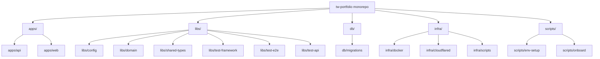
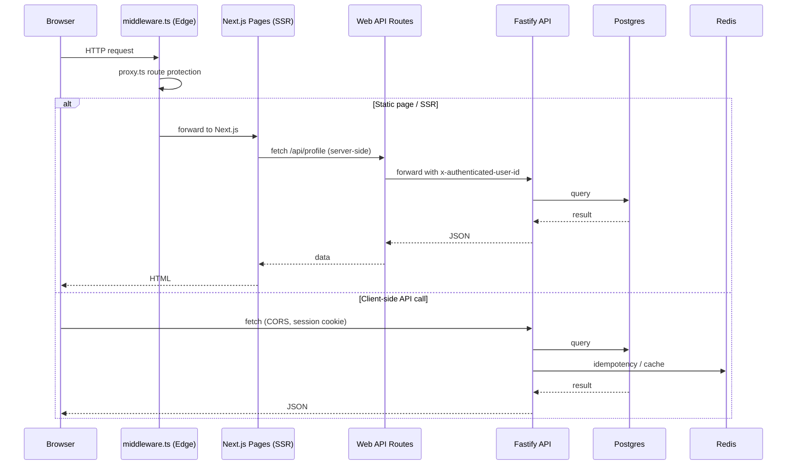
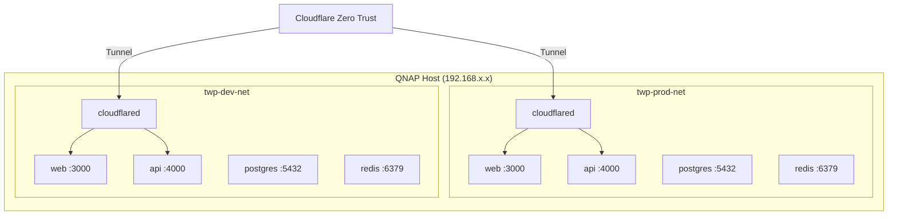
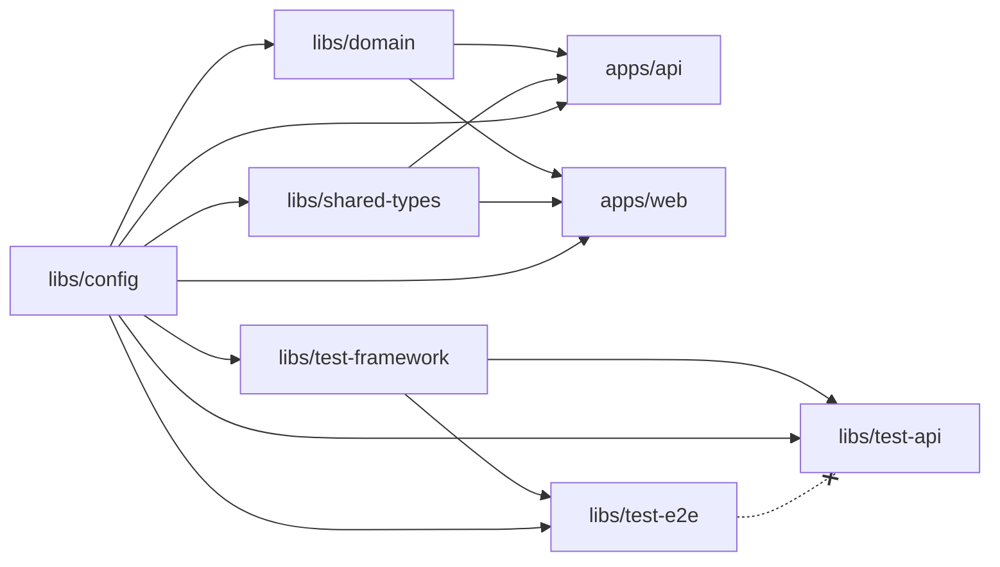
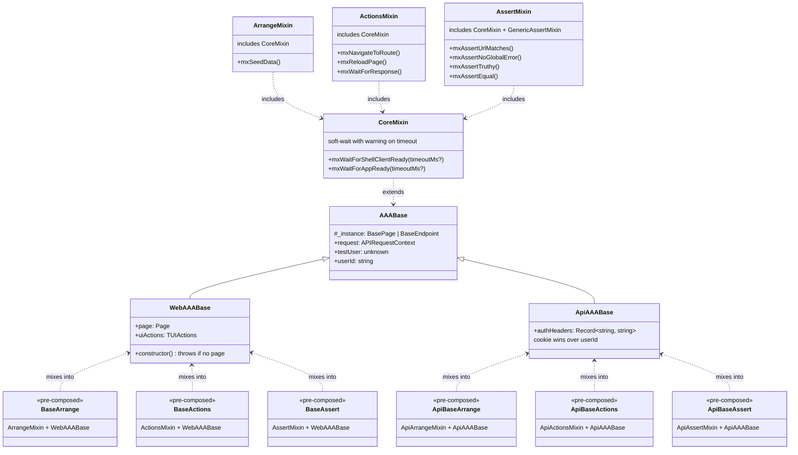
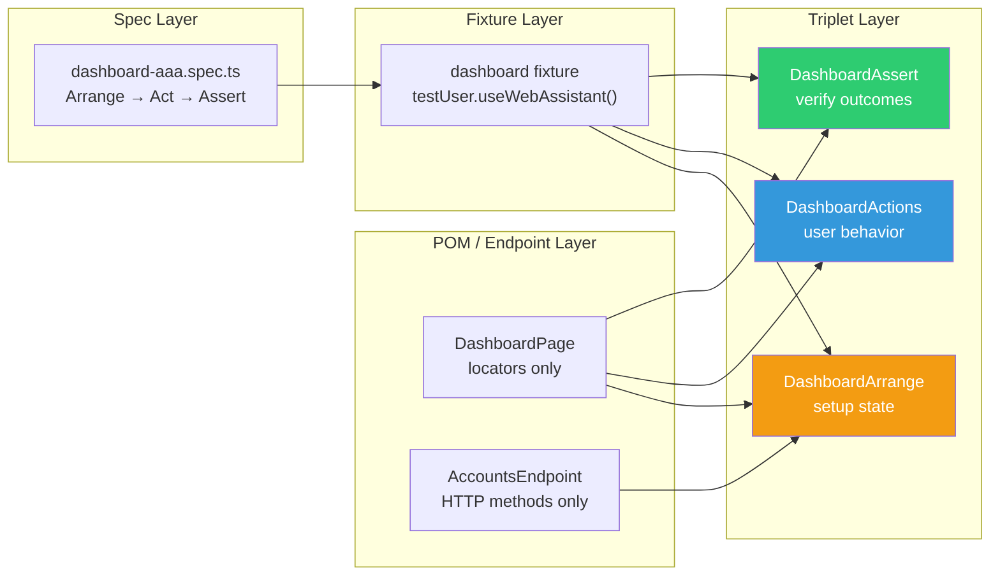
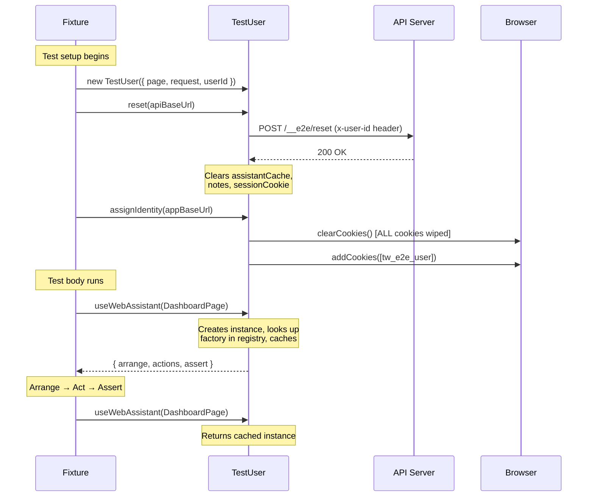
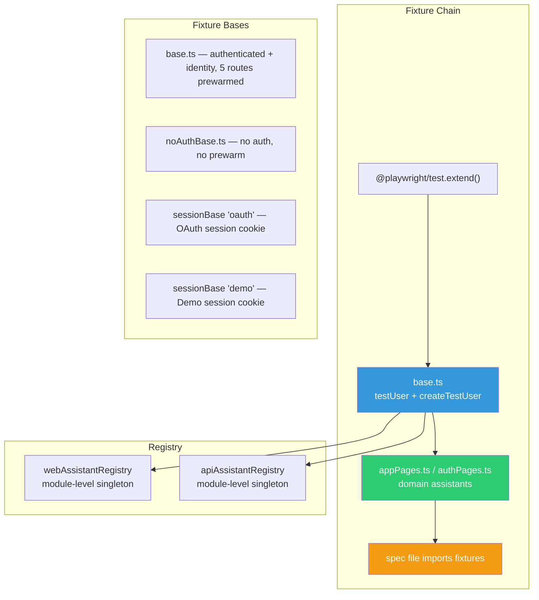

# System Architecture

This document describes the monorepo structure, request lifecycle, deployment topology, and build model for the tw-portfolio stack.

---

## Monorepo Structure



### Package table

| Package | Purpose | Runtime |
|---------|---------|---------|
| `apps/api` | Fastify REST API — routes, services, persistence | Node.js |
| `apps/web` | Next.js frontend — pages, components, API route handlers | Node.js (SSR) + Edge (middleware) |
| `libs/config` | Zod env schemas, env loading, shared constants | Node.js + Edge |
| `libs/domain` | Pure accounting logic — fee calculation, lot allocation, invariants | Node.js |
| `libs/shared-types` | TypeScript type contracts shared between API and web | Build-time only |
| `libs/test-framework` | Generic AAA test framework — core classes, mixins, actions, logging, decorators | Playwright + Vitest |
| `libs/test-e2e` | App-specific web E2E — page objects, assistants (Arrange/Actions/Assert triplets), fixtures | Playwright |
| `libs/test-api` | App-specific API HTTP — endpoint descriptors, assistants (Arrange/Actions/Assert triplets), fixtures | Playwright |
| `db` | SQL migrations and baseline schema | Postgres (via migrate container) |
| `infra` | Docker Compose files, deploy scripts, Cloudflare config | Host tooling |
| `scripts` | Env file generator, onboarding, dev helpers | Node.js CLI |

**Test library dependency rule:** `test-e2e` and `test-api` are siblings — both import from `test-framework`, never from each other.

---

## Request Lifecycle



### Key participants

| Participant | Location | Responsibility |
|-------------|----------|----------------|
| Middleware `proxy.ts` | `apps/web/middleware.ts` | Edge Runtime — route protection, session check, redirect to `/login` when `AUTH_MODE=oauth` |
| SSR `auth.ts` | `apps/web/lib/auth.ts` | Server-side session resolution — `getSession`, `requireSession`, `resolveSession` |
| Web API routes | `apps/web/app/api/*/route.ts` | Server-side proxy to Fastify API with auth header forwarding |
| API auth `resolveUserId` | `apps/api/src/routes/registerRoutes.ts` | Extracts user identity from HMAC session cookie (oauth) or defaults to `user-1` (dev_bypass) |
| Persistence `postgres.ts` | `apps/api/src/persistence/postgres.ts` | SQL reads/writes, migrations, Redis idempotency and cache |

---

## Persistence Backends

| Backend | Config value | Storage | Use case |
|---------|-------------|---------|----------|
| Postgres + Redis | `PERSISTENCE_BACKEND=postgres` | SQL tables + Redis cache/idempotency | Production, Docker local, integration tests |
| Memory | `PERSISTENCE_BACKEND=memory` | In-process JS objects | Unit tests, E2E tests, fast local dev |

### Postgres write paths

| Path | Trigger | Strategy |
|------|---------|----------|
| `savePostedTrade` | `POST /portfolio/transactions` | Incremental — inserts one trade + snapshot + cash + lot updates |
| `savePostedDividend` | `POST /portfolio/dividends/postings` | Incremental — upserts dividend event + ledger + deductions + cash + lots |
| `saveStore` | Settings save, recompute confirm | Full-store rewrite — replaces users, profiles, accounts, overrides, recompute jobs, then delegates to `saveAccountingStoreTx` |
| `saveAccountingStoreTx` | Called by `saveStore`, corporate actions, AI confirm | Full accounting rewrite — deletes and reinserts all trade, cash, dividend, lot, and snapshot rows |

---

## Deployment Topology



### Environment tiers

| Tier | Compose file | Project prefix | Network | Ingress |
|------|-------------|----------------|---------|---------|
| Local | `docker-compose.local.yml` | `twp-local` | `twp-local-net` | Host port mapping (+300 offset) |
| Dev | `docker-compose.dev.yml` | `twp-dev` | `twp-dev-net` | Cloudflare Tunnel |
| Production | `docker-compose.prod.yml` | `twp-prod` | `twp-prod-net` | Cloudflare Tunnel |

### Port mapping

| Service | Local (host:container) | Dev (host:container) | Production |
|---------|----------------------|---------------------|------------|
| Web | 3300:3000 | internal | internal |
| API | 4300:4000 | internal | internal |
| Postgres | 5732:5432 | 5454:5432 | internal |
| Redis | 6679:6379 | 6363:6379 | internal |

### Container resource limits

| Resource | Container limits total | Host available (est.) | Headroom |
|----------|----------------------|----------------------|----------|
| Memory | ~1,920 MB | 8 GB | ~6 GB for OS/QTS |
| vCPUs | 3.75 | 4 cores | ~0.25 for OS |

---

## Build Model



Dependency build order:

1. `libs/config` — Zod schemas, env loading (no internal deps)
2. `libs/domain` — accounting logic (depends on config)
3. `libs/shared-types` — type contracts (depends on config)
4. `libs/test-framework` — generic AAA core (depends on config)
5. `libs/test-e2e` — web E2E assistants and pages (depends on test-framework, config)
6. `libs/test-api` — API HTTP endpoints and assistants (depends on test-framework, config)
7. `apps/api` — Fastify server (depends on domain, shared-types, config; dev-depends on test-framework, test-api)
8. `apps/web` — Next.js app (depends on domain, shared-types, config; dev-depends on test-framework, test-e2e)

Workspace libraries are **not** built during `npm install`. Run `npm run build -w libs/domain -w libs/shared-types` after editing those packages, or use `npm run onboard` for initial setup.

```
Plain-text dependency flow:

libs/config ──► libs/domain ──► apps/api
           ──► libs/shared-types ──► apps/api
           ──► apps/api
           ──► apps/web

libs/config ──► libs/test-framework ──► libs/test-e2e  (web E2E)
                                   ──► libs/test-api   (API HTTP)
libs/test-e2e ──╳── libs/test-api   (siblings, never import each other)
```

---

## Test Architecture

The AAA (Arrange-Act-Assert) test framework is a three-layer system: a generic core (`test-framework`), and two app-specific siblings (`test-e2e` for web E2E, `test-api` for API HTTP).

### AAA Class Hierarchy



```
Plain-text:

AAABase (shared spine)
├── WebAAABase (Page + uiActions)
│   ├── BaseArrange  = ArrangeMixin(WebAAABase)
│   ├── BaseActions  = ActionsMixin(WebAAABase)
│   └── BaseAssert   = AssertMixin(WebAAABase)
│
└── ApiAAABase (authHeaders)
    ├── ApiBaseArrange  = ApiArrangeMixin(ApiAAABase)
    ├── ApiBaseActions  = ApiActionsMixin(ApiAAABase)
    └── ApiBaseAssert   = ApiAssertMixin(ApiAAABase)

Mixin chain (diamond composition, intentional):
  CoreMixin ──► ArrangeMixin
             ──► ActionsMixin
             ──► AssertMixin (+ GenericAssertMixin)
```

### AAA Triplet Pattern (Per Feature)

Each page or endpoint gets three assistant classes. POMs/endpoints are vocabulary-only (locators, HTTP bindings). Triplets contain behavior.



```
Plain-text:

Spec (test file)
  └── Fixture (wires assistants via TestUser)
        ├── Arrange (extends BaseArrange) ── reads POM / Endpoint
        ├── Actions (extends BaseActions) ── reads POM / Endpoint
        └── Assert  (extends BaseAssert)  ── reads POM / Endpoint

Boundary rules:
  - No expect() in Arrange or Actions (ESLint-enforced)
  - No direct this.page.* in assistants (use mixins/uiActions)
  - POMs: locators + descriptions only, zero behavior
  - @Step() on all public assistant methods
```

### TestUser Lifecycle

TestUser is the per-test orchestrator that holds identity, page/request references, and the assistant cache.



```
Plain-text:

1. Fixture creates TestUser with { page, request, userId }
2. reset(apiBaseUrl) → POST /__e2e/reset → clears cache, notes, sessionCookie
3. assignIdentity(appBaseUrl) → clearCookies() (ALL) → addCookies([tw_e2e_user])
4. useWebAssistant(PageClass) → create instance → registry lookup → cache → return triplet
5. Repeat useWebAssistant(same) → returns cached
6. After reset() → cache cleared → next call creates fresh
```

### Fixture Chain & Execution Flow



```
Plain-text:

Fixture chain:
  @playwright/test.extend()
    → base.ts (testUser, createTestUser, e2eUserId)
      → domain.ts (appShell, dashboard, settings, etc.)
        → spec file imports the domain fixture

Fixture base decision tree:
  ┌──────────────────┬──────────────┬────────────┬──────────────────────────┐
  │ Base              │ Auth         │ Prewarm    │ Use for                  │
  ├──────────────────┼──────────────┼────────────┼──────────────────────────┤
  │ base.ts           │ Authed + ID  │ 5 routes   │ Standard feature tests   │
  │ noAuthBase.ts     │ None         │ None       │ Login, auth errors       │
  │ sessionBase(oauth)│ OAuth cookie │ None       │ OAuth session management │
  │ sessionBase(demo) │ Demo cookie  │ None       │ Demo flows, rate limits  │
  └──────────────────┴──────────────┴────────────┴──────────────────────────┘

Registry: module-level singletons, idempotent, _reset() for test isolation
Prewarming: per-worker Set, shared across tests (not reset between tests)
```

---

## Related Docs

- [Backend, DB & API](./backend-db-api.md) — Postgres schema, ER diagram, API routes, persistence write paths
- [Web Frontend](./web-frontend.md) — component layering, auth middleware, session resolution
- [Auth and Session](./auth-and-session.md) — OAuth flow, dev_bypass, demo mode, cookies, identity resolution
- [Acceptance Test Mapping](../002-operations/acceptance-test-mapping.md) — test coverage mapping, AAA spec inventory, 7-suite definition
- [Runbook](../002-operations/runbook.md) — local dev, deployment, troubleshooting, rollback
- [Environment Variables](../002-operations/environment-variables.md) — all env vars, schemas, validation, generation
- [CI/CD](../002-operations/ci-cd.md) — GitHub Actions, deploy workflows, PR gate
