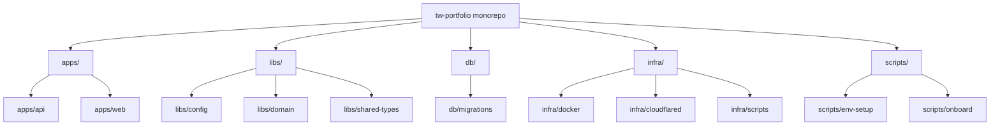
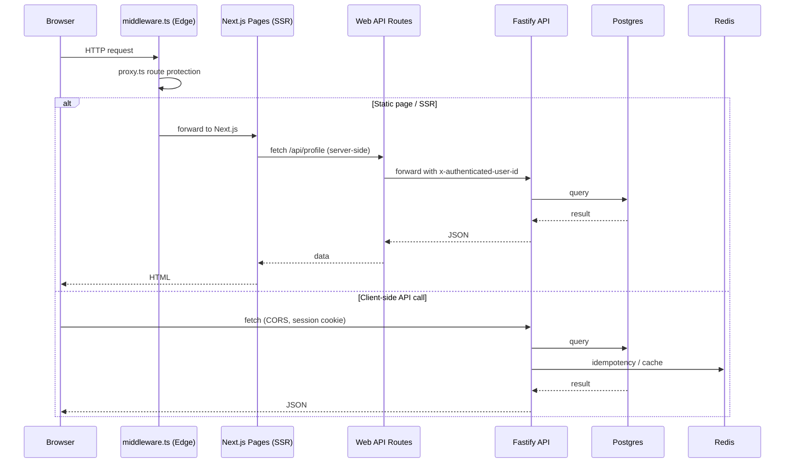
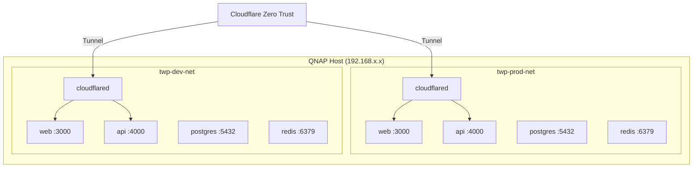
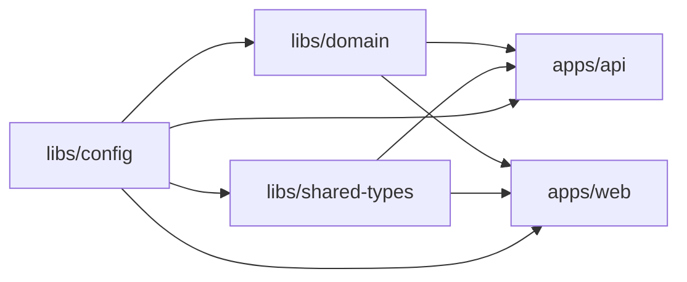

# System Architecture

This document describes the monorepo structure, request lifecycle, deployment topology, and build model for the tw-portfolio stack.

---

## Monorepo Structure

### Package table

| Package | Purpose | Runtime |
|---------|---------|---------|
| `apps/api` | Fastify REST API — routes, services, persistence | Node.js |
| `apps/web` | Next.js frontend — pages, components, API route handlers | Node.js (SSR) + Edge (middleware) |
| `libs/config` | Zod env schemas, env loading, shared constants | Node.js + Edge |
| `libs/domain` | Pure accounting logic — fee calculation, lot allocation, invariants | Node.js |
| `libs/shared-types` | TypeScript type contracts shared between API and web | Build-time only |
| `db` | SQL migrations and baseline schema | Postgres (via migrate container) |
| `infra` | Docker Compose files, deploy scripts, Cloudflare config | Host tooling |
| `scripts` | Env file generator, onboarding, dev helpers | Node.js CLI |

---

## Request Lifecycle

### Key participants

| Participant | Location | Responsibility |
|-------------|----------|----------------|
| Middleware `proxy.ts` | `apps/web/middleware.ts` | Edge Runtime — route protection, session check, redirect to `/login` when `AUTH_MODE=oauth` |
| SSR `auth.ts` | `apps/web/lib/auth.ts` | Server-side session resolution — `getSession`, `requireSession`, `resolveSession` |
| Web API routes | `apps/web/app/api/*/route.ts` | Server-side proxy to Fastify API with auth header forwarding |
| API auth `resolveUserId` | `apps/api/src/routes/registerRoutes.ts` | Extracts user identity from HMAC session cookie (oauth) or defaults to `user-1` (dev_bypass) |
| Persistence `postgres.ts` | `apps/api/src/persistence/postgres.ts` | SQL reads/writes, migrations, Redis idempotency and cache |

---

## Persistence Backends

| Backend | Config value | Storage | Use case |
|---------|-------------|---------|----------|
| Postgres + Redis | `PERSISTENCE_BACKEND=postgres` | SQL tables + Redis cache/idempotency | Production, Docker local, integration tests |
| Memory | `PERSISTENCE_BACKEND=memory` | In-process JS objects | Unit tests, E2E tests, fast local dev |

### Postgres write paths

| Path | Trigger | Strategy |
|------|---------|----------|
| `savePostedTrade` | `POST /portfolio/transactions` | Incremental — inserts one trade + snapshot + cash + lot updates |
| `savePostedDividend` | `POST /portfolio/dividends/postings` | Incremental — upserts dividend event + ledger + deductions + cash + lots |
| `saveStore` | Settings save, recompute confirm | Full-store rewrite — replaces users, profiles, accounts, overrides, recompute jobs, then delegates to `saveAccountingStoreTx` |
| `saveAccountingStoreTx` | Called by `saveStore`, corporate actions, AI confirm | Full accounting rewrite — deletes and reinserts all trade, cash, dividend, lot, and snapshot rows |

---

## Deployment Topology

### Environment tiers

| Tier | Compose file | Project prefix | Network | Ingress |
|------|-------------|----------------|---------|---------|
| Local | `docker-compose.local.yml` | `twp-local` | `twp-local-net` | Host port mapping (+300 offset) |
| Dev | `docker-compose.dev.yml` | `twp-dev` | `twp-dev-net` | Cloudflare Tunnel |
| Production | `docker-compose.prod.yml` | `twp-prod` | `twp-prod-net` | Cloudflare Tunnel |

### Port mapping

| Service | Local (host:container) | Dev (host:container) | Production |
|---------|----------------------|---------------------|------------|
| Web | 3300:3000 | internal | internal |
| API | 4300:4000 | internal | internal |
| Postgres | 5732:5432 | 5454:5432 | internal |
| Redis | 6679:6379 | 6363:6379 | internal |

### Container resource limits

| Resource | Container limits total | Host available (est.) | Headroom |
|----------|----------------------|----------------------|----------|
| Memory | ~1,920 MB | 8 GB | ~6 GB for OS/QTS |
| vCPUs | 3.75 | 4 cores | ~0.25 for OS |

---

## Build Model

Dependency build order:

1. `libs/config` — Zod schemas, env loading (no internal deps)
2. `libs/domain` — accounting logic (depends on config)
3. `libs/shared-types` — type contracts (depends on config)
4. `apps/api` — Fastify server (depends on all libs)
5. `apps/web` — Next.js app (depends on all libs)

Workspace libraries are **not** built during `npm install`. Run `npm run build -w libs/domain -w libs/shared-types` after editing those packages, or use `npm run onboard` for initial setup.

---

## Related Docs

- [Backend, DB & API](./backend-db-api.md) — Postgres schema, ER diagram, API routes, persistence write paths
- [Web Frontend](./web-frontend.md) — component layering, auth middleware, session resolution
- [Auth and Session](./auth-and-session.md) — OAuth flow, dev_bypass, demo mode, cookies, identity resolution
- [Runbook](../002-operations/runbook.md) — local dev, deployment, troubleshooting, rollback
- [Environment Variables](../002-operations/environment-variables.md) — all env vars, schemas, validation, generation
- [CI/CD](../002-operations/ci-cd.md) — GitHub Actions, deploy workflows, PR gate
