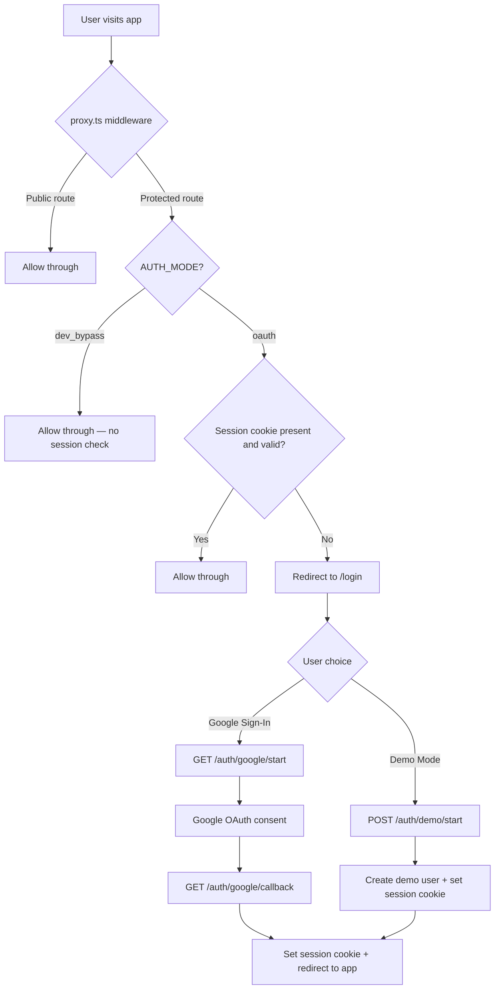
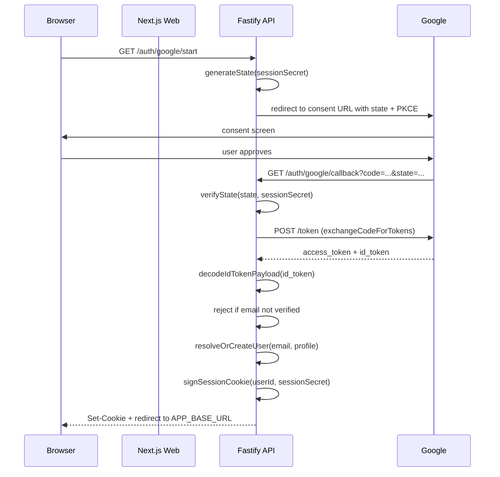
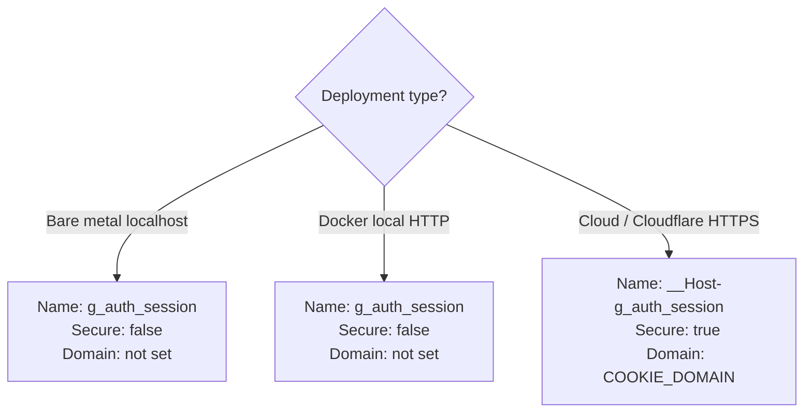
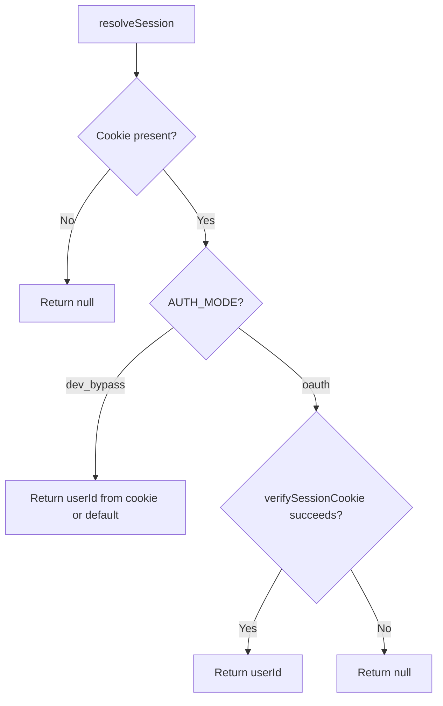
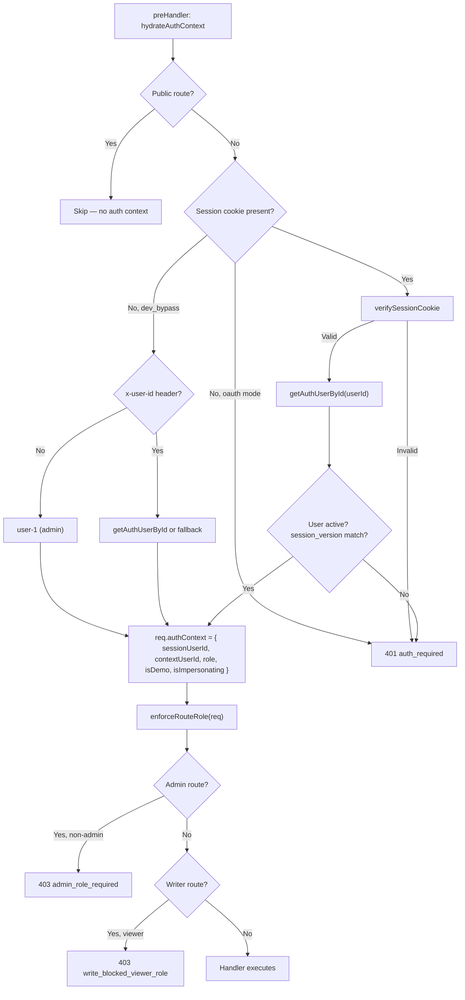
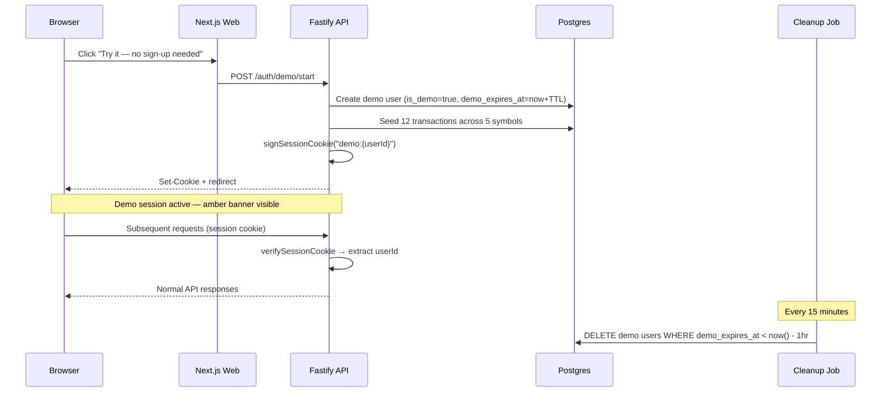
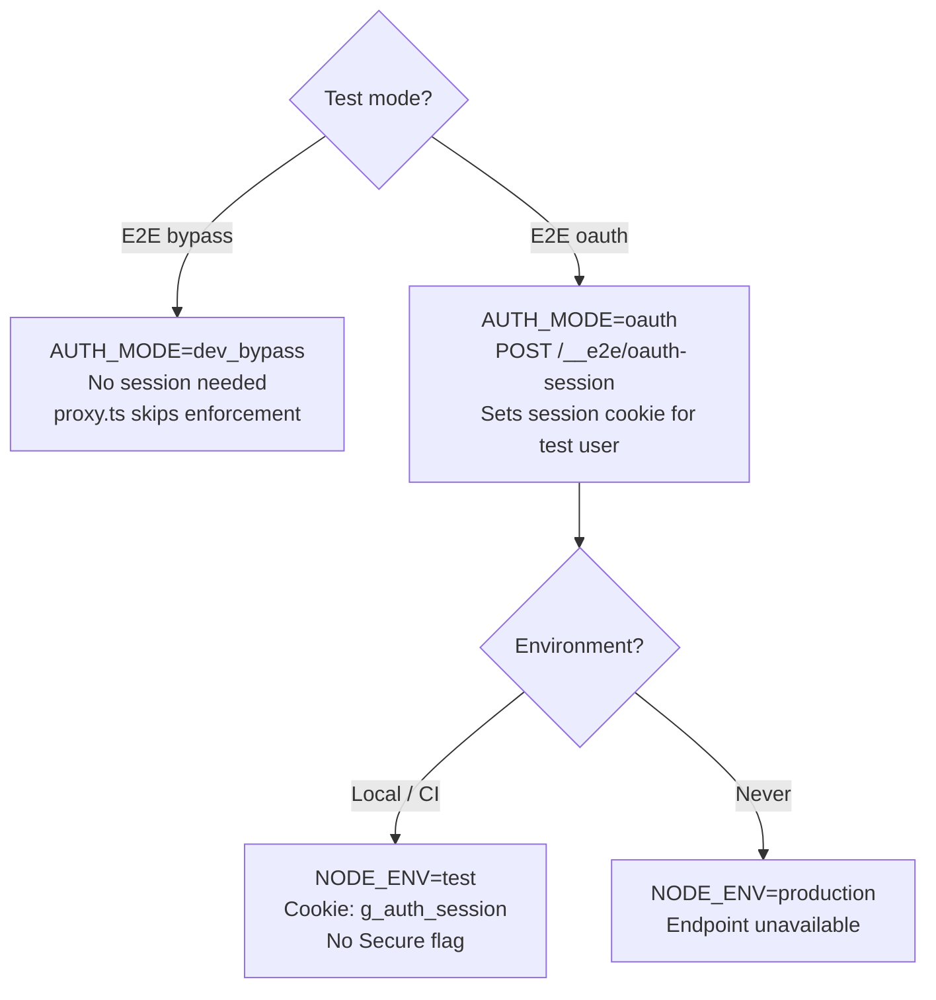
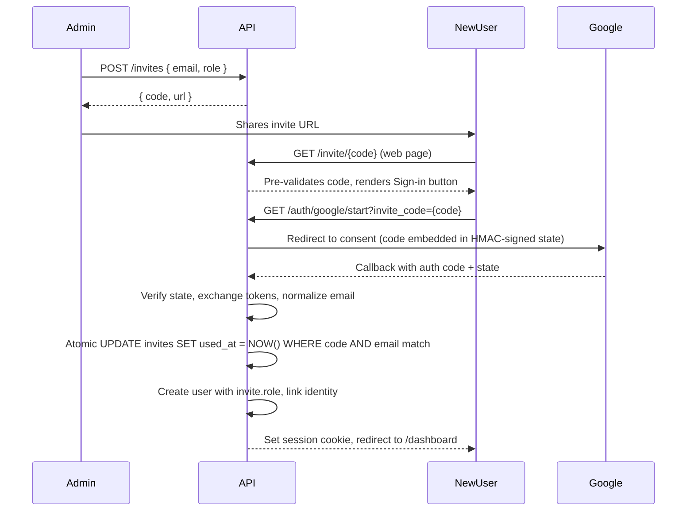

# Auth and Session Architecture

This document covers authentication modes, the OAuth lifecycle, demo mode, session cookies, and identity resolution across the web and API layers.

---

## Auth Modes

| Mode | Config value | Identity source | Use case |
|------|-------------|-----------------|----------|
| `dev_bypass` | `AUTH_MODE=dev_bypass` | Hardcoded `user-1` (API), no session enforcement (web middleware) | Local development, E2E tests |
| `oauth` | `AUTH_MODE=oauth` | HMAC-signed session cookie set after Google OAuth login | Production, Docker deployments, OAuth E2E tests |

`dev_bypass` is restricted to `NODE_ENV=development` or `NODE_ENV=test`. The API rejects `dev_bypass` when `NODE_ENV=production`.

---

## Unified Auth Flow

---

## Google OAuth Full Lifecycle

### Key functions

| Function | Location | Purpose |
|----------|----------|---------|
| `generateState` | `apps/api/src/auth/oauth.ts` | Creates HMAC-signed CSRF state token |
| `verifyState` | `apps/api/src/auth/oauth.ts` | Validates state token signature and expiry |
| `buildAuthorizationUrl` | `apps/api/src/auth/oauth.ts` | Constructs Google consent URL with scopes and state |
| `exchangeCodeForTokens` | `apps/api/src/auth/oauth.ts` | Exchanges auth code for access + ID tokens |
| `decodeIdTokenPayload` | `apps/api/src/auth/oauth.ts` | Base64-decodes and parses ID token payload |
| `signSessionCookie` | `apps/api/src/auth/session.ts` | Creates `{payload}.{hmacSignature}` session cookie |
| `verifySessionCookie` | `apps/api/src/auth/session.ts` | Validates HMAC signature and extracts userId |
| `resolveOrCreateUser` | `apps/api/src/services/userIdentity.ts` | Upserts user by email, links external identity, seeds default portfolio |

### OAuth routes

| Method | Path | Purpose |
|--------|------|---------|
| `GET` | `/auth/google/start` | Initiates OAuth flow — generates state, redirects to Google |
| `GET` | `/auth/google/callback` | Handles callback — exchanges code, creates session, redirects to app |
| `GET` | `/auth/logout` | Clears session cookie, redirects to login |
| `POST` | `/auth/token/refresh` | Refreshes session token |

---

## Session Cookie

### Format

Two formats coexist, disambiguated by part count:

**OAuth sessions (3-part):** `{userId}.{sessionVersion}.{hmacSignature}`

- **Payload**: `{userId}.{sessionVersion}` — internal UUID + integer version counter
- **Signature**: HMAC-SHA256 of the full payload using `SESSION_SECRET`
- **Session version**: checked against `users.session_version` on every authenticated API request. Mismatch → 401 (forces re-login after admin actions like disable or role change).

**Demo sessions (2-part):** `demo:{userId}.{hmacSignature}`

- **Payload**: `demo:{userId}` — prefix distinguishes from OAuth sessions
- **Signature**: HMAC-SHA256 of the full payload using `SESSION_SECRET`
- **No version check**: demo sessions self-expire via `demo_expires_at`; `session_version` does not apply.

`parseSessionCookie` splits on `.` and routes by part count: 2 parts → demo path, 3 parts → OAuth path. Old 2-part OAuth cookies (pre-KZO-143) fail signature verification and force a one-time re-login.

### Cookie attributes

| Attribute | Value | Notes |
|-----------|-------|-------|
| Path | `/` | Available to all routes |
| HttpOnly | `true` | Not accessible via JavaScript |
| SameSite | `Lax` | Protects against CSRF while allowing top-level navigation |
| Secure | `true` when `NODE_ENV=production` | Required for `__Host-` prefix |
| Domain | Set by `COOKIE_DOMAIN` | Enables cross-subdomain sharing (e.g., `.example.com`) |
| Max-Age | 7 days (OAuth), `DEMO_SESSION_TTL_SECONDS` (demo) | Session expiry |

### Cookie configuration by deployment

The `__Host-` prefix requires `Secure=true`, `Path=/`, and no `Domain` attribute. Use it only over HTTPS. For HTTP environments (local Docker, bare metal dev), use `g_auth_session` without the prefix.

---

## Identity Resolution — Web Side

### Web auth functions

| Function | Location | Behavior |
|----------|----------|----------|
| `getSession` | `apps/web/lib/auth.ts` | Returns `{ userId }` or `null` — never throws, never redirects |
| `requireSession` | `apps/web/lib/auth.ts` | Returns session or redirects to `/login` (302/307) — use for page-level guards only |
| `resolveSession` | `apps/web/lib/auth.ts` | Internal implementation — reads cookie, verifies signature, returns session |

**Important**: In API route handlers (`app/api/*/route.ts`), always use `getSession()` with a manual 401 JSON response. Never use `requireSession()` — it issues a redirect, not a JSON error.

---

## Identity Resolution — API Side

**Return shape:** `resolveUserId` returns `{ sessionUserId, contextUserId, role, isDemo, isImpersonating }`. In the current version, `contextUserId` always equals `sessionUserId` (sharing/impersonation added in KZO-146/148).

The `preHandler` hook runs `hydrateAuthContext` (one DB hit per request to fetch `role` and `session_version`) then `enforceRouteRole` (checks admin-only and writer-only route sets). In `dev_bypass` mode, `x-user-role` header overrides the resolved role per-request without mutating the DB.

---

## Demo Mode

### Lifecycle

### Demo components

| Component | Location | Purpose |
|-----------|----------|---------|
| `DemoButton` | `apps/web/components/DemoButton.tsx` | "Try it" button on login page — calls `POST /auth/demo/start` |
| `DemoBanner` | `apps/web/components/DemoBanner.tsx` | Amber banner on protected pages — "You're using a demo session" |
| Demo route handler | `apps/api/src/routes/registerRoutes.ts` | `POST /auth/demo/start` — creates user, seeds data, sets cookie |
| `SignInButton` | `apps/web/components/SignInButton.tsx` | Google sign-in button — hidden when demo mode disabled |

### Demo user data model

- `users.is_demo = true`
- `users.demo_expires_at` = creation time + `DEMO_SESSION_TTL_SECONDS`
- Cookie payload prefixed with `demo:` to distinguish from OAuth sessions
- 12 seeded transactions across 5 Taiwan stock/ETF symbols
- Rate-limited: 5 demo starts per minute per IP

### Guards

- `DEMO_MODE_ENABLED=false` (default): demo button hidden, `POST /auth/demo/start` returns 404, cleanup job does not run
- `DEMO_MODE_ENABLED=true`: full demo flow active
- Expired demo sessions return 401; client redirects to `/login?demoExpired=true`

---

## Middleware Route Protection

The Next.js middleware (`apps/web/middleware.ts`) runs `proxy.ts` on every request:

1. If `NEXT_PUBLIC_AUTH_MODE !== "oauth"`, all requests pass through (dev_bypass mode)
2. If the route is public (`/login`, `/_next/`, `/favicon.ico`, etc.), allow through
3. Otherwise, check for a valid session cookie
4. If no valid session, redirect to `/login`

The middleware runs in the Edge Runtime and cannot import Node.js modules. It uses `apps/web/lib/env-web.ts` for configuration (Edge-safe, never imports `env.ts`).

---

## E2E Test Auth

### Session seeding route

The API exposes `POST /__e2e/oauth-session` when `NODE_ENV !== "production"`. This endpoint creates a session cookie for a given user without going through Google OAuth, enabling E2E tests to authenticate.

The `/__e2e/reset` endpoint is available only when `NODE_ENV=development` (not `test` or `production`).

---

## User Identity Tables

### `users`

| Column | Type | Notes |
|--------|------|-------|
| `id` | `TEXT` PK | Internal UUID — tenancy root |
| `email` | `TEXT` | Nullable; functional unique index on `LOWER(email)`, CHECK `email = LOWER(email)` (KZO-77, KZO-143) |
| `display_name` | `TEXT` | From OAuth profile or demo default |
| `role` | `TEXT DEFAULT 'member'` | `CHECK (role IN ('admin','member','viewer'))` — role-derived permissions (KZO-143) |
| `session_version` | `INT DEFAULT 1` | Monotonically incremented on disable/delete/role-change; cookie carries this value; mismatch → 401 (KZO-143) |
| `is_demo` | `BOOLEAN` | `true` for demo users |
| `demo_expires_at` | `TIMESTAMP` | Demo session expiry |
| `locale` | `TEXT DEFAULT 'en'` | UI locale |
| `cost_basis_method` | `TEXT` | Locked to `WEIGHTED_AVERAGE` |
| `quote_poll_interval_seconds` | `INTEGER DEFAULT 10` | Quote refresh rate |
| `created_at` | `TIMESTAMP` | User creation time |
| `updated_at` | `TIMESTAMP` | Last update time |
| `deactivated_at` | `TIMESTAMP` | Soft deactivation |
| `deleted_at` | `TIMESTAMP` | Soft delete |

### `user_external_identities`

| Column | Type | Notes |
|--------|------|-------|
| `id` | `TEXT` PK | Identity record ID |
| `user_id` | `TEXT` FK | References `users.id` |
| `provider` | `TEXT` | e.g., `google` |
| `provider_subject` | `TEXT` | Provider's unique user ID (`sub` claim) |
| `provider_email` | `TEXT` | Email from provider |
| `provider_display_name` | `TEXT` | Display name from provider |
| `provider_picture_url` | `TEXT` | Avatar URL from provider |
| `linked_at` | `TIMESTAMP` | When identity was first linked |
| `last_seen_at` | `TIMESTAMP` | Last login via this identity |

**Unique constraint**: `(provider, provider_subject)` — one external identity per provider per subject.

---

---

## Roles and Permissions (KZO-143)

Three fixed roles: `admin`, `member`, `viewer`. Stored in `users.role` as `TEXT + CHECK`.

| Action | admin | member | viewer |
|---|:-:|:-:|:-:|
| Read own data (holdings, settings, etc.) | Yes | Yes | Yes |
| Write own data (accounts, transactions, fee profiles, etc.) | Yes | Yes | No |
| Create/revoke invites | Yes | No | No |
| Create/revoke own share grants | Yes | Yes | No |
| Access `/admin/*` (KZO-144) | Yes | No | No |
| Impersonate users (KZO-148) | Yes | No | No |

Enforcement: `enforceRouteRole` in the `preHandler` hook checks `req.authContext.role` against two route key sets — `ADMIN_ROUTE_KEYS` (403 `admin_role_required`) and `WRITER_ROLE_ROUTE_KEYS` (403 `write_blocked_viewer_role`).

Demo users are `role = member`, `is_demo = true`. Share-link blocking is deferred to KZO-146/147.

In `dev_bypass` mode, the default user (`user-1`) is `admin`. The `x-user-role` header overrides the resolved role per-request for testing without mutating the database.

---

## Invite-Gated Signup (KZO-143)

New users cannot sign in without a valid invite, except for the `INITIAL_ADMIN_EMAIL` bootstrap path.

### `invites` table

| Column | Type | Notes |
|---|---|---|
| `code` | `TEXT` PK | 8-char Crockford base32 (uppercase, no `O/I/L/U`) |
| `email` | `TEXT NOT NULL` | Lowercased, `CHECK (email = LOWER(email))` |
| `role` | `TEXT NOT NULL` | `CHECK (role IN ('admin','member','viewer'))` |
| `expires_at` | `TIMESTAMP NOT NULL` | Default 7 days from creation |
| `revoked_at` | `TIMESTAMP` | Set by `DELETE /invites/:code` (idempotent) |
| `used_at` | `TIMESTAMP` | Set atomically on OAuth callback consumption |
| `issued_by_user_id` | `TEXT` FK | Nullable (null for CLI-bootstrapped invites) |
| `share_owner_user_id` | `TEXT` FK | Nullable — present when the invite also carries pending share intent for an owner |
| `created_at` | `TIMESTAMP NOT NULL` | Default `NOW()` |

### Invite flow

Error reasons at callback: `invite_required`, `invalid_code`, `expired_code`, `email_mismatch`, `already_used`, `revoked`, `account_disabled`.

### Share-coupled invite materialization (KZO-145)

Some invites carry pending share intent in addition to their normal signup role:

1. Owner submits a share grant for an email that is not yet a registered user.
2. The backend either links the owner's share intent to an existing active invite for that email or creates a fresh viewer invite with `share_owner_user_id` populated.
3. OAuth callback resolves or creates the user first.
4. After user resolution, the callback scans all active invites for that email where `share_owner_user_id IS NOT NULL`.
5. For each surviving row, the backend materializes a `portfolio_shares` record, marks the invite used, and emits `share_granted`.

This keeps share intent durable even when the user signs up through a different invite first or multiple owners issued pending shares to the same email.

### API endpoints

| Method | Path | Auth | Notes |
|---|---|---|---|
| `POST` | `/invites` | Admin-only | Creates invite; rejects if email already registered |
| `DELETE` | `/invites/:code` | Admin-only | Idempotent revoke (sets `revoked_at`); returns 204 |
| `GET` | `/invites/:code/status` | Public | Rate-limited 20/min/IP; returns `{ status }` only |
| `POST` | `/shares` | Admin/member non-demo | Creates an active share or a share-coupled pending invite |
| `GET` | `/shares` | Authenticated | Lists outbound and inbound sharing records |
| `DELETE` | `/shares/:id` | Owner-only | Revokes an active share |

### `INITIAL_ADMIN_EMAIL` bootstrap

On startup (non-`dev_bypass` mode):
- If set and matching active user exists → idempotently promote to admin, emit `admin_promote_startup` audit
- If set but no user matches → WARN log ("admin will be promoted on first sign-in")
- If set but user is deactivated/deleted → WARN log, no promotion
- If unset → WARN log ("no admin bootstrap configured")

On OAuth callback, `INITIAL_ADMIN_EMAIL` check runs **before** the invite-gate. If the incoming email matches, the user is created/promoted to admin without consuming an invite.

CLI escape hatches:
- `npm run admin:promote -- email@example.com` — promotes existing user; fails if no match
- `npm run admin:bootstrap-invite -- email@example.com admin` — seeds an invite directly in DB

---

## Audit Log (KZO-143)

### `audit_log` table

| Column | Type | Notes |
|---|---|---|
| `id` | `TEXT` PK | UUID |
| `actor_user_id` | `TEXT` FK → `users(id)` | Nullable — null for system events (CLI, startup) |
| `action` | `TEXT NOT NULL` | Extended over time to include admin actions and sharing actions such as `share_granted` and `share_revoked` |
| `target_user_id` | `TEXT` FK → `users(id)` | Nullable |
| `metadata` | `JSONB NOT NULL DEFAULT '{}'` | |
| `ip_address` | `INET` | Nullable — null for CLI/startup events |
| `created_at` | `TIMESTAMP NOT NULL DEFAULT NOW()` | |

Indexes: `(created_at DESC)`, `(actor_user_id, created_at DESC)`, `(target_user_id, created_at DESC)`.

Initial KZO-143 behavior only emitted the 3 admin-promotion events. Later work adds invite lifecycle events and sharing lifecycle events while keeping metadata self-contained for post-purge readability.

---

## Related Docs

- [Backend, DB & API](./backend-db-api.md) — full Postgres schema, ER diagram, API endpoint catalog
- [Environment Variables](../002-operations/environment-variables.md) — all auth-related env vars and their validation rules
- [Runbook](../002-operations/runbook.md) — Google OAuth setup, cookie troubleshooting, local Docker auth config
