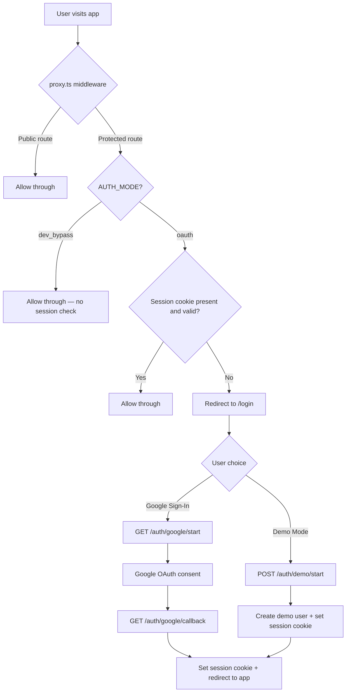
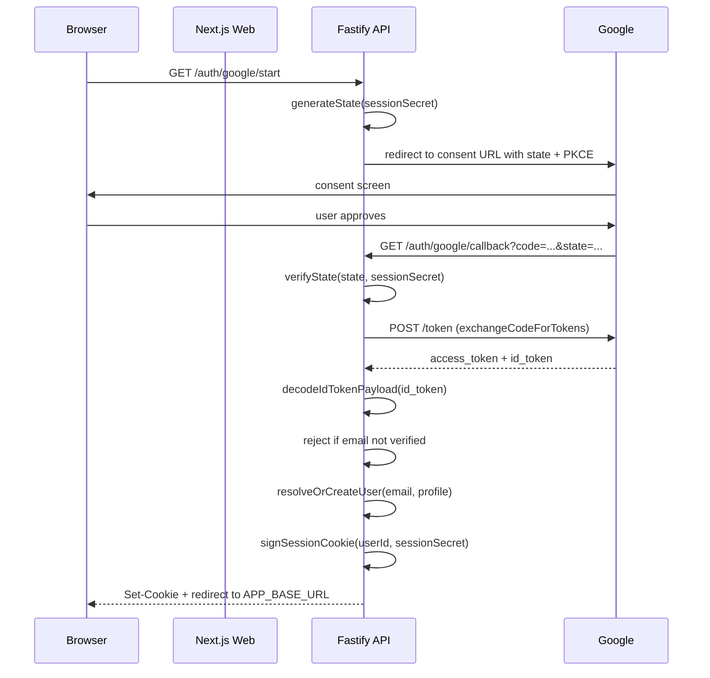
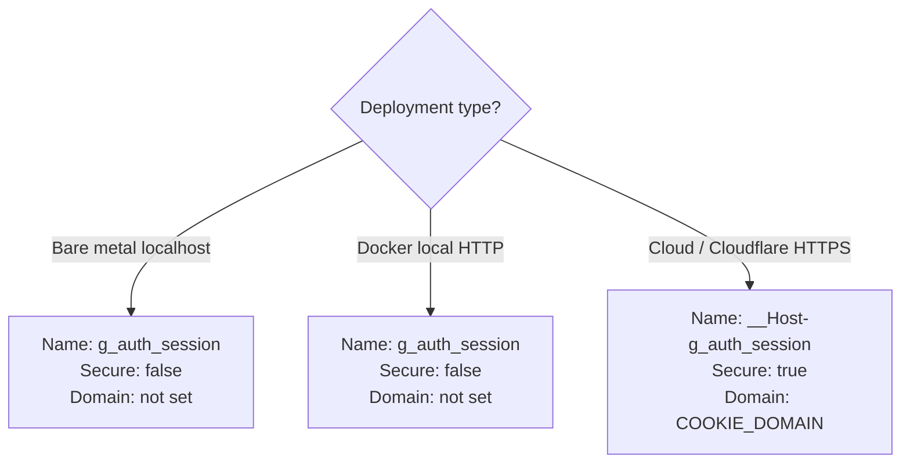
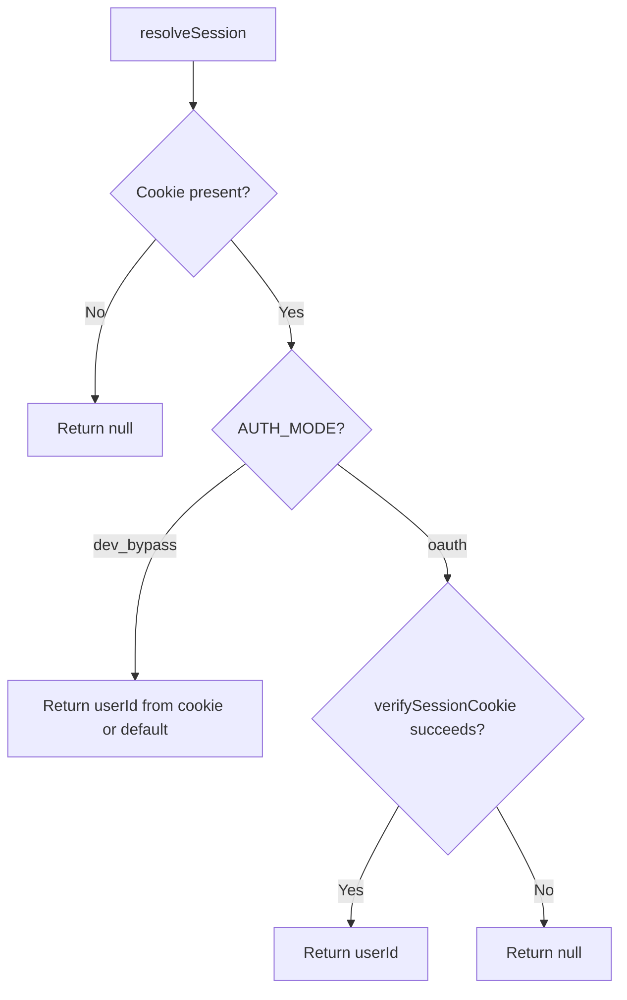
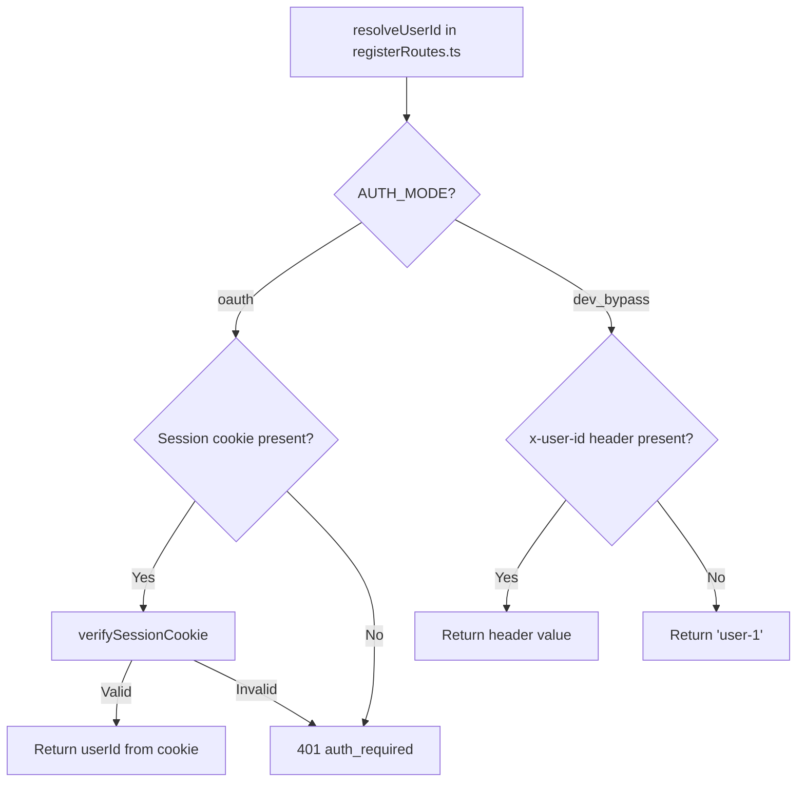
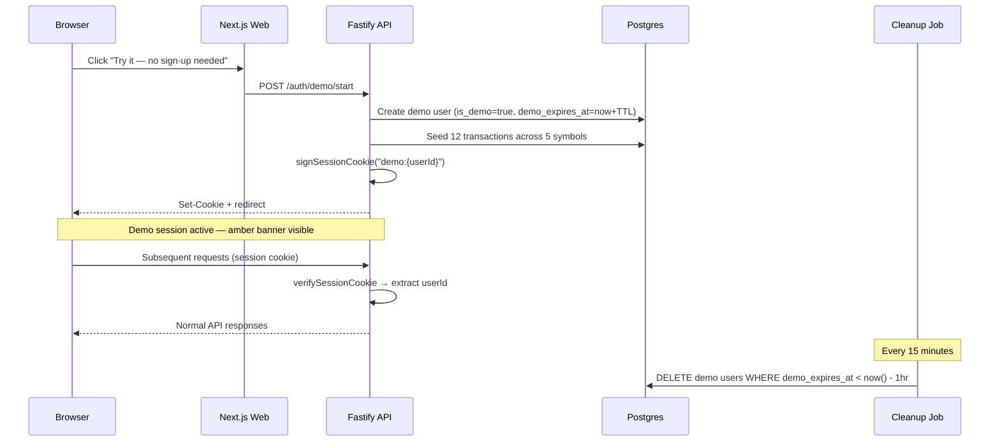
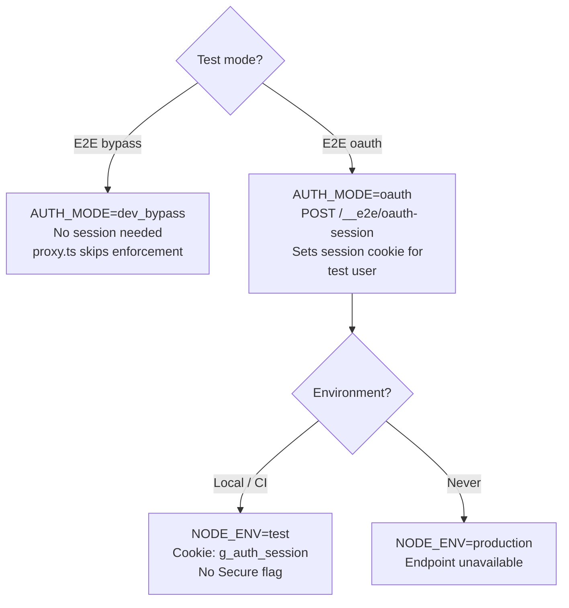

# Auth and Session Architecture

This document covers authentication modes, the OAuth lifecycle, demo mode, session cookies, and identity resolution across the web and API layers.

---

## Auth Modes

| Mode | Config value | Identity source | Use case |
|------|-------------|-----------------|----------|
| `dev_bypass` | `AUTH_MODE=dev_bypass` | Hardcoded `user-1` (API), no session enforcement (web middleware) | Local development, E2E tests |
| `oauth` | `AUTH_MODE=oauth` | HMAC-signed session cookie set after Google OAuth login | Production, Docker deployments, OAuth E2E tests |

`dev_bypass` is restricted to `NODE_ENV=development` or `NODE_ENV=test`. The API rejects `dev_bypass` when `NODE_ENV=production`.

---

## Unified Auth Flow

---

## Google OAuth Full Lifecycle

### Key functions

| Function | Location | Purpose |
|----------|----------|---------|
| `generateState` | `apps/api/src/auth/oauth.ts` | Creates HMAC-signed CSRF state token |
| `verifyState` | `apps/api/src/auth/oauth.ts` | Validates state token signature and expiry |
| `buildAuthorizationUrl` | `apps/api/src/auth/oauth.ts` | Constructs Google consent URL with scopes and state |
| `exchangeCodeForTokens` | `apps/api/src/auth/oauth.ts` | Exchanges auth code for access + ID tokens |
| `decodeIdTokenPayload` | `apps/api/src/auth/oauth.ts` | Base64-decodes and parses ID token payload |
| `signSessionCookie` | `apps/api/src/auth/session.ts` | Creates `{payload}.{hmacSignature}` session cookie |
| `verifySessionCookie` | `apps/api/src/auth/session.ts` | Validates HMAC signature and extracts userId |
| `resolveOrCreateUser` | `apps/api/src/services/userIdentity.ts` | Upserts user by email, links external identity, seeds default portfolio |

### OAuth routes

| Method | Path | Purpose |
|--------|------|---------|
| `GET` | `/auth/google/start` | Initiates OAuth flow — generates state, redirects to Google |
| `GET` | `/auth/google/callback` | Handles callback — exchanges code, creates session, redirects to app |
| `GET` | `/auth/logout` | Clears session cookie, redirects to login |
| `POST` | `/auth/token/refresh` | Refreshes session token |

---

## Session Cookie

### Format

The session cookie value is `{payload}.{hmacSignature}`:

- **Payload**: the internal user UUID (e.g., `a1b2c3d4-...`)
- **Signature**: HMAC-SHA256 of the payload using `SESSION_SECRET`
- **Demo prefix**: demo session payloads use `demo:{userId}` to distinguish from OAuth sessions

### Cookie attributes

| Attribute | Value | Notes |
|-----------|-------|-------|
| Path | `/` | Available to all routes |
| HttpOnly | `true` | Not accessible via JavaScript |
| SameSite | `Lax` | Protects against CSRF while allowing top-level navigation |
| Secure | `true` when `NODE_ENV=production` | Required for `__Host-` prefix |
| Domain | Set by `COOKIE_DOMAIN` | Enables cross-subdomain sharing (e.g., `.example.com`) |
| Max-Age | 7 days (OAuth), `DEMO_SESSION_TTL_SECONDS` (demo) | Session expiry |

### Cookie configuration by deployment

The `__Host-` prefix requires `Secure=true`, `Path=/`, and no `Domain` attribute. Use it only over HTTPS. For HTTP environments (local Docker, bare metal dev), use `g_auth_session` without the prefix.

---

## Identity Resolution — Web Side

### Web auth functions

| Function | Location | Behavior |
|----------|----------|----------|
| `getSession` | `apps/web/lib/auth.ts` | Returns `{ userId }` or `null` — never throws, never redirects |
| `requireSession` | `apps/web/lib/auth.ts` | Returns session or redirects to `/login` (302/307) — use for page-level guards only |
| `resolveSession` | `apps/web/lib/auth.ts` | Internal implementation — reads cookie, verifies signature, returns session |

**Important**: In API route handlers (`app/api/*/route.ts`), always use `getSession()` with a manual 401 JSON response. Never use `requireSession()` — it issues a redirect, not a JSON error.

---

## Identity Resolution — API Side

In `oauth` mode, the HMAC-signed session cookie is the **sole identity source**. No headers, no env vars participate in the identity path.

---

## Demo Mode

### Lifecycle

### Demo components

| Component | Location | Purpose |
|-----------|----------|---------|
| `DemoButton` | `apps/web/components/DemoButton.tsx` | "Try it" button on login page — calls `POST /auth/demo/start` |
| `DemoBanner` | `apps/web/components/DemoBanner.tsx` | Amber banner on protected pages — "You're using a demo session" |
| Demo route handler | `apps/api/src/routes/registerRoutes.ts` | `POST /auth/demo/start` — creates user, seeds data, sets cookie |
| `SignInButton` | `apps/web/components/SignInButton.tsx` | Google sign-in button — hidden when demo mode disabled |

### Demo user data model

- `users.is_demo = true`
- `users.demo_expires_at` = creation time + `DEMO_SESSION_TTL_SECONDS`
- Cookie payload prefixed with `demo:` to distinguish from OAuth sessions
- 12 seeded transactions across 5 Taiwan stock/ETF symbols
- Rate-limited: 5 demo starts per minute per IP

### Guards

- `DEMO_MODE_ENABLED=false` (default): demo button hidden, `POST /auth/demo/start` returns 404, cleanup job does not run
- `DEMO_MODE_ENABLED=true`: full demo flow active
- Expired demo sessions return 401; client redirects to `/login?demoExpired=true`

---

## Middleware Route Protection

The Next.js middleware (`apps/web/middleware.ts`) runs `proxy.ts` on every request:

1. If `NEXT_PUBLIC_AUTH_MODE !== "oauth"`, all requests pass through (dev_bypass mode)
2. If the route is public (`/login`, `/_next/`, `/favicon.ico`, etc.), allow through
3. Otherwise, check for a valid session cookie
4. If no valid session, redirect to `/login`

The middleware runs in the Edge Runtime and cannot import Node.js modules. It uses `apps/web/lib/env-web.ts` for configuration (Edge-safe, never imports `env.ts`).

---

## E2E Test Auth

### Session seeding route

The API exposes `POST /__e2e/oauth-session` when `NODE_ENV !== "production"`. This endpoint creates a session cookie for a given user without going through Google OAuth, enabling E2E tests to authenticate.

The `/__e2e/reset` endpoint is available only when `NODE_ENV=development` (not `test` or `production`).

---

## User Identity Tables

### `users`

| Column | Type | Notes |
|--------|------|-------|
| `id` | `TEXT` PK | Internal UUID — tenancy root |
| `email` | `TEXT` | Nullable; partial unique index (KZO-77) |
| `display_name` | `TEXT` | From OAuth profile or demo default |
| `is_demo` | `BOOLEAN` | `true` for demo users |
| `demo_expires_at` | `TIMESTAMP` | Demo session expiry |
| `locale` | `TEXT DEFAULT 'en'` | UI locale |
| `cost_basis_method` | `TEXT` | Locked to `WEIGHTED_AVERAGE` |
| `quote_poll_interval_seconds` | `INTEGER DEFAULT 10` | Quote refresh rate |
| `created_at` | `TIMESTAMP` | User creation time |
| `updated_at` | `TIMESTAMP` | Last update time |
| `deactivated_at` | `TIMESTAMP` | Soft deactivation |
| `deleted_at` | `TIMESTAMP` | Soft delete |

### `user_external_identities`

| Column | Type | Notes |
|--------|------|-------|
| `id` | `TEXT` PK | Identity record ID |
| `user_id` | `TEXT` FK | References `users.id` |
| `provider` | `TEXT` | e.g., `google` |
| `provider_subject` | `TEXT` | Provider's unique user ID (`sub` claim) |
| `provider_email` | `TEXT` | Email from provider |
| `provider_display_name` | `TEXT` | Display name from provider |
| `provider_picture_url` | `TEXT` | Avatar URL from provider |
| `linked_at` | `TIMESTAMP` | When identity was first linked |
| `last_seen_at` | `TIMESTAMP` | Last login via this identity |

**Unique constraint**: `(provider, provider_subject)` — one external identity per provider per subject.

---

## Related Docs

- [Backend, DB & API](./backend-db-api.md) — full Postgres schema, ER diagram, API endpoint catalog
- [Environment Variables](../002-operations/environment-variables.md) — all auth-related env vars and their validation rules
- [Runbook](../002-operations/runbook.md) — Google OAuth setup, cookie troubleshooting, local Docker auth config
