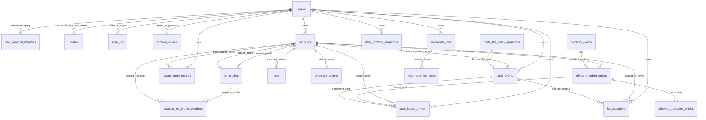
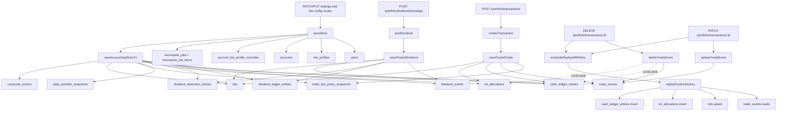
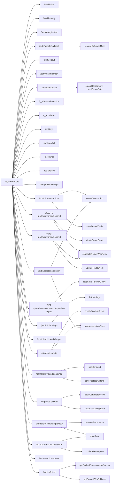
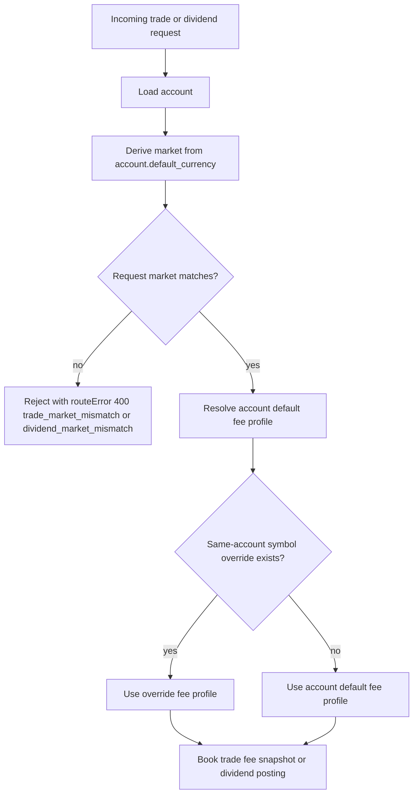
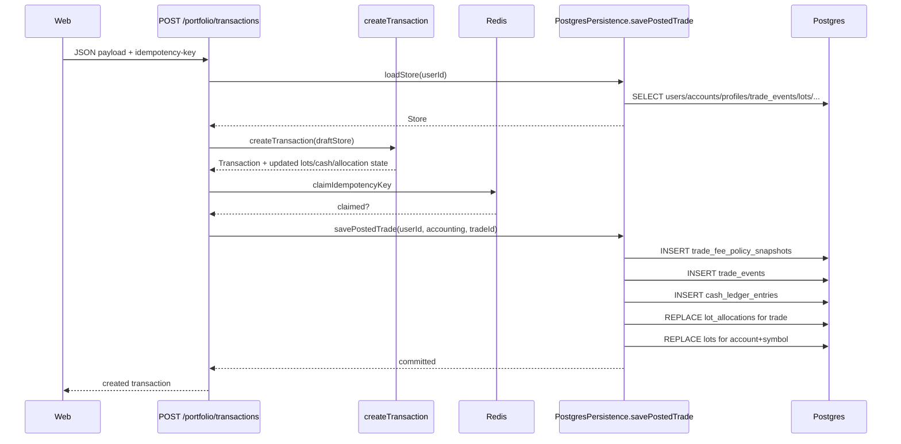
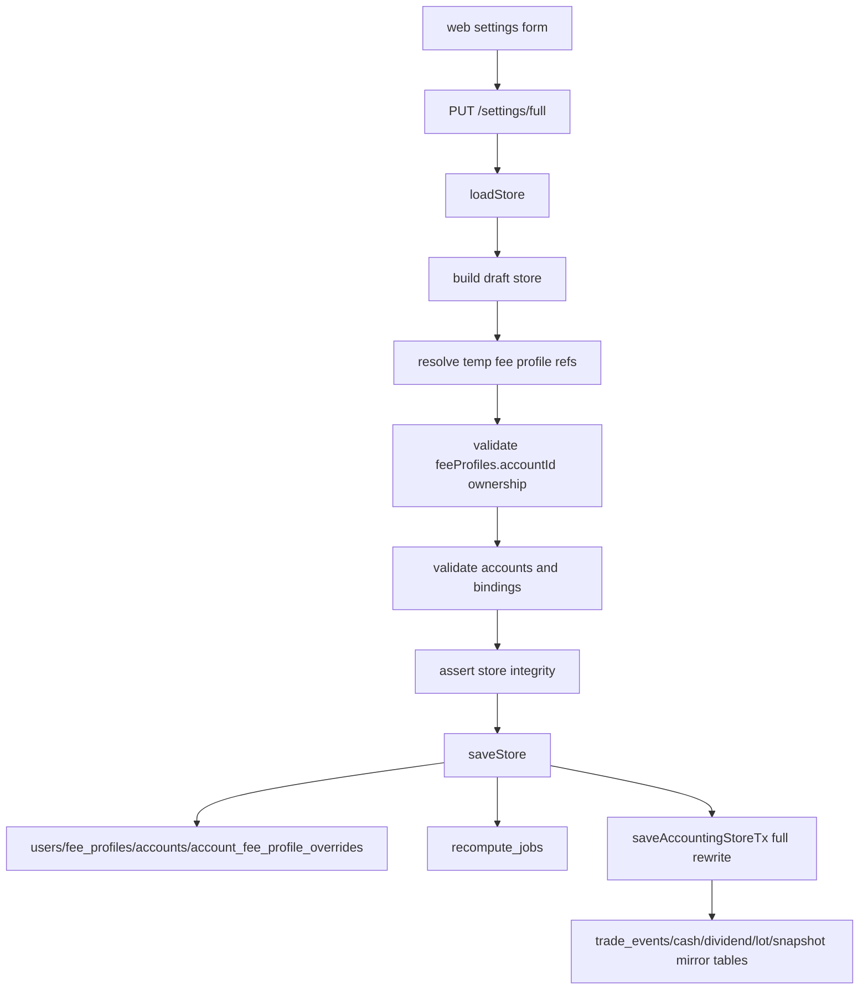

# Backend, DB & API Architecture

This document covers the Postgres schema, HTTP API surface, route dependencies, persistence write paths, and cross-cutting data flows for the `apps/api` backend.

Related docs:
- [Auth and Session](./auth-and-session.md) — OAuth flow, session cookies, identity resolution, demo mode
- [Environment Variables](../002-operations/environment-variables.md) — all env vars, schemas, validation
- [System Architecture](./architecture.md) — monorepo layout, request lifecycle, deployment topology

## Smooth Page Read Baseline

This section defines the backend contract for the authenticated page-performance baseline. Current implementation may still contain legacy `loadStore()`-backed read paths; until the migration is complete, treat the rules below as the design target and record any exceptions in the active performance note.

### Read-path model

| Class | Purpose | Allowed characteristics | Avoid |
|---|---|---|---|
| Shell read | identity and shared-context bootstrap used by the web shell | lightweight, stable, reusable across routes, no broad portfolio hydration | piggybacking page summaries, holdings, balances, or chart payloads into shell bootstrap |
| Primary page read | smallest route-specific read model required for first useful content | targeted query/projection, route-owned DTO, predictable latency budget, human-readable labels included when needed for first render | broad `loadStore()` hydration when the route only needs a projection |
| Secondary read | follow-up route data that improves depth after first paint | may be separate endpoint or deferred sub-read, still instrumented | becoming a hidden prerequisite for primary content |
| Enrichment read | quote freshness, FX/reporting overlays, grouped-holding translation, optional metadata | scoped to the component or route that needs it, safe to defer | cross-route coupling that makes unrelated pages wait |

### Endpoint rules

- Hot page reads must expose route-specific contracts instead of relying on global dashboard bootstrap endpoints.
- Route endpoints should return display-ready metadata required for first render. Example: cash-ledger primary reads must include human account labels rather than forcing a later UUID-to-label repair pass.
- DTO compatibility may be preserved for existing consumers during migration, but compatibility fields must not force unrelated routes back onto the global shell path.
- `loadStore()` remains valid for write-heavy, recompute, or domain-consistency flows. Do not remove it from mutation paths purely for symmetry with read-model work.

### Current primary/enrichment map

| Surface | Primary endpoint | Secondary/enrichment endpoint |
|---|---|---|
| Dashboard | `GET /dashboard/primary` | `GET /dashboard/enrichment`, `GET /dashboard/performance` |
| Reports | `GET /reports/daily-review`, `GET /reports/portfolio`, `GET /reports/market` | follow-up reads hit the same route-specific report endpoint with updated query state |
| Portfolio holdings | `GET /portfolio/primary` | `GET /portfolio/enrichment` |
| Transactions | `GET /transactions/primary` | `GET /portfolio/transactions`, AI inbox routes |
| Dividends Review | `GET /portfolio/dividends/review/primary` | `GET /portfolio/dividends/review/enrichment`; persisted row detail from `GET /portfolio/dividends/postings/:dividendLedgerEntryId` |
| Ticker detail | route-level primary composition today; backend split is `GET /tickers/:ticker/primary` | `GET /tickers/:ticker/enrichment` |
| Settings tickers | `GET /monitored-tickers` | `GET /instruments` when catalog browse/search opens |
| AI connector settings | `GET /ai/connectors/summary` | `GET /ai/connectors/logs` |

Compatibility endpoints remain for older callers: `GET /dashboard/overview`, `GET /portfolio/page-data`, and `GET /ai/connectors`. New route-primary UI must use the primary endpoints above.

Temporary exceptions:

- `GET /dashboard/primary`, `GET /portfolio/primary`, and `GET /transactions/primary` still hydrate the in-memory domain store through `loadStore()` so grouped holdings, fee-profile config, and recent transaction ordering stay identical while the route split lands. They deliberately skip quote resolution, freshness classification, FX/reporting translation, performance series, and dividend enrichment.
- Report routes currently build from `persistence.loadStore(userId)` plus in-memory scoping, quote resolution, FX translation, and bounded paging. They are route-specific contracts, but not yet narrow Postgres projections.
- The ticker web route has not fully switched to `GET /tickers/:ticker/primary`; current page boot still composes from dashboard primary data plus filtered transaction history, while `GET /tickers/:ticker/enrichment` defines the intended richer follow-up contract.

The next backend optimization step is replacing these transitional read paths with narrower Postgres projections once the UI contract is stable.

### Dividends Review read model

Dividends Review follows the same primary/enrichment boundary as Dashboard and Portfolio, but its Postgres implementation is already a targeted read model rather than a `loadStore()` transition:

| Read | Query identity | Response | Execution boundary |
|---|---|---|---|
| Primary | portfolio context; payment-date, account, ticker, market, posting, reconciliation, expected-row, and source-composition filters; sort field/direction; page; page size | lightweight row summaries, filtered total, eligible years, account options | builds filtered ledger and synthetic expected rows in SQL, applies an allowlisted SQL sort with stable tie-breakers, counts the complete filtered set, and returns only the requested 10/25/50-row page |
| Enrichment | portfolio context and the same semantic filters; no sort or pagination | currency/month/ticker aggregates, open count, NHI rollup, and source-composition counts | aggregates the complete filtered normalized row set independently of the current page |
| Persisted row detail | portfolio context and ledger-entry ID | primary summary fields plus deductions, source lines, reconciliation/amendment metadata, and linked position-action state | tenant-scoped direct-ID lookup followed by bulk detail hydration for that one row |
| Compatibility | primary query identity | detailed current page, total, and legacy aggregates | composes the optimized primary and enrichment reads in parallel, then hydrates details for the selected page only |

`dividendReviewNormalizedSql()` is the shared filter boundary for the Postgres primary and enrichment reads. It creates tenant-scoped `eligible_ledger`, ledger-ID-scoped receipt/deduction/action aggregates, and synthetic expected rows. Expected eligibility is replayed in recursive SQL with per-lot state for trades, stock dividends, splits, and cash-in-lieu validity. Reversed and superseded ledger, trade, and position-action history is excluded. The pending source-composition filter is applied inside this normalized set, before count, sort, page selection, and enrichment aggregation.

The primary query maps each validated sort field to a static SQL expression. It orders the requested field and direction first, then uses payment date, ticker, account name, and row ID as deterministic tie-breakers. Page hydration happens after `LIMIT`/`OFFSET`; the primary DTO does not include deductions or source lines. The memory persistence implementation exposes the same primary, enrichment, metadata, compatibility, and detail contracts for deterministic test/dev parity.

No Dividends Review projection, materialized view, or new index was added with this read model. Add an index only after `EXPLAIN ANALYZE` and repeated post-change measurements identify a justified bottleneck.

### Target budgets

| Backend surface | Budget |
|---|---:|
| Primary page read endpoint | P95 < 800 ms where realistic |
| Cash-ledger primary read endpoint | P95 < 1000 ms max |
| Shell/profile/shared-context bootstrap endpoint(s) | P95 < 300 ms |

If a route cannot meet these targets because of unavoidable data shape complexity, document the exception explicitly in the active performance note and keep the frontend route skeleton behavior aligned with the known delay.

### Timing instrumentation contract

- Hot authenticated read endpoints must emit `Server-Timing` and structured duration logs.
- Minimum timing dimensions for the smooth-pages work:
  - total request duration
  - app/service time
  - DB/query time where practical
  - response bytes when cheap to capture
- Baseline endpoints called out for instrumentation:
  - `GET /dashboard/overview`
  - `GET /dashboard/primary`
  - `GET /dashboard/enrichment`
  - `GET /dashboard/performance`
  - `GET /portfolio/page-data`
  - `GET /portfolio/primary`
  - `GET /portfolio/enrichment`
  - `GET /portfolio/instrument-index`
  - `GET /transactions/primary`
  - `GET /portfolio/transactions`
  - `GET /portfolio/cash-ledger`
  - `GET /portfolio/dividends/review/primary`
  - `GET /portfolio/dividends/review/enrichment`
  - `GET /monitored-tickers`
  - `GET /instruments`
  - `GET /ai/connectors/summary`
  - `GET /ai/connectors/logs`
  - `GET /accounts?includeBalances=true`
  - any new route-primary endpoint introduced to replace global bootstrap reads
- Instrumentation should stay production-safe and low-noise. Prefer consistent metric names so frontend/browser evidence can be correlated against backend timing.

### Verification expectations

- Add focused route or integration coverage proving page-primary endpoints do not need unrelated global reads to serve the first useful payload.
- Add coverage for DTO correctness on fields that affect first render semantics, especially shared-context labels, grouped holdings, and cash-ledger account labels.
- Performance evidence is not complete until a note or PR shows measured endpoint timings and browser-visible route timings after the implementation lands.
- When implementation is still in progress, documentation should mark timing tables as design budgets or pre-change baseline measurements, not as achieved results.

## Database

### Runtime storage model

The API supports two persistence backends behind `Persistence`:
- `postgres`: primary runtime path, backed by Postgres plus Redis
- `memory`: test/dev in-memory substitute with the same route surface but no SQL persistence

In the Postgres backend:
- Postgres stores user settings, fee configuration, accounting facts, projections, recompute jobs, and migration ledger state.
- Redis stores idempotency keys and quote cache entries.
- The API boot path runs migrations, seeds symbols, and ensures a default user/account/profile.

Current runtime write modes:
- incremental writes:
  - `savePostedTrade`
  - `savePostedDividend`
- mutation writes (KZO-114):
  - `deleteTradeEvent` — hard-deletes one trade event and cascades to child rows
  - `updateTradeEvent` — patches one trade event's fields in place
  - `replayPositionHistory` (via `scheduleReplayWithRetry`) — async cascade recompute after delete or update
- full-store or full-accounting rewrites:
  - `saveStore`
  - `saveAccountingStore`

### Canonical vs compatibility data model

Canonical trade/accounting reads come from:
- `trade_events`
- `trade_fee_policy_snapshots`
- `cash_ledger_entries`
- `dividend_events`
- `dividend_ledger_entries`
- `dividend_deduction_entries`
- `lots`
- `lot_allocations`
- `corporate_actions`
- `daily_portfolio_snapshots`

Workflow or dormant tables still matter:
- `recompute_jobs`
- `recompute_job_items`
- `schema_migrations`
- `reconciliation_records`: present in schema, unused by current runtime code
- `portfolio_shares`: sharing access control records for inbound/outbound grants

### Database relationship graph



Plain-text adjacency list:

```text
users
  -> user_external_identities.user_id
  -> invites.issued_by_user_id
  -> invites.share_owner_user_id
  -> audit_log.actor_user_id
  -> audit_log.target_user_id
  -> portfolio_shares.owner_user_id
  -> portfolio_shares.grantee_user_id
  -> portfolio_shares.revoked_by_user_id
  -> accounts.user_id
  -> trade_events.user_id
  -> cash_ledger_entries.user_id
  -> lot_allocations.user_id
  -> recompute_jobs.user_id
  -> daily_portfolio_snapshots.user_id
  -> reconciliation_records.user_id
  -> reconciliation_records.reviewer_id

fee_profiles
  -> fee_profiles.account_id
  -> accounts.fee_profile_id
  -> account_fee_profile_overrides.fee_profile_id

accounts
  -> fee_profiles.account_id
  -> account_fee_profile_overrides.account_id
  -> lots.account_id
  -> corporate_actions.account_id
  -> trade_events.account_id
  -> cash_ledger_entries.account_id
  -> lot_allocations.account_id
  -> dividend_ledger_entries.account_id
  -> reconciliation_records.account_id

trade_fee_policy_snapshots
  -> trade_events.fee_policy_snapshot_id

trade_events
  -> trade_events.fee_policy_snapshot_id
  -> cash_ledger_entries.related_trade_event_id
  -> lot_allocations.trade_event_id
  -> trade_events.reversal_of_trade_event_id

dividend_events
  -> dividend_ledger_entries.dividend_event_id

dividend_ledger_entries
  -> cash_ledger_entries.related_dividend_ledger_entry_id
  -> dividend_deduction_entries.dividend_ledger_entry_id
  -> dividend_ledger_entries.reversal_of_dividend_ledger_entry_id

cash_ledger_entries
  -> cash_ledger_entries.reversal_of_cash_ledger_entry_id

recompute_jobs
  -> recompute_job_items.job_id

recompute_job_items
  -> historical trade_event_id value only (not an FK after migration 104)
```

### Table catalog

#### `users`

Purpose:
- per-user settings and tenancy root

Fields:

| Column | Type / default | Constraints | Notes |
| --- | --- | --- | --- |
| `id` | `TEXT` | PK | tenant key (internal UUID) |
| `email` | `TEXT` | nullable, functional unique index on `LOWER(email)`, CHECK `email = LOWER(email)` (KZO-77, KZO-143) | user's real email from OAuth; identity resolution key. Nullable for demo users. |
| `display_name` | `TEXT` | nullable | from OAuth profile or demo default |
| `role` | `TEXT DEFAULT 'member'` | `NOT NULL`, `CHECK (role IN ('admin','member','viewer'))` | role-derived permissions (KZO-143). `admin` for bootstrap user, `member` for OAuth users, `viewer` for read-only guests. |
| `session_version` | `INT DEFAULT 1` | `NOT NULL` | incremented on disable/delete/role-change; cookie carries this; mismatch → 401 (KZO-143) |
| `is_demo` | `BOOLEAN DEFAULT false` | `NOT NULL` | `true` for demo users |
| `demo_expires_at` | `TIMESTAMP` | nullable | demo session expiry; null for OAuth users |
| `locale` | `TEXT DEFAULT 'en'` | `NOT NULL` | route layer restricts to `en` or `zh-TW` |
| `cost_basis_method` | `TEXT DEFAULT 'WEIGHTED_AVERAGE'` | `NOT NULL`, later check-constrained | migration `002` locks this to `WEIGHTED_AVERAGE` only |
| `quote_poll_interval_seconds` | `INTEGER DEFAULT 10` | `NOT NULL` | route layer caps at `86400` |
| `created_at` | `TIMESTAMP DEFAULT CURRENT_TIMESTAMP` | `NOT NULL` | user creation time |
| `updated_at` | `TIMESTAMP DEFAULT CURRENT_TIMESTAMP` | `NOT NULL` | last update time |
| `deactivated_at` | `TIMESTAMP` | nullable | soft deactivation timestamp |
| `deleted_at` | `TIMESTAMP` | nullable | soft delete timestamp |

Read path:
- loaded in `loadStore`

Write path:
- updated by `saveStore`
- upserted by `resolveOrCreateUser` (email-based identity resolution; KZO-77)

#### `user_external_identities`

Purpose:
- links users to OAuth provider identities (e.g., Google)

Fields:

| Column | Type / default | Constraints | Notes |
| --- | --- | --- | --- |
| `id` | `TEXT` | PK | identity record ID |
| `user_id` | `TEXT` | `NOT NULL`, FK -> `users.id` | owning user |
| `provider` | `TEXT` | `NOT NULL` | e.g., `google` |
| `provider_subject` | `TEXT` | `NOT NULL` | provider's unique user ID (`sub` claim) |
| `provider_email` | `TEXT` | nullable | email from provider |
| `provider_display_name` | `TEXT` | nullable | display name from provider |
| `provider_picture_url` | `TEXT` | nullable | avatar URL from provider (validated as HTTPS before rendering) |
| `linked_at` | `TIMESTAMP DEFAULT CURRENT_TIMESTAMP` | `NOT NULL` | when identity was first linked |
| `last_seen_at` | `TIMESTAMP DEFAULT CURRENT_TIMESTAMP` | `NOT NULL` | last login via this identity |

Indexes and uniqueness:
- `ux_user_external_identities_provider_subject` UNIQUE `(provider, provider_subject)`
- `idx_user_external_identities_user_id`

Read path:
- loaded during identity resolution in `resolveOrCreateUser`

Write path:
- upserted by `resolveOrCreateUser` on each OAuth login (updates `last_seen_at`, `provider_email`, `provider_display_name`, `provider_picture_url`)

#### `invites` (KZO-143)

Purpose:
- invite-gated signup codes issued by admins (or CLI bootstrap)

Fields:

| Column | Type / default | Constraints | Notes |
| --- | --- | --- | --- |
| `code` | `TEXT` | PK | 8-char Crockford base32 (uppercase, no `O/I/L/U`) |
| `email` | `TEXT` | `NOT NULL`, `CHECK (email = LOWER(email))` | target email for the invite |
| `role` | `TEXT` | `NOT NULL`, `CHECK (role IN ('admin','member','viewer'))` | role assigned on consumption |
| `expires_at` | `TIMESTAMP` | `NOT NULL` | default 7 days from creation |
| `revoked_at` | `TIMESTAMP` | nullable | set by `DELETE /invites/:code` |
| `used_at` | `TIMESTAMP` | nullable | set atomically on OAuth callback consumption |
| `issued_by_user_id` | `TEXT` | FK → `users(id)`, nullable | null for CLI-bootstrapped invites |
| `share_owner_user_id` | `TEXT` | FK → `users(id)`, nullable | present when the invite carries pending share intent for an owner |
| `created_at` | `TIMESTAMP DEFAULT NOW()` | `NOT NULL` | |

Indexes:
- `idx_invites_active_email` on `(email) WHERE used_at IS NULL AND revoked_at IS NULL`
- `idx_invites_active_expires_at` on `(expires_at) WHERE used_at IS NULL AND revoked_at IS NULL`
- `idx_invites_share_pending` on `(share_owner_user_id) WHERE share_owner_user_id IS NOT NULL AND used_at IS NULL AND revoked_at IS NULL`

Read path:
- `getInviteStatus(code)` — returns `valid | invalid | expired | used | revoked`
- `consumeInvite(code, email)` — atomic conditional UPDATE + follow-up SELECT for failure reason

Write path:
- `createInvite` / `insertBootstrapInvite` — generates Crockford code with retry on UNIQUE violation (max 3)
- `createShareCoupledInvite` — links or creates a pending invite for an owner-facing share grant
- `revokeInvite(code)` — sets `revoked_at = COALESCE(revoked_at, NOW())`
- `consumeInvite(code, email)` — sets `used_at = NOW()` atomically

#### `portfolio_shares` (KZO-145/KZO-146)

Purpose:
- durable owner-to-grantee access grants for shared portfolio viewing

Fields:

| Column | Type / default | Constraints | Notes |
| --- | --- | --- | --- |
| `id` | `TEXT` | PK | UUID |
| `owner_user_id` | `TEXT` | `NOT NULL`, FK → `users(id)` | owner of the portfolio being shared |
| `grantee_user_id` | `TEXT` | `NOT NULL`, FK → `users(id)` | user who receives read-only access |
| `created_at` | `TIMESTAMP DEFAULT NOW()` | `NOT NULL` | share creation time |
| `revoked_at` | `TIMESTAMP` | nullable | null for active shares |
| `revoked_by_user_id` | `TEXT` | FK → `users(id)`, nullable | owner who revoked the share |

Indexes:
- partial unique index on `(owner_user_id, grantee_user_id) WHERE revoked_at IS NULL`
- owner-scoped and grantee-scoped list queries

Read path:
- owner outbound list grouping active / pending / expired / revoked
- grantee inbound list grouping active / revoked

Write path:
- direct grant for an existing user
- OAuth callback materialization from share-coupled pending invites
- owner revocation of an active share

#### `audit_log` (KZO-143)

Purpose:
- append-only log of admin and system actions for compliance and debugging

Fields:

| Column | Type / default | Constraints | Notes |
| --- | --- | --- | --- |
| `id` | `TEXT` | PK | UUID |
| `actor_user_id` | `TEXT` | FK → `users(id)`, nullable | null for system events (CLI, startup) |
| `action` | `TEXT` | `NOT NULL`, `CHECK IN (...)` | includes admin actions plus sharing actions such as `share_granted` and `share_revoked` |
| `target_user_id` | `TEXT` | FK → `users(id)`, nullable | the user affected by the action |
| `metadata` | `JSONB DEFAULT '{}'` | `NOT NULL` | action-specific payload (e.g. `{ email }`) |
| `ip_address` | `INET` | nullable | null for CLI/startup events |
| `created_at` | `TIMESTAMP DEFAULT NOW()` | `NOT NULL` | |

Indexes:
- `idx_audit_log_created_at_desc` on `(created_at DESC)`
- `idx_audit_log_actor_created_at_desc` on `(actor_user_id, created_at DESC)`
- `idx_audit_log_target_created_at_desc` on `(target_user_id, created_at DESC)`

Read path:
- admin UI paginated list (KZO-144)

Write path:
- `appendAuditLog(input)` — called from `promoteUserToAdminByEmail` and OAuth callback admin-promotion path

#### `fee_profiles`

Purpose:
- broker fee/tax policy definitions used by accounts, overrides, and fee snapshots

Fields:

| Column | Type / default | Constraints | Notes |
| --- | --- | --- | --- |
| `id` | `TEXT` | PK | user-scoped in practice, globally keyed in schema |
| `user_id` | `TEXT` | `NOT NULL`, FK -> `users.id` | owner |
| `name` | `TEXT` | `NOT NULL` | profile label |
| `commission_rate_bps` | `INTEGER` | `NOT NULL` | raw commission rate |
| `commission_discount_percent` | `NUMERIC(5,2)` | `NOT NULL` | broker commission percent-off from board rate |
| `minimum_commission_amount` | `INTEGER` | `NOT NULL` | commission floor |
| `commission_currency` | `TEXT DEFAULT 'TWD'` | `NOT NULL` | fee-profile commission currency |
| `commission_rounding_mode` | `TEXT` | `NOT NULL` | `FLOOR`, `ROUND`, `CEIL` at route layer |
| `tax_rounding_mode` | `TEXT` | `NOT NULL` | `FLOOR`, `ROUND`, `CEIL` at route layer |
| `stock_sell_tax_rate_bps` | `INTEGER` | `NOT NULL` | stock sell tax |
| `stock_day_trade_tax_rate_bps` | `INTEGER` | `NOT NULL` | day-trade stock tax |
| `etf_sell_tax_rate_bps` | `INTEGER` | `NOT NULL` | ETF sell tax |
| `bond_etf_sell_tax_rate_bps` | `INTEGER` | `NOT NULL` | bond ETF sell tax |

Indexes:
- `idx_fee_profiles_user_id`

Read path:
- loaded into `Store.feeProfiles`

Write path:
- upserted and pruned by `saveStore`
- seeded with the default profile by `ensureDefaultPortfolioData` (called from `resolveOrCreateUser` on first login; KZO-77)

#### `accounts`

Purpose:
- account container for trades, lots, overrides, ledger rows, and corporate actions

Fields:

| Column | Type / default | Constraints | Notes |
| --- | --- | --- | --- |
| `id` | `TEXT` | PK | globally keyed in schema |
| `user_id` | `TEXT` | `NOT NULL`, FK -> `users.id` | owner |
| `name` | `TEXT` | `NOT NULL` | account label |
| `fee_profile_id` | `TEXT` | `NOT NULL`, FK -> `fee_profiles.id` | fallback fee profile |

Indexes and uniqueness:
- `idx_accounts_user_id`
- `ux_accounts_id_user_id` unique composite, added in migration `003`

Read path:
- loaded into `Store.accounts`

Write path:
- upserted and pruned by `saveStore`
- seeded with `Main` account by `ensureDefaultPortfolioData` (called on first login; KZO-77)

#### `account_fee_profile_overrides`

Purpose:
- account+symbol specific fee profile overrides

Fields:

| Column | Type / default | Constraints | Notes |
| --- | --- | --- | --- |
| `account_id` | `TEXT` | PK part, FK -> `accounts.id ON DELETE CASCADE` | account scope |
| `symbol` | `TEXT` | PK part | uppercased ticker at route layer |
| `fee_profile_id` | `TEXT` | `NOT NULL`, FK -> `fee_profiles.id` | override target |

Indexes:
- PK `(account_id, symbol)`
- `idx_account_fee_profile_overrides_account_id`

Read path:
- loaded into `Store.feeProfileBindings`

Write path:
- fully replaced by `saveStore`

#### `symbols`

Purpose:
- supported tradable instruments and instrument type lookup

Fields:

| Column | Type / default | Constraints | Notes |
| --- | --- | --- | --- |
| `ticker` | `TEXT` | PK | symbol |
| `instrument_type` | `TEXT` | `NOT NULL` | `STOCK`, `ETF`, `BOND_ETF` in seeded data |

Read path:
- loaded into `Store.symbols`

Write path:
- seeded/upserted by `seedSymbols`

#### `trade_fee_policy_snapshots`

Purpose:
- immutable relational fee-policy snapshots captured at trade booking time

Fields:

| Column | Type / default | Constraints | Notes |
| --- | --- | --- | --- |
| `id` | `TEXT` | PK | snapshot id, currently `trade-fee-snapshot:<tradeEventId>` |
| `user_id` | `TEXT` | `NOT NULL`, FK -> `users.id` | owner |
| `profile_id_at_booking` | `TEXT` | `NOT NULL` | profile identity captured at booking time |
| `profile_name_at_booking` | `TEXT` | `NOT NULL` | profile label captured at booking time |
| `board_commission_rate` | `NUMERIC(20,6)` | `NOT NULL`, check `>= 0` | exact board rate |
| `commission_discount_percent` | `NUMERIC(5,2)` | `NOT NULL`, check `0..100` | discount percent-off |
| `minimum_commission_amount` | `INTEGER` | `NOT NULL`, check `>= 0` | floor |
| `commission_currency` | `TEXT` | `NOT NULL`, ISO-4217 check | commission currency |
| `commission_rounding_mode` | `TEXT` | `NOT NULL`, checked | `FLOOR`, `ROUND`, `CEIL` |
| `tax_rounding_mode` | `TEXT` | `NOT NULL`, checked | `FLOOR`, `ROUND`, `CEIL` |
| `stock_sell_tax_rate_bps` | `INTEGER` | `NOT NULL`, check `>= 0` | stock sell tax |
| `stock_day_trade_tax_rate_bps` | `INTEGER` | `NOT NULL`, check `>= 0` | day-trade stock tax |
| `etf_sell_tax_rate_bps` | `INTEGER` | `NOT NULL`, check `>= 0` | ETF sell tax |
| `bond_etf_sell_tax_rate_bps` | `INTEGER` | `NOT NULL`, check `>= 0` | bond ETF sell tax |
| `commission_charge_mode` | `TEXT` | `NOT NULL`, checked | commission charge behavior |
| `booked_at` | `TIMESTAMP DEFAULT CURRENT_TIMESTAMP` | `NOT NULL` | capture time |

Indexes:
- `idx_trade_fee_policy_snapshots_user_id`

Read path:
- joined from `trade_events` during store load

Write path:
- inserted by `savePostedTrade`
- fully deleted/recreated by `saveAccountingStoreTx`

#### `lots`

Purpose:
- weighted-average lot-capable inventory projection

Fields:

| Column | Type / default | Constraints | Notes |
| --- | --- | --- | --- |
| `id` | `TEXT` | PK | lot id |
| `account_id` | `TEXT` | `NOT NULL`, FK -> `accounts.id` | owner account |
| `symbol` | `TEXT` | `NOT NULL` | ticker |
| `open_quantity` | `INTEGER` | `NOT NULL` | remaining position |
| `total_cost_amount` | `INTEGER` | `NOT NULL` | weighted-average allocated cost |
| `cost_currency` | `TEXT DEFAULT 'TWD'` | `NOT NULL` | lot cost currency |
| `opened_at` | `DATE` | `NOT NULL` | lot opening date |
| `opened_sequence` | `INTEGER` | `NOT NULL`, check `> 0` | migration `004`/`005` ordering key |

Indexes and uniqueness:
- `idx_lots_account_symbol`
- `idx_lots_account_symbol_opened_order`
- `ux_lots_account_symbol_opened_order`

Read path:
- loaded into `accounting.projections.lots`

Write path:
- rewritten per trade/dividend symbol by incremental save methods
- fully deleted/recreated by `saveStore` and `saveAccountingStoreTx`

#### `corporate_actions`

Purpose:
- stored corporate actions against an account+symbol

Fields:

| Column | Type / default | Constraints | Notes |
| --- | --- | --- | --- |
| `id` | `TEXT` | PK | action id |
| `account_id` | `TEXT` | `NOT NULL`, FK -> `accounts.id` | owner account |
| `symbol` | `TEXT` | `NOT NULL` | ticker |
| `action_type` | `TEXT` | `NOT NULL` | `DIVIDEND`, `SPLIT`, `REVERSE_SPLIT` in app |
| `numerator` | `INTEGER` | `NOT NULL` | split ratio numerator |
| `denominator` | `INTEGER` | `NOT NULL` | split ratio denominator |
| `action_date` | `DATE` | `NOT NULL` | effective date |

Read path:
- loaded into `accounting.facts.corporateActions`

Write path:
- fully replaced by `saveStore` and `saveAccountingStoreTx`

#### `recompute_jobs`

Purpose:
- persisted preview/confirm workflow state, not an accounting fact table

Fields:

| Column | Type / default | Constraints | Notes |
| --- | --- | --- | --- |
| `id` | `TEXT` | PK | job id |
| `user_id` | `TEXT` | `NOT NULL`, FK -> `users.id` | owner |
| `account_id` | `TEXT` | nullable | account-limited recompute |
| `profile_id` | `TEXT` | `NOT NULL` | chosen profile or `account-fallback` |
| `status` | `TEXT` | `NOT NULL`, checked | `PREVIEWED`, `RUNNING`, `CONFIRMED`, or `FAILED` |
| `created_at` | `TIMESTAMP` | `NOT NULL` | creation time |
| `fee_mode` | `TEXT DEFAULT 'KEEP_RECORDED'` | `NOT NULL`, checked | `KEEP_RECORDED` or `RECALCULATE_CALCULATED` |
| `use_fallback_bindings` | `BOOLEAN DEFAULT true` | `NOT NULL` | whether account fallback profiles participate |
| `account_revisions` | `JSONB DEFAULT '{}'` | `NOT NULL` | reviewed revision for each selected account |
| `fee_config_fingerprint` | `TEXT` | `NOT NULL`, 64-char lowercase hex | reviewed fee profiles and bindings |
| `preview_fingerprint` | `TEXT` | `NOT NULL`, 64-char lowercase hex | confirmation token over the complete reviewed preview |
| `expires_at` | `TIMESTAMPTZ` | `NOT NULL` | preview expiry boundary |
| `started_at` | `TIMESTAMPTZ` | nullable | successful `PREVIEWED -> RUNNING` transition time |
| `completed_at` | `TIMESTAMPTZ` | nullable | terminal transition time |
| `error_code` | `TEXT` | nullable | durable failure classification |
| `error_message` | `TEXT` | nullable | durable failure detail |

Indexes:
- `idx_recompute_jobs_user_id`

Read path:
- loaded into `Store.recomputeJobs`

Write path:
- previewed through `saveRecomputeJob`
- compare-and-set to `RUNNING` through `startRecomputeJob`
- marked `FAILED` only from `RUNNING`
- marked `CONFIRMED` inside `commitRecomputeStore`, atomically with the selected accounting scopes

#### `recompute_job_items`

Purpose:
- per-trade-event fee/tax recompute preview rows

Fields:

| Column | Type / default | Constraints | Notes |
| --- | --- | --- | --- |
| `id` | `TEXT` | PK | `${jobId}:${tradeEventId}` in current writes |
| `job_id` | `TEXT` | `NOT NULL`, FK -> `recompute_jobs.id` | parent job |
| `trade_event_id` | `TEXT` | `NOT NULL`, deliberately not an FK after migration `104` | historical source id retained even when replay rewrites or deletion removes the trade |
| `previous_commission_amount` | `NUMERIC(20,4)` | `NOT NULL` | prior value |
| `previous_tax_amount` | `NUMERIC(20,4)` | `NOT NULL` | prior value |
| `next_commission_amount` | `NUMERIC(20,4)` | `NOT NULL` | previewed value |
| `next_tax_amount` | `NUMERIC(20,4)` | `NOT NULL` | previewed value |
| `currency` | `TEXT` | `NOT NULL`, ISO-like check | native booked currency for grouped impacts |
| `fees_source` | `TEXT` | `NOT NULL`, checked | reviewed `CALCULATED`, `MANUAL`, or `SOURCE_PROVIDED` provenance |
| `applied_profile_id` | `TEXT` | nullable, paired with JSON | exact profile used for calculated-only repricing |
| `applied_fee_profile_json` | `JSONB` | nullable, paired with id | immutable profile snapshot used during confirmation |

Read path:
- loaded and grouped under `Store.recomputeJobs[].items`

Write path:
- written with the preview job and retained as immutable review/audit evidence
- loaded with jobs for confirmation and audit inspection

#### `trade_events`

Purpose:
- canonical trade fact table

Fields:

| Column | Type / default | Constraints | Notes |
| --- | --- | --- | --- |
| `id` | `TEXT` | PK | trade event id |
| `user_id` | `TEXT` | `NOT NULL`, FK -> `users.id` | owner |
| `account_id` | `TEXT` | `NOT NULL`, FK -> `accounts.id`, composite FK with `user_id` | tenant/account integrity |
| `symbol` | `TEXT` | `NOT NULL` | ticker |
| `instrument_type` | `TEXT` | `NOT NULL` | resolved from `symbols` |
| `trade_type` | `TEXT` | `NOT NULL`, check in `BUY`,`SELL` | trade direction |
| `quantity` | `INTEGER` | `NOT NULL`, check `> 0` | share count |
| `unit_price` | `INTEGER` | `NOT NULL`, check `>= 0` | unit price |
| `price_currency` | `TEXT DEFAULT 'TWD'` | `NOT NULL` | trade price currency |
| `trade_date` | `DATE` | `NOT NULL` | logical trade date |
| `trade_timestamp` | `TIMESTAMP` | `NOT NULL` | precise booking-order time |
| `booking_sequence` | `INTEGER` | `NOT NULL`, check `> 0` | per-account/day uniqueness |
| `commission_amount` | `INTEGER DEFAULT 0` | `NOT NULL`, check `>= 0` | booked commission |
| `tax_amount` | `INTEGER DEFAULT 0` | `NOT NULL`, check `>= 0` | booked tax |
| `is_day_trade` | `BOOLEAN DEFAULT false` | `NOT NULL` | day-trade flag |
| `fee_policy_snapshot_id` | `TEXT` | `NOT NULL`, FK -> `trade_fee_policy_snapshots.id`, unique | immutable booked fee-policy snapshot |
| `source_type` | `TEXT` | `NOT NULL` | origin channel |
| `source_reference` | `TEXT` | nullable | idempotent source reference |
| `booked_at` | `TIMESTAMP DEFAULT CURRENT_TIMESTAMP` | `NOT NULL` | persistence time |
| `reversal_of_trade_event_id` | `TEXT` | nullable, self-FK `ON DELETE CASCADE` (migration `016`) | trade reversal link |
| `fees_source` | `TEXT DEFAULT 'CALCULATED'` | `NOT NULL`, checked (migration `104`) | `CALCULATED` may be repriced only in the explicit recalculation mode; `MANUAL` and `SOURCE_PROVIDED` remain recorded |

Indexes and uniqueness:
- `idx_trade_events_user_id`
- `idx_trade_events_account_symbol_trade_date`
- `idx_trade_events_account_symbol_booking_order`
- `ux_trade_events_account_source_reference` partial on non-null `source_reference`
- `ux_trade_events_reversal_of_trade_event_id` partial on non-null reversal
- `ux_trade_events_account_trade_date_booking_sequence`

Read path:
- loaded into `accounting.facts.tradeEvents`

Write path:
- single-trade insert via `savePostedTrade`
- hard delete via `deleteTradeEvent` (cascades to `cash_ledger_entries` and `lot_allocations`; recompute audit items remain)
- field patch via `updateTradeEvent`
- full delete/reinsert via `saveAccountingStoreTx`

#### `dividend_events`

Purpose:
- ex-date/payment-date dividend announcements, independent of account

Fields:

| Column | Type / default | Constraints | Notes |
| --- | --- | --- | --- |
| `id` | `TEXT` | PK | dividend event id |
| `symbol` | `TEXT` | `NOT NULL` | ticker |
| `event_type` | `TEXT` | `NOT NULL`, checked | `CASH`, `STOCK`, `CASH_AND_STOCK` |
| `ex_dividend_date` | `DATE` | `NOT NULL` | ex-date |
| `payment_date` | `DATE` | `NOT NULL`, check `>= ex_dividend_date` | payment date |
| `cash_dividend_per_share` | `NUMERIC(20, 6) DEFAULT 0` | `NOT NULL`, check `>= 0` | economic input |
| `cash_dividend_currency` | `TEXT DEFAULT 'TWD'` | `NOT NULL` | dividend cash currency |
| `stock_dividend_per_share` | `NUMERIC(20, 6) DEFAULT 0` | `NOT NULL`, check `>= 0` | economic input |
| `source_type` | `TEXT` | `NOT NULL` | source system |
| `source_reference` | `TEXT` | nullable | source key |
| `created_at` | `TIMESTAMP DEFAULT CURRENT_TIMESTAMP` | `NOT NULL` | creation time |

Indexes and uniqueness:
- `idx_dividend_events_symbol_ex_dividend_date`
- `idx_dividend_events_payment_date`
- `ux_dividend_events_symbol_source_reference` partial on non-null `source_reference`

Read path:
- loaded into `accounting.facts.dividendEvents`

Write path:
- upserted in `savePostedDividend`
- upserted in `saveAccountingStoreTx`

#### `dividend_ledger_entries`

Purpose:
- per-account posting/reconciliation state for a dividend event

Fields:

| Column | Type / default | Constraints | Notes |
| --- | --- | --- | --- |
| `id` | `TEXT` | PK | ledger id |
| `account_id` | `TEXT` | `NOT NULL`, FK -> `accounts.id` | owning account |
| `dividend_event_id` | `TEXT` | `NOT NULL`, FK -> `dividend_events.id` | source event |
| `eligible_quantity` | `INTEGER` | `NOT NULL`, check `>= 0` | shares eligible on ex-date |
| `expected_cash_amount` | `INTEGER DEFAULT 0` | `NOT NULL`, check `>= 0` | computed expectation |
| `expected_stock_quantity` | `INTEGER DEFAULT 0` | `NOT NULL`, check `>= 0` | computed expectation |
| `received_stock_quantity` | `INTEGER DEFAULT 0` | `NOT NULL`, check `>= 0` | actual posted stock |
| `posting_status` | `TEXT` | `NOT NULL`, checked | `expected`, `posted`, `adjusted` after migration `006` |
| `reconciliation_status` | `TEXT` | `NOT NULL`, checked | `open`, `matched`, `explained`, `resolved` |
| `booked_at` | `TIMESTAMP DEFAULT CURRENT_TIMESTAMP` | `NOT NULL` | posting time |
| `reversal_of_dividend_ledger_entry_id` | `TEXT` | nullable, self-FK | reversal chain |
| `superseded_at` | `TIMESTAMP` | nullable | migration `006` active-row support |

Legacy removed fields:
- `supplemental_insurance_ntd`
- `other_deduction_ntd`

Indexes and uniqueness:
- `idx_dividend_ledger_entries_account_id`
- `idx_dividend_ledger_entries_dividend_event_id`
- `idx_dividend_ledger_entries_reconciliation_status`
- `ux_dividend_ledger_entries_reversal_of_dividend_ledger_entry_id`
- `ux_dividend_ledger_entries_active_account_event` partial active-row uniqueness

Read path:
- loaded into `accounting.facts.dividendLedgerEntries`
- `receivedCashAmount` is derived at load time from linked `cash_ledger_entries`

Write path:
- inserted/updated by `savePostedDividend`
- full delete/reinsert by `saveAccountingStoreTx`

#### `dividend_deduction_entries`

Purpose:
- typed withholding and fee deductions attached to a dividend ledger row

Fields:

| Column | Type / default | Constraints | Notes |
| --- | --- | --- | --- |
| `id` | `TEXT` | PK | deduction id |
| `dividend_ledger_entry_id` | `TEXT` | `NOT NULL`, FK -> `dividend_ledger_entries.id` | parent ledger row |
| `deduction_type` | `TEXT` | `NOT NULL`, checked | typed deduction enum |
| `amount` | `INTEGER` | `NOT NULL`, check `> 0` | positive amount |
| `currency_code` | `TEXT DEFAULT 'TWD'` | `NOT NULL` | deduction currency code |
| `withheld_at_source` | `BOOLEAN DEFAULT true` | `NOT NULL` | gross-vs-net analysis |
| `source_type` | `TEXT` | `NOT NULL` | origin source |
| `source_reference` | `TEXT` | nullable | origin key |
| `note` | `TEXT` | nullable | explanation |
| `booked_at` | `TIMESTAMP DEFAULT CURRENT_TIMESTAMP` | `NOT NULL` | booking time |

Indexes:
- `idx_dividend_deduction_entries_dividend_ledger_entry_id`

Read path:
- loaded into `accounting.facts.dividendDeductionEntries`

Write path:
- replaced for a single dividend ledger row in `savePostedDividend`
- full delete/reinsert by `saveAccountingStoreTx`

#### `cash_ledger_entries`

Purpose:
- canonical cash movement ledger for trade settlement, dividends, deductions, reversals, and manual adjustments

Fields:

| Column | Type / default | Constraints | Notes |
| --- | --- | --- | --- |
| `id` | `TEXT` | PK | cash row id |
| `user_id` | `TEXT` | `NOT NULL`, FK -> `users.id` | owner |
| `account_id` | `TEXT` | `NOT NULL`, FK -> `accounts.id`, composite FK with `user_id` | account |
| `entry_date` | `DATE` | `NOT NULL` | ledger date |
| `entry_type` | `TEXT` | `NOT NULL`, checked | `TRADE_SETTLEMENT_IN`, `TRADE_SETTLEMENT_OUT`, `DIVIDEND_RECEIPT`, `DIVIDEND_DEDUCTION`, `MANUAL_ADJUSTMENT`, `FX_TRANSFER_OUT`, `FX_TRANSFER_IN`, `REVERSAL` |
| `amount` | `INTEGER` | `NOT NULL`, non-zero plus sign checks | signed cash amount |
| `currency` | `TEXT DEFAULT 'TWD'` | `NOT NULL` | explicit cash currency |
| `related_trade_event_id` | `TEXT` | nullable, FK -> `trade_events.id` `ON DELETE CASCADE` (migration `016`) | trade link — row deleted automatically when the trade event is deleted |
| `related_dividend_ledger_entry_id` | `TEXT` | nullable, FK -> `dividend_ledger_entries.id` | dividend link |
| `fx_transfer_id` | `UUID` | nullable, checked by entry type | same UUID on the OUT/IN legs and inherited by FX reversal rows |
| `fx_rate_to_usd` | `NUMERIC` | nullable | producer-side FX stamp consumed by currency-wallet WAC replay |
| `source_type` | `TEXT` | `NOT NULL` | source channel |
| `source_reference` | `TEXT` | nullable | source key |
| `note` | `TEXT` | nullable | explanation |
| `booked_at` | `TIMESTAMP DEFAULT CURRENT_TIMESTAMP` | `NOT NULL` | booking time |
| `reversal_of_cash_ledger_entry_id` | `TEXT` | nullable, self-FK | reversal chain |

Indexes and uniqueness:
- `idx_cash_ledger_entries_user_id`
- `idx_cash_ledger_entries_account_entry_date`
- `idx_cash_ledger_entries_related_trade_event_id`
- `idx_cash_ledger_entries_related_dividend_ledger_entry_id`
- `ux_cash_ledger_entries_account_source_reference` partial on non-null `source_reference`
- `ux_cash_ledger_entries_reversal_of_cash_ledger_entry_id` partial on reversal target
- `idx_cash_ledger_fx_transfer_leg_originals` partial unique `(fx_transfer_id, entry_type)` for non-reversal FX originals

Important checks:
- sign is constrained by `entry_type`
- reversal rows must link to a target row
- trade-settlement rows must link trade only
- dividend rows must link dividend ledger only
- FX transfer rows must not link trades or dividend ledger rows, and only FX transfer or reversal rows may carry `fx_transfer_id`

Read path:
- loaded into `accounting.facts.cashLedgerEntries`

Write path:
- inserted with a trade in `savePostedTrade`
- replaced for a dividend ledger row in `savePostedDividend`
- full delete/reinsert by `saveAccountingStoreTx`
- FX-transfer create/edit/reverse flows currently persist through `saveAccountingStore`, then write one audit row and regenerate currency-wallet snapshots

#### `reconciliation_records`

Purpose:
- schema exists for future/manual reconciliation workflows

Fields:

| Column | Type / default | Constraints | Notes |
| --- | --- | --- | --- |
| `id` | `TEXT` | PK | reconciliation id |
| `user_id` | `TEXT` | `NOT NULL`, FK -> `users.id` | owner |
| `account_id` | `TEXT` | `NOT NULL`, FK -> `accounts.id`, composite FK with `user_id` | account |
| `source_type` | `TEXT` | `NOT NULL` | source system |
| `source_reference` | `TEXT` | nullable | source key |
| `source_file_name` | `TEXT` | nullable | import artifact |
| `source_row_key` | `TEXT` | nullable | import row id |
| `target_entity_type` | `TEXT` | `NOT NULL`, checked | entity kind |
| `target_entity_id` | `TEXT` | nullable | target row |
| `reconciliation_status` | `TEXT` | `NOT NULL`, checked | workflow state |
| `difference_reason` | `TEXT` | `NOT NULL` | explanation |
| `reviewed_at` | `TIMESTAMP` | nullable | review time |
| `reviewer_id` | `TEXT` | nullable, FK -> `users.id` | reviewer |
| `note` | `TEXT` | nullable | notes |
| `created_at` | `TIMESTAMP DEFAULT CURRENT_TIMESTAMP` | `NOT NULL` | creation time |

Indexes:
- `idx_reconciliation_records_user_account_status`
- `idx_reconciliation_records_target_entity`
- `idx_reconciliation_records_source`

Read/write path:
- no current runtime code reads or writes this table

Finding:
- this is schema-only in the current implementation. It is part of the migrated surface but not part of the live application behavior.

#### `daily_portfolio_snapshots`

Purpose:
- stored daily projection snapshots for NAV-style portfolio summaries

Fields:

| Column | Type / default | Constraints | Notes |
| --- | --- | --- | --- |
| `id` | `TEXT` | PK | snapshot id |
| `user_id` | `TEXT` | `NOT NULL`, FK -> `users.id` | owner |
| `snapshot_date` | `DATE` | `NOT NULL` | snapshot date |
| `currency` | `TEXT DEFAULT 'TWD'` | `NOT NULL` | snapshot currency |
| `total_market_value_amount` | `INTEGER` | `NOT NULL` | gross market value |
| `total_cost_amount` | `INTEGER` | `NOT NULL` | portfolio cost basis |
| `total_unrealized_pnl_amount` | `INTEGER` | `NOT NULL` | unrealized PnL |
| `total_realized_pnl_amount` | `INTEGER` | `NOT NULL` | realized PnL |
| `total_dividend_received_amount` | `INTEGER` | `NOT NULL` | dividend total |
| `total_cash_balance_amount` | `INTEGER` | `NOT NULL` | cash balance |
| `total_nav_amount` | `INTEGER` | `NOT NULL` | NAV |
| `generated_at` | `TIMESTAMP DEFAULT CURRENT_TIMESTAMP` | `NOT NULL` | generation time |
| `generation_run_id` | `TEXT` | `NOT NULL` | batch/run identity |

Indexes and uniqueness:
- `ux_daily_portfolio_snapshots_user_date_run`
- `idx_daily_portfolio_snapshots_user_snapshot_date`
- `idx_daily_portfolio_snapshots_generation_run_id`

Read path:
- loaded into `accounting.projections.dailyPortfolioSnapshots`

Write path:
- deleted/reinserted by `saveAccountingStoreTx`

Finding:
- the schema and loader support this table, but no current route/service populates snapshots during normal runtime flows.

#### `lot_allocations`

Purpose:
- per-sell mapping from a trade event to contributing lots

Fields:

| Column | Type / default | Constraints | Notes |
| --- | --- | --- | --- |
| `id` | `TEXT` | PK | allocation id |
| `user_id` | `TEXT` | `NOT NULL`, FK -> `users.id` | owner |
| `account_id` | `TEXT` | `NOT NULL`, FK -> `accounts.id`, composite FK with `user_id` | account |
| `trade_event_id` | `TEXT` | `NOT NULL`, FK -> `trade_events.id` `ON DELETE CASCADE` (migration `016`) | parent sell trade — row deleted automatically when the trade event is deleted |
| `symbol` | `TEXT` | `NOT NULL` | ticker |
| `lot_id` | `TEXT` | `NOT NULL` | references lot by id, but not FK-constrained |
| `lot_opened_at` | `DATE` | `NOT NULL` | lot order key |
| `lot_opened_sequence` | `INTEGER` | `NOT NULL`, check `> 0` | lot order key |
| `allocated_quantity` | `INTEGER` | `NOT NULL`, check `> 0` | quantity sold from lot |
| `allocated_cost_amount` | `INTEGER` | `NOT NULL`, check `>= 0` | cost allocation |
| `cost_currency` | `TEXT DEFAULT 'TWD'` | `NOT NULL` | allocation cost currency |
| `created_at` | `TIMESTAMP DEFAULT CURRENT_TIMESTAMP` | `NOT NULL` | creation time |

Indexes and uniqueness:
- `idx_lot_allocations_trade_event_id`
- `idx_lot_allocations_account_symbol`
- `ux_lot_allocations_trade_event_lot`

Read path:
- loaded into `accounting.projections.lotAllocations`

Write path:
- replaced per trade by `savePostedTrade`
- full delete/reinsert by `saveAccountingStoreTx`

#### `app_config` (KZO-133 / KZO-159)

Purpose:
- single-row global configuration table (one row, `id = 1`)

Fields:

| Column | Type / default | Constraints | Notes |
| --- | --- | --- | --- |
| `id` | `INT DEFAULT 1` | PK, `CHECK (id = 1)` | enforces singleton row |
| `repair_cooldown_minutes` | `INT NULL` | `CHECK (value IS NULL OR value > 0)` | monitored-ticker repair cooldown override; `null` = use hardcoded default |
| `dashboard_performance_ranges` | `JSONB NULL` | nullable (added migration `036`) | admin override for dashboard timeframe list; `null` = use `DEFAULT_DASHBOARD_PERFORMANCE_RANGES` |
| `updated_at` | `TIMESTAMPTZ DEFAULT NOW()` | `NOT NULL` | last modification time |

Read/write path:
- `getAppConfig()` — returns the singleton row including `dashboardPerformanceRanges` (null when unset) and derived `effectiveDashboardPerformanceRanges`
- `setRepairCooldownMinutes(value)` — updates `repair_cooldown_minutes`
- `setDashboardPerformanceRanges(value)` — updates `dashboard_performance_ranges`; both setters also bump `updated_at`
- read by `GET /admin/settings`; written by `PATCH /admin/settings`; `app_config_updated` audit entry on every change

Finding:
- the `dashboard_performance_ranges` column is nullable by design — a `null` value means "use the hardcoded default" and is distinct from an empty array (which the validator rejects). Only the admin UI can write non-null values.

#### `user_preferences` (KZO-159 / KZO-180)

Purpose:
- per-user JSONB preferences store (one row per user, created lazily on first PATCH)

Fields:

| Column | Type / default | Constraints | Notes |
| --- | --- | --- | --- |
| `user_id` | `TEXT` | PK, FK → `users.id` `ON DELETE CASCADE` | TEXT to match `users.id` PK type (see design D1) |
| `preferences` | `JSONB DEFAULT '{}'` | `NOT NULL` | opaque preferences bag; top-level keys are allowlisted at the route layer |
| `created_at` | `TIMESTAMPTZ DEFAULT NOW()` | `NOT NULL` | row creation time |
| `updated_at` | `TIMESTAMPTZ DEFAULT NOW()` | `NOT NULL` | last modification time |

Currently recognized top-level preference keys:
- `dashboardPerformanceRanges` (`string[] | null`) — user's saved timeframe list; validated against `dashboardPerformanceRangesSchema`. Read by `useEffectiveRanges` and the `<CustomizeRangesPopover>` (KZO-161 F4).
- `cardOrder` (`{ dashboard?: string[] | null, transactions?: string[] | null, portfolio?: string[] | null } | null`) — per-page card display order; persisted by `<SortableCardGrid>` debounced 250ms after `onDragEnd` (KZO-161 F5). Three durably scoped consumers (KZO-162): dashboard, transactions section (all three transactions cards reorderable in one grid — see KZO-162 transition guide for the in-flight scope expansion that replaced the original right-stack-only plan), portfolio section. Each sub-key is independently optional and accepts `null` to clear just that page's order; `cardOrder: null` at the top level clears every page atomically. Each slug array is capped at 50 entries per the `cardOrderSchema` in `registerRoutes.ts`. Adding a fourth page (e.g. `/dividends`, `/cash-ledger`) requires extending `cardOrderSchema` — `cash-ledger` is durably out of scope per KZO-162 Q1.
- `reportingCurrency` (`"TWD" | "USD" | "AUD" | "KRW" | null`) — user's dashboard reporting currency. The key is JSONB-only; there is no typed `user_preferences` column and no DB CHECK constraint. `resolveReportingCurrency(prefs)` defaults missing, null, or invalid stored values to `"TWD"`. The Display tab selector PATCHes this key immediately on change (KZO-180/KR).
- `holdingAllocationBasis` (`"market_value" | "cost_basis" | null`) — user's grouped-holdings allocation display basis. `resolveHoldingAllocationBasis(prefs)` defaults missing, null, or invalid stored values to `"market_value"`. Dashboard and portfolio controls PATCH this key and also keep a localStorage fallback for client resilience.

Read/write path:
- `getUserPreferences(userId)` — returns `{}` when no row (lazy: no insert on read)
- `setUserPreferencePatch(userId, patch)` — atomic top-level merge: non-null keys replace, `null` keys delete. Postgres: single `INSERT ... ON CONFLICT DO UPDATE` with `||` jsonb-concat + `- $3::text[]` null-deletes. Memory: equivalent semantics, no FK enforcement.
  - **`cardOrder` sub-key merge (KZO-162):** when the patch contains `cardOrder` as an object (not `null`), the merge happens at the sub-key level — `{ cardOrder: { transactions: [...] } }` does NOT wipe `cardOrder.dashboard`. A null sub-key value (e.g. `{ cardOrder: { transactions: null } }`) deletes only that sub-key. Postgres uses `jsonb_set(..., '{cardOrder}', jsonb_strip_nulls(existing.cardOrder || patch.cardOrder))`; Memory uses an explicit per-sub-key delete loop. Top-level `{ cardOrder: null }` still routes through the delete-keys arm and removes the entire `cardOrder` key.
- `_setUserPreferences(userId, prefs)` — test-only full-replace; not callable from production code
- read by `GET /user-preferences`; written by `PATCH /user-preferences`
- `ON DELETE CASCADE` — row automatically removed when the owning user is deleted

Dashboard reporting-currency read path (KZO-180):
- `/dashboard/overview` builds the native overview shape, resolves `reportingCurrency` and `holdingAllocationBasis`, then passes the summary, grouped holdings, upcoming dividends, and as-of date through `dashboardReportingCurrency.ts`. Summary KPI amounts are translated, and `holdingGroups` receives explicit reporting fields (`reportingCostBasisAmount`, `reportingMarketValueAmount`, `reportingUnrealizedPnlAmount`, `reportingAllocationPercent`, `reportingCurrency`, `fxStatus`). The compatibility `holdings` rows stay native/account-scoped.
- `/dashboard/performance` resolves the same pref and calls `translatePerformancePoints(...)`, which reads `getAggregatedSnapshotsInReportingCurrency(...)` first and falls back to the synthetic trade-replay path when no snapshots exist.
- `DashboardOverviewSummaryDto`, `DashboardOverviewHoldingGroupDto`, and `DashboardPerformanceDto` carry `reportingCurrency` plus `fxStatus = "complete" | "partial" | "missing"`. Each performance point carries `fxAvailable`; when false, all five point numeric fields are null. `getAggregatedSnapshotsInReportingCurrency(...)` uses snapshot-date FX and an explicit self-pair guard so TWD-only users do not depend on nonexistent TWD/TWD rows.

Finding:
- User prefs are not audited. The route uses `requireSessionUserId` (session owner's prefs, never the viewed portfolio's) rather than `contextUserId`.
- 8 KB cap enforced per-route at `PATCH /user-preferences` via Fastify `bodyLimit: 8192`.

#### `schema_migrations`

Purpose:
- migration ledger maintained by the runtime migration runner

Fields:

| Column | Type / default | Constraints | Notes |
| --- | --- | --- | --- |
| `name` | `TEXT` | PK | migration filename |
| `applied_at` | `TIMESTAMPTZ DEFAULT NOW()` | `NOT NULL` | application time |

Read/write path:
- maintained only by `runMigrations`

Migration support policy:
- fresh empty databases bootstrap from `baseline_current_schema.sql`
- numbered migrations `001` through `010` remain the supported upgrade path for legacy databases
- the migration manifest (`db/migrations/manifest.env`) declares which numbered files are superseded by the baseline for fresh installs

Current numbered migration inventory:
- `001_init.sql`: original base schema with users, fee profiles, accounts, transactions, lots, and recompute tables
- `002_cost_basis_weighted_average.sql`: normalizes legacy cost-basis values to `WEIGHTED_AVERAGE`
- `003_accounting_core_schema.sql`: adds the canonical accounting tables (`trade_events`, dividends, cash ledger, reconciliation, daily snapshots)
- `004_trade_order_and_lot_allocations.sql`: adds booking/open sequences and `lot_allocations`, with legacy backfills
- `005_booking_order_uniqueness.sql`: repairs duplicate booking/open sequences and adds uniqueness indexes
- `006_dividend_schema_alignment.sql`: aligns dividend ledger structure, adds `dividend_deduction_entries`, and retires older deduction columns
- `007_fee_profile_precision_and_dividend_currency.sql`: adds precise fee-profile fields and dividend cash currency
- `008_commission_discount_percent.sql`: derives `commission_discount_percent` from legacy basis-point storage
- `009_retire_twd_ntd_fields.sql`: renames `_ntd` amount fields to amount-plus-currency names and adds currency validation
- `010_trade_snapshot_recompute_normalization.sql`: introduces `trade_fee_policy_snapshots`, migrates recompute references, backfills dividend cash receipts, and drops retired legacy structures
- `014_user_identity_and_demo.sql`: adds `display_name`, `is_demo`, `demo_expires_at`, `created_at`, `updated_at`, `deactivated_at`, `deleted_at` to `users`; creates `user_external_identities` table with `UNIQUE(provider, provider_subject)`; makes `users.email` nullable with partial unique index
- `015_cookie_domain_and_session.sql`: adds `COOKIE_DOMAIN` support to session cookie configuration; adjusts demo session cookie handling for cross-subdomain sharing
- `016_transaction_mutations.sql`: upgrades FK constraints on `cash_ledger_entries.related_trade_event_id`, `lot_allocations.trade_event_id`, `trade_events.reversal_of_trade_event_id`, and (until superseded by migration `104`) `recompute_job_items.trade_event_id` to `ON DELETE CASCADE`; adds `fees_source TEXT NOT NULL DEFAULT 'CALCULATED'` column to `trade_events`
- `043_kzo168_fx_transfer.sql`: extends `cash_ledger_entries` for FX transfer OUT/IN rows, adds `fx_transfer_id`, enforces one non-reversal OUT and IN leg per transfer, and adds FX transfer audit actions
- `036_kzo158a_user_preferences.sql`: creates `user_preferences` table (per-user JSONB prefs with `ON DELETE CASCADE` on `users.id`); adds `dashboard_performance_ranges JSONB NULL` column to `app_config` for admin-configurable dashboard timeframe defaults (KZO-159)
- `041_kzo179_account_created_at_and_name_uniqueness.sql`: adds `accounts.created_at` and per-user account-name uniqueness to support account ordering and migration backfill naming
- `042_kzo183_account_scoped_fee_profiles.sql`: rescope `fee_profiles` from user-owned to account-owned, drop `account_fee_profile_overrides.market_code`, enforce same-account ownership with composite FKs, and add market-alignment guards for `trade_events` and `dividend_ledger_entries`
- `044_kzo169_composite_market_pk.sql`: rewrites `market_data.instruments` to primary key `(ticker, market_code)`, rewrites `market_data.daily_bars` to primary key `(ticker, market_code, bar_date)`, adds `market_code` to `market_data.dividend_events`, and keys `user_monitored_tickers` by `(user_id, ticker, market_code)`
- `049_kzo195_absence_delisting_detection.sql`: adds `last_seen_in_catalog_at TIMESTAMP NULL`, `absence_streak INTEGER NOT NULL DEFAULT 0`, `delisting_detection_excluded BOOLEAN NOT NULL DEFAULT FALSE` to `market_data.instruments`; adds `catalog_absence_threshold`, `catalog_absence_guard_percent`, `catalog_absence_guard_floor` to `app_config`; extends `audit_log_action_check` with `instrument_undelete` and `instrument_exclusion_toggle` action codes (KZO-195)
- `050_kzo196_gics_industry_group.sql`: adds `gics_industry_group TEXT NULL` to `market_data.instruments` with a partial covering index on `(market_code, gics_industry_group) WHERE gics_industry_group IS NOT NULL`; one-time UPDATE nulling `industry_category_raw` for AU rows (KZO-194 cleanup); adds `asx_gics_refresh_cron TEXT NULL` to `app_config` for the Tier A cron-override column; seeds the `asx-gics-csv` row in `market_data.provider_health_status` (KZO-196)
- `062_kr_market_support.sql`: extends `accounts.default_currency` to include `KRW`, maps `KRW -> KR` in `currency_to_market`, extends `market_data.ticker_fundamentals.market_code` to `KR`, and seeds `yahoo-finance-kr` / `twelve-data-kr` provider-health rows
- `092_jp_market_support.sql`: extends `accounts.default_currency` to include `JPY`, maps `JPY -> JP` in `currency_to_market`, widens JP-aware provider/calendar/app-config checks, adds JP Yahoo rate-limit and JP catalog-inclusion app-config columns, seeds `yahoo-finance-jp` / `twelve-data-jp` provider-health rows, and seeds default market calendar source `official-jp`
- `104_dividend_delete_recompute_history.sql`: adds durable recompute fee modes, fingerprints, expiry/lifecycle fields, native-currency and applied-profile audit data; expands `fees_source` with `SOURCE_PROVIDED`; and removes the recompute-item trade FK so replay or authorized deletion cannot erase immutable audit evidence

### Transaction market selector and symbol disambiguation (KZO-169)

KZO-169 makes BUY/SELL transaction entry market-aware while leaving DIV/STOCK_DIV/SPLIT user entry to KZO-184 and transaction-history display changes to KZO-175. Existing market-data rows backfill to `TW` through migration `044`'s forward-only `ADD COLUMN ... DEFAULT 'TW'` steps.

`POST /portfolio/transactions` and `POST /portfolio/transactions/estimate` require `marketCode`. The route resolves instruments by `(ticker, marketCode)`, derives trade currency with `currencyFor(marketCode)`, and rejects stale clients or bulk paths with `400 currency_mismatch` when `account.defaultCurrency` differs. Edit mode keeps ticker and market locked, and `TransactionHistoryItemDto.marketCode` is non-null after migration `044`.

`GET /instruments` accepts `market_code=TW|US|AU|KR|JP|ALL`, defaulting to `ALL`. Specific-market requests are filtered server-side; `ALL` returns cross-market rows so the web combobox can display disambiguated labels such as `BHP · AU` and `BHP · US`. `PUT /monitored-tickers` accepts `{ tickers: [{ ticker, marketCode }] }`. Backfill job payloads carry `{ ticker, marketCode, userId }`; `marketCode` is required and validated by `BackfillJobDataSchema` (Zod) at handler entry — old-shape jobs without `marketCode` are rejected immediately (ZodError → pg-boss retry → terminal failed). The `getAllMonitoredTickers()` persistence method returns `{ ticker, marketCode }[]` so producers stamp both fields directly without per-ticker lookup.

### Persistence write-path map



Plain-text write paths:

```text
saveStore
  updates users
  upserts/prunes fee_profiles
  upserts/prunes accounts
  replaces account_fee_profile_overrides
  replaces recompute_jobs and recompute_job_items
  delegates to saveAccountingStoreTx

saveAccountingStoreTx
  deletes: cash_ledger_entries, dividend_deduction_entries, dividend_ledger_entries,
           lot_allocations, trade_events, trade_fee_policy_snapshots,
           daily_portfolio_snapshots, lots, corporate_actions
  inserts/reinserts: dividend_events, dividend_ledger_entries, dividend_deduction_entries,
                     trade_fee_policy_snapshots, trade_events, cash_ledger_entries,
                     lot_allocations, daily_portfolio_snapshots, lots, corporate_actions

savePostedTrade
  inserts one trade_fee_policy_snapshots row
  inserts one trade_events row
  inserts one cash_ledger_entries row
  replaces lot_allocations for that trade
  replaces lots for that account+symbol

savePostedDividend
  upserts dividend_events row
  inserts/updates one dividend_ledger_entries row
  replaces dividend_deduction_entries for that ledger row
  replaces linked cash_ledger_entries for that ledger row
  replaces lots for that account+symbol

deleteTradeEvent (KZO-114)
  deletes one trade_events row (user+id scoped)
  cascades to: cash_ledger_entries (TRADE_SETTLEMENT_IN/OUT), lot_allocations
  preserves: recompute_job_items as immutable historical audit evidence

updateTradeEvent (KZO-114)
  patches one trade_events row (user+id scoped)
  updates: trade_type, quantity, unit_price, trade_date, trade_timestamp, commission_amount, tax_amount, fees_source

replayPositionHistory (KZO-114)
  deletes lots for account+symbol
  deletes lot_allocations for account+symbol
  deletes TRADE_SETTLEMENT_IN/OUT cash_ledger_entries for account+symbol
  replays all trade_events for account+symbol in trade_date + booking_sequence order
  inserts: lots, lot_allocations, cash_ledger_entries
  publishes: recompute_complete or recompute_failed SSE event
```

### Data integrity invariants enforced in application code

In addition to SQL constraints, `validateStoreInvariants` and `validateAccountingStoreInvariants` enforce:
- every account belongs to the active store user
- every account references an existing fee profile owned by that same account
- every fee-profile binding points to an existing account and a profile owned by that same account
- `accounting.policy.inventoryModel` must remain `LOT_CAPABLE`
- `accounting.policy.disposalPolicy` must remain `WEIGHTED_AVERAGE`
- booking sequences must be unique per `accountId + tradeDate`
- lot opened sequences must be unique per `accountId + symbol + openedAt`
- every trade event market must match the market derived from `accounts.default_currency`
- every dividend ledger row must reference an existing dividend event and valid account
- every dividend ledger posting market must match the market derived from `accounts.default_currency`
- `expected` dividend rows must remain reconciliation-open
- only one active dividend ledger row may exist for `(accountId, dividendEventId)`
- every lot allocation must reference a known trade and lot
- every cash ledger dividend link must reference an existing dividend ledger row
- every dividend deduction must reference an existing dividend ledger row
- every dividend deduction must use a valid 3-letter currency code
- every dividend deduction currency must match the parent dividend event cash currency

### Database findings summary

- Canonical trade reads use `trade_events` plus `trade_fee_policy_snapshots`.
- Recompute items retain the reviewed `trade_events.id` value in `recompute_job_items.trade_event_id`, but migration `104` deliberately makes it a non-FK historical reference so scoped replay and later authorized deletion cannot erase audit evidence.
- `reconciliation_records` is migrated but dormant.
- `daily_portfolio_snapshots` is persisted in the model but not actively generated by current route/service flows.
- Full-store save paths no longer rewrite compatibility trade mirrors.
- Some tables use strong `(account_id, user_id)` composite integrity, while older projection tables like `lots` and `corporate_actions` still only key through `accounts(id)`.
- Migration `016` (KZO-114) added `ON DELETE CASCADE` to four FKs referencing `trade_events(id)`. Migration `104` removes only the `recompute_job_items.trade_event_id` FK for audit retention; settlement cash, lot allocations, and reversal rows retain their cascade behavior.
- `trade_events.fees_source` distinguishes auto-calculated fees (`CALCULATED`), direct user overrides (`MANUAL`), and imported booked facts (`SOURCE_PROVIDED`). Bulk recompute preserves the latter two in both modes and reprices only `CALCULATED` rows after explicit review.

### Account soft-delete lifecycle (ui-enhancement)

Added in migration `053_uie_accounts_deleted_at.sql`. Accounts support a two-stage deletion model.

#### `deleted_at` semantics

`accounts.deleted_at TIMESTAMPTZ NULL`:
- `NULL` — account is **active**.
- Non-null — account is **soft-deleted**. Set by `DELETE /accounts/:id`. Cleared by `POST /accounts/:id/restore`.
- Soft-deleted rows continue to exist in the table and hold their name slot (until the hard-purge cron fires).

**Name-uniqueness handling:** the original `ux_accounts_user_id_name` unique index is replaced by a partial unique index `ux_accounts_user_id_name_active` that only covers rows where `deleted_at IS NULL`. This allows a new account to reuse a soft-deleted account's name without a DB-level collision.

#### Read-path filter contract

Every account-scoped read path adds `WHERE accounts.deleted_at IS NULL`. This applies to:

- `GET /accounts` — active accounts list
- `GET /dashboard` totals
- `GET /portfolio/aggregate`
- `GET /cash-ledger`, `GET /dividend-ledger`, `GET /transactions`
- Snapshot reads (`daily_holding_snapshots`, `currency_wallet_snapshots`)
- Share-view aggregates (anonymous public view)

**Snapshot policy:** filter-on-read for historical snapshots. Do **not** recompute past `daily_portfolio_snapshots` or `currency_wallet_snapshots` on soft-delete or restore — the rows still exist on disk and are simply excluded by the read-path filter until the account is restored.

The "Recently deleted" section (`GET /accounts/deleted`) is the only read path that explicitly selects `WHERE deleted_at IS NOT NULL`.

#### Restore-window invariant

An account is recoverable until the hard-purge cron fires. The cron selects accounts where:
```sql
deleted_at < NOW() - INTERVAL '<graceDays> days'
```
where `graceDays` is resolved live via `getEffectiveAccountHardPurgeDays()` (default 30, admin-tunable via `app_config.account_hard_purge_days`; see `docs/002-operations/runbook.md` §27).

On restore, if an active account already holds the same name, the restored account is auto-renamed `"{originalName} (restored)"`, then `"(restored 2)"`, etc. (up to 20 attempts).

#### Hard-purge cascade order

`hardPurgeAccount` (in `apps/api/src/persistence/postgres.ts`) mirrors the `hardPurgeUser` pattern (see `postgres.ts:7463+`) restricted to account-scoped child rows. The user row is **not** touched. All operations run in a single transaction with the audit row inserted **before** any DELETE.

Cascade order (FK-dependency-correct):

| Step | Table | Mechanism |
|---|---|---|
| 1 | Audit snapshot | `INSERT INTO audit_log` (action=`account_hard_purged`) with account-name snapshot — before any DELETE |
| 2 | `daily_holding_snapshots` | Explicit DELETE `WHERE account_id = $1` |
| 3 | `currency_wallet_snapshots` | Explicit DELETE `WHERE account_id = $1` |
| 4 | `cash_ledger_entries` | Explicit DELETE `WHERE account_id = $1` |
| 5 | `lot_allocations` | Explicit DELETE via `lot_id IN (SELECT id FROM lots WHERE account_id = $1)` |
| 6 | `lots` | Explicit DELETE `WHERE account_id = $1` |
| 7 | `dividend_deduction_entries` | Explicit DELETE via `dividend_ledger_entry_id IN (...)` |
| 8 | `dividend_ledger_entries` | Explicit DELETE `WHERE account_id = $1` |
| 9 | `corporate_actions` | Explicit DELETE `WHERE account_id = $1` |
| 10 | `trade_events` | Explicit DELETE `WHERE account_id = $1` |
| 11 | `trade_fee_policy_snapshots` | Left in place (user-scoped orphans; reaped on user hard-purge) |
| 12 | `account_fee_profile_overrides` | ON DELETE CASCADE from `accounts(id)` (auto) |
| 13 | `fee_profiles` (where `account_id = $1`) | ON DELETE CASCADE from `accounts(id)` (auto) |
| 14 | `tax_rules` | ON DELETE CASCADE via `fee_profiles` (auto) |
| 15 | `accounts` row | Final explicit DELETE `WHERE id = $1 AND user_id = $2` |

`dividend_source_lines` is covered by CASCADE from `dividend_ledger_entries`. `daily_portfolio_snapshots` has no `account_id` column and is user-scoped — not touched by per-account purge.

Per `replay-position-history-invariants.md` §1: `hardPurgeAccount` must NOT use `saveStore`. It operates with targeted DELETEs in a single transaction (same invariant as `hardPurgeUser`).

## API

### HTTP runtime model

Framework and middleware:
- Fastify server
- CORS allowlist with local-dev fallback
- mutation-only in-memory rate limit bucket keyed by `ip + user + method + path`
- security headers on all responses
- Zod request validation at route boundary
- centralized error normalization

Auth/tenant resolution:
- `AUTH_MODE=oauth`
  - requires valid HMAC-signed session cookie (sole identity source)
  - missing or invalid cookie returns `401 auth_required`
- `AUTH_MODE=dev_bypass`
  - accepts optional `x-user-id`
  - defaults to `user-1` if missing

Mutation-only common behavior:
- `POST`, `PATCH`, `PUT`, `DELETE` share rate limiting
- `POST /portfolio/transactions` and `POST /portfolio/dividends/postings` require `idempotency-key`

Response/error conventions:
- validation failure: `400 { error: "validation_error", issues: [...] }`
- known route error: `statusCode + { error, message }`
- inferred client error from thrown message:
  - `not found` -> `404 not_found`
  - `invalid`, `missing`, `unsupported` -> `400 invalid_request`
- unhandled error -> `500 { error: "internal_error" }`

### Route dependency graph



Plain-text call graph:

```text
GET /health/live
  -> literal response

GET /health/ready
  -> app.persistence.readiness

GET/PATCH /settings
  -> loadStore
  -> saveStore on PATCH

PUT /settings/full
  -> loadStore
  -> in-memory draft reconciliation
  -> saveStore

GET /settings/fee-config
  -> loadStore
  -> getStoreIntegrityIssue

PUT /settings/fee-config
  -> loadStore
  -> ensureBindingsAreValid
  -> assertStoreIntegrity
  -> saveStore

GET/PATCH /accounts/:id
  -> loadStore
  -> saveStore on PATCH

GET/POST/PATCH/DELETE /fee-profiles
  -> loadStore
  -> listTradeEvents for delete safety
  -> saveStore on mutations

GET/PUT /fee-profile-bindings
  -> loadStore
  -> ensureBindingsAreValid
  -> saveStore on PUT

POST /portfolio/transactions
  -> loadStore
  -> assertStoreIntegrity
  -> createTransaction
  -> claimIdempotencyKey
  -> savePostedTrade
  -> releaseIdempotencyKey on failure

DELETE /portfolio/transactions/:tradeEventId
  -> getTradeEvent (ownership + existence check)
  -> deleteTradeEvent (DB CASCADE removes child rows)
  -> scheduleReplayWithRetry (setImmediate)
    -> replayPositionHistory (async, 1 automatic retry)
      -> publishes recompute_complete or recompute_failed SSE event

PATCH /portfolio/transactions/:tradeEventId
  -> getTradeEvent (ownership + existence check)
  -> fee recalculation if quantity/price changed (uses bound feeSnapshot)
  -> updateTradeEvent
  -> scheduleReplayWithRetry (setImmediate)
    -> replayPositionHistory (async, 1 automatic retry)
      -> publishes recompute_complete or recompute_failed SSE event

GET /portfolio/transactions/:tradeEventId/preview-impact
  -> getTradeEvent (ownership check)
  -> loadStore (count affected rows + simulate quantity for negative-lots check)
  -> returns affectedRows + negativeLots preview

GET /portfolio/transactions
  -> loadStore
  -> listTradeEvents

GET /portfolio/holdings
  -> loadStore
  -> assertStoreIntegrity
  -> listHoldings

POST /dividend-events
  -> loadStore
  -> createDividendEvent
  -> saveAccountingStore

POST /portfolio/dividends/postings
  -> loadStore
  -> assertStoreIntegrity
  -> requireAccount
  -> postDividend
  -> claimIdempotencyKey
  -> savePostedDividend
  -> releaseIdempotencyKey on failure

POST /corporate-actions
  -> loadStore
  -> assertStoreIntegrity
  -> requireAccount
  -> applyCorporateAction
  -> saveAccountingStore

POST /portfolio/recompute/preview
  -> loadStore
  -> assertStoreIntegrity
  -> read selected account accounting revisions
  -> previewRecompute (fee mode + native-currency impacts + fingerprints)
  -> saveRecomputeJob (preview/audit rows only)

POST /portfolio/recompute/confirm
  -> loadStore
  -> validate reviewed fingerprint, expiry, trades, and fee configuration
  -> compare-and-set PREVIEWED -> RUNNING
  -> simulate deterministic replay for every selected account/ticker scope
  -> commitRecomputeStore (scoped accounting + CONFIRMED, one transaction)
  -> regenerate holding and wallet snapshots asynchronously after commit

GET /quotes/latest
  -> getCachedQuotes
  -> getQuotesWithFallback if cache miss
  -> cacheQuotes

POST /ai/transactions/parse
  -> local text parser only

POST /ai/transactions/confirm
  -> loadStore
  -> assertStoreIntegrity
  -> repeated createTransaction
  -> saveAccountingStore
```

### Endpoint catalog

#### Health and auth

| Method | Path | Request shape | Response shape | Dependencies | Notes |
| --- | --- | --- | --- | --- | --- |
| `GET` | `/health/live` | none | `{ status: "ok" }` | none | liveness only |
| `GET` | `/health/ready` | none | `{ status, dependencies }` | `persistence.readiness()` | status is `ready` only when both Postgres and Redis are healthy |
| `GET` | `/auth/google/start` | none | redirect to Google consent screen | `SESSION_SECRET` for CSRF state | generates HMAC-signed state token; redirects to Google OAuth |
| `GET` | `/auth/google/callback` | query `code`, `state` | redirect to `APP_BASE_URL` | `resolveOrCreateUser`, session cookie signing | rejects unverified emails; sets HMAC-signed UUID session cookie (KZO-77) |
| `GET` | `/auth/logout` | none | clears session cookie, redirect to `/login` | session cookie | clears `SESSION_COOKIE_NAME` and redirects |
| `POST` | `/auth/token/refresh` | session cookie | refreshed session cookie | `SESSION_SECRET` | re-signs the session cookie with updated expiry |
| `POST` | `/auth/demo/start` | none | session cookie + redirect | `DEMO_MODE_ENABLED`, `SESSION_SECRET` | creates demo user with seeded portfolio, sets `demo:` prefixed session cookie; returns 404 when demo disabled |
| `POST` | `/__e2e/oauth-session` | `{ userId }` | session cookie | `NODE_ENV !== "production"` | creates session cookie for a test user without Google OAuth; E2E test helper |
| `POST` | `/__e2e/reset` | none | `{ status: "ok" }` | `NODE_ENV === "development"` | resets test state; only available in development |

Finding:
- OAuth routes are fully implemented (KZO-77, extended KZO-143). Identity resolution is email-based (`users.email` functional unique index on `LOWER(email)`). The session cookie contains the internal UUID + session version (3-part), not the Google `sub`. Demo mode adds a parallel auth path using the same HMAC cookie mechanism with a `demo:` prefix (2-part).

#### Invites (KZO-143)

| Method | Path | Request shape | Response shape | Dependencies | Notes |
| --- | --- | --- | --- | --- | --- |
| `POST` | `/invites` | `{ email, role, expiresAt? }` | `{ code, url }` | Admin-only (`requireAdminRole`); rejects if email already registered (409) | Generates 8-char Crockford base32 code; default 7-day expiry |
| `DELETE` | `/invites/:code` | path param | 204 (no body) | Admin-only | Idempotent — sets `revoked_at = NOW()` if not already set |
| `GET` | `/invites/:code/status` | path param | `{ status }` where status is `valid \| invalid \| expired \| used \| revoked` | Public (no auth); rate-limited 20 req/min/IP | Does not leak email or role. Code uppercased on input. |

Invite consumption happens inside the OAuth callback — not via a dedicated endpoint. See [Auth and Session — Invite-Gated Signup](./auth-and-session.md#invite-gated-signup-kzo-143).

#### Admin settings (KZO-142 / KZO-159)

| Method | Path | Request shape | Response shape | Dependencies | Notes |
| --- | --- | --- | --- | --- | --- |
| `GET` | `/admin/settings` | none | `AppConfigDto` | `requireAdminRole`, `getAppConfig` | Returns current admin config including `dashboardPerformanceRanges` (null or list) and `effectiveDashboardPerformanceRanges` (resolved list) |
| `PATCH` | `/admin/settings` | `{ repairCooldownMinutes?: number \| null, dashboardPerformanceRanges?: string[] \| null }` | updated `AppConfigDto` | `requireAdminRole`, `setRepairCooldownMinutes`, `setDashboardPerformanceRanges` | Validates range list via `dashboardPerformanceRangesSchema`; emits `app_config_updated` audit entry on any change with `before`/`after` diff in metadata |

Key validation:
- `repairCooldownMinutes` must be a positive integer or null
- `dashboardPerformanceRanges` must be a non-empty list of ≤12 case-sensitive range strings matching the grammar (`YTD`, `ALL`, `nM` with n ≤ 240, `nY` with n ≤ 50), no duplicates; or null to reset to default

#### User preferences (KZO-159 / KZO-180)

| Method | Path | Request shape | Response shape | Dependencies | Notes |
| --- | --- | --- | --- | --- | --- |
| `GET` | `/user-preferences` | none | `{ preferences: Record<string, unknown> }` | `requireSessionUserId` | Returns `{ preferences: {} }` when no row exists (lazy — no insert on read) |
| `PATCH` | `/user-preferences` | `{ dashboardPerformanceRanges?: string[] \| null, cardOrder?: { dashboard?: string[] \| null, transactions?: string[] \| null, portfolio?: string[] \| null } \| null, reportingCurrency?: "TWD" \| "USD" \| "AUD" \| "KRW" \| null, holdingAllocationBasis?: "market_value" \| "cost_basis" \| null }` | `{ preferences: Record<string, unknown> }` | `requireSessionUserId`, `setUserPreferencePatch` | Top-level merge: non-null values replace keys, null deletes keys. `cardOrder` is sub-key-merged (KZO-162) — null sub-keys delete just that page. 8 KB body cap → `413 payload_too_large`. Unknown top-level key → `400 unknown_preference_key`. Invalid range list → `400 invalid_range_list`; invalid reporting currency/allocation basis → `400 invalid_preference`. Each `cardOrder.{page}` array capped at 50 slugs (`cardOrderSchema`) |
| `GET` | `/user-preferences/effective-ranges` | none | `{ ranges: string[], source: "user" \| "admin" \| "default" }` | `requireSessionUserId`, `resolveEffectiveRanges` | 3-tier resolution: user prefs (pruned to admin-allowed) → admin override → hardcoded `["1M","3M","YTD","1Y"]`. Never rewrites stored prefs. |

Effective-ranges resolution detail:
- Tier 1 (user): user's stored `dashboardPerformanceRanges` validated against `dashboardPerformanceRangesSchema`; pruned to admin-allowed set if an admin override is active. Non-empty result → `source = "user"`.
- Tier 2 (admin): `app_config.dashboard_performance_ranges` if non-null → `source = "admin"`.
- Tier 3 (default): hardcoded `DEFAULT_DASHBOARD_PERFORMANCE_RANGES = ["1M","3M","YTD","1Y"]` → `source = "default"`.

Finding:
- All three routes use `requireSessionUserId` — prefs belong to the session owner, never the viewed portfolio (i.e. not `contextUserId`). This matters for future sharing/impersonation scenarios.
- The `GET /dashboard/performance?range=X` route validates `range` against the caller's resolved effective-ranges list (dynamic `z.enum`) rather than the previous static union. Out-of-list values → `400 invalid_range`.

#### Sharing (KZO-145/KZO-146)

| Method | Path | Request shape | Response shape | Dependencies | Notes |
| --- | --- | --- | --- | --- | --- |
| `GET` | `/shares` | none | outbound + inbound sharing snapshot | authenticated session | Returns grouped owner outbound rows and grantee inbound rows |
| `POST` | `/shares` | `{ email }` | `{ type: "resolved", share }` or `{ type: "pending", invite }` | `requireShareGrantorRole`; email normalization; existing-user lookup | Rejects viewer/demo callers and self-share |
| `DELETE` | `/shares/:id` | path param | 204 (no body) | owner-only active share revoke | Emits `share_revoked` and grantee notification |

#### Settings and fee configuration

| Method | Path | Request shape | Response shape | Dependencies | Web usage |
| --- | --- | --- | --- | --- | --- |
| `GET` | `/settings` | none | `UserSettings` | targeted `getUserSettings(contextUserId)` read, `Server-Timing` | yes |
| `PATCH` | `/settings` | partial `{ locale?, costBasisMethod?, quotePollIntervalSeconds? }` | updated `UserSettings` | `loadStore`, `saveStore` | not used by shipped UI |
| `PUT` | `/settings/full` | `{ settings, feeProfiles, accounts, feeProfileBindings }` where each `feeProfile` carries `accountId` | `{ settings, accounts, feeProfiles, feeProfileBindings }` | draft merge, `saveStore` | yes |
| `GET` | `/settings/fee-config` | none | `{ accounts, feeProfiles, feeProfileBindings, integrityIssue }` with flat `feeProfiles[]` plus `accountId` discriminator | `loadStore`, integrity check | yes |
| `PUT` | `/settings/fee-config` | `{ accounts, feeProfileBindings }` | `{ accounts, feeProfileBindings }` | `loadStore`, validation, `saveStore` | not used by shipped UI |

#### Portfolio page reads

| Method | Path | Request shape | Response shape | Dependencies | Web usage |
| --- | --- | --- | --- | --- | --- |
| `GET` | `/portfolio/page-data` | none | `{ holdings, holdingGroups, dividends, instruments, accounts }` | route-owned portfolio read, `Server-Timing`; intentionally omits dashboard summary/actions/settings | `/portfolio` primary content |
| `GET` | `/portfolio/instrument-index` | none | `{ instruments }` | route-owned instrument search index, `Server-Timing`; intentionally omits dashboard summary/actions/settings | shell command/search bootstrap |

Key validation:
- `costBasisMethod` is restricted to `WEIGHTED_AVERAGE`
- quote poll interval must be `1..86400`
- `settings/full` accepts temp profile ids and resolves them to persisted ids
- at least one fee profile must remain
- every `accounts[].feeProfileId` must resolve to a fee profile whose `accountId` matches the account being saved
- every `feeProfileBindings[]` row must resolve to a fee profile whose `accountId` matches `binding.accountId`
- bindings are deduped by `accountId:symbol`

#### Accounts, fee profiles, and bindings

| Method | Path | Request shape | Response shape | Dependencies | Web usage |
| --- | --- | --- | --- | --- | --- |
| `GET` | `/accounts` | none | `Account[]` | `loadStore` | indirect via fee-config payload instead |
| `PATCH` | `/accounts/:id` | `{ name?, feeProfileId }` where `feeProfileId` must belong to the same account | updated `Account` | `loadStore`, `saveStore` | not used by shipped UI |
| `GET` | `/fee-profiles` | none | flat `FeeProfile[]` where each row carries `accountId` | `loadStore` | not used directly by shipped UI |
| `POST` | `/fee-profiles` | fee profile payload | created `FeeProfile` | `loadStore`, `saveStore` | not used directly by shipped UI |
| `PATCH` | `/fee-profiles/:id` | fee profile payload | updated `FeeProfile` | `loadStore`, `saveStore` | not used directly by shipped UI |
| `DELETE` | `/fee-profiles/:id` | none | `{ deletedId }` | `loadStore`, `listTradeEvents`, `saveStore` | not used directly by shipped UI |
| `GET` | `/fee-profile-bindings` | none | `FeeProfileBinding[]` | `loadStore` | not used directly by shipped UI |
| `PUT` | `/fee-profile-bindings` | `{ bindings }` | `FeeProfileBinding[]` | `loadStore`, `saveStore` | not used directly by shipped UI |

Delete protections for fee profiles:
- cannot delete the last remaining profile
- cannot delete a profile still used by any account
- cannot delete a profile referenced by any symbol override
- cannot delete a profile embedded in any historical trade fee snapshot

KZO-183 ownership model:
- `fee_profiles.account_id` is the ownership root; user-scoped sharing is removed
- `accounts.fee_profile_id` means "default profile within this account's profile list"
- `account_fee_profile_overrides` stays account-scoped and drops `market_code`; its primary key becomes `(account_id, ticker)`
- the database enforces same-account ownership with composite foreign keys on `(fee_profile_id, account_id)`

#### Portfolio trades and holdings

| Method | Path | Request shape | Response shape | Dependencies | Web usage |
| --- | --- | --- | --- | --- | --- |
| `POST` | `/portfolio/transactions` | `{ accountId, symbol, quantity, unitPrice, priceCurrency, tradeDate, tradeTimestamp?, bookingSequence?, commissionAmount?, taxAmount?, type, isDayTrade }` + `idempotency-key` header | created `Transaction` | `createTransaction`, Redis idempotency, `savePostedTrade` | yes |
| `GET` | `/portfolio/transactions` | query `symbol?`, `accountId?`, `limit?` | `TransactionHistoryItemDto[]` | `listTradeEvents` | not used by shipped UI, used heavily in tests |
| `DELETE` | `/portfolio/transactions/:tradeEventId` | path param | `202 { accountId, symbol, deletedTradeEventId, deletedChildRows: { cashLedgerEntries, lotAllocations } }` | `deleteTradeEvent`, `scheduleReplayWithRetry` | yes (KZO-114 PR 2) |
| `PATCH` | `/portfolio/transactions/:tradeEventId` | `{ date?, quantity?, price?, side?, confirmFeeRecalculation?, keepManualFees? }` | `202 { accountId, symbol, updatedTradeEventId, changedFields }` or `200 { requiresFeeConfirmation: true }` | `updateTradeEvent`, `scheduleReplayWithRetry` | yes (KZO-114 PR 2) |
| `GET` | `/portfolio/transactions/:tradeEventId/preview-impact` | query `action=delete\|patch`, `quantity?`, `price?`, `side?`, `date?` | `{ affectedRows: { cashLedgerEntries, lotAllocations, feePolicySnapshots }, negativeLots: { wouldOccur, resultingQuantity, symbol } }` | `loadStore` for simulation | yes (KZO-114 PR 2) |
| `GET` | `/portfolio/holdings` | none | `Holding[]` | `assertStoreIntegrity`, `listHoldings` | yes |

Trade posting behavior:
- derives the account market from `accounts.default_currency` (`TWD -> TW`, `USD -> US`, `AUD -> AU`, `KRW -> KR`, `JPY -> JP`)
- rejects the request when `trade.marketCode` does not match the derived account market
- resolves the account default fee profile first, then a same-account per-symbol override if present
- looks up instrument type from `symbols`
- calculates fees unless booked commission/tax is explicitly supplied
- enforces trade timestamp date alignment
- auto-assigns `bookingSequence` unless one is supplied
- rejects duplicate booking sequence for same account and trade date
- BUY updates lots directly
- SELL allocates against weighted-average lot projection and computes realized PnL

Transaction mutation behavior (KZO-114):
- `DELETE` hard-deletes the trade event row; DB `ON DELETE CASCADE` removes linked `cash_ledger_entries` (TRADE_SETTLEMENT_IN/OUT) and `lot_allocations`; `recompute_job_items` remain as immutable historical evidence and `trade_fee_policy_snapshots` remain orphaned (not FK-constrained)
- `PATCH` validates at least one field changed; if `quantity` or `price` changes and `fees_source = CALCULATED`, fees are recalculated from the bound fee snapshot; if `fees_source = MANUAL`, a `requiresFeeConfirmation: true` response is returned unless `confirmFeeRecalculation` or `keepManualFees` is provided
- both mutations respond `202` and immediately fire `scheduleReplayWithRetry` in `setImmediate` — the HTTP response returns before recompute completes
- recompute result is delivered via SSE: `recompute_complete` on success, `recompute_failed` on failure (with one automatic retry; second failure sets `retriesExhausted: true`)
- `GET /preview-impact` is side-effect-free: counts affected rows and simulates the post-mutation quantity sequence to detect negative lots before committing

Finding:
- `/portfolio/transactions` uses the incremental persistence path with Redis-backed idempotency, while AI-confirmed trades do not.

### Fee-profile ownership and resolution flow



Resolution order and guards:
- the account owns all eligible fee profiles through `fee_profiles.account_id`
- `accounts.fee_profile_id` selects the default profile inside that owned set
- `account_fee_profile_overrides(account_id, ticker)` can replace the default for one symbol, but only with another fee profile owned by the same account
- `trade_fee_policy_snapshots.profile_id_at_booking` remains audit-only metadata; migration `042` intentionally does not backfill it to the new account-owned ids
- DELETE and PATCH use a focused mutation path (KZO-114) with async cascade recompute — no loadStore round-trip, no full-store rewrite.

#### Dividends and corporate actions

| Method | Path | Request shape | Response shape | Dependencies | Web usage |
| --- | --- | --- | --- | --- | --- |
| `GET` | `/dividend-events` | none | `DividendEvent[]` | `listDividendEvents` | not used by shipped UI |
| `POST` | `/dividend-events` | `{ symbol, eventType, exDividendDate, paymentDate, cashDividendPerShare, cashDividendCurrency, stockDividendPerShare, sourceType?, sourceReference? }` | created `DividendEvent` | `createDividendEvent`, `saveAccountingStore` | not used by shipped UI |
| `GET` | `/portfolio/dividends/ledger` | none | `DividendLedgerEntry[]` | `listDividendLedgerEntries` | not used by shipped UI |
| `GET` | `/portfolio/dividends/review/primary` | semantic filters plus `sortBy`, `sortOrder`, `page`, and `limit` (10/25/50) | `{ reviewRows, total, years, accounts }` with lightweight row summaries | `listDividendReviewPrimary`, `listDividendReviewMetadata`, `Server-Timing` | Dividends Review first useful table |
| `GET` | `/portfolio/dividends/review/enrichment` | semantic filters only | `{ aggregates, nhiRollup, sourceComposition }` | `getDividendReviewEnrichment`, `Server-Timing` | deferred Review cards/chart/NHI data |
| `GET` | `/portfolio/dividends/review` | same primary query | compatibility `{ reviewRows, total, aggregates }` with detailed rows for the selected page | optimized primary + enrichment in parallel, page-only detail hydration | compatibility callers only |
| `GET` | `/portfolio/dividends/postings/:dividendLedgerEntryId` | tenant-scoped ledger-entry ID | detailed persisted Review row | targeted `getDividendReviewRowDetail` lookup | Review drawer on demand |
| `POST` | `/portfolio/dividends/postings` | `{ accountId, dividendEventId, receivedCashAmount, receivedStockQuantity, deductions[] }` + `idempotency-key` header | `{ dividendEvent, dividendLedgerEntry, dividendDeductionEntries, linkedCashLedgerEntries, comparison }` | `postDividend`, Redis idempotency, `savePostedDividend` | not used by shipped UI |
| `GET` | `/corporate-actions` | none | `CorporateAction[]` | `listCorporateActions` | not used by shipped UI |
| `POST` | `/corporate-actions` | `{ accountId, symbol, actionType, numerator, denominator, actionDate }` | created `CorporateAction` | `applyCorporateAction`, `saveAccountingStore` | not used by shipped UI |

#### FX transfers

| Method | Path | Request shape | Response shape | Dependencies | Web usage |
| --- | --- | --- | --- | --- | --- |
| `POST` | `/fx-transfers/estimate` | `{ fromAccountId, toAccountId, fromAmount, toAmount, effectiveRate, entryDate }` | `{ realizedFxImpactUsd, midRate, midRateAvailable, midRateProvider, tolerancePct, toleranceState, fromAccountAvailableBalance, insufficientBalance }` | `estimateFxTransfer`, live balance aggregation, FX-rate lookup | `RecordFxTransferDialog` preview/gauge |
| `POST` | `/fx-transfers` | same plus optional `notes` | `{ fxTransferId, legOutId, legInId }` | `createFxTransfer`, `saveAccountingStore`, audit log, wallet snapshot regeneration, SSE | yes |
| `PATCH` | `/fx-transfers/:id` | `{ fromAmount, toAmount, effectiveRate }` together, plus optional `entryDate`, `notes` | `{ fxTransferId, legOutId, legInId }` | `updateFxTransfer`, `saveAccountingStore`, audit log, wallet snapshot regeneration, SSE | yes |
| `POST` | `/fx-transfers/:id/reverse` | `{ reason? }` | `{ reversalLegOutId, reversalLegInId, fxTransferIdReversed }` | `reverseFxTransfer`, `saveAccountingStore`, audit log, wallet snapshot regeneration, SSE | yes |

FX-transfer behavior:
- create writes exactly two cash ledger originals with the same `fx_transfer_id`: `FX_TRANSFER_OUT` on the source account and `FX_TRANSFER_IN` on the destination account
- the source amount, destination amount, and effective rate must reconcile within the service epsilon; same-account and same-currency transfers are rejected
- the source account is synchronously checked against live unreversed cash balance before mutation
- non-USD legs receive a derived `fx_rate_to_usd` stamp; USD legs always use `1.0`
- direct mid-rate tolerance is safe below 2%, warning from 2% to under 10%, and hard-blocked at 10% or above
- missing direct mid-rate is a warning, but missing non-USD-to-USD bridge rates are rejected because the WAC replay cannot stamp the ledger row
- edit keeps accounts and currencies locked; reverse creates two `REVERSAL` rows that point at the current original legs and inherit `fx_transfer_id`
- after create/edit/reverse, the route regenerates currency-wallet snapshots and publishes `recompute_complete` with `holdings: []` and `cashBalanceChanges` for both affected wallets

Dividend posting behavior:
- creates or reuses one active expected ledger row per `(accountId, dividendEventId)`
- materializes expected cash/stock from eligible quantity at ex-date
- writes deduction rows separately from the dividend ledger row
- writes linked cash ledger entries for receipt and deductions
- optionally creates a stock-dividend lot on payment date

Dividends Review timing behavior:

- Primary emits total/app/DB timing through the shared read-path wrapper plus `review_primary_metadata`, `review_primary_db`, and `review_primary_hydration` `Server-Timing` entries and structured phases.
- Enrichment emits total/app/DB timing plus `review_enrichment_db` and `review_enrichment_aggregate` entries.
- The dimensions distinguish query work from summary mapping/page hydration and aggregate work. They are instrumentation, not proof that the performance budgets have been met; post-change P95 evidence still requires the repeated Postgres and browser measurements defined in the locked scope note.

Corporate action behavior:
- `DIVIDEND` only appends the action record
- `SPLIT` and `REVERSE_SPLIT` mutate open lot quantities in place using floor rounding

Finding:
- `POST /dividend-events` and `POST /corporate-actions` both persist through full-accounting rewrite, not focused incremental mutation.

#### Market data (KZO-163 / KZO-170 / KZO-172 / KZO-177)

| Method | Path | Request shape | Response shape | Dependencies | Web usage |
| --- | --- | --- | --- | --- | --- |
| `GET` | `/market-data/price` | query `ticker`, `date`, `market_code` (TW\|US\|AU\|KR) | `{ ticker, date, close, currency, sourceId }` | `marketDataRegistry.marketData.get(market_code)`, per-IP rate limit (30/min) | yes (quote card) |
| `GET` | `/market-data/search` | query `q` (2–50 chars, `[A-Za-z0-9 .&'()-]+`), `market_code` (TW\|US\|AU\|KR\|JP) | `{ instruments: RawInstrumentInfo[] }` | JP checks persisted catalog matches before provider fallback; other markets use `marketDataRegistry.catalog.get(market_code).searchInstruments`; per-IP rate limit (20/min) | instrument sheet live search |

Market data route behavior:
- `/market-data/price`: auth required (`resolveUserId`). Returns 429 on per-IP limit breach; 503 + `Retry-After` on upstream provider budget exhaustion (`RateLimitedError`). AU and KR use Yahoo Finance (`yahoo-finance2`); TW and US use FinMind.
- `/market-data/search`: auth required. Per-IP limit is a separate bucket from price (configurable via `MARKET_DATA_SEARCH_RATE_LIMIT_PER_MINUTE`, default 20). Non-`RateLimitedError` provider failures (e.g. Yahoo HTML scraper breakage) return 503 + `X-Search-Degraded: true` with empty `{ instruments: [] }` body — degraded search is not a hard failure.
- TW and US implement `searchInstruments` as `async () => []` (no-op); their full catalog dump from `fetchInstrumentCatalog` makes per-query upstream search unnecessary. AU and KR route search through the Yahoo Finance `search()` SDK call.
- AU catalog (KZO-194): sourced from `TwelveDataAuCatalogProvider` via `/stocks?exchange=ASX` + `/etf?exchange=ASX` (Twelve Data Basic free tier, ~2,439 rows after warrant filter). Yahoo Finance is retained for AU bars/dividends/metadata/search; the catalog provider delegates `fetchInstrumentMetadata` and `searchInstruments` to the Yahoo provider so per-ticker enrichment and live autocomplete are unchanged. LICs not present in Twelve Data bulk endpoints (e.g. AFI, ARG, AUI) remain discoverable via the Yahoo `searchInstruments` delegation and enrich inline at first backfill.
- KR catalog: sourced from `TwelveDataKrCatalogProvider` via `/stocks` + `/etf` for `exchange=KRX` and `exchange=KOSDAQ` on the no-paid Twelve Data plan. It validates `mic_code = "XKRX"` / `"XKOS"`, includes common stock, preferred stock, REIT, and ETF rows, and filters ETNs/warrants out. Yahoo Finance is retained for KR bars, dividends, metadata, and live search using internal `.KS` / `.KQ` suffix resolution while storing bare KRX/KOSDAQ codes.

**Delisting detection (KZO-195):**

Each `InstrumentCatalogProvider` carries two orthogonal capability flags that govern how `runCatalogSync` handles instruments no longer in the catalog:

| Flag | Meaning |
|---|---|
| `supportsDelistingFeed` | Provider delivers explicit delisting records (e.g. FinMind-TW publishes a `fetchDelistingHistory()` feed). The provider tells you which tickers left. |
| `absenceDetectionEnabled` | Provider participates in diff-based absence detection. The system infers delistings by comparing the current catalog snapshot against previous runs. |

`runCatalogSync` uses a 3-way gate:

```
if (provider.supportsDelistingFeed)     → Branch 1: TW feed path (explicit delisting records)
else if (provider.absenceDetectionEnabled) → Branch 2: diff path (consecutive-absence counting)
else                                    → Branch 3: bare upsert (US / Yahoo providers — no auto-delisting)
```

**Branch 2 — AU/KR diff-based detection flow (inside a single DB transaction):**

1. Present instruments are bulk-upserted; `last_seen_in_catalog_at` is stamped, `absence_streak` reset to `0`.
2. Absent instruments (those with `last_seen_in_catalog_at IS NOT NULL` but not present in this run) are SELECTed. LIC rows (`last_seen_in_catalog_at IS NULL`) and excluded rows (`delisting_detection_excluded = TRUE`) are filtered out.
3. The pure `detectDelistingsByAbsence()` function evaluates the mass-delisting guard: if absent candidates exceed `max(guardFloor, prevCatalogSize × guardPercent / 100)`, no bumps or stamps occur and a `warning` admin notification is queued.
4. If the guard does not trip: `absence_streak` is incremented for all candidates; candidates reaching `threshold` consecutive absences have `delisted_at` stamped (`status_reason = 'absence_detected'`), plus a per-ticker `instrument_undelete` audit row.

**Effective threshold resolution** follows the KZO-198 Tier 1 hybrid pattern: `getEffectiveCatalogAbsenceThreshold()` / `getEffectiveCatalogAbsenceGuardPercent()` / `getEffectiveCatalogAbsenceGuardFloor()` read from the TTL cache (DB column → env var → hard default `3 / 1.0 / 5`).

**Provider flag matrix (as of KZO-195):**

| Provider | `supportsDelistingFeed` | `absenceDetectionEnabled` |
|---|---|---|
| `TwelveDataAuCatalogProvider` | `false` | `true` |
| `TwelveDataKrCatalogProvider` | `false` | `true` |
| `FinMindMarketDataProvider` (TW) | `true` | `false` |
| `FinMindUsStockMarketDataProvider` | `false` | `false` |
| `YahooFinanceAuMarketDataProvider` | `false` | `false` |
| `YahooFinanceKrMarketDataProvider` | `false` | `false` |

US enablement path (future): flip `FinMindUsStockMarketDataProvider.absenceDetectionEnabled = true` — no persistence changes required.

**Admin surface:** `/admin/market-data/:marketCode/instruments` — market-scoped instrument list with status/support/backfill filters. Support-state mutations use the market-data BFF (`POST /admin/market-data/:marketCode/instruments/support-state`) and are separate from AU/KR delisting override semantics. The legacy standalone `/admin/instruments` backend/UI routes are retired; AU/KR undelete/exclusion controls remain a separate follow-up from support/retirement controls. Threshold knobs stay at `/admin/settings` → Catalog Absence section. See `docs/002-operations/runbook.md §23` for the operational playbook.

**GICS enrichment (KZO-196):**

The `asx-gics-csv` provider enriches AU instruments with their S&P/MSCI GICS industry-group label. It is orthogonal to the catalog-sync flow — it NEVER inserts rows; it only UPDATEs existing `market_data.instruments` rows by `(ticker, market_code='AU')`.

`market_data.instruments.gics_industry_group` column (added in migration 050):

| Property | Value |
|---|---|
| Type | `TEXT NULL` |
| Source | `https://www.asx.com.au/asx/research/ASXListedCompanies.csv` via `AsxGicsCatalogProvider` |
| Written by | `asxGicsSyncWorker` (enrichment-only UPDATE; NEVER INSERT) |
| Leave-stale | AU tickers absent from the CSV keep their prior value; no NULL-reset |
| Idempotent | UPDATE uses `IS DISTINCT FROM` — unchanged rows do not bump `updated_at` |
| Batch size | ~500 rows/transaction |
| Markets | AU/KR catalog providers; TW/US rows are not touched |

**GICS sync worker (`asx-gics-sync` pg-boss queue):**

```text
AsxGicsSyncWorker
  → AsxGicsProvider.fetchGicsCatalog()         (fetches ASXListedCompanies.csv, parses CSV, throws AsxGicsFetchError / AsxGicsParseError)
  → per-batch UPDATE market_data.instruments    (gics_industry_group WHERE IS DISTINCT FROM)
  → providerHealth.recordOutcome('asx-gics-csv', outcome)
  → sanity warn at < 1 000 or > 5 000 parsed rows (does not abort)
  → emit gics_sync_started / gics_sync_completed / gics_sync_failed SSE events
```

**Cron schedule (Tier A):** env `ASX_GICS_REFRESH_CRON` (default `'0 2 * * 0'`, Sundays 02:00 UTC); overridable via `app_config.asx_gics_refresh_cron` DB column. Restart-required for the override to take effect (schedule is read at boot during pg-boss queue registration). Resolver: `getEffectiveAsxGicsRefreshCron()` follows the KZO-198 hybrid pattern (DB column → env var → hard default).

**UI surface:** `InstrumentCatalogSheet` shows an AU-only sector dropdown (11 GICS sectors from `gicsSectors`). Selecting a sector filters catalog rows by `industryGroupsForSector(sector)`. Live-search results bypass the filter. Per-row industry-group label rendered when `gicsIndustryGroup != null`. Unknown industry-group values (not in the static `gicsIndustryGroups` map) are bucketed as "Other".

**Provider health (KZO-177):**

The `providerHealth.ts` aggregator sits between workers and the DB, recording success/error/rate-limit outcomes after each provider call. Provider classes themselves stay pure — no health tracking inside `finmind.ts`, `yahooFinanceAu.ts`, etc.

```text
backfillWorker.ts / fxRefreshWorker.ts
  → recordOutcome(persistence, { providerId, outcome })
  → market_data.provider_health_status   (one row per provider, updated each call)
  → market_data.provider_error_trail     (append-only error log)
  → fanOutAdminNotification              (on down transition, 24h-suppressed)
  → clearProviderDownNotificationCas     (CAS gated, on recovery)
```

Status is computed on read from `computeStatus({ lastSuccessfulRun, latestSettledTradingDay, errorCount24h })`:
- `healthy`: last success ≥ latest settled trading day AND no 24h errors
- `degraded`: last success ≥ latest settled trading day AND ≥ 1 24h error
- `down`: last success < latest settled trading day (including NULL)

`latestSettledTradingDay(market, now)` is provided by the `TradingCalendarCache` wrapper (from KZO-173), which caches `getDistinctBarDates` results per request.

The provider health backend remains provider-scoped for back-compatible callers and operation attribution, while the admin UI uses the market-first `/admin/market-data` BFF:

| Method | Path | Purpose |
|---|---|---|
| `GET` | `/admin/market-data` | Market-data landing DTO for the admin UI, aggregating market health, unresolved counts, pending/failed backfill counts, latest operation, and next action metadata |
| `GET` | `/admin/market-data/:marketCode/*` | Market workspace BFF for overview, actions, instruments, operations, logs, backfill preview/execute, purge preview/execute, and support-state mutation |
| `GET` | `/admin/providers` | Back-compatible provider DTO for tests/external callers; returns provider rows plus recent error trail entries per row |
| `POST` | `/admin/providers/:providerId/rerun` | Back-compatible provider-wide refresh API; writes `provider_health_rerun` audit entry. For `asx-gics-csv`, enqueues the singleton-keyed `asx-gics-sync` pg-boss job |

Holdings freshness (`dashboardFreshness.ts`):

```text
GET /dashboard/overview
  → buildDashboardOverview (existing)
  → enrichHoldingsWithFreshness(holdings, store, { persistence, tradingCalendar })
     → getDailyBarsForTickers(tickers, startDate, endDate)   [90d lookback]
     → latestSettledTradingDay(market, now)                   [per-request cached]
     → tradingDaysBetween(latestBarDate, settled, market)
  → DashboardOverviewHoldingDto.freshness + freshnessTooltip
```

`freshness` values: `current` (0 days behind), `stale_amber` (1 day), `stale_red` (≥ 2 days or no bar data). Manual/unsupported instruments always return `current` + `null` tooltip.

#### Recompute and quote retrieval

| Method | Path | Request shape | Response shape | Dependencies | Web usage |
| --- | --- | --- | --- | --- | --- |
| `POST` | `/portfolio/recompute/preview` | `{ profileId?, accountId?, useFallbackBindings=true, forceProfileOnly=false, mode="KEEP_RECORDED" }` | `{ jobId, status, mode, fingerprint, expiresAt, counts, impactsByCurrency }` | `previewRecompute`, `saveRecomputeJob` | yes |
| `POST` | `/portfolio/recompute/confirm` | `{ jobId, fingerprint }` | `{ jobId, status, mode, counts, holdingSnapshotGenerationRunId, walletSnapshotRefreshQueued }` | `confirmRecompute`, `commitRecomputeStore` | yes |
| `GET` | `/quotes/latest` | query `symbols=a,b,c` | `Quote[]` | Redis cache, market-data provider fallback | not used by shipped UI |

Recompute behavior:
- omitted HTTP and MCP modes default to `KEEP_RECORDED`; this preserves booked commission and tax while still rebuilding deterministic history
- `RECALCULATE_CALCULATED` updates commission and tax together only for trades whose `fees_source` is `CALCULATED`; `MANUAL` and `SOURCE_PROVIDED` remain unchanged
- preview returns aggregate deltas by native booked currency and a 15-minute fingerprinted review token; confirmation requires that exact fingerprint
- confirmation compare-and-sets the durable job to `RUNNING`, simulates every selected scope, then replaces only the selected accounts' core accounting and marks the job `CONFIRMED` in one transaction
- account revisions and fee-profile/binding fingerprints reject races; losing or stale confirmations cannot regress a confirmed job
- holding and wallet snapshots regenerate after the atomic core commit and do not roll back confirmed accounting if their asynchronous refresh fails

Quote behavior:
- maximum 20 symbols per request
- cache-first via Redis keys `quote:<symbol>`
- cache TTL is 30 seconds
- provider chain is currently mock-only:
  - primary: `mock-primary`
  - fallback: `mock-fallback`

Finding:
- `/quotes/latest` is structurally production-like but still wired to mock providers, not a live market-data integration.

#### Server-Sent Events

| Method | Path | Request shape | Response shape | Dependencies | Web usage |
| --- | --- | --- | --- | --- | --- |
| `GET` | `/events/stream` | none (session cookie or `x-user-id` header) | `text/event-stream` — `heartbeat`, domain events | `EventBus.subscribe`, session cookie (oauth) or `tw_e2e_user` cookie (dev_bypass) | via `useEventStream` hook |
| `POST` | `/__test/publish-event` | `{ type, data? }` | `{ published, type, userId }` | `EventBus.publishEvent`, `NODE_ENV !== "production"` | not called by shipped UI — test/dev only |

SSE stream behavior:
- Streams `text/event-stream` with headers `Cache-Control: no-cache`, `Connection: keep-alive`
- Each event frame includes `id:` (per-connection monotonic integer), `event:` (type), `data:` (JSON)
- Sends an initial `heartbeat` event on connect; subsequent heartbeats every 30 seconds
- Per-user connection limit: max 5 concurrent connections. The 6th connection receives an `event: error` with `{"code":"connection_limit_exceeded"}` and is closed immediately (200 status, not 429)
- On reconnect, parses `Last-Event-ID` header and logs gap telemetry (`userId`, `lastEventId`, gap size); **does not replay** missed events (phase 1)
- `EventSource` sends session cookie automatically via `withCredentials: true`; dev_bypass mode also accepts `tw_e2e_user` cookie for E2E test user isolation

SSE event types (KZO-114 additions):
- `recompute_complete` — `{ type, accountId, symbol, updatedHoldings: { openQuantity, averageCost, totalRealizedPnl, totalCommission, totalTax }, cashBalanceChange, lotsRecalculated, affectedTradeCount }` — published after successful `replayPositionHistory`
- `recompute_failed` — `{ type, accountId, symbol, reason, retriesExhausted: boolean }` — published when `replayPositionHistory` throws. `retriesExhausted: false` on first failure (retry scheduled); `retriesExhausted: true` when retry also fails

Finding:
- `/events/stream` is consumed by the `useEventStream` React hook (`apps/web/hooks/useEventStream.ts`). The EventBus (`apps/api/src/events/`) is wired into `AppInstance` alongside `persistence`. In-memory backend uses `InMemoryEventBus` (EventEmitter); postgres backend uses `RedisEventBus` (2 Redis connections: publisher + subscriber).
- `recompute_complete` and `recompute_failed` are emitted by `scheduleReplayWithRetry` in `apps/api/src/services/replayPositionHistory.ts`. The frontend (PR 2) will subscribe to these for scoped loading states and toast notifications.

#### AI transaction endpoints

| Method | Path | Request shape | Response shape | Dependencies | Web usage |
| --- | --- | --- | --- | --- | --- |
| `POST` | `/ai/transactions/parse` | `{ text }` | `{ proposals }` | local parser only | not used by shipped UI |
| `POST` | `/ai/transactions/confirm` | `{ accountId, proposals[] }` | `{ created }` | repeated `createTransaction`, `saveAccountingStore` | not used by shipped UI |

AI parse behavior:
- tokenizes each non-empty line into `type symbol qty price tradeDate`
- caps at 200 proposals
- defaults to `BUY 2330 1 100 2026-01-01` shape if tokens are missing

AI confirm behavior:
- mutates one draft store across all proposals
- if any proposal fails, none are persisted
- persists by full accounting rewrite, not incremental idempotent trade posting

Finding:
- AI confirm and direct trade posting create the same domain objects but use different persistence strategies and different operational guarantees.

### Current web-consumed API surface

Shipped web code currently calls:
- `GET /settings`
- `GET /settings/fee-config`
- `GET /portfolio/holdings`
- `PUT /settings/full`
- `POST /portfolio/transactions`
- `POST /portfolio/recompute/preview`
- `POST /portfolio/recompute/confirm`
- `GET /auth/google/start` (login page redirect)
- `GET /auth/google/callback` (OAuth callback)
- `GET /auth/logout` (sign-out)
- `POST /auth/demo/start` (demo mode entry)
- `GET /events/stream` (via `useEventStream` hook)
- `GET /admin/settings` (admin settings page — admin role only)
- `PATCH /admin/settings` (admin settings save — admin role only)
- `GET /user-preferences/effective-ranges` (AppShell bootstrap, feeds dashboard timeframe picker)

Defined server routes not currently called by the shipped web app:
- both health endpoints
- `POST /auth/token/refresh`
- `PATCH /settings`
- `PUT /settings/fee-config`
- `GET /accounts`
- `PATCH /accounts/:id`
- all standalone fee profile and binding CRUD endpoints
- all dividend endpoints
- all corporate action endpoints
- `GET /portfolio/transactions` (not used by shipped UI; used in tests)
- `GET /quotes/latest`
- both AI endpoints
- `GET /user-preferences` and `PATCH /user-preferences` (user-facing UI deferred to KZO-161 / 158C)
- E2E endpoints (`/__e2e/oauth-session`, `/__e2e/reset`, `/__e2e/seed-user-preferences`)
- `POST /__test/publish-event` (test/dev only, blocked in production)

Finding:
- the server surface is substantially broader than the shipped UI surface. The primary user journey currently depends on dashboard bootstrap, full settings save, manual transaction posting, transaction delete/edit (KZO-114), and recompute only.

## Cross-cutting Data Flow and Dependencies

### End-to-end transaction posting flow



Plain-text flow:

```text
web form
  -> apps/web/features/portfolio/services/portfolioService.submitTransaction
  -> POST /portfolio/transactions
  -> load canonical store from Postgres
  -> mutate in-memory accounting state via createTransaction
  -> claim Redis idempotency key
  -> incrementally persist trade fee snapshot, trade, settlement cash, lot allocations, and lots
  -> return created trade event
```

### End-to-end settings save flow



Key effect:
- a settings save does not just update configuration tables; it rewrites workflow state and all persisted accounting state from the current in-memory `Store`.

Finding:
- configuration and accounting persistence are tightly coupled through `saveStore`. That gives atomicity, but it also means small settings changes pay the cost of broad persistence churn.

### End-to-end dividend posting flow

```text
POST /portfolio/dividends/postings
  -> loadStore
  -> validate store integrity and account existence
  -> postDividend
     -> create/reuse active expected dividend ledger row
     -> compute expected cash/stock from eligible quantity
     -> attach deduction rows
     -> generate linked cash ledger entries
     -> update lots for stock dividends
  -> claim Redis idempotency key
  -> savePostedDividend
     -> upsert dividend_events
     -> upsert dividend_ledger_entries
     -> replace dividend_deduction_entries for ledger
     -> replace linked cash_ledger_entries for ledger
     -> replace lots for account+symbol
```

### Dependency map by subsystem

#### Route layer

- `registerRoutes.ts`
  - depends on Zod schemas for boundary validation
  - depends on `resolveUserId` and `loadUserStore` for tenancy
  - depends on business services:
    - `accountingStore.ts`
    - `portfolio.ts`
    - `dividends.ts`
    - `recompute.ts`
    - `userPreferences.ts` (KZO-159 / KZO-180) — `resolveEffectiveRanges` for effective-ranges endpoint and dynamic `/dashboard/performance` validator; `resolveReportingCurrency` for dashboard FX-aware reads
    - `dashboardReportingCurrency.ts` (KZO-180) — sibling dashboard aggregator translating summary KPIs and performance points into the resolved reporting currency
  - depends on persistence interface methods
  - depends on `marketData.ts` for quote fetch fallback
  - depends on `@vakwen/shared-types` for `dashboardPerformanceRangesSchema` and `DEFAULT_DASHBOARD_PERFORMANCE_RANGES` (KZO-159)

- `adminRoutes.ts`
  - depends on `requireAdminRole` and `appendAuditLog`
  - depends on persistence `getAppConfig`, `setRepairCooldownMinutes`, `setDashboardPerformanceRanges` (KZO-159)
  - depends on `dashboardPerformanceRangesSchema` from `@vakwen/shared-types` (KZO-159)
  - depends on `getProviderHealthStatus`, `listProviderHealthStatuses`, `getProviderErrorTrail` for `GET /admin/providers` (KZO-177)
  - depends on `enqueueDailyRefresh({ marketFilter })` and `FX_REFRESH_QUEUE` for `POST /admin/providers/:providerId/rerun` (KZO-177)

- `providerHealth.ts` (KZO-177)
  - pure aggregator: `computeStatus(input)`, `recordOutcome(persistence, args)`, `createProviderHealthService(deps)`
  - depends on `TradingCalendarCache.latestSettledTradingDay` for status threshold
  - depends on persistence: `getProviderHealthStatus`, `upsertProviderHealthStatus`, `insertProviderErrorTrailEntry`, `computeErrorCount24h`, `clearProviderDownNotificationCas`, `listAdminUserIds`, `createNotification`
  - consumed by `backfillWorker.ts` and `fxRefreshWorker.ts` (workers call `app.providerHealth.recordOutcome`)

- `dashboardFreshness.ts` (KZO-177)
  - pure enricher: mutates holdings array in place with `freshness` + `freshnessTooltip`
  - depends on `TradingCalendarCache.latestSettledTradingDay` + `tradingDaysBetween`
  - depends on `persistence.getDailyBarsForTickers` (90-day lookback window)
  - called from the dashboard overview handler after the base DTO is built

#### Service layer

- `portfolio.ts`
  - depends on `@vakwen/domain` fee and lot algorithms
  - depends on `accountingStore.ts` append/replace helpers

- `dividends.ts`
  - depends on `accountingStore.ts` list/upsert/replace helpers
  - depends on store facts and projections to compute expected entitlement

- `recompute.ts`
  - depends on `@vakwen/domain` fee calculators
  - depends on `accountingStore.ts` trade lookup and cash entry replacement

- `userPreferences.ts` (KZO-159 / KZO-180)
  - pure resolution helper, no side effects
  - `resolveEffectiveRanges(persistence, userId)` → reads `getUserPreferences` + `getAppConfig` concurrently and applies 3-tier resolution
  - `resolveReportingCurrency(prefs)` → returns `"TWD" | "USD" | "AUD" | "KRW"`, defaulting invalid or missing prefs to `"TWD"`
  - consumed by `GET /user-preferences/effective-ranges` and the dynamic `z.enum` validator in `GET /dashboard/performance`
  - depends on `DEFAULT_DASHBOARD_PERFORMANCE_RANGES` and `dashboardPerformanceRangesSchema` from `@vakwen/shared-types`

- `dashboardReportingCurrency.ts` (KZO-180)
  - translates `/dashboard/overview.summary` summary totals at the overview as-of date using per-source-currency `getFxRate(...)` calls
  - translates `/dashboard/performance.points[]` through `getAggregatedSnapshotsInReportingCurrency(...)`, with a synthetic fallback for users without snapshots
  - exposes `fxStatus`/`fxAvailable` degradation metadata; performance point numeric fields are null when FX is unavailable
  - v1 translates denormalized `cumulative_realized_pnl` at snapshot-date FX; KZO-176 owns sale-date attribution

- `accountingStore.ts`
  - pure store mutation and projection helpers
  - central place where holdings and realized PnL projections are recomputed

#### Persistence layer

- `postgres.ts`
  - depends on `pg`
  - depends on `redis`
  - depends on migrations in `db/migrations`
  - depends on service helpers for policy build, realized PnL derivation, and holding rebuild

- `memory.ts`
  - depends on `createStore`
  - mimics persistence API but skips SQL/Redis

#### Shared libraries

- `@vakwen/domain` (`libs/domain/src/`)
  - Pure business logic, no persistence or framework imports.
  - `performanceRange.ts` (KZO-159) — `parsePerformanceRange(str) → ParsedRange | null`, `resolveRangeBounds(rangeString, asOf, earliestTradeDate?) → { startDate, endDate }`, `isValidPerformanceRange(str)`. Grammar: `YTD`, `ALL`, `nM` (n ≤ 240), `nY` (n ≤ 50), case-sensitive. Re-exported from `@vakwen/shared-types` so frontend code can import from one package.
  - Fee calculators (`fee.ts`): `calculateBuyFees`, `calculateSellFees`.
  - Lot algorithms: FIFO allocation helpers consumed by `accountingStore.ts`.

- `@vakwen/shared-types` (`libs/shared-types/src/`)
  - Shared TypeScript types and Zod schemas for API contracts.
  - `DashboardPerformanceRange` (KZO-159) — widened from closed union to `string`; runtime-validated via `dashboardPerformanceRangesSchema`.
  - `dashboardPerformanceRangesSchema` (KZO-159) — `z.array(z.string()).min(1).max(12).refine(...)`. Single source of truth for range-list validation in admin settings, user preferences PATCH, and front-end AdminSettingsClient.
  - `DEFAULT_DASHBOARD_PERFORMANCE_RANGES = ["1M","3M","YTD","1Y"] as const` (KZO-159) — hardcoded fallback for the 3-tier resolver.
  - `HOLDING_ALLOCATION_BASES = ["market_value","cost_basis"] as const` — valid grouped-holdings allocation basis values; default is `DEFAULT_HOLDING_ALLOCATION_BASIS = "market_value"`.
  - `AppConfigDto` (KZO-142 / KZO-159) — includes `dashboardPerformanceRanges: string[] | null` and `effectiveDashboardPerformanceRanges: string[]`.
  - `ProviderHealthStatus = "healthy" | "degraded" | "down"` (KZO-177).
  - `ProviderErrorClass = "rate_limit" | "http_4xx" | "http_5xx" | "network" | "parse" | "other"` (KZO-177).
  - `ProviderHealthStatusDto` (KZO-177) — per-provider row with `providerId`, `status`, `lastSuccessfulRun`, `lastFailedRun`, `errorCount24h`, `errorCount7d`, `rateLimitCount24h`, `lastErrorMessage`, `lastManualRerunAt`, `updatedAt`, `recentErrors: ProviderErrorTrailEntryDto[]`.
  - `ProviderErrorTrailEntryDto` (KZO-177) — `{ id, occurredAt, errorClass, errorMessage }`.
  - `AdminProvidersResponse = { providers: ProviderHealthStatusDto[] }` (KZO-177).
  - `DashboardOverviewHoldingDto` (KZO-177 extension) — adds `freshness: "current" | "stale_amber" | "stale_red"` and `freshnessTooltip: string | null`.
  - `DashboardOverviewHoldingGroupDto` / `DashboardOverviewHoldingChildDto` — grouped parent ticker/market rows and account child rows. Parent rows aggregate quantity, weighted average cost, cost basis, current price, market value, unrealized P&L, dividend dates, quote/freshness status, reporting-currency fields, and allocation fallback metadata while preserving `DashboardOverviewDto.holdings` as account-level compatibility rows.
  - `gicsSectors` (KZO-196) — ordered array of 11 GICS sector display names (post-2023 S&P/MSCI taxonomy).
  - `gicsIndustryGroups` (KZO-196) — ordered array of 25 GICS industry-group entries `{ industryGroup, sector, displayKey }`.
  - `sectorForIndustryGroup(industryGroup): string | null` / `industryGroupsForSector(sector): string[]` (KZO-196) — lookup helpers used by `InstrumentCatalogSheet` sector-filter dropdown. Content inlined into `index.ts` (webpack relative-import resolution constraint; KZO-202 tracks extraction to a separate `gics.ts` file once `extensionAlias` lands).
  - `InstrumentCatalogRow.gicsIndustryGroup?: string` (KZO-196) — populated by the `asx-gics-csv` pg-boss worker from `ASXListedCompanies.csv`; `NULL` on TW/US rows and on AU rows not yet touched by the first sync run.

### Cross-cutting findings summary

- The backend is organized around an in-memory `Store`/`AccountingStore` model that is mutated first and persisted second.
- Incremental persistence exists only for trade posting and dividend posting.
- Everything else important, including settings save, recompute, AI confirm, dividend-event creation, and corporate-action creation, goes through broad rewrite paths.
- The canonical accounting model and runtime storage are now aligned on `trade_events` plus relational booked fee snapshots.
- API breadth exceeds current UI consumption. The implemented route surface contains admin-like and workflow endpoints not currently exercised by the shipped web app.
- Dashboard timeframe ranges are now admin-configurable (`app_config.dashboard_performance_ranges`) and user-overridable (KZO-161 / 158C); `GET /dashboard/performance?range=X` validates dynamically against the caller's resolved effective list rather than a static enum. (KZO-159)
