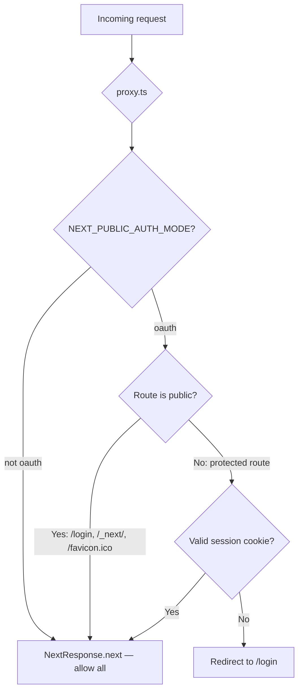

# Web Frontend Architecture

## Layering

| Layer | Location | Responsibility |
|-------|----------|----------------|
| UI primitives | `components/ui/*` | Reusable presentation components — buttons, inputs, modals, tooltips |
| Feature components | `components/*` (outside `ui/`) | Presentational components that consume feature hooks/models |
| Feature services | `features/*/services/*` | Endpoint paths, request/response contract mapping |
| Feature hooks | `features/*/hooks/*` | Workflow state, async orchestration, derived UI state |
| Feature mappers | `features/*/mappers/*` | Backend DTO to UI-facing model translation |
| Feature validators | `features/*/validators/*` | Pure validation logic |
| Pages/layouts | `app/*/page.tsx`, `app/*/layout.tsx` | Route entry points — compose features, no direct API imports |
| API routes | `app/api/*/route.ts` | Server-side proxy to Fastify API with auth header forwarding |
| Middleware | `middleware.ts` | Edge Runtime route protection via `proxy.ts` |
| Auth library | `lib/auth.ts` | Server-side session resolution |
| Env config | `lib/env-web.ts` | Edge-safe env schema (never imports `env.ts`) |

### Rules

- Page and layout components must not import `lib/api.ts` directly.
- Complex form components must not embed validation or API payload shaping inline.
- UI editing state should use feature models, not backend DTOs directly.
- New copy should live in feature-scoped i18n modules and be composed through `lib/i18n.ts`.

### Review checklist

- Does the component own more than one responsibility?
- Does the UI know backend field names like `feeProfileRef` or `tempId`?
- Does validation live in a pure function that can be unit tested?
- Does the change add or preserve a test seam for non-trivial logic?

---

## Smooth Page Performance Baseline

This section is the implementation baseline for authenticated route performance work on `/dashboard`, `/portfolio`, `/transactions`, and `/cash-ledger`. It is intentionally normative: some current code paths still predate this pattern, so treat this as the target contract until implementation evidence in the related performance notes shows full conformance.

### Intent

- The shell should become interactive from lightweight identity and navigation state, not from route-specific portfolio data.
- Each page should own one primary read model that makes first useful content visible.
- Secondary and enrichment reads may improve the page after first paint, but they must not block the initial route content.
- Refreshes should preserve visible content and replace only the affected region with a skeleton or pending state.

### Data boundaries

| Boundary | Owner | Must include | Must not block on |
|---|---|---|---|
| Shell data | `AppShell` and shell-scoped providers | profile, locale, shared owner/read-only context, sidebar/topbar labels, notification bootstrap, command/search essentials, global action handlers | dashboard holdings, dashboard summary cards, transactions lists, cash-ledger rows, page-specific account/balance reads |
| Page primary data | Route entry or route-owned client hook | the smallest route-specific payload required for meaningful content | unrelated route reads, charts, quote freshness decoration, grouped-holding enrichments not needed for the first visible state |
| Secondary data | Route-owned hooks/components | deferred charts, richer actions, filter options that are not required for first render, non-critical preference sync | the route shell and primary content |
| Enrichment data | feature-level helpers/services | quote freshness, FX/reporting overlays, account-label decoration, grouped-holding translation, badge/status polish | unrelated routes and the shell bootstrap |

### Route expectations

| Route | Primary content boundary | Allowed secondary/enrichment after first paint |
|---|---|---|
| `/dashboard` | dashboard summary, grouped holdings preview, action center, enough shared-context data to explain whose portfolio is visible | performance chart series, richer quote/freshness decoration, non-critical controls |
| `/reports` | active report tab, validated URL state, report summary cards, bounded detail rows | follow-up refreshes of the same report DTO, tab switches, mobile detail sheets |
| `/portfolio` | grouped holdings page data and allocation-basis-aware table render | deeper quote freshness, optional breakdowns, non-blocking preference refresh |
| `/transactions` | recent transactions, lightweight account options, route-local status needed to submit/edit safely | richer verification details, non-critical badges, post-render refreshes |
| `/cash-ledger` | first-page ledger rows, human account labels, balances/filters required to understand the page | later pages, optional aggregates, non-critical enrichment |
| `/dividends?view=ledger` | server-seeded Review row summaries, filtered total, eligible years, and account options | aggregates, chart, NHI/source-composition rollups, and persisted row details |
| `/tickers/[ticker]` | ticker identity, scoped position summary, recent transactions, and account breakdown needed to render the page without waiting for chart/fundamental work | chart, fundamentals, refresh metadata, richer overlays |
| `/settings/tickers` | monitored ticker list and current selection state | full instrument catalog, browse/search rows, repair metadata beyond monitored rows |
| `/settings/ai-connectors` | connector summary and policy | recent access logs and expanded history |

### Current route-owned endpoints

- `/dashboard` server-renders from `GET /dashboard/primary`; client enrichment refreshes from `GET /dashboard/enrichment` and chart data from `GET /dashboard/performance`.
- `/reports` server-renders from one of `GET /reports/daily-review`, `GET /reports/portfolio`, or `GET /reports/market`, selected from validated URL state. Client refreshes reuse the same report endpoint and may restore a short-lived cached DTO before revalidation.
- `/portfolio` server-renders from `GET /portfolio/primary`; client enrichment refreshes from `GET /portfolio/enrichment`.
- `/transactions` server-renders from `GET /transactions/primary`; the payload seeds recent rows, transaction account options, and AppShell's portfolio config, while AI inbox details remain tab-owned.
- `/dividends?view=ledger` server-renders from `GET /portfolio/dividends/review/primary`. The client starts `GET /portfolio/dividends/review/enrichment` without making it a prerequisite for the table. Persisted drawer rows load from `GET /portfolio/dividends/postings/:dividendLedgerEntryId` only when opened.
- `/tickers/[ticker]` currently server-seeds from route-owned composition over dashboard primary data, filtered transaction history, and instrument metadata. Backend `GET /tickers/:ticker/primary` and `GET /tickers/:ticker/enrichment` now exist, but the web route has not fully switched to them yet.
- `/settings/tickers` first loads `GET /monitored-tickers`; `GET /instruments` is triggered only when the catalog surface opens.
- `/settings/ai-connectors` first loads `GET /ai/connectors/summary`; recent access uses `GET /ai/connectors/logs`.
- Legacy broad reads such as `GET /dashboard/overview`, `GET /portfolio/page-data`, and `GET /ai/connectors` remain compatibility surfaces and must not become route-primary dependencies for new UI code.

### Shell and route rules

- `AppShell` must not gate route rendering on `/dashboard/overview` or any other page-owned endpoint.
- Route pages may pass server-provided `initialPortfolioConfig` into `AppShell` when a primary read model already contains account/fee-profile config. This prevents an immediate duplicate `/settings/fee-config` client fetch from delaying first controls.
- Shared portfolio owner label and read-only state must be derivable from shell/profile/shared-context data before page primary data resolves.
- Shell command/search bootstrap should use a narrow catalog endpoint such as `/portfolio/instrument-index`, and it must remain non-blocking for route content.
- A route may reuse data structures that also appear elsewhere, but ownership still belongs to the route that needs them for first useful content.
- Existing content should remain mounted during refresh whenever the prior state is still valid. Use local skeletons or loading affordances instead of blanking the whole shell.
- Route DTO caches are allowed for short-lived stale-while-revalidate restore. Cache keys must include route identity plus the state dimensions that change DTO semantics, and invalidation must prefer correctness over reuse.
- Page components and route-owned hooks should name primary versus secondary fetches clearly so reviewers can tell which data is allowed to block first render.

### Dividends Review query and cache state

The Review client keeps requested and committed query identities separate. A query identity contains the portfolio context plus payment-date, account, ticker, market, status, expected-row, and source-composition filters; sort field/direction; page; and page size. Sort, filter, and page-size changes reset to page 1. Previous/Next requests preserve the selected page size (10, 25, or 50).

`useDividendReviewData` applies this state machine:

1. Read only the exact primary cache key for the requested query. Fresh data commits immediately; stale-but-usable data commits with a visible refreshing state and revalidates.
2. If no exact cache entry exists, clear table rows, render fixed-height table-local skeletons, and set `aria-busy`. Rows from a different query identity never stand in for the requested query.
3. Abort a superseded primary request. Only the latest request may commit its response. Pagination controls remain disabled while primary data is pending; sort and filter actions may supersede that request.
4. On primary failure, restore the last committed query, URL, filter controls, and rows, then expose a local retry. Retrying replays the failed identity.
5. Load enrichment by its filter-only identity. Sort and pagination do not restart enrichment. A fresh match renders immediately; stale enrichment remains visible during revalidation and after a revalidation failure, with a retryable warning. Enrichment failure does not blank or disable the primary table.

Primary cache keys include `getRouteDtoContextScope()` (`session user + selected portfolio owner`), every semantic filter, sort, direction, page, and limit. Enrichment keys use the same context and filters but deliberately omit sort and pagination. Both cache slots use the configured route-cache policy: primary maps to the portfolio TTL and enrichment maps to the reports TTL, with the shared stale-usable TTL. Their route tags are `route:dividend-review-primary` and `route:dividend-review-enrichment`.

Dividend posting and reconciliation mutations clear both tags. Review listens for `dividend_reconciliation_changed`, `dividend_posted`, and `dividend_updated` SSE events and then clears/reloads primary and enrichment. Portfolio-context changes clear all context-owned route tags, close and clear the drawer cache, reset Review to page 1, discard the previous owner's committed data, and fetch under the new context identity.

### Dividends Review lazy row detail

Primary rows are table summaries. Synthetic expected rows already contain the fields needed to open the posting workflow and require no detail request. Opening a persisted ledger row triggers a drawer-local detail request; its cache key is `portfolio context + row ID + row version`. The drawer owns its skeleton, `aria-busy` state, error, retry, and abort controller, so a slow or failed detail lookup does not affect the table. Successful mutations, relevant SSE events, and context changes clear the drawer detail cache.

### Performance budgets

These budgets come from the 2026-06-01 smooth-pages baseline note and are the default bar for future work unless a later note replaces them.

| Surface | Budget |
|---|---:|
| Shell/profile/shared context ready | P95 < 300 ms |
| Dashboard usable primary UI | P95 < 2.5 s |
| Portfolio usable primary UI | P95 < 2.0 s |
| Transactions usable primary UI | P95 < 2.0 s |
| Cash ledger first page usable UI | P95 < 2.5 s |
| Dividends Review usable primary table | P95 < 2.5 s |
| Dividends Review sort/page/page-size/filter update | P95 < 1.5 s |
| Dividends Review deferred enrichment | P95 < 5.0 s |
| Blank shell without meaningful page content | Never > 1 s without a route skeleton |

### Instrumentation handoff

- Frontend timing must distinguish shell-ready, route-primary-ready, and secondary/enrichment completion. Do not collapse them into one generic "page loaded" mark.
- When the backend exposes `Server-Timing`, route-level measurement should correlate the browser-visible wait with endpoint durations instead of guessing from one side alone.
- Timing helpers and test logs should record which route-owned endpoint supplied first useful content so regressions are attributable to the correct boundary.

### Verification expectations

- Add focused tests proving `/portfolio`, `/transactions`, and `/cash-ledger` can render primary content without waiting for `/dashboard/overview`.
- Add shared-context tests proving owner label and read-only messaging remain visible while route primary data is pending.
- When implementation is in flight, docs and notes should say whether timing evidence is design-time baseline only or backed by fresh post-change measurements.
- Do not claim the baseline is satisfied until a follow-up note or PR evidence includes before/after measurements plus the repo-required test suites.
- Dividends Review timing entries and deterministic loading-state tests establish observability and state correctness. The required 20-sample-per-scenario warmed PostgreSQL/browser run is recorded in `docs/notes/dividend-review-performance/evidence/results.md`; raw response timing, row identities, and frame probes are retained beside it.

---

## Auth Middleware

The Next.js middleware (`middleware.ts`) delegates to `proxy.ts` for route protection:



The middleware runs in the Edge Runtime. It uses `WebEnv` from `lib/env-web.ts` and cannot import Node.js modules.

### Session resolution

| Function | Location | Behavior | Use in |
|----------|----------|----------|--------|
| `getSession` | `lib/auth.ts` | Returns `{ userId }` or `null` — never throws, never redirects | API route handlers |
| `requireSession` | `lib/auth.ts` | Returns session or redirects to `/login` (302/307) | Page-level guards only |
| `resolveSession` | `lib/auth.ts` | Internal — reads cookie, verifies signature, returns session | Called by `getSession` and `requireSession` |

### Web API route handler pattern

API route handlers at `app/api/*/route.ts` must use `getSession()` with a manual 401 JSON response. Never use `requireSession()` — it issues a redirect, which is wrong for JSON endpoints.

```ts
const session = await getSession(req);
if (!session) return NextResponse.json({ error: "auth_required" }, { status: 401 });
// Forward to Fastify API:
headers: { "x-authenticated-user-id": session.userId }
```

### Key auth files

| File | Runtime | Purpose |
|------|---------|---------|
| `middleware.ts` | Edge | Entry point — delegates to `proxy.ts` |
| `lib/proxy.ts` | Edge | Route protection logic |
| `lib/auth.ts` | Node.js SSR | Session resolution (`getSession`, `requireSession`, `resolveSession`) |
| `lib/env-web.ts` | Edge + SSR | `WebEnv` — Edge-safe env schema |

---

## SSE and Mutation Hooks

### Design model: SSE fast path + polling safety net

SSE is the **preferred fast path** for real-time event delivery, not the sole delivery mechanism. Every SSE consumer has a companion safety net timer that fires if SSE is silent:

1. SSE delivers events instantly when the connection is healthy (the 95% case)
2. A **10-second safety net timer** fires only if SSE delivered nothing — refreshes data, clears loading state, shows a neutral "Portfolio updated." message
3. SSE delivery (success or failure) **cancels** the safety net timer
4. When the safety net fires, a `console.warn` logs the SSE silence for observability

This model exists because SSE over public internet (Browser → Cloudflare CDN → Cloudflare Tunnel → API) is fundamentally at-most-once delivery. Redis pub/sub is fire-and-forget, and proxy layers can silently drop connections.

### SSE infrastructure (`hooks/useEventStream.ts`)

`useEventStream` wraps the browser `EventSource` API. It connects to `GET /events/stream` and routes incoming events to registered handlers.

**Interface:**

```ts
interface UseEventStreamOptions {
  /** @deprecated Use eventTypes instead */
  eventType?: string;
  /** Array of SSE event types to listen for (KZO-113/114) */
  eventTypes?: string[];
  onEvent: (data: unknown) => void;
  onReconnect?: (gap: { lastReceivedId: number; currentId: number }) => void;
  onError?: (error: Event) => void;
  enabled?: boolean;
}
```

Both `eventType` (single) and `eventTypes` (array) are accepted for backward compatibility. The hook registers one `addEventListener` per type, all sharing a `lastEventIdRef` for gap detection on reconnect. The dependency array is stabilized with `JSON.stringify(eventTypes)` to prevent reconnection on every render.

**Retry resilience:** The hook uses a sliding-window retry strategy. `MAX_RETRIES` (5) limits consecutive failures, but the counter resets to 0 if the connection was stable for 60+ seconds before the error. This prevents transient infrastructure events (Cloudflare Tunnel restart, edge failover) from permanently exhausting retries. The `open` event also resets the counter on successful connection.

### Server-side SSE reliability (`sseRoute.ts`, `replayPositionHistory.ts`)

The SSE route (`GET /events/stream`) writes directly to `reply.raw` to bypass Fastify's buffered response. Key reliability measures:

- **`writeEvent()` is wrapped in try/catch** — prevents `ERR_STREAM_DESTROYED` crashes when a Redis pub/sub callback fires after the client socket closes (race between `close` and message delivery in the event loop)
- **`scheduleReplayWithRetry()` wraps `publishEvent()` in try/catch** inside catch blocks — prevents unhandled promise rejections when Redis is disconnected during error reporting
- **30-second heartbeat** keeps the connection alive (below Cloudflare's ~100s idle timeout)
- **CORS headers propagated** via `pickCorsHeaders(reply)` — required because `reply.raw.writeHead()` bypasses Fastify's automatic header flush

### Transaction mutation hooks (`features/portfolio/hooks/useTransactionMutations.ts`)

`useTransactionMutations` manages the full delete and inline-edit workflows for `TransactionHistoryTable`. It coordinates:
- Service calls: `previewImpact`, `deleteTransaction`, `patchTransaction` (via `features/portfolio/services/transactionMutationService.ts`)
- SSE subscription: `eventTypes: ["recompute_complete", "recompute_failed"]` (always enabled)
- Recompute skeleton state: `recomputingIds: Set<string>` (per transaction), `recomputingSymbols: Set<string>` (per `accountId:symbol`)
- **Safety net timer** (10s): fires when SSE is silent, refreshes data, shows neutral "Portfolio updated." message, logs a warning
- Disable guard: prevents new mutations on a symbol while its recompute is in progress

**SSE-cancels-timer pattern:** The `handleSSEEvent` callback sets a `sseDeliveredRef` flag and clears the safety net timer. If SSE delivers `recompute_complete`, it shows a success message. If SSE delivers `recompute_failed`, it shows an error. If SSE delivers nothing within 10 seconds, the safety net fires with the neutral message.

The hook is instantiated in two contexts:
1. `SymbolHistoryClient` (symbol history page) — `refresh: router.refresh()`
2. `AppShell` (global layout) — `refresh: refreshAfterTransaction`, passes `recomputingSymbols` to `HoldingsTable`

### Mutation state propagation

```
useTransactionMutations
  ├── recomputingIds      → TransactionHistoryTable (row skeleton)
  ├── recomputingSymbols  → HoldingsTable (holding row skeleton)
  ├── message/errorMessage→ inline status banners (mutation-status, mutation-error testids)
  └── callbacks           → TransactionHistoryTable (onDeleteRequest, onEditStart, onEditSave…)
```

---

## Card Layout (KZO-161 / KZO-162)

The dashboard, transactions section, and portfolio section all render through a shared `<SortableCardGrid>` (`components/layout/SortableCardGrid.tsx`) — a page-agnostic dnd-kit primitive that:

- Reads canonical card metadata (`{ slug, fullWidth }[]`) from the consumer.
- Fetches the user's saved order via `GET /user-preferences` on mount and merges it with the canonical list (`mergeCardOrder` — unknown slugs dropped, new canonical slugs appended at the tail).
- Wraps the rendered cells in `<DndContext>` + `<SortableContext>` with three sensors: `PointerSensor` (mouse/pen), `KeyboardSensor` (keyboard reorder), and `TouchSensor` with a 250 ms long-press activation delay (mobile).
- Persists order changes via `PATCH /user-preferences { cardOrder: { [orderKey]: [...slugs] } }`, debounced 250 ms after `onDragEnd`. Multiple drags within the window coalesce to one PATCH.
- Optimistic UI: `displayOrder` updates immediately on drag; on PATCH failure the grid reverts to `serverConfirmedOrderRef.current` (the last successful PATCH), not pre-drag — multiple drags inside a debounce window share one rollback baseline.

### Page wiring

| Surface | `orderKey` | Cards | Layout |
|---|---|---|---|
| Dashboard (`/dashboard`) | `dashboard` | `portfolio-trend`, `allocation-snapshot`, `return-percent`, `holdings-table` (full), `dividends-section` (full), `action-center` (full) | Inside the dashboard column; cards canonical list lives in `components/dashboard/cards.ts` |
| Transactions (`/transactions`) | `transactions` | `transactions-add` (full), `transactions-status` (full), `transactions-recent` (full) | All three cards are reorderable in one grid; the `transactions-add` slot renders `AddTransactionCard` normally and a read-only notice in shared context. All slugs `fullWidth: true` so they stack vertically. |
| Portfolio (`/portfolio`) | `portfolio` | `holdings-table` (full), `dividends-section` (full) | Replaces the previous `<HoldingsTable>` + `<DividendsSection>` block. Slugs reused from `DASHBOARD_CARDS` — same React components, different `cardOrder.{key}` namespace, no collision. |

The transactions and portfolio `cards` arrays are inlined at the AppShell call site (no per-page `cards.ts` file) since each has only two entries. Each call site has a one-line "to add a card" comment pointing at the matching `switch` case below it.

Heterogeneous card props (each card takes different data) are wired inline via a `switch (slug)` block inside the grid's render-prop child — no shared abstraction is needed at the metadata level. Adding a new card is `{ slug, fullWidth }` here plus a matching `case` in the switch; `mergeCardOrder` appends it at the tail of any saved-order array automatically.

Drag handle UX: each card cell renders a `⠿` button at the top-left of the wrapper (`absolute -left-2 -top-2`, 28×28 px). The negative offset places the handle slightly outside the card's top-left corner so it does not overlap the card title or eyebrow text. The `card-drag-handle-{slug}` testid is the dnd-kit drag handle for both unit and E2E tests.

### Reset Layout (KZO-162)

The Display tab (`SettingsDrawer` → Display tab → Layout section) exposes **four always-visible buttons**:

- `reset-dashboard-layout-btn` → `PATCH /user-preferences { cardOrder: { dashboard: null } }`
- `reset-transactions-layout-btn` → `PATCH /user-preferences { cardOrder: { transactions: null } }`
- `reset-portfolio-layout-btn` → `PATCH /user-preferences { cardOrder: { portfolio: null } }`
- `reset-all-layouts-btn` → `PATCH /user-preferences { cardOrder: null }` (atomic global clear)

Per-page resets bump only the relevant counter inside `cardLayoutResetCounts: { dashboard, transactions, portfolio }` on AppShell, which keys the matching `<SortableCardGrid>` instance and remounts only that surface. The global "Reset all layouts" bumps every counter atomically. Server-side, the JSONB merge in `setUserPreferencePatch` deep-merges `cardOrder` with sub-key null deletion — `{ cardOrder: { dashboard: null } }` removes only the `dashboard` sub-key while preserving siblings. Postgres uses `jsonb_set(...) || jsonb_strip_nulls(...)`; Memory uses an explicit per-sub-key delete loop.

The same `<SortableRangeList>` primitive (`components/settings/SortableRangeList.tsx`) is used for the per-row drag-reorder UI in two surfaces: the F4 user "Customize ranges" popover (gear icon on `<PortfolioTrendCard>`), and the F4a admin "Dashboard Timeframe Defaults" section. Single source of drag mechanics, two consumers — see the scope-todo at `docs/004-notes/kzo-158/scope-todo-202604241500-kzo-161-refined.md` for the full F4/F4a/F5 contract.

---

## Grouped Holdings Table

Dashboard and portfolio both render `components/portfolio/HoldingsTable.tsx` against grouped holdings:

- API-preferred data comes from `DashboardOverviewDto.holdingGroups`; the component can fall back to deriving groups from compatibility `holdings` rows when older payloads are encountered.
- Parent rows are grouped by ticker plus market code and show aggregate quantity, weighted average cost, current price, market value/cost-basis allocation, P&L, dividend date, quote freshness, and missing-quote allocation fallback labels.
- Child rows mirror the parent table columns at account level and link to `/tickers/{ticker}?marketCode={marketCode}&accountId={accountId}`. Parent rows link to `/tickers/{ticker}?marketCode={marketCode}`.
- Display mode uses a shadcn-style `ToggleGroup`: aggregated, expanded, and account-only. Portfolio defaults to aggregated compact mode; dashboard defaults to expanded grouped rows.
- Toolbar controls use dropdown/checkbox primitives for market, account, quote status, and visible columns. Search filters ticker, market, account name, and account id.
- Allocation basis uses `Market value | Cost basis`, reads/writes `holdingAllocationBasis` through `/user-preferences`, and stores a localStorage fallback under `vakwen-holdings-allocation-basis`.

Dashboard allocation and biggest-movers cards consume grouped holdings so a ticker/market appears once across multiple accounts. Ticker pages consume `holdingGroup` and `accountBreakdown` for aggregate/account-scoped views.

---

## Demo Mode Components

| Component | Location | Purpose |
|-----------|----------|---------|
| `DemoButton` | `components/DemoButton.tsx` | "Try it — no sign-up needed" button on login page |
| `DemoBanner` | `components/DemoBanner.tsx` | Amber banner on protected pages: "You're using a demo session" |
| Demo route handler | Fastify API `POST /auth/demo/start` | Creates demo user, seeds data, returns session cookie |
| `SignInButton` | `components/SignInButton.tsx` | Google sign-in button; shown alongside demo button when `DEMO_MODE_ENABLED=true` |

Demo components are conditionally rendered based on `NEXT_PUBLIC_DEMO_MODE_ENABLED`. The demo button calls `POST /auth/demo/start` on the API, which creates a temporary user and returns a session cookie.

---

## Build-Time vs Runtime Variables

| Variable | Inlined at | Changed by |
|----------|-----------|-----------|
| `NEXT_PUBLIC_AUTH_MODE` | Build time (Dockerfile `ARG` -> `ENV`) | Rebuild web image |
| `NEXT_PUBLIC_API_BASE_URL` | Build time | Rebuild web image |
| `NEXT_PUBLIC_DEMO_MODE_ENABLED` | Build time | Rebuild web image |
| `SERVER_API_BASE_URL` | Runtime (compose `environment`) | Restart container |

`NEXT_PUBLIC_*` vars are baked into the client JS bundle by Next.js. The multi-stage Docker build does not carry `ARG`/`ENV` values to the runtime stage, so server-side code (`proxy.ts`, `auth.ts`) also needs `NEXT_PUBLIC_AUTH_MODE` set in the compose `environment` block.

---

## Related Docs

- [Auth and Session](./auth-and-session.md) — full OAuth flow, cookie details, identity resolution
- [System Architecture](./architecture.md) — request lifecycle, deployment topology
- [Backend, DB & API](./backend-db-api.md) — API endpoints consumed by the web app
- [Environment Variables](../002-operations/environment-variables.md) — web env vars, schemas
