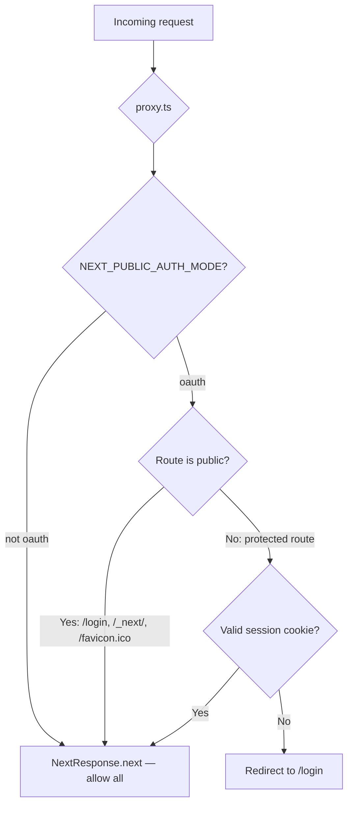

# Web Frontend Architecture

## Layering

| Layer | Location | Responsibility |
|-------|----------|----------------|
| UI primitives | `components/ui/*` | Reusable presentation components — buttons, inputs, modals, tooltips |
| Feature components | `components/*` (outside `ui/`) | Presentational components that consume feature hooks/models |
| Feature services | `features/*/services/*` | Endpoint paths, request/response contract mapping |
| Feature hooks | `features/*/hooks/*` | Workflow state, async orchestration, derived UI state |
| Feature mappers | `features/*/mappers/*` | Backend DTO to UI-facing model translation |
| Feature validators | `features/*/validators/*` | Pure validation logic |
| Pages/layouts | `app/*/page.tsx`, `app/*/layout.tsx` | Route entry points — compose features, no direct API imports |
| API routes | `app/api/*/route.ts` | Server-side proxy to Fastify API with auth header forwarding |
| Middleware | `middleware.ts` | Edge Runtime route protection via `proxy.ts` |
| Auth library | `lib/auth.ts` | Server-side session resolution |
| Env config | `lib/env-web.ts` | Edge-safe env schema (never imports `env.ts`) |

### Rules

- Page and layout components must not import `lib/api.ts` directly.
- Complex form components must not embed validation or API payload shaping inline.
- UI editing state should use feature models, not backend DTOs directly.
- New copy should live in feature-scoped i18n modules and be composed through `lib/i18n.ts`.

### Review checklist

- Does the component own more than one responsibility?
- Does the UI know backend field names like `feeProfileRef` or `tempId`?
- Does validation live in a pure function that can be unit tested?
- Does the change add or preserve a test seam for non-trivial logic?

---

## Auth Middleware

The Next.js middleware (`middleware.ts`) delegates to `proxy.ts` for route protection:



The middleware runs in the Edge Runtime. It uses `WebEnv` from `lib/env-web.ts` and cannot import Node.js modules.

### Session resolution

| Function | Location | Behavior | Use in |
|----------|----------|----------|--------|
| `getSession` | `lib/auth.ts` | Returns `{ userId }` or `null` — never throws, never redirects | API route handlers |
| `requireSession` | `lib/auth.ts` | Returns session or redirects to `/login` (302/307) | Page-level guards only |
| `resolveSession` | `lib/auth.ts` | Internal — reads cookie, verifies signature, returns session | Called by `getSession` and `requireSession` |

### Web API route handler pattern

API route handlers at `app/api/*/route.ts` must use `getSession()` with a manual 401 JSON response. Never use `requireSession()` — it issues a redirect, which is wrong for JSON endpoints.

```ts
const session = await getSession(req);
if (!session) return NextResponse.json({ error: "auth_required" }, { status: 401 });
// Forward to Fastify API:
headers: { "x-authenticated-user-id": session.userId }
```

### Key auth files

| File | Runtime | Purpose |
|------|---------|---------|
| `middleware.ts` | Edge | Entry point — delegates to `proxy.ts` |
| `lib/proxy.ts` | Edge | Route protection logic |
| `lib/auth.ts` | Node.js SSR | Session resolution (`getSession`, `requireSession`, `resolveSession`) |
| `lib/env-web.ts` | Edge + SSR | `WebEnv` — Edge-safe env schema |

---

## SSE and Mutation Hooks

### Design model: SSE fast path + polling safety net

SSE is the **preferred fast path** for real-time event delivery, not the sole delivery mechanism. Every SSE consumer has a companion safety net timer that fires if SSE is silent:

1. SSE delivers events instantly when the connection is healthy (the 95% case)
2. A **10-second safety net timer** fires only if SSE delivered nothing — refreshes data, clears loading state, shows a neutral "Portfolio updated." message
3. SSE delivery (success or failure) **cancels** the safety net timer
4. When the safety net fires, a `console.warn` logs the SSE silence for observability

This model exists because SSE over public internet (Browser → Cloudflare CDN → Cloudflare Tunnel → API) is fundamentally at-most-once delivery. Redis pub/sub is fire-and-forget, and proxy layers can silently drop connections.

### SSE infrastructure (`hooks/useEventStream.ts`)

`useEventStream` wraps the browser `EventSource` API. It connects to `GET /events/stream` and routes incoming events to registered handlers.

**Interface:**

```ts
interface UseEventStreamOptions {
  /** @deprecated Use eventTypes instead */
  eventType?: string;
  /** Array of SSE event types to listen for (KZO-113/114) */
  eventTypes?: string[];
  onEvent: (data: unknown) => void;
  onReconnect?: (gap: { lastReceivedId: number; currentId: number }) => void;
  onError?: (error: Event) => void;
  enabled?: boolean;
}
```

Both `eventType` (single) and `eventTypes` (array) are accepted for backward compatibility. The hook registers one `addEventListener` per type, all sharing a `lastEventIdRef` for gap detection on reconnect. The dependency array is stabilized with `JSON.stringify(eventTypes)` to prevent reconnection on every render.

**Retry resilience:** The hook uses a sliding-window retry strategy. `MAX_RETRIES` (5) limits consecutive failures, but the counter resets to 0 if the connection was stable for 60+ seconds before the error. This prevents transient infrastructure events (Cloudflare Tunnel restart, edge failover) from permanently exhausting retries. The `open` event also resets the counter on successful connection.

### Server-side SSE reliability (`sseRoute.ts`, `replayPositionHistory.ts`)

The SSE route (`GET /events/stream`) writes directly to `reply.raw` to bypass Fastify's buffered response. Key reliability measures:

- **`writeEvent()` is wrapped in try/catch** — prevents `ERR_STREAM_DESTROYED` crashes when a Redis pub/sub callback fires after the client socket closes (race between `close` and message delivery in the event loop)
- **`scheduleReplayWithRetry()` wraps `publishEvent()` in try/catch** inside catch blocks — prevents unhandled promise rejections when Redis is disconnected during error reporting
- **30-second heartbeat** keeps the connection alive (below Cloudflare's ~100s idle timeout)
- **CORS headers propagated** via `pickCorsHeaders(reply)` — required because `reply.raw.writeHead()` bypasses Fastify's automatic header flush

### Transaction mutation hooks (`features/portfolio/hooks/useTransactionMutations.ts`)

`useTransactionMutations` manages the full delete and inline-edit workflows for `TransactionHistoryTable`. It coordinates:
- Service calls: `previewImpact`, `deleteTransaction`, `patchTransaction` (via `features/portfolio/services/transactionMutationService.ts`)
- SSE subscription: `eventTypes: ["recompute_complete", "recompute_failed"]` (always enabled)
- Recompute skeleton state: `recomputingIds: Set<string>` (per transaction), `recomputingSymbols: Set<string>` (per `accountId:symbol`)
- **Safety net timer** (10s): fires when SSE is silent, refreshes data, shows neutral "Portfolio updated." message, logs a warning
- Disable guard: prevents new mutations on a symbol while its recompute is in progress

**SSE-cancels-timer pattern:** The `handleSSEEvent` callback sets a `sseDeliveredRef` flag and clears the safety net timer. If SSE delivers `recompute_complete`, it shows a success message. If SSE delivers `recompute_failed`, it shows an error. If SSE delivers nothing within 10 seconds, the safety net fires with the neutral message.

The hook is instantiated in two contexts:
1. `SymbolHistoryClient` (symbol history page) — `refresh: router.refresh()`
2. `AppShell` (global layout) — `refresh: refreshAfterTransaction`, passes `recomputingSymbols` to `HoldingsTable`

### Mutation state propagation

```
useTransactionMutations
  ├── recomputingIds      → TransactionHistoryTable (row skeleton)
  ├── recomputingSymbols  → HoldingsTable (holding row skeleton)
  ├── message/errorMessage→ inline status banners (mutation-status, mutation-error testids)
  └── callbacks           → TransactionHistoryTable (onDeleteRequest, onEditStart, onEditSave…)
```

---

## Dashboard Card Layout (KZO-161)

The dashboard renders its cards through a single `<SortableCardGrid>` (`components/layout/SortableCardGrid.tsx`) — a page-agnostic dnd-kit primitive that:

- Reads canonical card metadata (`{ slug, fullWidth }[]`) from the consumer.
- Fetches the user's saved order via `GET /user-preferences` on mount and merges it with the canonical list (`mergeCardOrder` — unknown slugs dropped, new canonical slugs appended at the tail).
- Wraps the rendered cells in `<DndContext>` + `<SortableContext>` with three sensors: `PointerSensor` (mouse/pen), `KeyboardSensor` (keyboard reorder), and `TouchSensor` with a 250 ms long-press activation delay (mobile).
- Persists order changes via `PATCH /user-preferences { cardOrder: { [orderKey]: [...slugs] } }`, debounced 250 ms after `onDragEnd`. Multiple drags within the window coalesce to one PATCH.
- Optimistic UI: `displayOrder` updates immediately on drag; on PATCH failure the grid reverts to `serverConfirmedOrderRef.current` (the last successful PATCH), not pre-drag — multiple drags inside a debounce window share one rollback baseline.

Canonical dashboard list (`components/dashboard/cards.ts`):

```ts
export const DASHBOARD_CARDS = [
  { slug: "portfolio-trend",     fullWidth: false },
  { slug: "allocation-snapshot", fullWidth: false },
  { slug: "return-percent",      fullWidth: false },
  { slug: "holdings-table",      fullWidth: true  },
  { slug: "dividends-section",   fullWidth: true  },
  { slug: "action-center",       fullWidth: true  },
] as const;
```

Heterogeneous card props (each card takes different data) are wired inline in `AppShell.tsx` via a `switch (slug)` block inside the grid's render-prop child — no shared abstraction is needed at the metadata level. Adding a new card is `{ slug, fullWidth }` here plus a matching `case` in the switch; `mergeCardOrder` appends it at the tail of any saved-order array automatically.

Layout: `grid grid-cols-1 xl:grid-cols-2 gap-6 [grid-auto-flow:dense]`. Full-width cards apply `xl:col-span-2`. The `RouteHeroPanel` stays above the sortable grid (fixed); there are no longer fixed cards below the grid — `ActionCenterSection` joined the draggable list as a `fullWidth: true` slug.

Drag handle UX: each card cell renders a `⠿` button at the top-left of the wrapper (`absolute -left-2 -top-2`, 28×28 px). The negative offset places the handle slightly outside the card's top-left corner so it does not overlap the card title or eyebrow text. The `card-drag-handle-{slug}` testid is the dnd-kit drag handle for both unit and E2E tests.

Reset: the Display tab (`SettingsDrawer` → Display tab → Layout section) exposes a "Reset Layout" button that PATCHes `{ cardOrder: null }` and bumps a `cardLayoutResetCount` key on the grid, forcing a remount + re-fetch.

The same `<SortableRangeList>` primitive (`components/settings/SortableRangeList.tsx`) is used for the per-row drag-reorder UI in two surfaces: the F4 user "Customize ranges" popover (gear icon on `<PortfolioTrendCard>`), and the F4a admin "Dashboard Timeframe Defaults" section. Single source of drag mechanics, two consumers — see the scope-todo at `docs/004-notes/kzo-158/scope-todo-202604241500-kzo-161-refined.md` for the full F4/F4a/F5 contract.

---

## Demo Mode Components

| Component | Location | Purpose |
|-----------|----------|---------|
| `DemoButton` | `components/DemoButton.tsx` | "Try it — no sign-up needed" button on login page |
| `DemoBanner` | `components/DemoBanner.tsx` | Amber banner on protected pages: "You're using a demo session" |
| Demo route handler | Fastify API `POST /auth/demo/start` | Creates demo user, seeds data, returns session cookie |
| `SignInButton` | `components/SignInButton.tsx` | Google sign-in button; shown alongside demo button when `DEMO_MODE_ENABLED=true` |

Demo components are conditionally rendered based on `NEXT_PUBLIC_DEMO_MODE_ENABLED`. The demo button calls `POST /auth/demo/start` on the API, which creates a temporary user and returns a session cookie.

---

## Build-Time vs Runtime Variables

| Variable | Inlined at | Changed by |
|----------|-----------|-----------|
| `NEXT_PUBLIC_AUTH_MODE` | Build time (Dockerfile `ARG` -> `ENV`) | Rebuild web image |
| `NEXT_PUBLIC_API_BASE_URL` | Build time | Rebuild web image |
| `NEXT_PUBLIC_DEMO_MODE_ENABLED` | Build time | Rebuild web image |
| `SERVER_API_BASE_URL` | Runtime (compose `environment`) | Restart container |

`NEXT_PUBLIC_*` vars are baked into the client JS bundle by Next.js. The multi-stage Docker build does not carry `ARG`/`ENV` values to the runtime stage, so server-side code (`proxy.ts`, `auth.ts`) also needs `NEXT_PUBLIC_AUTH_MODE` set in the compose `environment` block.

---

## Related Docs

- [Auth and Session](./auth-and-session.md) — full OAuth flow, cookie details, identity resolution
- [System Architecture](./architecture.md) — request lifecycle, deployment topology
- [Backend, DB & API](./backend-db-api.md) — API endpoints consumed by the web app
- [Environment Variables](../002-operations/environment-variables.md) — web env vars, schemas
