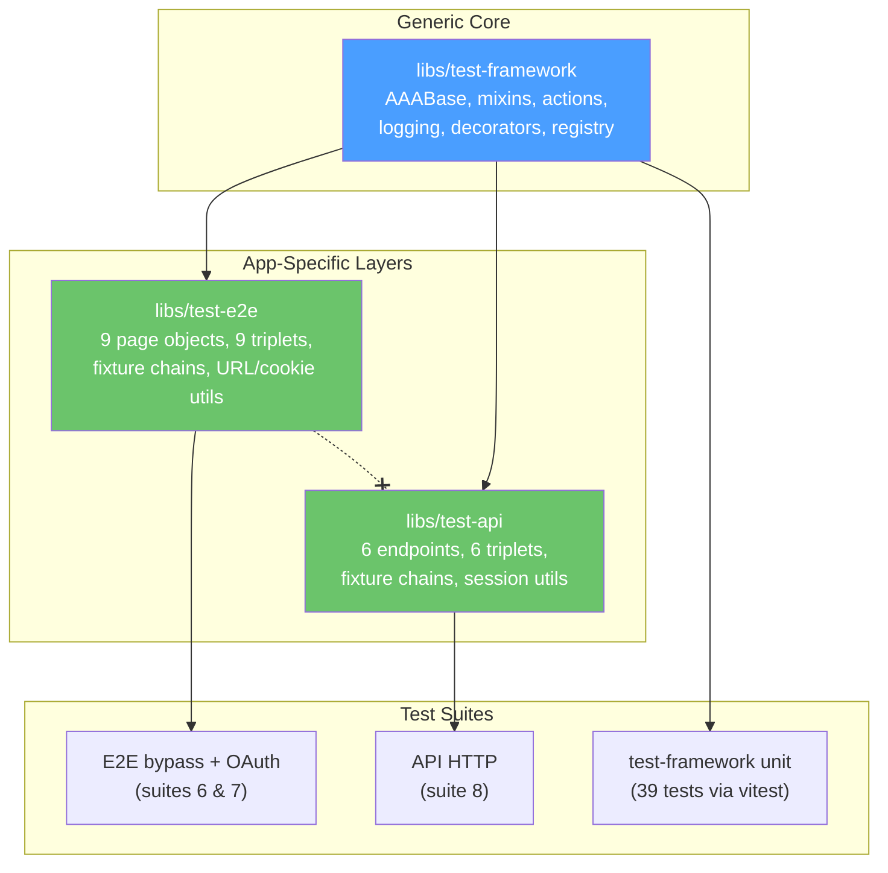

# Acceptance Criteria to Tests Mapping

## Test Suite Overview

Eight required suites. All must pass before declaring "tests pass."

| # | Suite | Command | Runner | Auth Mode |
|---|-------|---------|--------|-----------|
| 1 | Lint | `npx eslint .` | ESLint | n/a |
| 2 | Typecheck | `npm run typecheck` | tsc | n/a |
| 3 | Web unit | `npm run test --prefix apps/web` | Vitest | n/a |
| 4 | API package | `npm run test --prefix apps/api` | Vitest | Memory |
| 5 | API integration | `npm run test:integration:full:host` | Vitest | Postgres |
| 6 | E2E bypass | `npm run test:e2e:bypass:mem --prefix apps/web` | Playwright | dev_bypass |
| 7 | E2E OAuth | `npm run test:e2e:oauth:mem --prefix apps/web` | Playwright | oauth |
| 8 | API HTTP | `npm run test:http --prefix apps/api` | Playwright | oauth |

`npm run test --prefix apps/api` covers API unit tests plus memory-backed integration tests. It does not replace suite 5, which runs the Postgres-backed integration matrix.

---

## Functional Acceptance

1. Fee profile math (rounding/min fee/day trade)
- Unit: `libs/domain/test/fee.test.ts`
- API HTTP: `apps/api/test/http/specs/fee-profiles-aaa.http.spec.ts`, `settings-aaa.http.spec.ts`
- API integration: `apps/api/test/integration/`

2. Weighted-average lot matching
- Unit: `libs/domain/test/lot.test.ts`

3. Historical immutability + recompute preview/confirm
- Integration: `apps/api/test/integration/`
- E2E: `apps/web/tests/e2e/specs/transaction-mutations-aaa.spec.ts`

4. Critical user journey (navigation, locale, settings, transactions)
- E2E: `apps/web/tests/e2e/specs/shell-navigation-aaa.spec.ts`, `settings-aaa.spec.ts`, `portfolio-transactions-aaa.spec.ts`

5. Service health and readiness
- API endpoints: `/health/live`, `/health/ready`
- Integration: `apps/api/test/integration/` (contract: status shape and dependencies)

6. Web locale switch and full Traditional Chinese translation
- E2E: `apps/web/tests/e2e/specs/settings-aaa.spec.ts`

7. Settings unsaved-change discard flow
- E2E: `apps/web/tests/e2e/specs/settings-aaa.spec.ts`

8. Settings/domain tooltips visibility and accessibility (including weighted-average details)
- E2E: `apps/web/tests/e2e/specs/tooltips-a11y-aaa.spec.ts`

9. Fee profile settings UX v2 (drawer tabs, account fallback, per-security overrides)
- API HTTP: `apps/api/test/http/specs/fee-profiles-aaa.http.spec.ts`, `settings-aaa.http.spec.ts`
- API integration: `apps/api/test/integration/`
- E2E: `apps/web/tests/e2e/specs/settings-aaa.spec.ts`

10. System-generated profile IDs and temp-ID resolution in full settings save flow
- API HTTP: `apps/api/test/http/specs/settings-aaa.http.spec.ts`

11. Security baseline (strict validation + tenant-safe persistence upserts)
- API HTTP: `apps/api/test/http/specs/` (auth identity, OAuth identity resolution)
- API integration: `apps/api/test/integration/`

12. OAuth login, session management, demo mode
- E2E OAuth: `apps/web/tests/e2e/specs-oauth/auth-session-aaa.spec.ts`, `auth-demo-aaa.spec.ts`
- API HTTP: `apps/api/test/http/specs/e2e-oauth-session-aaa.http.spec.ts`, `auth-identity-source-aaa.http.spec.ts`

---

## API Route Coverage (HTTP vs Integration vs E2E)

### Playwright HTTP specs (`apps/api/test/http/specs/*-aaa.http.spec.ts`)

Browser-free API contract tests using `libs/test-api` AAA assistants:

- **Settings:** GET `/settings`, PATCH `/settings`, PUT `/settings/full`, GET `/settings/fee-config`, PUT `/settings/fee-config`
- **Accounts:** GET `/accounts`, PATCH `/accounts/:id`
- **Fee profiles:** GET/POST/PATCH/DELETE `/fee-profiles`
- **Profile API:** GET/PUT `/profile`
- **Auth identity:** Cookie-vs-header resolution, `POST /__e2e/oauth-session`
- **OAuth identity resolution:** Multi-provider identity linking, email-based resolution

### Vitest integration tests (`apps/api/test/integration/*.integration.test.ts`)

Routes or flows that need in-process setup, module mocking, persistence orchestration, or streaming:

- **Health:** GET `/health/live`, GET `/health/ready` (status and dependencies shape)
- **Portfolio:** POST/GET `/portfolio/transactions`, GET `/portfolio/holdings`, POST `/portfolio/recompute/preview`, POST `/portfolio/recompute/confirm`
- **Corporate actions:** GET `/corporate-actions`, POST `/corporate-actions` (success and failure paths)
- **AI:** POST `/ai/transactions/confirm`
- **Auth/demo/session internals:** OAuth callback handling, demo session orchestration, SSE, user identity persistence

### E2E-only coverage

Routes covered only by E2E or out of scope for API-only contract suites:

- GET `/auth/google/start`, GET `/auth/google/callback` (browser redirect flow)
- GET `/quotes/latest` (market data)
- POST `/ai/transactions/parse` (AI text parsing)
- SSE `/events/stream` (browser-mediated: `specs/sse-events.spec.ts`, `specs-oauth/sse-auth.spec.ts`)

---

## E2E Spec File Inventory

### `specs/` (dev_bypass mode, suite 6)

| Spec file | Coverage area |
|-----------|---------------|
| `shell-navigation-aaa.spec.ts` | App shell, sidebar nav, search, routing |
| `settings-aaa.spec.ts` | Settings drawer, locale, fee profiles, discard flow |
| `portfolio-transactions-aaa.spec.ts` | Transaction CRUD, inline edit |
| `transaction-mutations-aaa.spec.ts` | Delete, edit, recompute cascade, SSE confirmation |
| `tooltips-a11y-aaa.spec.ts` | Tooltip visibility, keyboard accessibility |
| `auth-oauth-aaa.spec.ts` | OAuth login flow (mock OAuth server) |
| `sse-events.spec.ts` | SSE event delivery (non-AAA, browser-mediated) |
| `identity-resolution.spec.ts` | Cookie persistence across navigation (non-AAA) |

### `specs-oauth/` (OAuth mode, suite 7)

| Spec file | Coverage area |
|-----------|---------------|
| `auth-session-aaa.spec.ts` | Session cookie lifecycle, logout, route protection |
| `auth-demo-aaa.spec.ts` | Demo mode sign-in, TTL expiry, banner |
| `demo-symbol-history-aaa.spec.ts` | Demo user symbol/history page flows |
| `profile-tab-aaa.spec.ts` | Profile tab in settings (OAuth identity) |
| `routing-aaa.spec.ts` | Protected route redirects, returnTo |
| `sse-auth.spec.ts` | SSE with OAuth session (non-AAA, browser-mediated) |

### `apps/api/test/http/specs/` (API HTTP, suite 8)

| Spec file | Coverage area |
|-----------|---------------|
| `settings-aaa.http.spec.ts` | Settings CRUD, full save, fee config |
| `accounts-aaa.http.spec.ts` | Account listing, rename |
| `fee-profiles-aaa.http.spec.ts` | Fee profile CRUD |
| `profile-api-aaa.http.spec.ts` | Profile GET/PUT |
| `auth-identity-source-aaa.http.spec.ts` | Cookie vs header auth resolution |
| `e2e-oauth-session-aaa.http.spec.ts` | Test session endpoint |
| `identity-resolution-aaa.http.spec.ts` | User identity upsert |
| `oauth-identity-resolution-aaa.http.spec.ts` | Multi-provider OAuth identity |

### Non-AAA specs (legitimate, not migration leftovers)

| File | Reason |
|------|--------|
| `specs/sse-events.spec.ts` | Browser-mediated SSE, not HTTP-migrable |
| `specs/identity-resolution.spec.ts` | Uses `page.goto()` + `page.reload()` for cookie persistence |
| `specs-oauth/sse-auth.spec.ts` | Browser-mediated SSE with OAuth, not HTTP-migrable |

---

## Test Library Architecture



```
Plain-text:

libs/test-framework (generic AAA core)
├──► libs/test-e2e (web E2E)  ──► E2E bypass + OAuth specs (suites 6 & 7)
├──► libs/test-api (API HTTP)  ──► API HTTP specs (suite 8)
└──► test-framework unit tests (39 vitest tests)

test-e2e ──╳── test-api  (siblings, never import each other)
```
