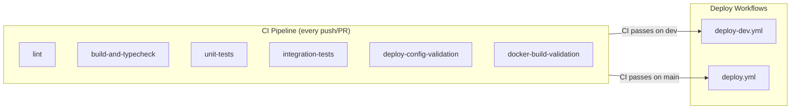
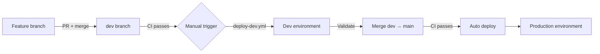
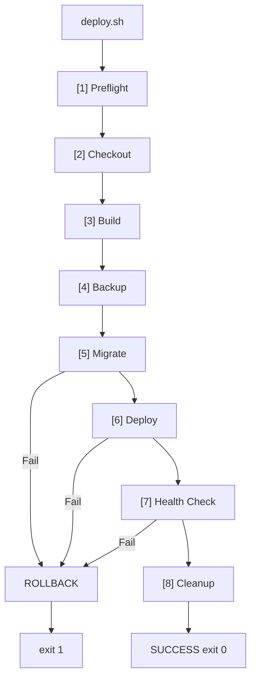

# CI/CD

GitHub Actions pipelines, deploy workflows, and validation scripts.

---

## Pipeline Overview



---

## CI Pipeline

| Job | What it does | Depends on |
|-----|-------------|------------|
| `lint` | `npx eslint .` — full project lint | — |
| `build-and-typecheck` | Builds workspace libs, API, web; runs typecheck | — |
| `unit-tests` | `npm run test:unit --prefix apps/web` (vitest) | `build-and-typecheck` |
| `integration-tests` | `npm run test:integration:full:host --prefix apps/api` with isolated Postgres/Redis | `build-and-typecheck` |
| `deploy-config-validation` | Validates all compose files render with fixture env | `build-and-typecheck` |
| `docker-build-validation` | Builds all Docker images including migrate (`--profile migrate`) | `deploy-config-validation` |

### PR gate checks

| Check | Required? | Description |
|-------|-----------|-------------|
| `lint` | Yes | No ESLint errors |
| `build-and-typecheck` | Yes | All packages build and typecheck cleanly |
| `unit-tests` | Yes | All vitest unit tests pass |
| `integration-tests` | Yes | API integration tests pass with real Postgres/Redis |
| `deploy-config-validation` | Yes | Compose files render without errors |
| `docker-build-validation` | Yes | All Docker images build successfully |

---

## Deploy Workflows

### Branch-to-environment mapping

| Branch | Workflow | GitHub Environment | Trigger |
|--------|---------|-------------------|---------|
| `dev` | `deploy-dev.yml` | `dev` | Manual (`workflow_dispatch`) |
| `main` | `deploy.yml` | `production` | Automatic after CI passes (`workflow_run`) |

### Promotion flow



### Reusable deploy workflow

Both workflows use the same hardened pattern:

1. Wait for CI to succeed on the matching branch
2. Install Cloudflare WARP client on the GitHub-hosted runner
3. Enroll runner into Zero Trust using a service token
4. Install SSH deploy key and pinned `known_hosts`
5. Verify remote deploy script, compose file, and env file exist
6. Run `deploy.sh` with the exact CI-tested commit SHA

---

## Deploy Script

### Phases



| Phase | Action |
|-------|--------|
| Preflight | Validate git, docker, env file, compose config |
| Checkout | `git fetch` + checkout + reset to target SHA |
| Build | `docker compose --profile migrate build` |
| Backup | `pg_dump \| gzip` (if postgres running) |
| Migrate | `docker compose run --rm migrate` + post-migration verification |
| Deploy | `docker compose up -d --remove-orphans` |
| Health Check | API `/health/live` (30s) + Web `/` (20s) |
| Cleanup | Remove old images |

**Rollback**: Restores previous branch/SHA, rebuilds images, restores DB from backup, `docker compose up -d`.

### Options

| Option | Description |
|--------|-------------|
| `-e`, `--environment ENV` | `production` or `dev` (default: `production`) |
| `-b`, `--branch BRANCH` | Deploy from this branch (default: `main`) |
| `-s`, `--select-branch` | Interactively choose branch (requires TTY) |
| `-t`, `--image-tag TAG` | Image tag for app images (default: short SHA) |
| `-f`, `--force` | Allow deploy with uncommitted changes |
| `DEPLOY_SHA` | Commit SHA to deploy (must be reachable from branch) |

### Logging

Each deploy writes a timestamped log and per-container log snapshots to `~/.local/state/tw-portfolio/<environment>/logs/deploy/`. Logs older than 30 days are pruned automatically.

---

## Validation Script

`infra/scripts/validate-local.sh` validates the local Docker stack end-to-end:

1. Preflight — check docker, compose file, env file
2. Build — `docker compose --profile migrate build`
3. Start infra — postgres + redis, wait for healthy (60s)
4. Migrate — run migrate container
5. Start apps — api + web containers
6. Health check — API `/health/live` (30s), Web `/` (20s)
7. Summary — `docker compose ps`

Pass `--teardown` to tear down after validation. Accessible via `npm run dev:docker:validate` (or `:teardown`).

---

## Service Redeploy

`infra/scripts/redeploy-service.sh` rebuilds and restarts a single service:

```bash
bash infra/scripts/redeploy-service.sh -e local web
bash infra/scripts/redeploy-service.sh -e dev api
bash infra/scripts/redeploy-service.sh -e production --with-deps web
```

Options: `-e ENV` (required), `--with-deps` (restart dependents), service name (`api` or `web`).

---

## GitHub Environment Secrets

| Name | Type | Purpose |
|------|------|---------|
| `CF_ACCESS_CLIENT_ID` | Secret | Cloudflare WARP service token Client ID |
| `CF_ACCESS_CLIENT_SECRET` | Secret | Cloudflare WARP service token Client Secret |
| `CF_TEAM_NAME` | Secret | Cloudflare Zero Trust team name |
| `DEPLOY_SSH_KEY` | Secret | Private SSH deploy key (OpenSSH format) |
| `DEPLOY_KNOWN_HOSTS` | Secret | Verified `known_hosts` entry for deploy host |
| `DEPLOY_HOST` | Secret/Variable | Private IP or hostname for SSH over WARP |
| `DEPLOY_USER` | Secret/Variable | SSH user for remote deploy |
| `DEPLOY_PATH` | Secret/Variable | Absolute repo path on deploy host (no `~`) |

Both `dev` and `production` environments use the same secret names with environment-specific values.

---

## Related Docs

- [Runbook](./runbook.md) — deploy flow details, rollback procedures, troubleshooting
- [System Architecture](../001-architecture/architecture.md) — deployment topology, container layout
- [Environment Variables](./environment-variables.md) — all env vars used by CI and deploy
