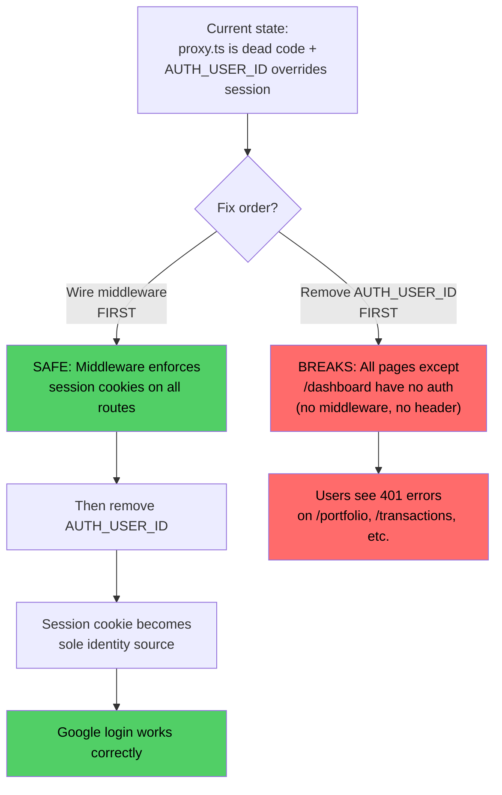
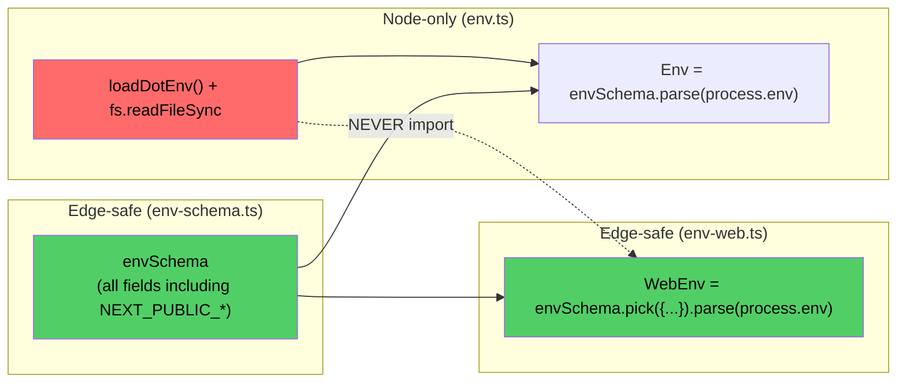
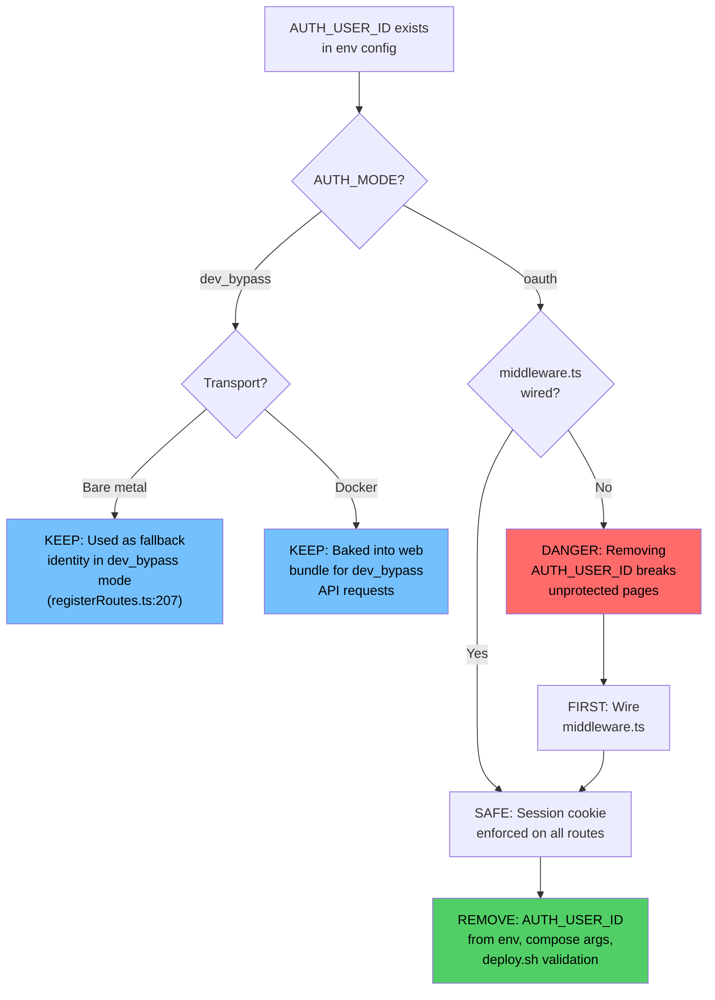
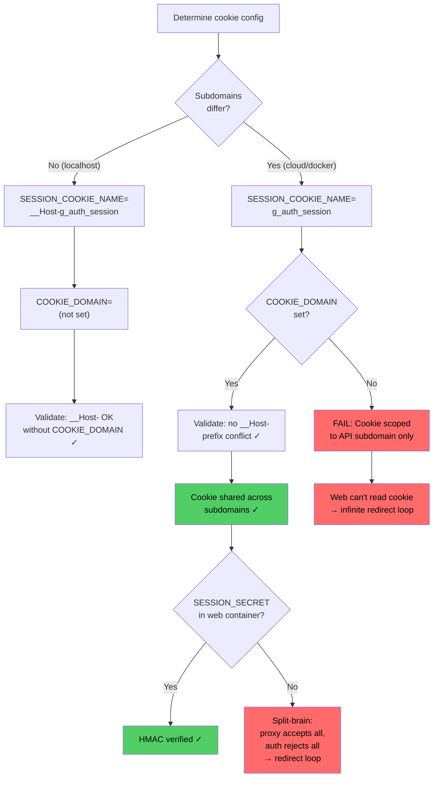
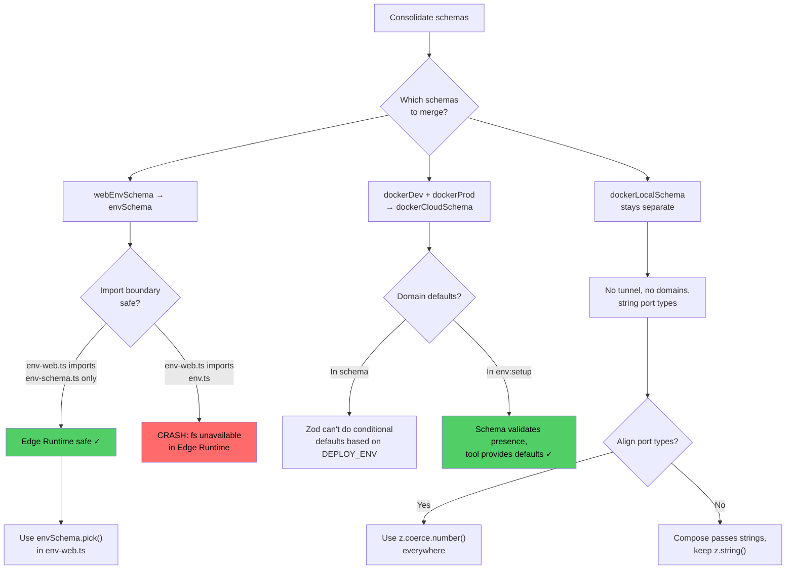
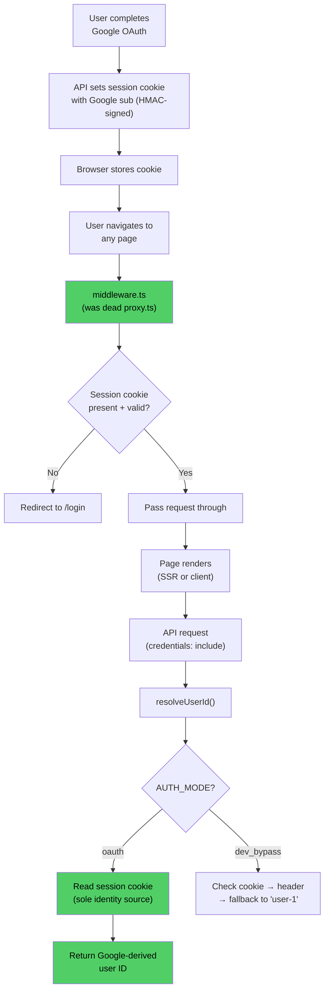
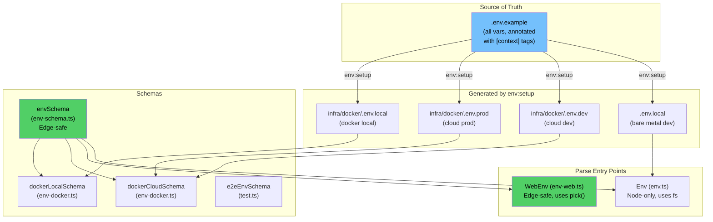
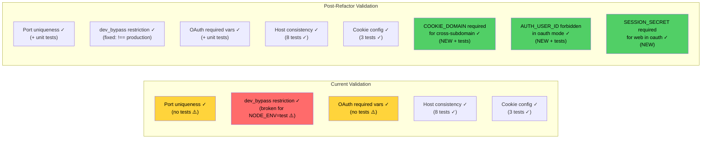
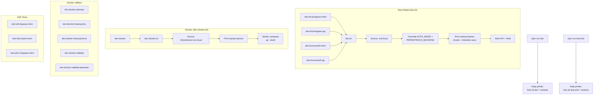

# Environment Variable Refactor — Team Review

> **Team**: Architect, Backend Engineer, Senior QA
> **Date**: 2026-03-21
> **Input**: [env-variable-refactor-plan.md](./env-variable-refactor-plan.md)
> **Scope**: Feasibility, simplicity, AUTH_USER_ID bug, testability, security

---

## Executive Summary

The plan is **feasible with critical prerequisites**. The team reached consensus on all items after cross-cutting debate. Three critical issues must be resolved before or alongside the refactor — two are pre-existing bugs, one is a missing architectural piece.

### Verdict: APPROVED with 3 blocking prerequisites

| # | Prerequisite | Why it blocks |
|---|-------------|---------------|
| P0-1 | Wire `proxy.ts` as `middleware.ts` | Without this, removing AUTH_USER_ID breaks all pages except /dashboard |
| P0-2 | Remove AUTH_USER_ID from cloud deploys | Root cause of Google login bug — identity conflict between header and cookie |
| P0-3 | Add SESSION_SECRET to docker-compose.local.yml web container | Local Docker auth is broken (redirect loop) |

---

## 1. The AUTH_USER_ID Bug — Unanimous Root Cause

All three agents independently traced the same bug. The team reached full consensus.

### The Identity Conflict

```
AUTH_USER_ID=user-1 (env file)
  → NEXT_PUBLIC_AUTH_USER_ID=user-1 (baked into Next.js bundle at Docker build time)
    → getAuthHeaders() in apps/web/lib/api.ts:39-45
      → x-authenticated-user-id: user-1 (sent on EVERY API request)
        → resolveUserId() in apps/api/src/routes/registerRoutes.ts:182-198
          → Header checked FIRST, returns "user-1"
          → Session cookie (containing real Google identity) NEVER reached
```

### The Atomic Fix (Architect's critical finding)

The team debated fix ordering and reached consensus: **these two changes are an atomic pair — neither is safe alone.**



**Step 1**: Create `apps/web/middleware.ts` that re-exports `proxy` from `proxy.ts` — enables session cookie enforcement on all routes.

**Step 2**: Remove `AUTH_USER_ID` / `NEXT_PUBLIC_AUTH_USER_ID` from env files, compose build args, and deploy.sh validation. Invert deploy.sh:401-404 to *forbid* AUTH_USER_ID when AUTH_MODE=oauth.

**Step 3**: Update `resolveUserId()` in `registerRoutes.ts` — in oauth mode, session cookie is the sole identity source. Remove or gate the `x-authenticated-user-id` header trust.

### deploy.sh Validation Is Inverted (Backend + Architect agreed)

```bash
# CURRENT (WRONG) — requires AUTH_USER_ID for oauth
if [ "${AUTH_MODE:-}" = "oauth" ] && [ -z "${AUTH_USER_ID:-}" ]; then
    echo "ERROR: AUTH_USER_ID is required when AUTH_MODE=oauth"

# CORRECT — forbids AUTH_USER_ID for oauth
if [ "${AUTH_MODE:-}" = "oauth" ] && [ -n "${AUTH_USER_ID:-}" ]; then
    echo "WARNING: AUTH_USER_ID should not be set when AUTH_MODE=oauth"
```

---

## 2. What the Team Debated

### Debate 1: Schema Consolidation — Edge Runtime Constraint

| Agent | Position | Resolution |
|-------|----------|------------|
| **Architect** | Folding `webEnvSchema` into `envSchema` will break Edge Runtime — `env.ts` uses `fs.readFileSync` at import time | Raised the constraint |
| **Backend** | Agreed. Proposed: fold Zod fields into `envSchema` in `env-schema.ts` (Edge-safe), rewrite `env-web.ts` to use `envSchema.pick({...}).parse()` importing only from `env-schema.ts` | Refined the solution |
| **QA** | No position (not in scope) | — |
| **Consensus** | **Schema shape is unified; parse entry points stay separate.** `env-schema.ts` (Edge-safe) vs `env.ts` (Node-only). Add CI guard: `grep` check that `env-web.ts` never imports `env.ts`. |



### Debate 2: NODE_ENV=test + AUTH_MODE=dev_bypass Conflict

| Agent | Position | Resolution |
|-------|----------|------------|
| **QA** | Found that `validatePortConflicts()` rejects dev_bypass outside NODE_ENV=development. Plan context #8 (CI E2E) uses NODE_ENV=test + dev_bypass → would crash. | Raised the bug |
| **Architect** | Agreed. Prefers `=== "production"` denylist over `["development", "test"]` allowlist — safer by default if new NODE_ENV values appear. | Refined the fix |
| **Backend** | Not flagged independently, but consistent with analysis. | — |
| **Consensus** | **Change validation to `NODE_ENV === "production"` denylist.** Update plan Section 3 validation rules table. |

### Debate 3: Should E2E CI Be Part of This Refactor?

| Agent | Position | Resolution |
|-------|----------|------------|
| **QA** | CI has ZERO E2E jobs. This is a P0 gap. Should be fixed as part of refactor. | Raised as critical |
| **Architect** | Agrees it's critical, but **disagrees it should be bundled**. Scope creep risk. Refactor should unblock E2E CI; actual CI job is a follow-up PR. | Challenged scope |
| **Backend** | No position (implementation-focused). | — |
| **Consensus** | **Refactor unblocks E2E CI (fix validation, add e2eEnvSchema). Actual CI job is a tracked follow-up.** |

### Debate 4: COOKIE_DOMAIN Required for Cloud Deploys

| Agent | Position | Resolution |
|-------|----------|------------|
| **Architect** | `dockerProdSchema` missing COOKIE_DOMAIN default. Silent auth failure if omitted. | Found the gap |
| **QA** | Confirmed. Proposed `validateCookieDomainRequired()` — when PUBLIC_DOMAIN_WEB ≠ PUBLIC_DOMAIN_API, COOKIE_DOMAIN must be set. Wrote test cases. | Designed the fix |
| **Backend** | Not flagged independently, but consistent with cookie analysis. | — |
| **Consensus** | **Add validation rule + unit tests. Make COOKIE_DOMAIN required in `dockerCloudSchema`.** |

### Debate 5: SESSION_SECRET Missing in Local Docker Web Container

| Agent | Position | Resolution |
|-------|----------|------------|
| **Backend** | `docker-compose.local.yml` web container missing SESSION_SECRET. HMAC verification silently skipped. | Found the gap |
| **QA** | Confirmed. Traced the split-brain behavior: proxy.ts accepts all cookies (no secret → skip verification), but auth.ts returns null (no secret → no session). Result: redirect loop. This is a P1 bug. | Traced the full impact |
| **Architect** | Not flagged independently. | — |
| **Consensus** | **Add `SESSION_SECRET: ${SESSION_SECRET:?required}` to local compose web container. Add compose config CI test.** |

### Debate 6: Docker Schema Domain Defaults

| Agent | Position | Resolution |
|-------|----------|------------|
| **Architect** | Remove domain defaults from `dockerCloudSchema` entirely. Let `env:setup` tool provide context-specific defaults during generation. Schema only validates presence. | Proposed simplification |
| **Backend** | No objection. | — |
| **QA** | No objection. | — |
| **Consensus** | **No domain defaults in schema. `env:setup` provides them. Schema validates required fields only.** |

---

## 3. Decision Trees

### 3.1 AUTH_USER_ID Removal Decision Tree



### 3.2 Cookie Configuration Decision Tree



### 3.3 Schema Consolidation Decision Tree



---

## 4. Consolidated Findings — All Agents

### 4.1 Bugs Found (Pre-existing, Not Caused by Refactor Plan)

| # | Bug | Severity | Found by | File:Line |
|---|-----|----------|----------|-----------|
| B1 | AUTH_USER_ID header overrides session cookie in oauth mode | **Critical** | All three | `api.ts:39-45`, `registerRoutes.ts:182-198` |
| B2 | deploy.sh requires AUTH_USER_ID when it should forbid it (oauth) | **Critical** | Backend + Architect | `deploy.sh:401-404` |
| B3 | `proxy.ts` not wired as middleware — no route protection | **Critical** | Backend, confirmed by Architect | `apps/web/` (missing `middleware.ts`) |
| B4 | SESSION_SECRET missing from local Docker web container | **High** | Backend + QA | `docker-compose.local.yml:148-153` |
| B5 | COOKIE_DOMAIN missing from `dockerProdSchema` default | **High** | Architect + QA | `env-docker.ts:34-41` |
| B6 | `validatePortConflicts` rejects dev_bypass in NODE_ENV=test | **Medium** | QA, confirmed by Architect | `env.ts:37-39` |
| B7 | `__Host-g_auth_session` in `infra/docker/.env.local` is misleading (overridden by compose) | **Low** | Architect | `infra/docker/.env.local:14` |

### 4.2 Test Gaps Found

| # | Gap | Severity | Found by |
|---|-----|----------|----------|
| T1 | CI has ZERO E2E test jobs | **Critical** | QA |
| T2 | No test for AUTH_USER_ID identity conflict | **Critical** | QA |
| T3 | `validatePortConflicts()` has zero unit tests | **High** | QA |
| T4 | No validation that COOKIE_DOMAIN is required for cross-subdomain deploys | **High** | Architect + QA |
| T5 | No compose config test for auth-critical vars in all containers | **Medium** | QA |
| T6 | No CI guard preventing `env-web.ts` from importing `env.ts` | **Medium** | Backend |

### 4.3 Plan Assessment — Decision by Decision

| Plan Decision | Architect | Backend | QA | Consensus |
|--------------|-----------|---------|-----|-----------|
| Single `.env.example` | ✅ Feasible | ✅ Clean | ✅ Simpler | **Approved** — add `[context]` annotations |
| Schema consolidation (web → root) | ✅ With Edge Runtime caveat | ✅ `envSchema.pick()` approach | ✅ No objection | **Approved** — keep separate parse entry points |
| `dockerCloudSchema` (unified dev+prod) | ✅ No domain defaults in schema | ✅ No objection | ✅ No objection | **Approved** — `env:setup` provides defaults |
| `DEPLOY_ENV` | ✅ Right abstraction | ✅ No objection | ✅ No objection | **Approved** — add behavior ownership table |
| npm script naming (4 segments) | ✅ Acceptable, watch growth | ✅ No objection | ⚠️ Rename is breaking for muscle memory | **Approved** — document in migration notes |
| dev.sh Approach A (env overrides) | ✅ No objection | ✅ Correct env loading order | ✅ No objection | **Approved** |
| dev:docker thin wrapper | ✅ Good separation | ✅ Add `--migrate` flag | ✅ No objection | **Approved** — add migration profile support |
| `e2eEnvSchema` for refresh token | ✅ No objection | ✅ No objection | ✅ Net improvement | **Approved** |
| Post-worktree `auth:refresh-token` | ✅ No objection | ✅ No objection | ✅ Token expiry handling is sound | **Approved** |
| Gitignore `infra/docker/.env.local` | ✅ No objection | ✅ No objection | ✅ No objection | **Approved** |
| Help-printers for `dev` and `test:e2e` | ✅ Good for discoverability | ✅ No objection | ✅ No objection | **Approved** |

---

## 5. Prioritized Action Items

### Phase 0: Critical Prerequisites (Before Refactor)

| # | Action | Owner | Rationale |
|---|--------|-------|-----------|
| P0-1 | Create `apps/web/middleware.ts` re-exporting `proxy.ts` | Backend | Enables session cookie enforcement on all routes |
| P0-2 | Remove `AUTH_USER_ID` / `NEXT_PUBLIC_AUTH_USER_ID` from cloud env, compose build args, deploy.sh | Backend | Fixes Google login identity conflict |
| P0-3 | Add `SESSION_SECRET` to `docker-compose.local.yml` web container | Backend | Fixes local Docker auth redirect loop |
| P0-4 | Invert deploy.sh validation: forbid AUTH_USER_ID when AUTH_MODE=oauth | Backend | Prevents re-introducing the bug |

### Phase 1: Core Refactor

| # | Action | Owner | Rationale |
|---|--------|-------|-----------|
| P1-1 | Create unified `.env.example` with `[context]` annotations | Architect | Single source of truth |
| P1-2 | Add `NEXT_PUBLIC_*` fields to `envSchema` in `env-schema.ts` | Backend | Schema consolidation |
| P1-3 | Rewrite `env-web.ts` to use `envSchema.pick().parse()` | Backend | Edge Runtime safe consolidation |
| P1-4 | Merge `dockerDev` + `dockerProd` schemas into `dockerCloudSchema` | Backend | Schema simplification |
| P1-5 | Make `COOKIE_DOMAIN` required in `dockerCloudSchema` | Backend | Prevent silent auth failure |
| P1-6 | Add `DEPLOY_ENV` to schemas | Backend | Cloud tier separation |
| P1-7 | Reduce env-setup targets from 9 → 4 | Backend | File proliferation |
| P1-8 | Add `GOOGLE_OAUTH_REFRESH_TOKEN` to `e2eEnvSchema` | QA | Test var validation |
| P1-9 | Fix NODE_ENV validation: `=== "production"` denylist | Backend | Unblock E2E CI |
| P1-10 | Gitignore `infra/docker/.env.local` | Backend | Remove tracked secrets |

### Phase 2: Dev Experience

| # | Action | Owner | Rationale |
|---|--------|-------|-----------|
| P2-1 | Implement `dev:local:bypass:mem` etc. npm scripts | Backend | Explicit dev mode naming |
| P2-2 | Update `dev.sh` with env var overrides + startup banner | Backend | Approach A implementation |
| P2-3 | Create `dev-docker.sh` thin wrapper | Backend | Separate from deploy.sh |
| P2-4 | Add help-printers for `npm run dev` and `npm run test:e2e` | Backend | Discoverability |
| P2-5 | Rename E2E scripts to `test:e2e:bypass:mem` etc. | QA | Consistent naming |
| P2-6 | Update post-worktree hook with `auth:refresh-token` prompt | Backend | Fresh tokens in new worktrees |

### Phase 3: Test Hardening (Follow-up PRs)

| # | Action | Owner | Rationale |
|---|--------|-------|-----------|
| P3-1 | Add E2E bypass job to CI | QA | Close biggest test gap |
| P3-2 | Add E2E oauth job to CI (Path B, no refresh token) | QA | Middleware + HMAC coverage |
| P3-3 | Add `validatePortConflicts` unit tests (refactor to accept params) | QA | Zero test coverage currently |
| P3-4 | Add `validateCookieDomainRequired` validation + tests | QA | Prevent silent prod auth failure |
| P3-5 | Add AUTH_USER_ID identity conflict regression test | QA | Prevent re-introducing the bug |
| P3-6 | Add CI guard: `env-web.ts` must not import `env.ts` | Backend | Protect Edge Runtime boundary |
| P3-7 | Add compose auth-vars consistency CI test | QA | Catch missing SESSION_SECRET etc. |

---

## 6. Architecture Diagrams (Post-Refactor)

### 6.1 Auth Identity Flow — Fixed



### 6.2 Environment File Architecture — Post-Refactor



### 6.3 Validation Rule Coverage — Current vs. Post-Refactor



### 6.4 npm Script Dispatch — Post-Refactor



---

## 7. Risk Register

| Risk | Likelihood | Impact | Mitigation |
|------|-----------|--------|------------|
| Removing AUTH_USER_ID before wiring middleware breaks pages | High (if misordered) | Critical | Atomic PR: middleware + AUTH_USER_ID removal together |
| Monolithic `.env.example` becomes overwhelming | Medium | Low | `[context]` annotations + `env:setup` tool handles complexity |
| Schema consolidation accidentally imports `fs` in Edge Runtime | Low | High | CI guard grep check |
| npm script renames break developer muscle memory | Medium | Low | Migration notes + help-printers |
| COOKIE_DOMAIN omitted in new prod deployment | Low | High | Required in `dockerCloudSchema` + validation rule |
| E2E CI job not created as follow-up | Medium | High | Track as explicit ticket, not "someday" |

---

## 8. What Tests Should Exist Post-Refactor

### New Test: AUTH_USER_ID Identity Conflict (Regression)

```typescript
// specs-oauth/auth-identity-source.spec.ts
test("session cookie identity takes precedence over x-authenticated-user-id header", async ({ page, request }) => {
  // 1. Create session via /__e2e/oauth-session → returns userId (UUID from Google sub)
  const sessionRes = await request.post(`${apiUrl}/__e2e/oauth-session`);
  const { userId: sessionUserId } = await sessionRes.json();

  // 2. Navigate to a page that makes an API call
  await page.goto("/dashboard");

  // 3. Assert the API used the session cookie identity, NOT any header
  // The page should show data for sessionUserId, not "user-1"
  await expect(page.locator("[data-testid=user-id]")).toContainText(sessionUserId);
});
```

### New Test: COOKIE_DOMAIN Required for Cross-Subdomain

```typescript
// libs/config/test/env.test.ts
describe("validateCookieDomainRequired", () => {
  it("throws when subdomains differ but COOKIE_DOMAIN is unset", () => {
    expect(() => validateCookieDomainRequired({
      PUBLIC_DOMAIN_WEB: "twp-web.example.com",
      PUBLIC_DOMAIN_API: "twp-api.example.com",
      COOKIE_DOMAIN: undefined,
    })).toThrow("COOKIE_DOMAIN");
  });

  it("passes when subdomains differ and COOKIE_DOMAIN is set", () => {
    expect(() => validateCookieDomainRequired({
      PUBLIC_DOMAIN_WEB: "twp-web.example.com",
      PUBLIC_DOMAIN_API: "twp-api.example.com",
      COOKIE_DOMAIN: ".example.com",
    })).not.toThrow();
  });
});
```
