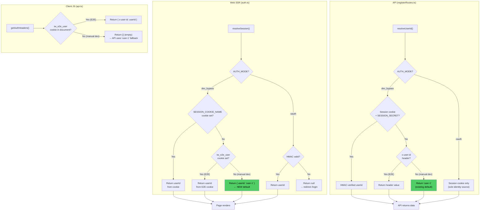
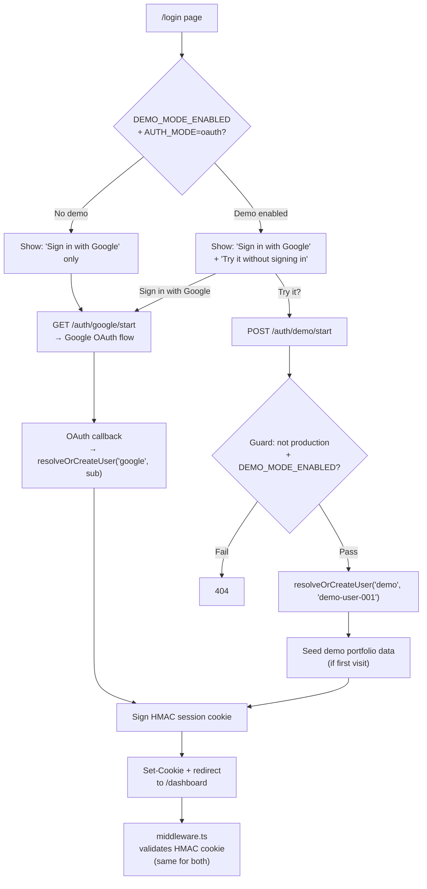
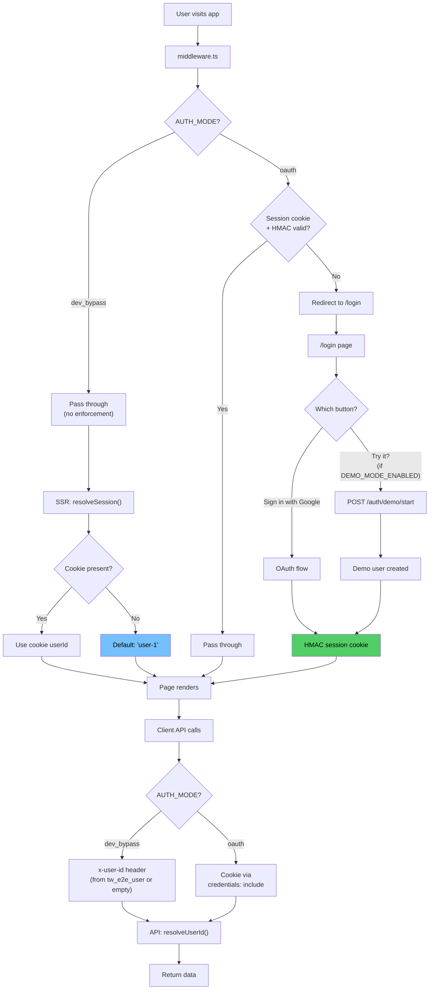
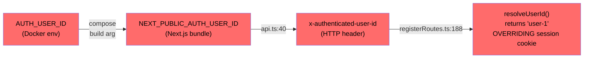

# Auth Flow Design Review — dev_bypass, Demo User, and Env Variable Audit

> **Team**: Architect, Backend Engineer, Senior QA
> **Date**: 2026-03-21
> **Input**: [env-variable-refactor-plan.md](./env-variable-refactor-plan.md), [env-refactor-team-review.md](./env-refactor-team-review.md)
> **Scope**: dev_bypass cookie/session design, demo user architecture, environment variable cleanup

---

## Executive Summary

Three design questions resolved through structured debate:

1. **dev_bypass session**: One-line default fallback in `auth.ts` — `return { userId: "user-1" }` when no cookie is set. Zero infrastructure, matches API behavior.
2. **Demo user**: Feature flag (`DEMO_MODE_ENABLED`) within oauth mode, not a third AUTH_MODE. HMAC-signed cookie, same as real OAuth.
3. **Env var cleanup**: 4 dead variables to remove, 2 alias groups to consolidate, 1 actively harmful variable chain to eliminate.

---

## 1. dev_bypass Session Design

### The Debate

| Round | Architect | Backend | QA |
|-------|-----------|---------|-----|
| Initial | Option B: auto-cookie via `/auth/dev-session` endpoint | Stay stateless, header + fallback is sufficient | — |
| Cross-cutting | — | Conceded SSR is broken for manual dev. Proposed: one-line fallback `return { userId: "user-1" }` | Auto-cookie wins on test fidelity (6 dead code paths removed) |
| Final | Conceded auto-cookie. Found `parseSessionCookie()` needs SESSION_SECRET — auto-cookie only fixes SSR, not API calls. Agreed with Backend's fallback. | Position held | Withdrew auto-cookie. SESSION_SECRET finding invalidates "dead code cleanup" argument. Accepted fallback. |

### The Decisive Finding

```
parseSessionCookie() at registerRoutes.ts:175:
  if (!sessionSecret) return null;  // SESSION_SECRET is not set in dev_bypass
```

In dev_bypass mode, the API cannot verify HMAC cookies (no SESSION_SECRET). Even with auto-cookie, client-side API calls still need the `x-user-id` header path. Auto-cookie only solves SSR — the `tw_e2e_user` + `getRuntimeDevUserId()` + `getAuthHeaders()` chain is still required for client→API calls.

**This made auto-cookie all cost (new endpoint, fixture migration) for partial benefit (SSR only). The one-line fallback solves the same SSR problem with zero infrastructure.**

### Consensus: One-Line Default Fallback

**Change `auth.ts:54`** — after all cookie checks in the dev_bypass branch:

```typescript
// auth.ts — resolveSession(), dev_bypass block
if (WebEnv.NEXT_PUBLIC_AUTH_MODE === "dev_bypass") {
  const cookieStore = await cookies();
  const raw = cookieStore.get(WebEnv.SESSION_COOKIE_NAME)?.value;
  if (raw?.trim()) return { userId: raw.trim() };
  const e2eRaw = cookieStore.get("tw_e2e_user")?.value;
  if (e2eRaw?.trim()) return { userId: decodeURIComponent(e2eRaw.trim()) };
  return { userId: "user-1" };  // ← NEW: matches API's resolveUserId() fallback
}
```

**Why this is correct:**
- **Consistency**: API's `resolveUserId()` already returns `"user-1"` as fallback in dev_bypass (`registerRoutes.ts:208-209`). Web SSR now matches.
- **Zero config**: Developer runs `dev:local:bypass:mem`, opens browser, sees dashboard. No env vars, no cookies, no setup.
- **E2E preserved**: Tests set `tw_e2e_user` cookie → resolved BEFORE the default → per-test isolation intact.
- **No new infrastructure**: No endpoints, no middleware changes, no session secrets.
- **Safe**: Only fires inside `AUTH_MODE === "dev_bypass"` branch, which is validated to only run in development/test.

### Decision Tree: dev_bypass Identity Resolution



### What Stays, What Goes

| Code path | Status | Reason |
|-----------|--------|--------|
| `tw_e2e_user` cookie check in `auth.ts:52-53` | **Keep** | E2E per-test identity isolation |
| `getRuntimeDevUserId()` in `api.ts:59-74` | **Keep** | Client→API identity for E2E tests |
| `getAuthHeaders()` x-user-id path | **Keep** | API needs header (can't read plain cookies without SESSION_SECRET) |
| `NEXT_PUBLIC_DEV_USER_ID` in `api.ts:50-55` | **Remove** | Dead code — never set anywhere |
| `NEXT_PUBLIC_AUTH_USER_ID` in `api.ts:40-44` | **Remove** | Root cause of Google login bug |
| `x-authenticated-user-id` trust in `resolveUserId()` | **Remove** | Security issue — no gateway sets this header |

---

## 2. Demo User Design

### Consensus: Feature Flag within OAuth Mode

All three agents agreed: demo is NOT a third AUTH_MODE. It's a feature within oauth mode, controlled by `DEMO_MODE_ENABLED`.

```
AUTH_MODE: "oauth" | "dev_bypass"      (unchanged)
DEMO_MODE_ENABLED: "true" | "false"    (new, default: "false")
```

### Architecture



### Demo User Specifics

| Aspect | Design |
|--------|--------|
| **Identity** | Provider: `"demo"`, sub: `"demo-user-001"` — deterministic, all demo sessions share one user |
| **Session cookie** | HMAC-signed, identical format to OAuth sessions. Same `SESSION_SECRET`. |
| **Data** | Seeded on first call via `ensureDefaultPortfolioData()`. Sample transactions, dividends. |
| **Isolation** | Same userId-based isolation as real users. No special schema. |
| **Persistence** | Memory: lost on restart (acceptable). Postgres: persists (may need cleanup job). |
| **Security guard** | `NODE_ENV === "production" && DEPLOY_ENV === "production"` → 404 |
| **Rate limiting** | Standard rate limits apply (no special treatment) |
| **Login page** | Conditionally render "Try it?" button via `NEXT_PUBLIC_DEMO_MODE_ENABLED` |

### New Environment Variables for Demo

| Variable | Schema | Default | Where Used |
|----------|--------|---------|-----------|
| `DEMO_MODE_ENABLED` | `envSchema` | `"false"` | API: guards `/auth/demo/start` endpoint |
| `NEXT_PUBLIC_DEMO_MODE_ENABLED` | `envSchema` (web-exposed) | `"false"` | Web: login page conditional render |

### Demo Testing (QA's recommendation)

- Demo tests live in **bypass suite** (`specs/auth-demo.spec.ts`) — no separate config needed
- Test the "Try it?" button click → session creation → dashboard render
- Verify demo user sees seeded data (non-empty portfolio)
- Verify demo data isolation from real users
- No need for `auth.setup.ts` — demo flow is self-contained

---

## 3. Unified Auth Flow — All Three Paths



---

## 4. Environment Variable Audit — Consolidated

### 4.1 Variables to Remove (unanimous)

| Variable | Status | Evidence | Action |
|----------|--------|----------|--------|
| `NEXT_PUBLIC_AUTH_USER_ID` | **Actively harmful** | Root cause of Google login bug. Baked into Next.js bundle, overrides session cookie. | Remove from Dockerfile ARG/ENV, compose build args, `api.ts:40-44` |
| `AUTH_USER_ID` | **Harmful in oauth** | Maps to `NEXT_PUBLIC_AUTH_USER_ID` via compose build args. Required by deploy.sh when it shouldn't be. | Remove from docker schemas, compose files. Invert deploy.sh validation. |
| `NEXT_PUBLIC_DEV_USER_ID` | **Dead code** | Referenced in `api.ts:50-55` but never set in any env file, schema, compose, or CI config. Zero hits. | Remove from `api.ts` |
| `NEXT_PUBLIC_API_PORT` | **Dead code** | Referenced in `api.ts:18` as fallback. Never set anywhere. `NEXT_PUBLIC_API_BASE_URL` is always provided. | Remove from `api.ts` |

### 4.2 Alias Groups (variables that are the same thing)

**Group 1: User Identity (REMOVE ENTIRE GROUP)**



All four nodes in this chain must be removed for the Google login fix.

**Group 2: Auth Mode (KEEP — different purposes)**

| Variable | Purpose | Keep? |
|----------|---------|-------|
| `AUTH_MODE` | Server-side (API routing, validation) | Yes |
| `NEXT_PUBLIC_AUTH_MODE` | Client-side (login page, getAuthHeaders behavior) | Yes — must stay synced with `AUTH_MODE` |

These look like aliases but serve different runtime contexts (server vs browser bundle). They must remain separate.

**Group 3: API Base URL (SIMPLIFY)**

| Variable | Purpose | Keep? |
|----------|---------|-------|
| `NEXT_PUBLIC_API_BASE_URL` | Authoritative API URL for web client | Yes |
| `NEXT_PUBLIC_API_PORT` | Fallback port in `resolveApiBase()` | **Remove** — dead, never set |
| `API_PORT` | API server listen port (server-side) | Yes — different purpose |

### 4.3 Test-Only Variables to Formalize

| Variable | Currently | Recommendation |
|----------|-----------|----------------|
| `MOCK_OAUTH_PORT` | Read via `process.env`, no schema | Add to `e2eEnvSchema` |
| `HOST` | Read via `process.env`, no schema | Add to `e2eEnvSchema` (default: `localhost`) |
| `GOOGLE_TOKEN_URL` | In `envSchema` (optional) | Keep — used at runtime for mock override |
| `GOOGLE_OAUTH_REFRESH_TOKEN` | Read via `process.env`, no schema | Add to `e2eEnvSchema` (already in plan) |
| `E2E_BASE_URL` / `E2E_API_BASE_URL` | Read via `process.env`, no schema | Remove — derive from `HOST` + ports |

### 4.4 Test Infrastructure: `127.0.0.1` vs `localhost` Confusion

QA found that `flows.ts` uses `127.0.0.1` while `TestEnv` uses `localhost`. Cookies set on `localhost` are NOT sent to `127.0.0.1`.

**Recommendation**: Unify on `localhost` everywhere. The IPv4-only mock OAuth server concern can be solved by binding to `localhost`.

### 4.5 Variables Confirmed to Keep

| Variable | Why keep |
|----------|---------|
| `TWP_STATE_DIR`, `BACKUP_DIR`, `DEPLOY_LOG_DIR` | Used by deploy.sh (shell, not Node). Docker-only. |
| `IMAGE_TAG` | Docker build-time concern |
| `PRIMARY_PROVIDER`, `FALLBACK_PROVIDER` | Harmless defaults, may be used in future |
| `DATA_PROVIDER_TIMEOUT_MS`, `RATE_LIMIT_*` | Harmless tuning knobs, same defaults everywhere |

---

## 5. New Environment Variables Summary

| Variable | Type | Default | Purpose |
|----------|------|---------|---------|
| `DEPLOY_ENV` | New | — | Cloud tier: `"dev"` or `"production"`. Docker-only. |
| `DEMO_MODE_ENABLED` | New | `"false"` | Feature flag for demo user on login page |
| `NEXT_PUBLIC_DEMO_MODE_ENABLED` | New | `"false"` | Client-side rendering of "Try it?" button |

---

## 6. Consolidated Action Items

### Phase 0: Critical Bug Fixes

| # | Action | Consensus |
|---|--------|-----------|
| P0-1 | Wire `middleware.ts` (one-line re-export from `proxy.ts`) | Unanimous |
| P0-2 | Add default fallback `return { userId: "user-1" }` in `auth.ts` dev_bypass branch | Unanimous (debated, resolved) |
| P0-3 | Remove `NEXT_PUBLIC_AUTH_USER_ID` from Dockerfile, compose, `api.ts` | Unanimous |
| P0-4 | Remove `AUTH_USER_ID` from docker schemas, compose build args | Unanimous |
| P0-5 | Remove `x-authenticated-user-id` header trust from `resolveUserId()` oauth mode | Unanimous |
| P0-6 | Simplify `getAuthHeaders()` — remove NEXT_PUBLIC_AUTH_USER_ID + NEXT_PUBLIC_DEV_USER_ID reads | Unanimous |
| P0-7 | Invert deploy.sh validation: forbid AUTH_USER_ID when AUTH_MODE=oauth | Unanimous |
| P0-8 | Add SESSION_SECRET to `docker-compose.local.yml` web container | Unanimous |

### Phase 1: Env Refactor (from original plan)

| # | Action | Consensus |
|---|--------|-----------|
| P1-1 | Create unified `.env.example` | Unanimous |
| P1-2 | Fold `webEnvSchema` into `envSchema` (schema fields only, keep Edge-safe parse) | Unanimous |
| P1-3 | Merge `dockerDevSchema` + `dockerProdSchema` → `dockerCloudSchema` | Unanimous |
| P1-4 | Add `DEPLOY_ENV` to schemas | Unanimous |
| P1-5 | Make `COOKIE_DOMAIN` required in `dockerCloudSchema` | Unanimous |
| P1-6 | Remove dead vars: `NEXT_PUBLIC_DEV_USER_ID`, `NEXT_PUBLIC_API_PORT` | Unanimous |
| P1-7 | Add CI guard: `env-web.ts` must not import `env.ts` | Unanimous |
| P1-8 | Unify test infra on `localhost` (remove `127.0.0.1` usage) | Unanimous |

### Phase 2: Demo User

| # | Action | Consensus |
|---|--------|-----------|
| P2-1 | Add `DEMO_MODE_ENABLED` / `NEXT_PUBLIC_DEMO_MODE_ENABLED` to schemas | Unanimous |
| P2-2 | Add `POST /auth/demo/start` endpoint with security guards | Unanimous |
| P2-3 | Add demo data seeding (`ensureDefaultPortfolioData` for demo user) | Unanimous |
| P2-4 | Update login page with conditional "Try it?" button | Unanimous |
| P2-5 | Accept `"demo"` as provider in `resolveOrCreateUser()` | Unanimous |

### Phase 3: Test Hardening (follow-up)

| # | Action | Consensus |
|---|--------|-----------|
| P3-1 | Add E2E bypass job to CI | Unanimous |
| P3-2 | Fix `validatePortConflicts` NODE_ENV=test + dev_bypass | Unanimous |
| P3-3 | Add `e2eEnvSchema` with `MOCK_OAUTH_PORT`, `HOST`, `GOOGLE_OAUTH_REFRESH_TOKEN` | Unanimous |
| P3-4 | Fix mock OAuth server lifecycle (add to oauth config's webServer) | QA recommendation |
| P3-5 | Add demo user E2E tests in `specs/auth-demo.spec.ts` | QA recommendation |
| P3-6 | Remove `E2E_BASE_URL` / `E2E_API_BASE_URL` overrides | QA recommendation |
