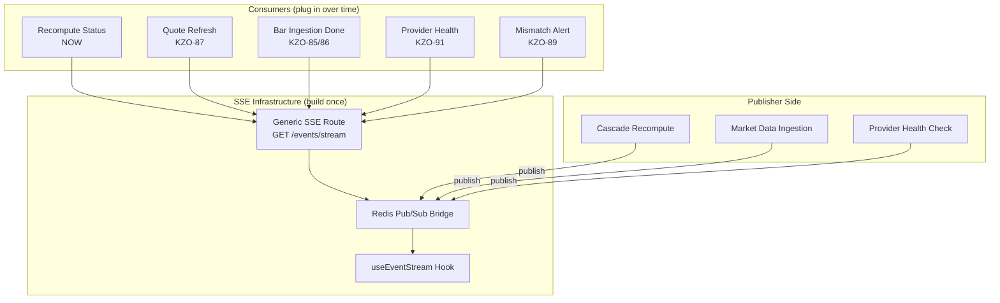

# Debate: SSE Infrastructure — Build Now vs. Poll First

Date: 2026-03-23

## Contested Question

Should we build a generic SSE (Server-Sent Events) infrastructure now for the Fastify API + Next.js frontend, or use polling first and upgrade to SSE when the Market Data Platform project needs it?

**User's position:** Build now — "I'd rather overbuild now to save time in the future."

## Team Composition

| Role | Skill Loaded |
|------|-------------|
| Moderator | (plain role) |
| Architect | /senior-architect |
| Backend Engineer | /senior-backend |
| Frontend Engineer | /senior-frontend |

## Context (Codebase State at Time of Debate)

- No realtime infrastructure exists. All communication is request-response via plain `fetch`.
- Redis is minimal — quote caching (30s TTL) and idempotency keys only. No pub/sub.
- Fastify plugins: Only `@fastify/cors`. No streaming or WebSocket plugins.
- Frontend: Plain `getJson()`/`postJson()` helpers. No SWR, no React Query, no polling.
- Recompute is fully synchronous — runs in the route handler, no job queue.
- Only background job: `setInterval` for demo user cleanup every 15 minutes.
- `quotePollIntervalSeconds` exists in user settings (default 10s) but is not actively used — a prepared hook for future realtime quote updates.

## Exchange

### Round 1

#### Architect — Senior Architect

**Position:** Build generic SSE now.

**Defense:**

1. `quotePollIntervalSeconds` already exists in user settings — someone planned for realtime quote delivery. SSE is the natural transport.
2. Market Data Platform is the next project — KZO-87 (EOD quote snapshot), KZO-86 (daily bar refresh), KZO-89 (mismatch flagging) all produce events that downstream consumers want to know about without polling.
3. The infrastructure cost is bounded: one generic SSE route (~50-80 lines), one Redis pub/sub helper (~30 lines), one `useEventStream()` React hook (~40 lines), one event type registry (TypeScript discriminated union).
4. Retrofitting is more expensive than building forward. Polling first means N polling implementations replaced by N event subscriptions later — N+1 migrations instead of 0.

Five consumers visible within the roadmap: recompute status, quote refresh (KZO-87), bar ingestion completion (KZO-85/86), provider health alerts (KZO-91), mismatch flagging (KZO-89).

#### Backend Engineer — Senior Backend

**Position:** Build generic SSE now, but scope tightly.

**Defense:**

- Fastify doesn't need a plugin for SSE. Raw `reply.raw.writeHead()` + `text/event-stream` is ~20 lines.
- Redis pub/sub is a thin layer on the existing Redis client. One additional subscriber connection (~10 lines of setup).
- The "recompute takes <1 second, just poll" argument ignores that edit/delete cascade recompute was explicitly chosen as async. If async, you need a notification channel. A polling endpoint is the same route code as SSE — but SSE is reusable.
- **Constraint:** No job queue (Bull, pg-boss) for phase 1. Use `setImmediate()` or `process.nextTick()` to defer cascade after HTTP response, publish to Redis when done.

#### Frontend Engineer — Senior Frontend

**Position:** Build SSE now.

**Defense:**

- `EventSource` is native browser API, no library needed. Hook is ~15 lines.
- SSE connects directly to Fastify API (`NEXT_PUBLIC_API_BASE_URL`), not proxied through Next.js. This is already the pattern for client-side fetches in `api.ts`.
- Need `withCredentials: true` for cookie auth.
- Polling alternative requires: polling hook with interval management, cleanup, error handling, per-consumer interval tuning, deduplication logic. Roughly the same code as SSE hook, but **per consumer** instead of once. Gets thrown away on upgrade.

**Acknowledged concern:** `EventSource` auto-reconnects but needs `lastEventId` protocol for gap recovery. For sub-second recomputes this is unlikely to matter; for market data refresh notifications it will.

## Visual Diagrams

## Conclusions

**Consensus: Build generic SSE infrastructure now (3-of-3 unanimous).**

- SSE over polling — the investment is bounded (~150 lines total across API + frontend) and five visible consumers exist on the roadmap.
- Redis pub/sub is the right bridge — already have Redis, just add a subscriber connection.
- No new job queue dependency for phase 1 — use in-process defer (`setImmediate`) + Redis pub/sub.
- Frontend SSE connects directly to Fastify API (not proxied through Next.js), using `withCredentials: true` for cookie auth.

## Implementation Constraints (from debate)

1. No Fastify SSE plugin — use raw `reply.raw` streaming
2. No job queue (Bull, pg-boss) in phase 1 — defer cascade with `setImmediate`, publish completion via Redis pub/sub
3. SSE route requires a second Redis connection (pub/sub cannot share with command connection)
4. Frontend `EventSource` needs `withCredentials: true`
5. Implement `lastEventId` protocol for reconnection gap recovery (needed for market data, not critical for recompute)

## Open Items

- None — consensus reached, no escalation needed.
