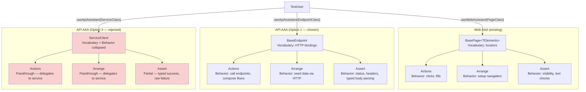

# Debate: API AAA Instance Pattern — Option 1 vs Option 3

**Date:** 2026-03-27
**Status:** Resolved — Unanimous consensus
**Decision:** Option 1 (thin endpoint descriptor)
**Participants:** Architect, Backend Engineer, QA Engineer
**Context:** Phase 5e — API test migration to AAA framework

---

## Contested Question

What should serve as the API equivalent of `BasePage` in the AAA test framework pattern?

- **Option 1:** Thin endpoint descriptor — `BaseEndpoint` wraps `APIRequestContext` with named HTTP method bindings, returns raw Playwright `APIResponse`
- **Option 3:** Richer service client — `SettingsService.getSettings()` returns pre-parsed `{ status: number; body: Settings }`

## Decision: Option 1 — Thin Endpoint Descriptor

Unanimous 3-of-3. No cross-examination was needed; arguments were complementary, not contradictory.

## Key Arguments by Role

### Architect — Structural Isomorphism

`BasePage` is a **vocabulary**, not a behavior. It provides locators (nouns); the Arrange/Actions/Assert triplet provides behavior (verbs). This separation is the invariant that makes AAA composable.

- `BasePage.elements.saveButton` returns a `Locator`, not "settings were saved"
- `BaseEndpoint.patch(data, headers)` returns `APIResponse`, not `{ status, body }`
- Option 3 collapses vocabulary + behavior into the instance, making Actions a passthrough

Generic constraints align naturally: `TestAAA<TInstance extends BaseEndpoint>` parallels `TestAAA<TInstance extends BasePage<unknown>>`. Factory/registry/caching (`TestUser.useApiAssistant(EndpointClass)`) works unchanged.

### Backend Engineer — Ergonomics and Migration

**BasePage is thinner than it looks.** 47 lines: holds a `Page`, exposes typed `elements`, provides `locate()` helpers. No DOM parsing, no error handling. Option 1's `BaseEndpoint` mirrors this: holds `APIRequestContext`, exposes named HTTP methods.

**Auth patterns are heterogeneous.** 4 distinct patterns across 13 domains (no auth, `x-user-id` header, session cookie, intentionally missing auth for 401 tests). Option 1's transparent `headers?` parameter handles all without interface changes. Option 3 bakes `cookie?: string` into method signatures — breaks for `x-user-id`, awkward for 401 tests.

**Boilerplate:** ~6 lines per endpoint class (Option 1) vs ~20+ lines per service class (Option 3), multiplied by 13 domains.

**Existing E2E specs** (`auth-identity-source.spec.ts`) already use the Option 1 pattern: `request.get(apiUrl("/settings"), { headers })`. Migration is nearly mechanical.

### QA Engineer — Test Trustworthiness

**47% of migrating tests assert on non-2xx responses.** Counted across 4 integration test files (settings: 3/6, profile-api: 3/7, auth-oauth: 8/14, demo-session: 2/7). Option 3's typed return `Promise<{ status: number; body: Settings }>` is a type lie for error paths where the body is `{ error: string; message?: string }`.

Option 3's escape hatches all degrade test readability:
- Discriminated union → requires narrowing before assertions
- Throw on non-2xx → forces try/catch in error-path tests
- Return raw on error → inconsistent API (typed success, raw failure)

**Header/cookie assertions require raw access.** `auth-oauth.integration.test.ts` has 6 assertions on a single callback response: status 302, `Location` header, `Set-Cookie` containing cookie name, not containing Google sub, `HttpOnly`, `SameSite=Lax`. Option 3's `{ status, body }` loses headers entirely.

**Migration is mechanical with Option 1:** `app.inject({ method: "GET", url })` → `endpoint.get()`, `.statusCode` → `.status()`. Near 1:1 mapping.

## Convergence Points

All 3 debaters independently converged on:

1. **`BaseEndpoint` mirrors `BasePage`** — structural descriptor, not business logic
2. **Returns raw Playwright `APIResponse`** — no pre-parsed typed bodies
3. **Auth via transparent `headers?` parameter** — no baked-in cookie signature
4. **Typed response parsing belongs in the Assert layer**, not the instance
5. **~6 lines per endpoint class** — 13 domains totals ~80 lines, trivially reviewable

## Where Option 3's Value Lives

All 3 debaters identified that Option 3's appeal (typed responses) is legitimate but misplaced. It belongs in the **Assert layer**:

```typescript
class SettingsAssert extends BaseAssert {
  // Typed where it matters — success assertions
  async localeIs(expected: string): Promise<void> {
    const res = await this.endpoint.get(this.authHeaders);
    const body = await res.json() as Settings;
    expect(body.locale).toBe(expected);
  }

  // Raw where it must be — error assertions (no type lie)
  async rejectedWithStatus(status: number): Promise<void> {
    expect(this.lastResponse.status()).toBe(status);
  }
}
```

## Structural Diagram



## Implementation Sketch (from consensus)

```typescript
// libs/test-api/src/core/BaseEndpoint.ts
abstract class BaseEndpoint {
  constructor(protected readonly request: APIRequestContext) {}
}

// libs/test-api/src/endpoints/SettingsEndpoint.ts (~6 lines)
class SettingsEndpoint extends BaseEndpoint {
  get = (headers?: Record<string, string>) =>
    this.request.get(apiUrl("/settings"), { headers });
  patch = (data: unknown, headers?: Record<string, string>) =>
    this.request.patch(apiUrl("/settings"), { data, headers });
}

// TestUser integration — parallel to useWebAssistant
testUser.useApiAssistant<SettingsEndpoint, SettingsAssistant>(SettingsEndpoint)
```

## Quantitative Evidence

| Metric | Option 1 | Option 3 |
|---|---|---|
| Lines per domain endpoint | ~6 | ~20+ |
| Error-path type safety | Native (raw `APIResponse`) | Type lie or escape hatch |
| Auth patterns supported without interface changes | 4/4 | 1/4 (cookie only) |
| % of tests requiring raw response access | 47%+ | 47%+ (forced workaround) |
| Migration complexity from `app.inject()` | Mechanical (1:1) | Structural (new types, new shapes) |
| Framework changes needed (TestUser, factory) | Zero | Cache key ambiguity |
