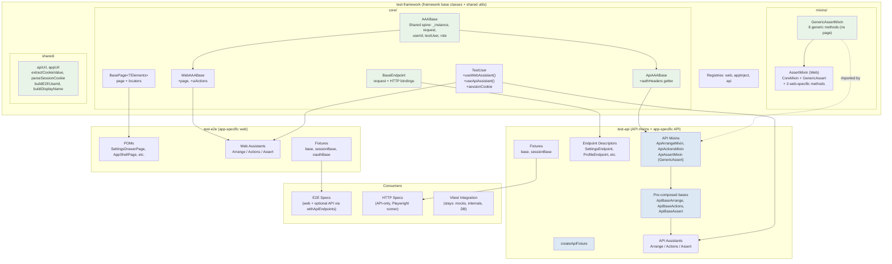

# Phase 5e — API Test Migration to AAA Framework

**Date:** 2026-03-27
**Status:** Frozen snapshot — do not update after merge
**Origin:** Grill session + debate on `automation-refactor` worktree (Phase 5e design)
**Predecessor:** [design-202603262345-aaa-framework-phase5d-e2e-migration.md](design-202603262345-aaa-framework-phase5d-e2e-migration.md)
**Debate:** [debate-202603271410-api-aaa-instance-pattern.md](debate-202603271410-api-aaa-instance-pattern.md)

---

## Overview

Phase 5e extends the AAA test framework from web-only to support API HTTP tests. The core idea: `BaseEndpoint` is the API equivalent of `BasePage` — a thin vocabulary descriptor that wraps `APIRequestContext` with named HTTP method bindings and returns raw Playwright `APIResponse`.

The framework layer (`test-framework`) gains shared infrastructure. A new `test-api` library provides API-specific assistants, endpoint descriptors, and fixtures. Two E2E specs migrate to `apps/api/test/http/`. Eight integration tests migrate from vitest `app.inject()` to Playwright HTTP.

---

## Locked Decisions

| # | Decision | Rationale |
|---|----------|-----------|
| D1 | **Thin endpoint descriptor (Option 1)** — `BaseEndpoint` wraps `APIRequestContext`, returns raw `APIResponse` | Unanimous debate consensus. 47% of tests assert non-2xx; typed return is a type lie for error paths. See debate note. |
| D2 | **AAABase extraction** — shared spine class with `WebAAABase` + `ApiAAABase` branches | Zero changes to existing web code. API branch adds `authHeaders` getter. |
| D3 | **GenericAssertMixin split** — 8 generic methods extracted from `AssertMixin` | API tests need `mxAssertTruthy`, `mxAssertEqual`, etc. without `page` dependency. |
| D4 | **TestUser gains `useApiAssistant()`** — parallel to `useWebAssistant()` | Same cache/registry/factory pattern. No page required. |
| D5 | **TestUser gains `sessionCookie`** — mutable property + `setSessionCookie()` | OAuth API tests mint cookies externally, store on TestUser for self-selecting auth headers. |
| D6 | **Self-selecting `authHeaders` getter** — on `ApiAAABase` | Returns `{ cookie: "name=value" }` if sessionCookie set, else `{ "x-user-id": userId }`. |
| D7 | **`createPlaywrightConfig()` factory** — shared config with `webServers: "full" \| "api-only"` | Eliminates ~95% duplication between 3 Playwright configs. |
| D8 | **Fixture extension pattern** — `withApiEndpoints(baseTest)` | E2E specs consuming test-api assistants extend existing fixtures without contaminating base. |
| D9 | **Category A reclassification** — 8 migrate to Playwright, 5 stay in vitest | Decision framework: migrate if test only uses `app.inject()` for HTTP contracts; stay if test needs `vi.mock()`, module state, or Fastify internals. |
| D10 | **Rename `TestAAA` → `WebAAABase`** — API gets `ApiAAABase` | Clarifies layer ownership. Both extend `AAABase` (shared spine). |
| D11 | **API base classes in test-framework/core; API mixins in test-api** | `BaseEndpoint` + `ApiAAABase` stay in test-framework (TestUser depends on them — moving to test-api creates circular dep). API mixins, pre-composed bases, `createApiFixture` live in test-api. |
| D12 | **`buildE2EUserId` and `buildDisplayName` move to test-framework** | Shared by both web and API fixtures. Currently only in test-e2e. |
| D13 | **Shared utilities consolidated in test-framework/shared** | `apiUrl`, `appUrl`, `extractCookieValue`, `parseSessionCookie`, `UUID_V4_PATTERN` move from test-e2e to test-framework/shared. Eliminates cross-sibling dependency (test-api must never import from test-e2e). |

---

## Folder Structure

### Dependency Graph

```
@tw-portfolio/config/test  (test env config — no test code)
         │
         ▼
test-framework  (framework base classes + shared utilities)
    ┌────┴────┐
    ▼         ▼
test-e2e   test-api   (sibling app-specific layers — NEVER import from each other)
```

`test-api` and `test-e2e` are parallel siblings. Neither may import from the other. All shared code lives in `test-framework`.

### Why BaseEndpoint and ApiAAABase stay in test-framework

`TestUser` (the shared orchestrator in test-framework) constructs instances via typed methods:

```typescript
// TestUser.useWebAssistant — needs BasePage type + constructor shape
const instance = new PageClass(this.page);

// TestUser.useApiAssistant — needs BaseEndpoint type + constructor shape
const instance = new EndpointClass(this.request);
```

Moving `BasePage` to test-e2e or `BaseEndpoint` to test-api would create **circular dependencies** (test-framework → test-e2e/test-api → test-framework). Both base classes must be co-located with `TestUser`.

API **mixins**, **pre-composed bases**, and **`createApiFixture`** have no such constraint — they only import downward from test-framework. These live in test-api.

### libs/test-framework/ (additions)

```
libs/test-framework/src/
├── core/
│   ├── AAABase.ts               ← NEW: shared spine (extracted from TestAAA)
│   ├── ApiAAABase.ts            ← NEW: API base with authHeaders getter
│   ├── BaseEndpoint.ts          ← NEW: thin endpoint descriptor (API parallel to BasePage)
│   ├── BasePage.ts              ← unchanged
│   ├── WebAAABase.ts            ← NEW: renamed from TestAAA
│   ├── TestAAA.ts               ← backward-compat re-export shim
│   ├── TestUser.ts              ← MODIFIED: +useApiAssistant, +sessionCookie, +setSessionCookie
│   ├── types.ts                 ← MODIFIED: +TApiBaseOptions
│   └── index.ts                 ← MODIFIED: export AAABase, WebAAABase, ApiAAABase, BaseEndpoint
├── mixins/
│   ├── GenericAssertMixin.ts    ← NEW: 8 generic assert methods (no page dependency)
│   ├── AssertMixin.ts           ← MODIFIED: composes GenericAssertMixin + 3 web-specific methods
│   ├── CoreMixin.ts             ← unchanged
│   ├── ArrangeMixin.ts          ← unchanged
│   ├── ActionsMixin.ts          ← unchanged
│   └── index.ts                 ← MODIFIED: +export GenericAssertMixin; pre-composed WEB bases only
├── config/
│   ├── mapper.ts                ← MODIFIED: +apiAssistantRegistry (generic instance, no API-specific code)
│   ├── assistantFactory.ts      ← unchanged (already generic)
│   ├── createWebFixture.ts      ← unchanged
│   ├── createPlaywrightConfig.ts ← NEW: shared Playwright config factory
│   └── index.ts                 ← MODIFIED: export new items
├── shared/                      ← NEW: shared utilities used by both test-e2e and test-api
│   ├── userId.ts                ← buildE2EUserId, buildDisplayName (moved from test-e2e)
│   ├── url.ts                   ← apiUrl, appUrl (moved from test-e2e)
│   ├── cookie.ts                ← extractCookieValue, parseSessionCookie, UUID_V4_PATTERN (moved from test-e2e)
│   └── index.ts
├── actions/, decorators/, logging/  ← unchanged
└── package.json                 ← MODIFIED: +./shared export, +@faker-js/faker dep, +@tw-portfolio/config/test dep
```

**No `./api` subdirectory or export.** API and web base classes sit side-by-side in `core/` — they're framework-level abstractions at the same layer.

### libs/test-api/ (new library)

```
libs/test-api/
├── src/
│   ├── mixins/                   ← API-specific mixins (extend ApiAAABase from test-framework)
│   │   ├── ApiArrangeMixin.ts
│   │   ├── ApiActionsMixin.ts
│   │   ├── ApiAssertMixin.ts     ← GenericAssertMixin composed on ApiAAABase
│   │   └── index.ts              ← Pre-composed: ApiBaseArrange, ApiBaseActions, ApiBaseAssert
│   ├── config/
│   │   ├── createApiFixture.ts   ← Parallel to createWebFixture (imports BaseEndpoint from test-framework)
│   │   ├── mapper.ts             ← registerTestApiAssistants()
│   │   └── index.ts
│   ├── endpoints/                ← App-specific endpoint descriptors (~6 lines each)
│   │   ├── SettingsEndpoint.ts
│   │   ├── ProfileEndpoint.ts
│   │   ├── AuthOAuthEndpoint.ts
│   │   ├── DemoSessionEndpoint.ts
│   │   ├── SseEndpoint.ts
│   │   ├── E2EEndpoint.ts        ← /__e2e/reset, /__e2e/oauth-session, /__e2e/demo-session
│   │   └── index.ts
│   ├── assistants/               ← App-specific API AAA triplets
│   │   ├── settings/
│   │   │   ├── SettingsApiArrange.ts
│   │   │   ├── SettingsApiActions.ts
│   │   │   ├── SettingsApiAssert.ts
│   │   │   └── index.ts
│   │   ├── profile/
│   │   │   ├── ProfileApiArrange.ts
│   │   │   ├── ProfileApiActions.ts
│   │   │   ├── ProfileApiAssert.ts
│   │   │   └── index.ts
│   │   ├── auth/
│   │   │   ├── AuthOAuthApiArrange.ts
│   │   │   ├── AuthOAuthApiActions.ts
│   │   │   ├── AuthOAuthApiAssert.ts
│   │   │   └── index.ts
│   │   ├── demo/
│   │   │   ├── DemoSessionApiArrange.ts
│   │   │   ├── DemoSessionApiActions.ts
│   │   │   ├── DemoSessionApiAssert.ts
│   │   │   └── index.ts
│   │   ├── sse/
│   │   │   ├── SseApiArrange.ts
│   │   │   ├── SseApiActions.ts
│   │   │   ├── SseApiAssert.ts
│   │   │   └── index.ts
│   │   └── index.ts
│   ├── fixtures/
│   │   ├── base.ts               ← API-only base fixture (no page)
│   │   ├── shared.ts             ← buildApiUserFixtures()
│   │   ├── sessionBase.ts        ← API session fixture (mint cookie, no page context)
│   │   └── index.ts
│   ├── utils/
│   │   ├── publish.ts            ← HTTP publish helper (extracted from test-e2e sse.ts)
│   │   └── index.ts
│   └── index.ts
├── package.json                  ← depends on: @tw-portfolio/test-framework, @playwright/test
└── tsconfig.json
```

### apps/api/test/http/ (new test directory)

```
apps/api/test/http/
├── playwright.config.ts          ← consumes createPlaywrightConfig({ webServers: "api-only" })
├── auth-identity-source.http.spec.ts    ← migrated from specs-oauth/
├── identity-resolution.http.spec.ts     ← migrated from specs-oauth/
├── settings.http.spec.ts               ← migrated from integration/
├── profile-api.http.spec.ts            ← migrated from integration/
├── auth-oauth.http.spec.ts             ← migrated from integration/
├── demo-session.http.spec.ts           ← migrated from integration/
├── sse.http.spec.ts                    ← migrated from integration/
├── oauth-identity-resolution.http.spec.ts ← migrated from integration/
├── e2e-oauth-session.http.spec.ts      ← migrated from integration/
└── user-identity.http.spec.ts          ← migrated from integration/
```

---

## Framework Layer Changes (test-framework)

### 1. AAABase — Shared Spine

Extracted from the current `TestAAA`. Holds the properties shared between web and API layers.

```typescript
// libs/test-framework/src/core/AAABase.ts
import type { APIRequestContext } from "@playwright/test";
import type { TTestAAAOptions } from "./types.js";

export class AAABase<TInstance = unknown> {
  protected readonly _instance: TInstance;
  readonly request: APIRequestContext;
  readonly role: string | undefined;
  readonly testUser: unknown;
  readonly userId: string | undefined;

  constructor(options: TTestAAAOptions) {
    this._instance = options.instance as TInstance;
    this.request = options.request;
    this.role = options.role;
    this.testUser = options.testUser;
    this.userId = options.userId;
  }
}
```

### 2. WebAAABase — Web Layer (renamed from TestAAA)

Extends `AAABase` with page-specific properties. Existing code continues to work via re-export.

```typescript
// libs/test-framework/src/core/WebAAABase.ts
import type { Page } from "@playwright/test";

import { defaultUIActions } from "../actions/index.js";
import type { BasePage } from "./BasePage.js";
import type { TTestAAAOptions, TUIActions } from "./types.js";
import { AAABase } from "./AAABase.js";

export class WebAAABase<
  TInstance extends BasePage<unknown> = BasePage<unknown>,
> extends AAABase<TInstance> {
  readonly page: Page;
  readonly uiActions: TUIActions;

  constructor(options: TTestAAAOptions) {
    super(options);
    this.page = options.page ?? (this._instance as BasePage<unknown>).page;
    this.uiActions = options.uiActions ?? defaultUIActions;
  }
}

// libs/test-framework/src/core/TestAAA.ts — backward-compat re-export
export { WebAAABase as TestAAA } from "./WebAAABase.js";
```

### 3. ApiAAABase — API Layer

```typescript
// libs/test-framework/src/core/ApiAAABase.ts
import type { BaseEndpoint } from "./BaseEndpoint.js";
import type { TTestAAAOptions } from "./types.js";
import { AAABase } from "./AAABase.js";

export class ApiAAABase<
  TInstance extends BaseEndpoint = BaseEndpoint,
> extends AAABase<TInstance> {
  /**
   * Self-selecting auth headers.
   * - If testUser has a sessionCookie → returns cookie header
   * - Otherwise → returns x-user-id header
   *
   * Supports all 4 auth patterns:
   *   1. No auth (omit authHeaders in call)
   *   2. x-user-id header (dev_bypass default)
   *   3. Session cookie (oauth tests)
   *   4. Intentionally missing auth (401 tests — pass empty headers)
   */
  get authHeaders(): Record<string, string> {
    const testUser = this.testUser as { sessionCookie?: string; userId: string } | undefined;
    if (!testUser) {
      return this.userId ? { "x-user-id": this.userId } : {};
    }

    if (testUser.sessionCookie) {
      return { cookie: testUser.sessionCookie };
    }

    return { "x-user-id": testUser.userId };
  }

  constructor(options: TTestAAAOptions) {
    super(options);
  }
}
```

### 4. BaseEndpoint — Thin Endpoint Descriptor

```typescript
// libs/test-framework/src/core/BaseEndpoint.ts
import type { APIRequestContext } from "@playwright/test";

/**
 * API equivalent of BasePage. A thin vocabulary descriptor that wraps
 * APIRequestContext with named HTTP method bindings. Returns raw
 * Playwright APIResponse — no pre-parsed bodies, no baked-in auth.
 *
 * ~6 lines per domain endpoint class.
 */
export abstract class BaseEndpoint {
  constructor(protected readonly request: APIRequestContext) {}
}
```

### 5. GenericAssertMixin — Page-Independent Assertions

Extracted from the current `AssertMixin`. These 8 methods have zero page dependency.

```typescript
// libs/test-framework/src/mixins/GenericAssertMixin.ts
import { expect } from "@playwright/test";
import { Step } from "../decorators/Step.js";
import type { Constructor } from "../core/types.js";

/**
 * Generic assertion mixin — works with any base class (web or API).
 * No page dependency. Used by both AssertMixin (web) and ApiAssertMixin.
 */
export function GenericAssertMixin<TBase extends Constructor<object>>(Base: TBase) {
  return class extends Base {
    @Step("Assert Truthy")
    async mxAssertTruthy(value: unknown, label = "value"): Promise<void> {
      expect(value, `${label} should be truthy`).toBeTruthy();
    }

    @Step("Assert Defined")
    async mxAssertDefined<T>(value: T, label = "value"): Promise<void> {
      expect(value, `${label} should be defined`).toBeDefined();
    }

    @Step("Assert Equal")
    async mxAssertEqual<T>(actual: T, expected: T, label = "value"): Promise<void> {
      expect(actual, `${label} should equal expected value`).toBe(expected);
    }

    @Step("Assert Not Equal")
    async mxAssertNotEqual<T>(actual: T, unexpected: T, label = "value"): Promise<void> {
      expect(actual, `${label} should differ from unexpected value`).not.toBe(unexpected);
    }

    @Step("Assert Includes")
    async mxAssertIncludes(
      actual: string | null | undefined,
      expected: string,
      label = "value",
    ): Promise<void> {
      expect(actual, `${label} should include expected text`).toContain(expected);
    }

    @Step("Assert Matches")
    async mxAssertMatches(
      actual: string | null | undefined,
      expected: RegExp,
      label = "value",
    ): Promise<void> {
      expect(actual, `${label} should match expected pattern`).toMatch(expected);
    }

    @Step("Assert Greater Than Or Equal")
    async mxAssertGreaterThanOrEqual(
      actual: number,
      expectedMinimum: number,
      label = "value",
    ): Promise<void> {
      expect(actual, `${label} should be >= ${expectedMinimum}`).toBeGreaterThanOrEqual(expectedMinimum);
    }

    @Step("Assert Less Than Or Equal")
    async mxAssertLessThanOrEqual(
      actual: number,
      expectedMaximum: number,
      label = "value",
    ): Promise<void> {
      expect(actual, `${label} should be <= ${expectedMaximum}`).toBeLessThanOrEqual(expectedMaximum);
    }
  };
}
```

### 6. AssertMixin — Web Layer (modified)

Now composes `GenericAssertMixin` + web-specific methods.

```typescript
// libs/test-framework/src/mixins/AssertMixin.ts (modified)
import { expect } from "@playwright/test";
import type { Locator, Page } from "@playwright/test";
import { Step } from "../decorators/Step.js";
import type { Constructor } from "../core/types.js";
import { CoreMixin } from "./CoreMixin.js";
import { GenericAssertMixin } from "./GenericAssertMixin.js";

function escapeRegExp(value: string): string {
  return value.replace(/[.*+?^${}()|[\]\\]/g, "\\$&");
}

function timeoutOpt(timeout?: number) {
  return timeout === undefined ? undefined : { timeout };
}

async function assertUrl(page: Page, expected: RegExp | string, negate: boolean): Promise<void> {
  const pattern = typeof expected === "string" ? new RegExp(escapeRegExp(expected)) : expected;
  const assertion = negate ? expect(page).not : expect(page);
  await assertion.toHaveURL(pattern);
}

export function AssertMixin<TBase extends Constructor<{ page: Page }>>(Base: TBase) {
  // Compose: CoreMixin (page-readiness) → GenericAssertMixin (8 generic) → web-specific
  const Mixed = GenericAssertMixin(CoreMixin(Base));

  return class extends Mixed {
    @Step("Assert Hidden")
    async mxAssertHidden(locator: Locator, timeout?: number): Promise<void> {
      await expect(locator).toBeHidden(timeoutOpt(timeout));
    }

    @Step("Assert URL Matches")
    async mxAssertUrlMatches(expected: RegExp | string): Promise<void> {
      await assertUrl((this as unknown as { page: Page }).page, expected, false);
    }

    @Step("Assert URL Does Not Match")
    async mxAssertUrlNotMatches(expected: RegExp | string): Promise<void> {
      await assertUrl((this as unknown as { page: Page }).page, expected, true);
    }
  };
}
```

### 7. API Mixins — Pre-Composed Bases (in test-api)

These live in `libs/test-api/src/mixins/`, NOT in test-framework. They import downward from test-framework.

```typescript
// libs/test-api/src/mixins/ApiArrangeMixin.ts
import type { Constructor } from "@tw-portfolio/test-framework/core";

/**
 * API arrange mixin — no page dependency.
 * Thin for now; extend with API-specific arrange helpers as needed.
 */
export function ApiArrangeMixin<TBase extends Constructor<object>>(Base: TBase) {
  return class extends Base {};
}
```

```typescript
// libs/test-api/src/mixins/ApiActionsMixin.ts
import type { Constructor } from "@tw-portfolio/test-framework/core";

/**
 * API actions mixin — HTTP-focused operations.
 * No page, no uiActions, no DOM.
 */
export function ApiActionsMixin<TBase extends Constructor<object>>(Base: TBase) {
  return class extends Base {};
}
```

```typescript
// libs/test-api/src/mixins/ApiAssertMixin.ts
import type { Constructor } from "@tw-portfolio/test-framework/core";
import { GenericAssertMixin } from "@tw-portfolio/test-framework/mixins";

/**
 * API assert mixin — GenericAssertMixin (8 methods) composed on any base.
 * No page dependency. No mxAssertHidden, no mxAssertUrlMatches.
 */
export function ApiAssertMixin<TBase extends Constructor<object>>(Base: TBase) {
  return GenericAssertMixin(Base);
}
```

```typescript
// libs/test-api/src/mixins/index.ts
import { ApiAAABase } from "@tw-portfolio/test-framework/core";

export { ApiArrangeMixin } from "./ApiArrangeMixin.js";
export { ApiActionsMixin } from "./ApiActionsMixin.js";
export { ApiAssertMixin } from "./ApiAssertMixin.js";

import { ApiArrangeMixin } from "./ApiArrangeMixin.js";
import { ApiActionsMixin } from "./ApiActionsMixin.js";
import { ApiAssertMixin } from "./ApiAssertMixin.js";

// Pre-composed bases — API parallels of BaseArrange/BaseActions/BaseAssert
export const ApiBaseArrange = ApiArrangeMixin(ApiAAABase);
export const ApiBaseActions = ApiActionsMixin(ApiAAABase);
export const ApiBaseAssert = ApiAssertMixin(ApiAAABase);
```

### 8. apiAssistantRegistry

```typescript
// libs/test-framework/src/config/mapper.ts (modified — add one line)
import type { Constructor, TAssistantFactory, TAssistantFactoryOptions } from "../core/types.js";

// ... existing AssistantFactoryRegistry class unchanged ...

export const webAssistantRegistry = new AssistantFactoryRegistry();
export const appInjectAssistantRegistry = new AssistantFactoryRegistry();
export const apiAssistantRegistry = new AssistantFactoryRegistry(); // ← NEW
```

### 9. createApiFixture (in test-api)

Lives in `libs/test-api/src/config/`, NOT in test-framework. Imports base types downward from test-framework.

```typescript
// libs/test-api/src/config/createApiFixture.ts
import type { BaseEndpoint, TestUser, Constructor } from "@tw-portfolio/test-framework/core";

/**
 * Parallel to createWebFixture. Creates a Playwright fixture that
 * produces an API assistant triplet via TestUser.useApiAssistant().
 */
export function createApiFixture<TAssistant>(
  EndpointClass: Constructor<BaseEndpoint>,
) {
  return async (
    { testUser }: { testUser: TestUser },
    use: (assistant: TAssistant) => Promise<void>,
  ) => {
    await use(await testUser.useApiAssistant<BaseEndpoint, TAssistant>(EndpointClass));
  };
}
```

### 10. TestUser — Additions

```typescript
// libs/test-framework/src/core/TestUser.ts — additions (shown as diff context)

// NEW import
import { apiAssistantRegistry } from "../config/mapper.js";
import type { BaseEndpoint } from "./BaseEndpoint.js";

export class TestUser {
  // ... existing fields ...

  // NEW: mutable session cookie for OAuth API tests
  private _sessionCookie: string | undefined;

  get sessionCookie(): string | undefined {
    return this._sessionCookie;
  }

  /**
   * Set the session cookie value for API auth.
   * Format: "cookieName=cookieValue" (full cookie header fragment).
   * Used by OAuth API fixtures after minting a session.
   */
  setSessionCookie(cookie: string): void {
    this._sessionCookie = cookie;
  }

  // ... existing useWebAssistant, useAppInjectAssistant ...

  // NEW: parallel to useWebAssistant for API endpoints
  async useApiAssistant<TEndpoint extends BaseEndpoint, TAssistant>(
    EndpointClass: Constructor<TEndpoint>,
  ): Promise<TAssistant> {
    const cached = this.assistantCache.get(EndpointClass) as TAssistant | undefined;
    if (cached) {
      return cached;
    }

    const instance = new EndpointClass(this.request);
    const assistant = await apiAssistantRegistry.create(
      EndpointClass,
      this.createFactoryOptions(instance),
    );
    this.assistantCache.set(EndpointClass, assistant);
    return assistant as TAssistant;
  }

  // ... rest unchanged ...
}
```

### 11. Shared Utilities — Consolidated in test-framework/shared

All utilities used by both test-e2e and test-api live in `test-framework/shared/`. This eliminates the cross-sibling dependency (test-api must never import from test-e2e).

**Moved from test-e2e → test-framework/shared:**

```typescript
// libs/test-framework/src/shared/userId.ts
// (moved from libs/test-e2e/src/fixtures/shared.ts)
import { faker } from "@faker-js/faker";
import type { TestInfo } from "@playwright/test";

function buildAcronym(filename: string): string {
  const stem = (filename.split("/").pop() ?? "spec")
    .replace(/\.spec\.[jt]s$/, "")
    .replace(/\.[jt]s$/, "");
  return stem.split("-").map((segment) => segment[0] ?? "").join("").toLowerCase();
}

export function buildDisplayName(testInfo: TestInfo): string {
  const acronym = buildAcronym(testInfo.file);
  return `${acronym}:${testInfo.workerIndex}:${faker.person.firstName()}`;
}

export function buildE2EUserId(testInfo: TestInfo): string {
  const fileName = testInfo.file.split("/").pop() ?? "spec";
  const slug = `${fileName}-${testInfo.title}-${testInfo.workerIndex}`
    .toLowerCase()
    .replace(/[^a-z0-9]+/g, "-")
    .replace(/^-+|-+$/g, "")
    .slice(0, 72);

  return `qa-${slug || "e2e"}`;
}
```

```typescript
// libs/test-framework/src/shared/url.ts
// (moved from libs/test-e2e/src/utils/url.ts)
import { TestEnv } from "@tw-portfolio/config/test";

/** Full URL for an app path. Passthrough if already absolute. */
export function appUrl(path = "/"): string {
  return path.startsWith("http") ? path : new URL(path, TestEnv.appBaseUrl).href;
}

/** Full URL for an API path. Passthrough if already absolute. */
export function apiUrl(path = "/"): string {
  return path.startsWith("http") ? path : new URL(path, TestEnv.apiBaseUrl).href;
}
```

```typescript
// libs/test-framework/src/shared/cookie.ts
// (moved from libs/test-e2e/src/utils/cookie.ts)

/** Extract a named cookie value from a Set-Cookie header string. Returns null if not found. */
export function extractCookieValue(setCookieHeader: string, cookieName: string): string | null {
  const escaped = cookieName.replace(/[.*+?^${}()|[\]\\]/g, "\\$&");
  const match = setCookieHeader.match(new RegExp(`${escaped}=([^;]+)`));
  return match?.[1] ?? null;
}

/** UUID v4 pattern — strictly validates version 4 and variant 1 (RFC 4122). */
export const UUID_V4_PATTERN = /^[0-9a-f]{8}-[0-9a-f]{4}-4[0-9a-f]{3}-[89ab][0-9a-f]{3}-[0-9a-f]{12}$/;

/**
 * Parse an HMAC-signed session cookie value into its components.
 * Cookie format: `<userId>.<hmac-signature>`
 */
export function parseSessionCookie(cookieValue: string): { userId: string; hmac: string } {
  const lastDot = cookieValue.lastIndexOf(".");
  if (lastDot <= 0) {
    throw new Error(`Invalid session cookie format (no dot separator): ${cookieValue}`);
  }
  return {
    userId: cookieValue.slice(0, lastDot),
    hmac: cookieValue.slice(lastDot + 1),
  };
}
```

**test-e2e migration:** `libs/test-e2e/src/utils/url.ts` and `libs/test-e2e/src/utils/cookie.ts` become thin re-exports from test-framework/shared. Existing test-e2e imports continue to work unchanged.

```typescript
// libs/test-e2e/src/utils/url.ts — becomes a re-export
export { appUrl, apiUrl } from "@tw-portfolio/test-framework/shared";

// libs/test-e2e/src/utils/cookie.ts — becomes a re-export
export {
  extractCookieValue,
  parseSessionCookie,
  UUID_V4_PATTERN,
} from "@tw-portfolio/test-framework/shared";
```

### 12. Package Exports — test-framework

```jsonc
// libs/test-framework/package.json — exports field (additions)
{
  "exports": {
    ".": { /* unchanged */ },
    "./core": { /* unchanged */ },
    "./actions": { /* unchanged */ },
    "./decorators": { /* unchanged */ },
    "./mixins": { /* unchanged */ },
    "./config": { /* unchanged */ },
    "./logging": { /* unchanged */ },
    "./shared": {                                 // ← NEW (only new export)
      "types": "./dist/shared/index.d.ts",
      "default": "./dist/shared/index.js"
    }
  },
  "dependencies": {
    "@playwright/test": "^1.51.1",
    "@faker-js/faker": "^9.x",                   // ← NEW (for buildDisplayName)
    "@tw-portfolio/config": "workspace:*"         // ← NEW (for TestEnv in url.ts, createPlaywrightConfig)
  }
}
```

**No `./api` export.** `ApiAAABase` and `BaseEndpoint` are exported via `./core`.

### 13. Types — Additions

```typescript
// libs/test-framework/src/core/types.ts — additions

// Existing TTestAAAOptions already has page?: Page (optional).
// No changes needed — ApiAAABase simply doesn't use it.

// NEW: Explicit options type for API base (documentation / type narrowing)
export interface TApiBaseOptions<TInstance = unknown> extends TTestAAAOptions<TInstance> {
  // sessionCookie is managed on TestUser, not passed in options.
  // This type exists for documentation and future extension.
}
```

---

## createPlaywrightConfig Factory

Shared Playwright config factory that eliminates duplication across the 3 config files.

```typescript
// libs/test-framework/src/config/createPlaywrightConfig.ts
import { defineConfig } from "@playwright/test";
import path from "path";
import { TestEnv } from "@tw-portfolio/config/test";

type TWebServerMode = "full" | "api-only";

interface TCreatePlaywrightConfigOptions {
  /** "full" = mock-oauth + API + web; "api-only" = mock-oauth + API */
  webServers: TWebServerMode;
  /** Playwright testDir — relative to the config file */
  testDir: string;
  /** Repo root — resolved by the consuming config */
  repoRoot: string;
  /** Override AUTH_MODE for the API server */
  authMode?: "dev_bypass" | "oauth";
  /** Override for additional API env vars */
  apiEnvOverrides?: Record<string, string>;
  /** Override for additional web env vars (ignored when api-only) */
  webEnvOverrides?: Record<string, string>;
  /** Override workers count */
  workers?: number;
  /** Override timeout */
  timeout?: number;
  /** Override expect timeout */
  expectTimeout?: number;
  /** HTML report output folder name */
  reportFolder?: string;
  /** Playwright projects config (optional) */
  projects?: Array<{ name: string; testDir: string }>;
}

export function createPlaywrightConfig(options: TCreatePlaywrightConfigOptions) {
  const {
    webServers,
    testDir,
    repoRoot,
    authMode = "dev_bypass",
    apiEnvOverrides = {},
    webEnvOverrides = {},
    workers,
    timeout = 30_000,
    expectTimeout = 10_000,
    reportFolder = "playwright-report",
    projects,
  } = options;

  const host = TestEnv.host;
  const webPort = TestEnv.ports.web;
  const apiPort = TestEnv.ports.api;

  const mockOAuthServer = {
    command: "bash ../../scripts/reclaim-e2e-server.sh mock-oauth && node ../../libs/test-e2e/src/mock-oauth-server.mjs",
    port: TestEnv.ports.mockOAuth,
    cwd: path.resolve(repoRoot, "apps/web"),
    reuseExistingServer: false,
    stdout: "ignore" as const,
    stderr: "pipe" as const,
  };

  const apiServer = {
    command: "bash scripts/reclaim-e2e-server.sh api && npm run build -w @tw-portfolio/config -w libs/domain -w libs/shared-types && npm run dev -w apps/api",
    url: `http://${host}:${apiPort}/health/live`,
    timeout: 60_000,
    cwd: repoRoot,
    reuseExistingServer: false,
    stderr: "pipe" as const,
    stdout: "ignore" as const,
    gracefulShutdown: { signal: "SIGINT" as const, timeout: 10_000 },
    env: TestEnv.apiServerEnv({
      AUTH_MODE: authMode,
      GOOGLE_TOKEN_URL: TestEnv.mockTokenUrl,
      ...apiEnvOverrides,
    }),
  };

  const webServer = {
    command: "bash scripts/reclaim-e2e-server.sh web && npm run dev -w @tw-portfolio/web",
    cwd: repoRoot,
    url: `http://${host}:${webPort}`,
    timeout: 60_000,
    reuseExistingServer: false,
    stderr: "pipe" as const,
    stdout: "ignore" as const,
    gracefulShutdown: { signal: "SIGINT" as const, timeout: 10_000 },
    env: TestEnv.webServerEnv({
      NEXT_PUBLIC_AUTH_MODE: authMode,
      ...webEnvOverrides,
    }),
  };

  const servers = webServers === "full"
    ? [mockOAuthServer, apiServer, webServer]
    : [mockOAuthServer, apiServer];

  return defineConfig({
    testDir,
    fullyParallel: false,
    timeout,
    expect: { timeout: expectTimeout },
    retries: process.env.CI ? 2 : 0,
    workers: workers ?? (process.env.CI ? 2 : undefined),
    reporter: [
      ["list"],
      ["html", { open: "on-failure", outputFolder: path.join(repoRoot, `apps/web/${reportFolder}`) }],
    ],
    use: {
      baseURL: webServers === "full" ? `http://${host}:${webPort}` : `http://${host}:${apiPort}`,
      trace: "on-first-retry",
      screenshot: "only-on-failure",
      video: { mode: "retain-on-failure" },
    },
    ...(projects && { projects }),
    webServer: servers,
  });
}
```

### Config Consumers

```typescript
// apps/web/tests/e2e/playwright.config.ts — simplified
import path from "path";
import { fileURLToPath } from "url";
import { createPlaywrightConfig } from "@tw-portfolio/test-framework/config";

const __dirname = path.dirname(fileURLToPath(import.meta.url));
const repoRoot = path.resolve(__dirname, "../../../..");

export default createPlaywrightConfig({
  testDir: "./specs",
  repoRoot,
  webServers: "full",
  authMode: "dev_bypass",
});
```

```typescript
// apps/web/tests/e2e/playwright.oauth.config.ts — simplified
import path from "path";
import { fileURLToPath } from "url";
import { createPlaywrightConfig } from "@tw-portfolio/test-framework/config";
import { TestEnv } from "@tw-portfolio/config/test";

const __dirname = path.dirname(fileURLToPath(import.meta.url));
const repoRoot = path.resolve(__dirname, "../../../..");

export default createPlaywrightConfig({
  testDir: "./specs-oauth",
  repoRoot,
  webServers: "full",
  authMode: "oauth",
  timeout: 60_000,
  expectTimeout: 15_000,
  reportFolder: "playwright-report-oauth",
  workers: 2,
  projects: [{ name: "oauth", testDir: "./specs-oauth" }],
  apiEnvOverrides: {
    DEMO_MODE_ENABLED: "true",
    PERSISTENCE_BACKEND: process.env.PERSISTENCE_BACKEND ?? "memory",
    GOOGLE_CLIENT_ID: TestEnv.oauth.clientId,
    GOOGLE_CLIENT_SECRET: TestEnv.oauth.clientSecret,
    GOOGLE_REDIRECT_URI: TestEnv.googleRedirectUri,
    SESSION_SECRET: TestEnv.oauth.sessionSecret,
    APP_BASE_URL: TestEnv.appBaseUrl,
  },
  webEnvOverrides: {
    DEMO_MODE_ENABLED: "true",
    SESSION_SECRET: TestEnv.oauth.sessionSecret,
  },
});
```

```typescript
// apps/api/test/http/playwright.config.ts — API-only
import path from "path";
import { fileURLToPath } from "url";
import { createPlaywrightConfig } from "@tw-portfolio/test-framework/config";
import { TestEnv } from "@tw-portfolio/config/test";

const __dirname = path.dirname(fileURLToPath(import.meta.url));
const repoRoot = path.resolve(__dirname, "../../../..");

export default createPlaywrightConfig({
  testDir: ".",
  repoRoot,
  webServers: "api-only",
  authMode: "oauth",
  reportFolder: "playwright-report-http",
  apiEnvOverrides: {
    DEMO_MODE_ENABLED: "true",
    PERSISTENCE_BACKEND: "memory",
    GOOGLE_CLIENT_ID: TestEnv.oauth.clientId,
    GOOGLE_CLIENT_SECRET: TestEnv.oauth.clientSecret,
    GOOGLE_REDIRECT_URI: TestEnv.googleRedirectUri,
    SESSION_SECRET: TestEnv.oauth.sessionSecret,
    APP_BASE_URL: TestEnv.appBaseUrl,
  },
});
```

---

## API Test Library (test-api)

### Endpoint Descriptors

Each domain gets ~6 lines. Returns raw `APIResponse`.

```typescript
// libs/test-api/src/endpoints/SettingsEndpoint.ts
import type { APIResponse } from "@playwright/test";
import { BaseEndpoint } from "@tw-portfolio/test-framework/core";
import { apiUrl } from "@tw-portfolio/test-framework/shared";

export class SettingsEndpoint extends BaseEndpoint {
  get = (headers?: Record<string, string>): Promise<APIResponse> =>
    this.request.get(apiUrl("/settings"), { headers });

  patch = (data: unknown, headers?: Record<string, string>): Promise<APIResponse> =>
    this.request.patch(apiUrl("/settings"), { data, headers });
}
```

```typescript
// libs/test-api/src/endpoints/ProfileEndpoint.ts
import type { APIResponse } from "@playwright/test";
import { BaseEndpoint } from "@tw-portfolio/test-framework/core";
import { apiUrl } from "@tw-portfolio/test-framework/shared";

export class ProfileEndpoint extends BaseEndpoint {
  get = (headers?: Record<string, string>): Promise<APIResponse> =>
    this.request.get(apiUrl("/profile"), { headers });

  patch = (data: unknown, headers?: Record<string, string>): Promise<APIResponse> =>
    this.request.patch(apiUrl("/profile"), { data, headers });
}
```

```typescript
// libs/test-api/src/endpoints/AuthOAuthEndpoint.ts
import type { APIResponse } from "@playwright/test";
import { BaseEndpoint } from "@tw-portfolio/test-framework/core";
import { apiUrl } from "@tw-portfolio/test-framework/shared";

export class AuthOAuthEndpoint extends BaseEndpoint {
  startOAuth = (headers?: Record<string, string>): Promise<APIResponse> =>
    this.request.get(apiUrl("/auth/google/start"), { headers, maxRedirects: 0 });

  callback = (params: { code: string; state: string }, headers?: Record<string, string>): Promise<APIResponse> =>
    this.request.get(apiUrl(`/auth/google/callback?code=${params.code}&state=${params.state}`), {
      headers,
      maxRedirects: 0,
    });

  logout = (headers?: Record<string, string>): Promise<APIResponse> =>
    this.request.get(apiUrl("/auth/logout"), { headers, maxRedirects: 0 });

  refreshToken = (headers?: Record<string, string>): Promise<APIResponse> =>
    this.request.post(apiUrl("/auth/token/refresh"), { headers });
}
```

```typescript
// libs/test-api/src/endpoints/E2EEndpoint.ts
import type { APIResponse } from "@playwright/test";
import { BaseEndpoint } from "@tw-portfolio/test-framework/core";
import { apiUrl } from "@tw-portfolio/test-framework/shared";

export class E2EEndpoint extends BaseEndpoint {
  reset = (headers?: Record<string, string>): Promise<APIResponse> =>
    this.request.post(apiUrl("/__e2e/reset"), { headers });

  oauthSession = (data?: unknown, headers?: Record<string, string>): Promise<APIResponse> =>
    this.request.post(apiUrl("/__e2e/oauth-session"), { data, headers });

  demoSession = (headers?: Record<string, string>): Promise<APIResponse> =>
    this.request.post(apiUrl("/__e2e/demo-session"), { headers });
}
```

```typescript
// libs/test-api/src/endpoints/DemoSessionEndpoint.ts
import type { APIResponse } from "@playwright/test";
import { BaseEndpoint } from "@tw-portfolio/test-framework/core";
import { apiUrl } from "@tw-portfolio/test-framework/shared";

export class DemoSessionEndpoint extends BaseEndpoint {
  startDemo = (headers?: Record<string, string>): Promise<APIResponse> =>
    this.request.post(apiUrl("/auth/demo/start"), { headers });
}
```

```typescript
// libs/test-api/src/endpoints/SseEndpoint.ts
import type { APIResponse } from "@playwright/test";
import { BaseEndpoint } from "@tw-portfolio/test-framework/core";
import { apiUrl } from "@tw-portfolio/test-framework/shared";

export class SseEndpoint extends BaseEndpoint {
  /** SSE stream endpoint — note: Playwright request can't hold open SSE, so this is for rejection tests only */
  stream = (headers?: Record<string, string>): Promise<APIResponse> =>
    this.request.get(apiUrl("/events/stream"), { headers });

  publishTestEvent = (data: unknown, headers?: Record<string, string>): Promise<APIResponse> =>
    this.request.post(apiUrl("/__test/publish-event"), {
      data,
      headers: { "content-type": "application/json", ...headers },
    });
}
```

**No local `url.ts` in test-api** — endpoints import `apiUrl` from `@tw-portfolio/test-framework/shared` (see Section 11).

### API Assistant Triplets

Example: Settings API assistant (follows the exact same pattern as web assistants).

```typescript
// libs/test-api/src/assistants/settings/SettingsApiArrange.ts
import { ApiBaseArrange } from "../../mixins/index.js";
import type { SettingsEndpoint } from "../../endpoints/SettingsEndpoint.js";

export class SettingsApiArrange extends ApiBaseArrange {
  declare protected readonly _instance: SettingsEndpoint;

  /** Seed settings to a known state via PATCH */
  async seedLocale(locale: string): Promise<void> {
    const res = await this._instance.patch({ locale }, this.authHeaders);
    if (!res.ok()) {
      throw new Error(`Failed to seed locale: ${res.status()}`);
    }
  }
}
```

```typescript
// libs/test-api/src/assistants/settings/SettingsApiActions.ts
import type { APIResponse } from "@playwright/test";
import { ApiBaseActions } from "../../mixins/index.js";
import type { SettingsEndpoint } from "../../endpoints/SettingsEndpoint.js";

export class SettingsApiActions extends ApiBaseActions {
  declare protected readonly _instance: SettingsEndpoint;

  async getSettings(): Promise<APIResponse> {
    return this._instance.get(this.authHeaders);
  }

  async patchSettings(data: unknown): Promise<APIResponse> {
    return this._instance.patch(data, this.authHeaders);
  }

  /** Call without auth headers — for 401 tests */
  async getSettingsUnauthenticated(): Promise<APIResponse> {
    return this._instance.get({ cookie: "" });
  }
}
```

```typescript
// libs/test-api/src/assistants/settings/SettingsApiAssert.ts
import { expect } from "@playwright/test";
import type { APIResponse } from "@playwright/test";
import { ApiBaseAssert } from "../../mixins/index.js";
import type { SettingsEndpoint } from "../../endpoints/SettingsEndpoint.js";

export class SettingsApiAssert extends ApiBaseAssert {
  declare protected readonly _instance: SettingsEndpoint;

  async statusIs(response: APIResponse, expected: number): Promise<void> {
    await this.mxAssertEqual(response.status(), expected, "HTTP status");
  }

  async localeIs(response: APIResponse, expected: string): Promise<void> {
    const body = await response.json();
    await this.mxAssertEqual(body.locale, expected, "locale");
  }

  async bodyHasProperty(response: APIResponse, property: string): Promise<void> {
    const body = await response.json();
    expect(body).toHaveProperty(property);
  }

  async rejectedWithStatus(response: APIResponse, status: number): Promise<void> {
    await this.mxAssertEqual(response.status(), status, "rejection status");
  }
}
```

```typescript
// libs/test-api/src/assistants/settings/index.ts
import { createAssistantFactory } from "@tw-portfolio/test-framework/config";
import { SettingsApiArrange } from "./SettingsApiArrange.js";
import { SettingsApiActions } from "./SettingsApiActions.js";
import { SettingsApiAssert } from "./SettingsApiAssert.js";

export const settingsApiAssistantFactory = createAssistantFactory({
  Arrange: SettingsApiArrange,
  Actions: SettingsApiActions,
  Assert: SettingsApiAssert,
});

export type TSettingsApiAssistant = ReturnType<typeof settingsApiAssistantFactory>;
```

### Registry

```typescript
// libs/test-api/src/config/mapper.ts
import { apiAssistantRegistry } from "@tw-portfolio/test-framework/config";

import { settingsApiAssistantFactory } from "../assistants/settings/index.js";
import { profileApiAssistantFactory } from "../assistants/profile/index.js";
import { authOAuthApiAssistantFactory } from "../assistants/auth/index.js";
import { demoSessionApiAssistantFactory } from "../assistants/demo/index.js";
import { sseApiAssistantFactory } from "../assistants/sse/index.js";
import { SettingsEndpoint } from "../endpoints/SettingsEndpoint.js";
import { ProfileEndpoint } from "../endpoints/ProfileEndpoint.js";
import { AuthOAuthEndpoint } from "../endpoints/AuthOAuthEndpoint.js";
import { DemoSessionEndpoint } from "../endpoints/DemoSessionEndpoint.js";
import { SseEndpoint } from "../endpoints/SseEndpoint.js";

let registered = false;

export function registerTestApiAssistants(): void {
  if (registered) return;

  apiAssistantRegistry
    .register(SettingsEndpoint, settingsApiAssistantFactory)
    .register(ProfileEndpoint, profileApiAssistantFactory)
    .register(AuthOAuthEndpoint, authOAuthApiAssistantFactory)
    .register(DemoSessionEndpoint, demoSessionApiAssistantFactory)
    .register(SseEndpoint, sseApiAssistantFactory);

  registered = true;
}
```

### API Fixtures

```typescript
// libs/test-api/src/fixtures/shared.ts
import type { APIRequestContext, TestInfo } from "@playwright/test";
import { TestEnv } from "@tw-portfolio/config/test";
import { TestUser } from "@tw-portfolio/test-framework/core";
import { buildE2EUserId, buildDisplayName } from "@tw-portfolio/test-framework/shared";
import { registerTestApiAssistants } from "../config/mapper.js";

registerTestApiAssistants();

export interface TApiBaseFixtures {
  e2eUserId: string;
  testUser: TestUser;
}

/**
 * Build API user fixtures — no page, no uiActions.
 * seedIdentity controls whether TestUser.reset() is called.
 */
export function buildApiUserFixtures(seedIdentity: boolean) {
  return {
    e2eUserId: async (
      { request: _request }: { request: APIRequestContext },
      use: (id: string) => Promise<void>,
      testInfo: TestInfo,
    ) => {
      await use(buildE2EUserId(testInfo));
    },

    testUser: async (
      { request, e2eUserId }: { request: APIRequestContext; e2eUserId: string },
      use: (user: TestUser) => Promise<void>,
      testInfo: TestInfo,
    ) => {
      const testUser = new TestUser({
        request,
        userId: e2eUserId,
        displayName: buildDisplayName(testInfo),
        // No page, no uiActions — API only
      });

      if (seedIdentity) {
        await testUser.reset(TestEnv.apiBaseUrl);
      }

      await use(testUser);
    },
  };
}
```

```typescript
// libs/test-api/src/fixtures/base.ts
import { test as base } from "@playwright/test";
import { buildApiUserFixtures, type TApiBaseFixtures } from "./shared.js";

/**
 * Base API test fixture — dev_bypass mode.
 * No page, no browser context. TestUser has x-user-id auth.
 */
export const test = base.extend<TApiBaseFixtures>({
  ...buildApiUserFixtures(true),
});

export { expect } from "@playwright/test";
```

```typescript
// libs/test-api/src/fixtures/sessionBase.ts
import { test as base } from "@playwright/test";
import type { APIRequestContext, TestInfo } from "@playwright/test";
import { TestEnv } from "@tw-portfolio/config/test";
import { TestUser } from "@tw-portfolio/test-framework/core";
import { buildE2EUserId, buildDisplayName } from "@tw-portfolio/test-framework/shared";
import { extractCookieValue } from "@tw-portfolio/test-framework/shared";
import { registerTestApiAssistants } from "../config/mapper.js";

registerTestApiAssistants();

export type TApiSessionMode = "oauth" | "demo";

interface TApiSessionConfig {
  endpoint: string;
}

const SESSION_CONFIGS: Record<TApiSessionMode, TApiSessionConfig> = {
  oauth: { endpoint: "/__e2e/oauth-session" },
  demo: { endpoint: "/__e2e/demo-session" },
};

export interface TApiSessionFixtures {
  e2eUserId: string;
  testUser: TestUser;
}

/**
 * API session fixture — mints a session cookie via E2E endpoint,
 * stores it on TestUser for self-selecting authHeaders.
 * No page context. No browser cookies.
 */
export function createApiSessionTest(mode: TApiSessionMode) {
  const config = SESSION_CONFIGS[mode];

  return base.extend<TApiSessionFixtures>({
    e2eUserId: async (
      { request: _request }: { request: APIRequestContext },
      use: (id: string) => Promise<void>,
      testInfo: TestInfo,
    ) => {
      await use(buildE2EUserId(testInfo));
    },

    testUser: async (
      { request, e2eUserId }: { request: APIRequestContext; e2eUserId: string },
      use: (user: TestUser) => Promise<void>,
      testInfo: TestInfo,
    ) => {
      // Mint session cookie via E2E endpoint
      const response = await request.post(
        new URL(config.endpoint, TestEnv.apiBaseUrl).href,
      );
      if (!response.ok()) {
        throw new Error(`${config.endpoint} failed: ${response.status()} ${await response.text()}`);
      }

      const setCookieHeader = response.headers()["set-cookie"] ?? "";
      const cookieName = TestEnv.sessionCookieName;
      const cookieValue = extractCookieValue(setCookieHeader, cookieName);
      if (!cookieValue) {
        throw new Error(`Session cookie "${cookieName}" not found in Set-Cookie header`);
      }

      const testUser = new TestUser({
        request,
        userId: e2eUserId,
        displayName: buildDisplayName(testInfo),
      });

      // Store session cookie — ApiAAABase.authHeaders will use it
      testUser.setSessionCookie(`${cookieName}=${cookieValue}`);

      await use(testUser);
    },
  });
}
```

---

## E2E → API Spec Migrations

### auth-identity-source.spec.ts → auth-identity-source.http.spec.ts

**Source:** `apps/web/tests/e2e/specs-oauth/auth-identity-source.spec.ts`
**Destination:** `apps/api/test/http/auth-identity-source.http.spec.ts`
**Reason:** Pure HTTP — uses `request.get()` with headers/cookies, zero `page.goto()` or DOM assertions.

Migration is mechanical:
- `import { test, expect }` from test-api session fixture instead of test-e2e oauthBase
- `apiUrl()`, `parseSessionCookie` from test-framework/shared instead of test-e2e utils
- Session cookie comes from `testUser.sessionCookie` instead of `page.context().cookies()`
- Replace `page.context().cookies()` lookup with direct cookie from fixture

```typescript
// apps/api/test/http/auth-identity-source.http.spec.ts
import { createApiSessionTest } from "@tw-portfolio/test-api/fixtures/sessionBase";
import { expect } from "@playwright/test";
import { parseSessionCookie, apiUrl } from "@tw-portfolio/test-framework/shared";

const oauthTest = createApiSessionTest("oauth");

oauthTest.describe("session cookie as sole identity source (AUTH_MODE=oauth)", () => {
  oauthTest("x-authenticated-user-id header is ignored", async ({ testUser, request }) => {
    const cookie = testUser.sessionCookie!;
    const { userId: sessionUserId } = parseSessionCookie(cookie.split("=").slice(1).join("="));

    const res = await request.get(apiUrl("/settings"), {
      headers: {
        cookie,
        "x-authenticated-user-id": "evil-override",
      },
    });

    expect(res.ok()).toBeTruthy();
    const body = await res.json();
    expect(body.userId).toBe(sessionUserId);
    expect(body.userId).not.toBe("evil-override");
  });

  oauthTest("unauthenticated request with header returns 401", async ({ request }) => {
    const res = await request.get(apiUrl("/settings"), {
      headers: {
        "x-authenticated-user-id": "user-1",
        cookie: "",
      },
    });
    expect(res.status()).toBe(401);
  });

  oauthTest("unauthenticated request without identity returns 401", async ({ request }) => {
    const res = await request.get(apiUrl("/settings"), {
      headers: { cookie: "" },
    });
    expect(res.status()).toBe(401);
  });
});
```

### identity-resolution.spec.ts → identity-resolution.http.spec.ts

**Source:** `apps/web/tests/e2e/specs-oauth/identity-resolution.spec.ts`
**Destination:** `apps/api/test/http/identity-resolution.http.spec.ts`
**Reason:** Pure HTTP — `page` is only used for `page.context().cookies()` to read the session cookie. No DOM, no navigation.

```typescript
// apps/api/test/http/identity-resolution.http.spec.ts
import { createApiSessionTest } from "@tw-portfolio/test-api/fixtures/sessionBase";
import { expect } from "@playwright/test";
import { parseSessionCookie, UUID_V4_PATTERN, apiUrl } from "@tw-portfolio/test-framework/shared";

const test = createApiSessionTest("oauth");

test.describe("session cookie identity format (AUTH_MODE=oauth)", () => {
  test("session cookie userId part is a UUID", async ({ testUser }) => {
    const cookieValue = testUser.sessionCookie!.split("=").slice(1).join("=");
    const { userId } = parseSessionCookie(cookieValue);
    expect(userId).toMatch(UUID_V4_PATTERN);
  });

  test("/settings returns a UUID as userId", async ({ testUser, request }) => {
    const res = await request.get(apiUrl("/settings"), {
      headers: { cookie: testUser.sessionCookie! },
    });
    expect(res.ok()).toBeTruthy();
    const body = await res.json();
    expect(body.userId).toMatch(UUID_V4_PATTERN);
  });

  test("userId in cookie matches /settings userId", async ({ testUser, request }) => {
    const cookieValue = testUser.sessionCookie!.split("=").slice(1).join("=");
    const { userId: cookieUserId } = parseSessionCookie(cookieValue);

    const res = await request.get(apiUrl("/settings"), {
      headers: { cookie: testUser.sessionCookie! },
    });
    expect(res.ok()).toBeTruthy();
    const settingsUserId = (await res.json()).userId;
    expect(settingsUserId).toBe(cookieUserId);
  });
});
```

---

## Category A Integration Test Reclassification

### Decision Framework: Playwright HTTP vs Vitest app.inject()

```
Is the test purely asserting HTTP contracts (status, headers, body shape)?
├── YES → Does it need vi.mock(), module-level state resets, or Fastify internals?
│   ├── YES → STAY in vitest (app.inject())
│   └── NO → MIGRATE to Playwright HTTP (apps/api/test/http/)
└── NO → Does it test database-specific behavior (Postgres constraints, migrations)?
    ├── YES → STAY in vitest integration (requires real DB)
    └── NO → Evaluate case-by-case
```

**Key signals for STAY in vitest:**
- `vi.mock("@tw-portfolio/config")` — changes runtime behavior that can't be controlled via env
- `_resetDemoRateBuckets()` or similar module state reset — requires same-process access
- `vi.fn()` / fetch mocks — intercepts internal function calls
- `buildApp({ oauthConfig: null })` — tests missing-config codepaths
- Postgres-specific constraints (`UNIQUE`, `ON CONFLICT`, timestamps)

**Key signals for MIGRATE to Playwright:**
- Only uses `app.inject({ method, url, payload, headers })` → `endpoint.get/post/patch(data, headers)`
- Assertions are on `statusCode`, `json()`, response headers
- No mocks, no module state, no internal Fastify access
- Tests HTTP contract that a real client would exercise

### Reclassification Table

| # | Integration Test | Decision | Reason |
|---|-----------------|----------|--------|
| 1 | `settings.integration.test.ts` | **MIGRATE** | Pure HTTP contracts: PATCH merge, PUT validation, fee profile UUID generation. All `app.inject()` → endpoint calls. |
| 2 | `profile-api.integration.test.ts` | **MIGRATE** | HTTP contracts with OAuth session. Uses `vi.mock()` for AUTH_MODE but Playwright config sets this via env. `seedUser()` → `E2EEndpoint.oauthSession()`. |
| 3 | `auth-oauth.integration.test.ts` | **STAY** | Heavy `vi.fn()` usage for fetch mocks (Google token exchange), `vi.mock()` for config, tests missing OAuth config (503), internal `verifySessionCookie`. Cannot replicate with real HTTP. |
| 4 | `demo-session.integration.test.ts` | **STAY** | Uses `vi.mock()` for DEMO_MODE_ENABLED, `_resetDemoRateBuckets()` for rate limiter state, tests disabled-demo codepath. Module-level state access required. |
| 5 | `sse.integration.test.ts` | **STAY** | Tests `InMemoryEventBus` internals, SSE frame parsing, `app.listen()` + `fetch()` for live streaming, connection limits, `BufferedEventBus` replay. Mixed internal + HTTP, too intertwined to split. |
| 6 | `oauth-identity-resolution.integration.test.ts` | **MIGRATE** | OAuth session → GET /settings → verify UUID identity. Same pattern as E2E identity-resolution spec. All HTTP contracts. |
| 7 | `e2e-oauth-session.integration.test.ts` | **MIGRATE** | Tests `/__e2e/oauth-session` endpoint: POST, verify cookie, read settings. Pure HTTP. |
| 8 | `user-identity.integration.test.ts` | **MIGRATE** | External identity linking, HEAD /profile before/after. Pure HTTP with session auth. |
| 9 | `accounts.integration.test.ts` | **MIGRATE** | CRUD HTTP contracts for accounts. Pure `app.inject()`. |
| 10 | `fee-profiles.integration.test.ts` | **MIGRATE** | CRUD HTTP contracts for fee profiles. Pure `app.inject()`. |
| 11 | `transaction-mutations.integration.test.ts` | **MIGRATE** | Create/edit/delete transaction HTTP contracts. Pure `app.inject()`. |
| 12 | `dashboard.integration.test.ts` | **STAY** (evaluate) | If it tests recompute internals, stay. If pure HTTP, migrate. |
| 13 | `health.integration.test.ts` | **STAY** | Trivial health check — not worth the Playwright overhead. |
| 14 | `postgres-migrations.integration.test.ts` | **STAY** | DB-specific — tests migration scripts against real Postgres. |
| 15 | `corporate-actions.integration.test.ts` | **STAY** (evaluate) | May have internal service dependencies. |
| 16 | `dividends.integration.test.ts` | **STAY** (evaluate) | May have internal service dependencies. |
| 17 | `portfolio.integration.test.ts` | **STAY** (evaluate) | May have internal service dependencies. |
| 18 | `ai.integration.test.ts` | **STAY** | Likely mocks AI provider. |
| 19 | `demo-cleanup.integration.test.ts` | **STAY** | Tests internal cleanup logic. |

**Summary:** 8 definite migrations (#1, #2, #6, #7, #8, #9, #10, #11), 2 from E2E, 5 definite stays (#3, #4, #5, #13, #14), 6 evaluate-later (#12, #15, #16, #17, #18, #19).

---

## SSE Utility Split

The current `libs/test-e2e/src/utils/sse.ts` has three functions with different dependency profiles:

| Function | Page-dependent | HTTP-dependent | Decision |
|----------|---------------|----------------|----------|
| `openSseProbe(page, options)` | 100% `page.evaluate()` | No | **STAYS** in test-e2e |
| `waitForSseProbeResult(page, timeout)` | 100% `page.waitForFunction()` | No | **STAYS** in test-e2e |
| `publishAndExpectSseEvent(options)` | 67% page (opens probe, waits) + 33% HTTP (publish POST) | Yes | **STAYS** in test-e2e (orchestrates page + HTTP) |

**New utility in test-api:**

```typescript
// libs/test-api/src/utils/publish.ts
import type { APIRequestContext } from "@playwright/test";
import { apiUrl } from "@tw-portfolio/test-framework/shared";

interface TPublishEventOptions {
  request: APIRequestContext;
  eventType: string;
  eventData: Record<string, unknown>;
  authHeaders: Record<string, string>;
}

/**
 * Publish an SSE event via the synthetic test endpoint.
 * Extracted from test-e2e's publishAndExpectSseEvent — the HTTP-only part.
 * Can be used by API tests that don't need a browser probe.
 */
export async function publishTestEvent(options: TPublishEventOptions): Promise<void> {
  const { request, eventType, eventData, authHeaders } = options;
  const res = await request.post(apiUrl("/__test/publish-event"), {
    headers: { "content-type": "application/json", ...authHeaders },
    data: { type: eventType, data: eventData },
  });
  if (!res.ok()) {
    throw new Error(`publish-event failed: ${res.status()} ${await res.text()}`);
  }
}
```

---

## Fixture Extension Pattern

E2E specs that need to consume API assistants alongside web assistants use a fixture extension function.

```typescript
// libs/test-api/src/fixtures/withApiEndpoints.ts
import type { TestType } from "@playwright/test";
import { createApiFixture } from "../config/createApiFixture.js";
import { SettingsEndpoint } from "../endpoints/SettingsEndpoint.js";
import type { TSettingsApiAssistant } from "../assistants/settings/index.js";
import { registerTestApiAssistants } from "../config/mapper.js";

registerTestApiAssistants();

interface TApiEndpointFixtures {
  settingsApi: TSettingsApiAssistant;
  // Add more as needed: profileApi, authApi, etc.
}

/**
 * Extend any existing Playwright test fixture with API endpoint assistants.
 * Usage: const test = withApiEndpoints(existingTest);
 *
 * This allows E2E specs to use both web assistants (page-based) and
 * API assistants (HTTP-based) in the same test.
 */
export function withApiEndpoints<T extends Record<string, unknown>>(
  baseTest: TestType<T, Record<string, unknown>>,
) {
  return baseTest.extend<TApiEndpointFixtures>({
    settingsApi: createApiFixture<TSettingsApiAssistant>(SettingsEndpoint),
  });
}
```

**Usage in E2E spec:**

```typescript
// Example: E2E spec that needs both web and API assistants
import { test as baseTest } from "@tw-portfolio/test-e2e/fixtures/base";
import { withApiEndpoints } from "@tw-portfolio/test-api/fixtures/withApiEndpoints";

const test = withApiEndpoints(baseTest);

test("can read settings via API and see them in UI", async ({ testUser, settingsApi }) => {
  // API: seed settings
  await settingsApi.arrange.seedLocale("zh-TW");

  // Web: verify in UI (via testUser.useWebAssistant)
  const settings = await testUser.useWebAssistant(SettingsDrawerPage);
  // ... web assertions ...
});
```

---

## Migration Ordering

### Pathfinder (first — validates the full stack)

| Order | What | Validates |
|-------|------|-----------|
| P1 | `AAABase` extraction + `WebAAABase` rename + backward compat shim | Zero regression in existing web tests |
| P2 | `GenericAssertMixin` extraction + `AssertMixin` modification | Zero regression in existing web tests |
| P3 | `BaseEndpoint` + `ApiAAABase` in test-framework/core | Compiles, imports resolve alongside BasePage |
| P4 | API mixins + pre-composed bases in test-api/mixins | test-api imports from test-framework work |
| P5 | `apiAssistantRegistry` (test-framework) + `createApiFixture` (test-api) | Registry pattern works |
| P6 | `TestUser.useApiAssistant()` + `sessionCookie` | Integration with existing TestUser |
| P7 | `SettingsEndpoint` + Settings API triplet (pathfinder domain) | Full API AAA stack end-to-end |
| P8 | `settings.http.spec.ts` — migrate settings integration test | First Playwright HTTP test passes |
| P9 | `createPlaywrightConfig()` + `apps/api/test/http/playwright.config.ts` | API-only Playwright config works |

**Validation gate:** After P9, run all 6 test suites. Zero regressions = proceed.

### Wave 1 — Core Infrastructure

| Order | What |
|-------|------|
| W1.1 | `buildE2EUserId` / `buildDisplayName` move to test-framework/shared/userId.ts |
| W1.2 | `apiUrl` / `appUrl` move to test-framework/shared/url.ts; test-e2e url.ts becomes re-export shim |
| W1.3 | `extractCookieValue` / `parseSessionCookie` / `UUID_V4_PATTERN` move to test-framework/shared/cookie.ts; test-e2e cookie.ts becomes re-export shim |
| W1.4 | `test-api` package scaffold (package.json, tsconfig, index files, mixins/) |
| W1.5 | API fixtures: `base.ts`, `shared.ts`, `sessionBase.ts` |

### Wave 2 — E2E Spec Migrations

| Order | What | From | To |
|-------|------|------|----|
| W2.1 | `auth-identity-source` | specs-oauth/ | apps/api/test/http/ |
| W2.2 | `identity-resolution` | specs-oauth/ | apps/api/test/http/ |

**Dual-pair:** Keep old specs alongside new until both pass identically.

### Wave 3 — Integration Test Migrations

Ordered by complexity (simplest first):

| Order | What | Complexity |
|-------|------|------------|
| W3.1 | `settings.integration.test.ts` | Low — already pathfinder |
| W3.2 | `e2e-oauth-session.integration.test.ts` | Low — seed + verify |
| W3.3 | `oauth-identity-resolution.integration.test.ts` | Low — session + GET |
| W3.4 | `profile-api.integration.test.ts` | Medium — needs OAuth session fixture |
| W3.5 | `user-identity.integration.test.ts` | Medium — external identity linking |
| W3.6 | `accounts.integration.test.ts` | Medium — CRUD |
| W3.7 | `fee-profiles.integration.test.ts` | Medium — CRUD |
| W3.8 | `transaction-mutations.integration.test.ts` | High — create/edit/delete chains |

**Dual-pair:** For each migration, keep the vitest version until the Playwright version passes. Delete vitest version after verification.

### Wave 4 — Cleanup and Config Consolidation

| Order | What |
|-------|------|
| W4.1 | Refactor `playwright.config.ts` to use `createPlaywrightConfig()` |
| W4.2 | Refactor `playwright.oauth.config.ts` to use `createPlaywrightConfig()` |
| W4.3 | Update test-e2e `shared.ts` to import `buildE2EUserId`/`buildDisplayName` from test-framework/shared |
| W4.4 | Add npm scripts for API HTTP tests |
| W4.5 | Update `.claude/rules/full-test-suite.md` to include API HTTP suite |
| W4.6 | Delete migrated vitest integration tests (after dual-pair verification) |
| W4.7 | Delete migrated E2E specs from specs-oauth/ (after dual-pair verification) |

---

## Structural Diagram



---

## npm Script Additions

```jsonc
// apps/api/package.json — additions
{
  "scripts": {
    "test:http": "npx playwright test --config test/http/playwright.config.ts",
    "test:http:headed": "npx playwright test --config test/http/playwright.config.ts --headed"
  }
}
```

```jsonc
// Root package.json — addition to CI pipeline
{
  "scripts": {
    "test:http:api": "npm run test:http --prefix apps/api"
  }
}
```

**Updated full test suite (7 suites):**

1. `npx eslint .`
2. `npm run typecheck`
3. `npm run test --prefix apps/web` — web unit tests
4. `npm run test:integration:full:host` — API integration tests (vitest, stays)
5. `npm run test:e2e:bypass:mem --prefix apps/web` — standard E2E
6. `npm run test:e2e:oauth:mem --prefix apps/web` — OAuth E2E
7. `npm run test:http --prefix apps/api` — API HTTP tests (Playwright, new)

---

## E2E Spec Deletions (after migration)

| File | Phase | Reason |
|------|-------|--------|
| `specs-oauth/auth-identity-source.spec.ts` | After W2.1 verified | Migrated to apps/api/test/http/ |
| `specs-oauth/identity-resolution.spec.ts` | After W2.2 verified | Migrated to apps/api/test/http/ |

---

## API Test Runner Selection Guide

This section is the durable policy for choosing between **Playwright HTTP** (`apps/api/test/http/`) and **Vitest integration** (`apps/api/test/integration/`) when writing new API tests. Apply this for all future API test work, not just Phase 5e migrations.

### When to use Playwright HTTP (test-api + AAA)

Use Playwright HTTP when the test exercises the **public HTTP contract** — what a real client would see over the wire.

| Signal | Example |
|--------|---------|
| Asserting status codes, response bodies, headers | `expect(res.status()).toBe(200)` |
| Asserting cookie attributes (HttpOnly, SameSite, Domain) | OAuth callback Set-Cookie inspection |
| Testing auth enforcement end-to-end (session cookie → identity resolution → response) | 401 on missing session, spoofed header ignored |
| Testing redirect chains (302 Location) | OAuth start → Google redirect |
| Multi-request flows where ordering matters (seed → act → verify via separate HTTP calls) | Create account → GET accounts → verify presence |
| Response shape contracts (does body have these 7 fields?) | ProfileDto shape validation |
| Cross-cutting concerns visible at the HTTP boundary (CORS headers, rate limit 429) | SSE CORS header propagation |

**Runner:** Playwright via `apps/api/test/http/playwright.config.ts` (api-only webServers).
**Pattern:** AAA triplet (Arrange/Actions/Assert) with endpoint descriptors, TestUser orchestration, raw `APIResponse`.
**Auth:** Self-selecting `authHeaders` — session cookie for OAuth tests, `x-user-id` for dev-bypass tests.

### When to use Vitest integration (app.inject)

Use Vitest when the test needs **same-process access** — things that can't be observed or controlled over HTTP.

| Signal | Example |
|--------|---------|
| `vi.mock()` to swap module behavior | Override `AUTH_MODE`, `DEMO_MODE_ENABLED` at runtime |
| `vi.fn()` to intercept internal calls | Mock Google token exchange fetch |
| Module-level state reset between tests | `_resetDemoRateBuckets()` |
| `buildApp()` with non-default options | `buildApp({ oauthConfig: null })` for 503 codepath |
| Internal function unit testing | `verifySessionCookie()` directly |
| Fastify plugin/hook behavior | Decorator registration, onRequest hooks |
| Database-specific constraints | Postgres UNIQUE index, migration scripts, timestamp population |
| InMemoryEventBus pub/sub internals | Subscribe handler called, cleanup verified |

**Runner:** Vitest via `apps/api/vitest.config.ts`.
**Pattern:** `app.inject({ method, url, payload, headers })` with direct Fastify instance access.

### Decision flowchart

```
New API test needed
│
├── Does it need vi.mock(), vi.fn(), or module state resets?
│   └── YES → Vitest integration
│
├── Does it need buildApp() with custom options (null config, specific backend)?
│   └── YES → Vitest integration
│
├── Does it test internal functions directly (not via HTTP)?
│   └── YES → Vitest integration (or unit test)
│
├── Does it test database-specific behavior (constraints, migrations, timestamps)?
│   └── YES → Vitest integration (requires real Postgres)
│
├── Does it only assert on HTTP status, headers, body, cookies?
│   └── YES → Playwright HTTP (test-api AAA)
│
└── Mixed (some assertions need internals, some are HTTP)?
    ├── Can the internal part be split into a separate Vitest test?
    │   └── YES → Split: Vitest for internals, Playwright for HTTP contract
    └── NO → Vitest integration (keep together, don't force Playwright)
```

### Anti-patterns to avoid

| Anti-pattern | Why it's wrong | Do this instead |
|---|---|---|
| Playwright test that mocks node modules | Playwright runs out-of-process — can't vi.mock() | Use Vitest if you need mocks |
| Vitest test asserting Set-Cookie attributes | `app.inject()` returns headers but doesn't enforce real cookie semantics (domain, secure, sameSite) | Use Playwright where cookie behavior matters |
| Duplicating the same assertion in both runners | Maintenance burden, false confidence | Pick one runner per assertion — HTTP contract tests in Playwright, internals in Vitest |
| Playwright test for a trivial health check | Overhead of starting a real server for `GET /health/live → 200` | Keep trivial checks in Vitest |
| Forcing a test into Playwright just because "it's an HTTP call" | Some HTTP calls are incidental to testing internal logic | If the test's *purpose* is internal behavior, Vitest is correct even if it uses `app.inject()` |

### Boundary summary

```
┌─────────────────────────────────────────────────────────┐
│                    Playwright HTTP                       │
│  "What does the client see over the wire?"              │
│                                                         │
│  ✓ Status codes    ✓ Response bodies    ✓ Headers       │
│  ✓ Cookies         ✓ Redirects          ✓ Auth E2E      │
│  ✓ Multi-request flows                                  │
│                                                         │
│  Real server, real HTTP, real cookie domain rules        │
├─────────────────────────────────────────────────────────┤
│                    Vitest Integration                    │
│  "What happens inside the server?"                      │
│                                                         │
│  ✓ Mocked modules  ✓ Internal functions  ✓ State resets │
│  ✓ Custom buildApp  ✓ DB constraints     ✓ Pub/sub      │
│  ✓ Missing-config codepaths                             │
│                                                         │
│  Same-process access, full test isolation control        │
└─────────────────────────────────────────────────────────┘
```

---

## Not in Scope

- Phase 5d E2E spec migrations (10 web specs) — completed
- SSE E2E specs (`sse-events.spec.ts`, `sse-auth.spec.ts`) — browser-mediated, stay in E2E (classified in Phase 5d doc as "browser-mediated API tests")
- `specs/identity-resolution.spec.ts` — has `page.goto()` + `page.reload()` for cookie persistence, stays in E2E
- Evaluate-later integration tests (#12, #15-#19) — deferred to post-5e assessment
- Phase 5f skill/rule promotion
