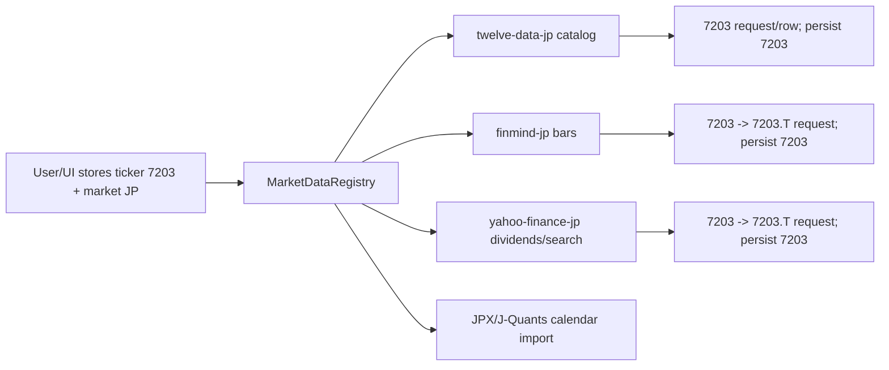

# JP Market Provider Feasibility Spike

Generated: 2026-06-25  
Worktree: `/Users/lume/repos/tw-portfolio/.worktrees/jp-market-support`  
Branch: `codex/jp-market-support`  
Base report: `docs/004-notes/jp-market-support/analysis-20260625-jp-market-support.md`

## Locked Scope Update

Locked: 2026-06-25 via scope-grill.  
Implementation todo: `docs/004-notes/jp-market-support/scope-todo-20260625-jp-market-support.md`

This spike preserves the probe evidence, but its initial three-provider recommendation is superseded. JP v1 is locked to **Twelve Data + Yahoo Finance JP only**:

| Capability | Locked JP v1 source |
|---|---|
| JPX stock/ETF catalog | Twelve Data JP reference endpoints |
| Daily bars | Yahoo Finance JP `.T` chart |
| Dividends | Yahoo Finance JP `.T` chart events, basic cash dividends only |
| Intraday/close refresh | Yahoo Finance JP `.T` chart |
| Fundamentals | Yahoo Finance fundamentals with `.T` normalization |
| Search/autocomplete | Persisted JP catalog first; Yahoo search fallback only |
| Calendar | Existing admin calendar workflow using JPX Market Holidays |

FinMind JP is out of JP v1 because its JPX stock catalog is stale, even though `JapanStockPrice` returned current daily bars in probes. J-Quants is out of JP v1 and remains the future official-provider upgrade path.

## Implementation Alignment Note

The current worktree now follows the locked two-provider JP v1 shape:

- `apps/api/src/services/market-data/registry.ts` registers `yahoo-finance-jp` for JP bars/dividends/metadata/search and `twelve-data-jp` for catalog sync.
- `apps/api/src/services/market-data/providers/yahooFinanceJp.ts` persists bare JP tickers and normalizes `${ticker}.T` at the Yahoo boundary.
- `apps/api/src/services/market-data/providers/twelveDataJp.ts` implements the strict JPX/JPY/XJPX catalog filters and admin-relaxed inclusion settings.
- `db/migrations/092_jp_market_support.sql` seeds JP provider-health rows and the default official JP calendar source.

The older FinMind-based recommendation below is preserved as probe history only. It is not the active JP v1 implementation target.

## Decision

JP market support is feasible without a new paid provider by using a split-provider model:

| Capability | Recommended v1 provider | Why |
|---|---|---|
| JP instrument catalog | Twelve Data reference endpoints | Current `.env.local` key returned 4,064 JPX/XJPX JPY stock rows and 468 JP ETF rows. This is the strongest free/catalog path observed. |
| JP daily bars | FinMind `JapanStockPrice` | Current `.env.local` key returned JP daily OHLCV for `7203.T` through 2026-06-24. This is closer to the existing TW/US FinMind model than the KR model. |
| JP dividends | Yahoo `.T` chart events | Yahoo returned cash-dividend events for Toyota, NTT, and a TOPIX ETF. FinMind guessed dividend datasets were unavailable; Twelve Data price/dividend coverage was not available on current key. |
| JP live search / metadata fallback | Yahoo `.T` search/quote | Yahoo search returned `7203.T` with JPX/Tokyo metadata. Twelve Data `symbol_search` also works but has cross-market ambiguity. |
| JP calendar | JPX/J-Quants official calendar if adopting J-Quants; otherwise JPX market-holidays import plus bar-derived cache | Calendar must not rely only on daily bars. JP has holidays and a lunch break. |
| JP fundamentals / rich corporate actions | J-Quants later | Not required for v1 portfolio bookkeeping. J-Quants is the correct upgrade path for official dividends, listed-company master, and calendar data. |

Concrete recommendation:

1. Ship v1 as `twelve-data-jp` catalog + `finmind-jp` bars + `yahoo-finance-jp` dividends/search.
2. Keep J-Quants as an explicit v1.5/v2 upgrade, not as the v1 blocker.
3. Store canonical JP tickers as bare JPX/TSE codes like `7203`, with provider boundary conversion:
   - FinMind: `7203 -> 7203.T`
   - Yahoo: `7203 -> 7203.T`
   - Twelve Data: `7203 -> 7203`
   - J-Quants: `7203 -> 72030` only if the endpoint requires the five-character issue code.

This is a hybrid of the current KR and TW/US models:

- Like KR/AU: split provider ownership, with provider-specific symbol suffixes hidden at the boundary.
- Like TW/US: FinMind can own JP daily bars under the same existing token/rate-limit family.

## Probe Setup

Credentials:

- `.env.local` contains a FinMind token.
- `.env.local` contains a Twelve Data key.
- `.env.local` does not contain a J-Quants key.

No secrets are copied into this report.

Live probes were read-only and bounded:

- Twelve Data: reference catalog, symbol search, JPX time-series/price probes.
- FinMind: JP catalog, JP daily price, guessed JP dividend dataset probes.
- Yahoo Finance public chart/search endpoints: JP `.T` chart, dividends, ETF, and search.
- J-Quants: official docs and plan matrix only, because no local API key exists.

## Provider Matrix

| Provider | Catalog | Daily bars | Dividends | Search/metadata | Calendar | Free/current-key result | Fit |
|---|---:|---:|---:|---:|---:|---|---|
| Twelve Data | Yes | No in probe | Not checked/likely no for v1 | Yes | No | `country=Japan` returned JPX stocks and ETFs; `time_series`/`price` for `7203` + JPX returned `Data not found` or query errors. | Catalog-only provider, mirrors AU/KR catalog split. |
| FinMind | Stale/weak | Yes | No in probe | No | No | `JapanStockInfo` exists but is a 2019 snapshot; `JapanStockPrice` returned current OHLCV for `7203.T`; guessed `JapanStockDividend` returned 422. | Daily-bar provider, not catalog/dividend source. |
| Yahoo `.T` | Bounded/search only | Yes | Yes basic | Yes | No | Chart returned JPX JPY bars for `7203.T` and `1306.T`; wider period returned dividends and one split for sampled symbols. | Good fallback for dividends/search; avoid sole production source due unofficial API/ToS risk. |
| J-Quants Free | Yes, official | Yes but delayed | No based on plan matrix | Yes via master | Yes | Official docs show free plan with listed issue master, daily stock prices, financial data, earnings calendar; free data is delayed by 12 weeks. Cash dividends appear only on paid plan matrix. | Good official secondary/upgrade path, but free plan is not enough for current portfolio backfill/freshness. |
| J-Quants Standard/Premium | Yes | Yes | Yes on higher plan | Yes | Yes | JPX docs list official OHLC, listed-company master, dividends, financials, earnings calendar, trading calendar, plus add-ons for minute/tick. | Best long-term production-quality provider if paid service is acceptable. |

## Live Probe Results

### Twelve Data

The current key supports JP reference data:

| Probe | Result |
|---|---|
| `/stocks?country=Japan` | HTTP 200, status `ok`, 4,064 rows. Sample rows had `currency=JPY`, `exchange=JPX`, `mic_code=XJPX`, `country=Japan`, `type=Common Stock`. |
| `/etf?country=Japan` | HTTP 200, status `ok`, 468 rows. Sample rows included `1305`, `1306`, `1308`, all `JPY`, `JPX`, `XJPX`. |
| `/symbol_search?symbol=7203` | HTTP 200, status `ok`, returned JP `7203` plus non-JP symbols with same code. Must filter by `country=Japan`/`mic_code=XJPX`. |
| `/time_series?symbol=7203&exchange=JPX&interval=1day` | HTTP 404, status `error`, message `Data not found`. |
| `/price?symbol=7203&exchange=JPX` | HTTP 400 error. |

Implication:

- Twelve Data is feasible for JP catalog sync on the existing account.
- It should not own JP price bars for v1 under the current key.
- Implement `TwelveDataJpCatalogProvider` as a sibling of `TwelveDataKrCatalogProvider`:
  - fetch `/stocks?country=Japan`,
  - fetch `/etf?country=Japan`,
  - require `currency === "JPY"`,
  - require `exchange === "JPX"` and `mic_code === "XJPX"`,
  - include stock-like rows such as `Common Stock`, probably `Preferred Stock` and `REIT` if observed,
  - include ETF rows,
  - filter warrants/ETNs/unsupported rows unless explicitly mapped.

### FinMind

The current key supports JP daily bars:

| Probe | Result |
|---|---|
| `dataset=JapanStockInfo` | HTTP 200, 3,640 rows, but all sampled/max dates were `2019-01-14`; stock IDs include `.T` suffix. |
| `dataset=JapanStockPrice&data_id=7203.T&start_date=2024-01-01&end_date=2024-01-15` | HTTP 200, 7 rows. Row keys: `date`, `stock_id`, `Open`, `High`, `Low`, `Close`, `Adj_Close`, `Volume`. |
| Same dataset with `data_id=7203` | HTTP 200, 0 rows. `.T` suffix is required for JP. |
| `dataset=JapanStockPrice&data_id=7203.T&start_date=2026-06-01&end_date=2026-06-24` | HTTP 200, 18 rows through `2026-06-24`. |
| Guessed `dataset=JapanStockDividend` | HTTP 422. |

Implication:

- FinMind can be the v1 JP daily-bar provider.
- It cannot be the v1 catalog source because its JP catalog is stale.
- It cannot be the v1 dividend provider based on the probed datasets.
- Add `FinMindJpStockMarketDataProvider` as a sibling of `FinMindUsStockMarketDataProvider`.
- Reuse the shared FinMind hourly limiter. JP will share the same 600/hour budget with TW/US unless app_config/env adds a separate higher-tier plan.
- Provider boundary should convert `7203` to `7203.T` for requests and strip `.T` before persistence.

### Yahoo Finance `.T`

The public chart/search path supports JP symbols:

| Probe | Result |
|---|---|
| `chart/7203.T` Jan 2024 | HTTP 200, JPY, exchange `JPX`, full exchange `Tokyo`, instrument `EQUITY`, first trade date `1999-05-06`, 20 bars. |
| `chart/1306.T` Jan 2024 | HTTP 200, JPY, exchange `JPX`, instrument `ETF`, 20 bars. |
| `search?q=7203.T` | HTTP 200, returned `7203.T`, Toyota, `JPX`, Tokyo Stock Exchange, `quoteType=EQUITY`. |
| `chart/7203.T` 2022-2026 with events | Returned 9 dividends. |
| `chart/9432.T` 2022-2026 with events | Returned 9 dividends and one split. |
| `chart/1306.T` 2022-2026 with events | Returned 4 ETF dividends. |

Implication:

- Yahoo is viable for JP live search and basic dividends.
- Yahoo can backstop bars but should not be primary if FinMind JP bars are available.
- If used for dividends, map `paymentDate = exDividendDate` unless a better source supplies payment date.
- This mirrors current KR limitations: basic cash dividends only, no withholding/source automation, no full corporate-action fidelity.

### J-Quants

No local J-Quants API key is available, so this spike used official docs and JPX plan information.

Official support:

- JPX describes J-Quants as an API for historical stock prices and corporate financial information.
- JPX sample datasets include:
  - stock prices/OHLC, adjusted and unadjusted,
  - listed-company information as of past/current/next-business dates,
  - dividends with dividend per share, record date, ex-dividend date, scheduled payment start date,
  - earnings announcement schedule,
  - add-on tick/minute bars and TDnet.
- J-Quants endpoint list includes:
  - `/equities/master`,
  - `/equities/bars/daily`,
  - `/markets/calendar`,
  - `/fins/dividend`,
  - `/fins/summary`,
  - `/fins/details`,
  - bulk CSV endpoints.
- J-Quants dividend docs say `/v2/fins/dividend` includes dividend value per share, record date, ex-rights date, payable date, and cash delivered amount fields.
- JPX's published plan matrix says the free plan includes listed issue master, stock prices, financial data, and earnings calendar, with 12-week delay. Cash dividend data appears only in the higher plan columns in the matrix.

Implication:

- J-Quants is the best official provider for a future paid-quality JP stack.
- J-Quants Free is not a good v1 dependency for current bookkeeping because the free plan is delayed by 12 weeks and appears not to include cash dividend data in the plan matrix.
- If adopting J-Quants later, it could replace:
  - Twelve Data JP catalog,
  - FinMind JP bars,
  - Yahoo JP dividends,
  - JPX manual holiday import,
  with one official provider.

## Feasible Architecture

Provider IDs:

| Provider ID | Responsibility |
|---|---|
| `twelve-data-jp` | Catalog sync and absence detection candidate. |
| `finmind-jp` | Daily OHLCV bars. |
| `yahoo-finance-jp` | Basic dividends, live search, metadata fallback. |
| `jpx-calendar-jp` or `j-quants-jp` | Calendar import, depending whether J-Quants is available. |

Mock providers:

- `MockTwelveDataJpCatalogProvider`: include common stock, ETF, REIT/preferred sample, and unsupported warrant/ETN rows.
- `MockFinMindJpStockMarketDataProvider`: daily bars for `7203`, `1306`, and one synthetic fixture.
- `MockYahooFinanceJpMarketDataProvider`: dividends/search/metadata for `7203`, `9432`, `1306`.

## Concrete Implementation Plan

### Phase 1 - Contracts And Schema

- Add `JP` and `JPY` to shared market/currency constants.
- Add a DB migration for:
  - `accounts.default_currency` check,
  - `currency_to_market('JPY') -> 'JP'`,
  - provider operation/resolution/unresolved/outcome/incident market checks,
  - `ticker_price_supported_markets` array check,
  - ticker fundamentals market check if still used.
- Add `JPY` to FX stored quotes and report currency validation.

### Phase 2 - JP Provider Classes

- Add `TwelveDataJpCatalogProvider`.
- Add `FinMindJpStockMarketDataProvider`.
- Add `YahooFinanceJpMarketDataProvider`.
- Add mocks for all three.
- Extend `providers/index.ts`.
- Extend `buildMarketDataRegistry()`:
  - catalog `JP -> twelve-data-jp`,
  - marketData `JP -> finmind-jp`,
  - dividend/search fallback either by composing Yahoo into the JP provider or by making a small JP composite provider.

Recommended implementation detail:

- Use a `JpCompositeMarketDataProvider` only if the existing `MarketDataProvider` interface requires one object for bars + dividends + metadata/search.
- Internally delegate:
  - `fetchDailyBars` to FinMind,
  - `fetchDividendEvents` to Yahoo,
  - `fetchInstrumentMetadata`/`searchInstruments` to Yahoo,
  - `fetchInstrumentCatalog` should remain on the Twelve Data catalog provider.

### Phase 3 - Calendar/Freshness

- Add `JP` to calendar supported markets with timezone `Asia/Tokyo` and daily settlement close `15:30`.
- Add JP official calendar import using either:
  - J-Quants `/markets/calendar` if a key is introduced, or
  - JPX holiday calendar import fixture/process for v1.
- Extend `marketRegularSession` to support multiple intervals before enabling JP intraday:
  - `09:00-11:30`,
  - `12:30-15:30`.
- If interval refactor is too large, set JP intraday off by default while daily close freshness works.

### Phase 4 - Admin/Web/Tests

- Add JP market-data admin workspace with three providers.
- Add JP provider operation routing:
  - catalog sync through Twelve Data,
  - bar/dividend backfill through JP composite/FinMind/Yahoo,
  - provider health rows per provider ID.
- Add JP account creation/i18n/market chips/reporting currency.
- Fix existing test helper drift by replacing literal `TW | US | AU` helper types with shared `MarketCode`.
- Add E2E and HTTP tests using mocks, not live providers.

### Phase 5 - J-Quants Upgrade Path

When a J-Quants key exists and paid-plan acceptance is explicit:

- Add encrypted app_config key fields for `JQUANTS_API_KEY`.
- Add `JQuantsJpProvider`.
- Replace the three-provider JP split as follows:
  - catalog: J-Quants `/equities/master`,
  - bars: J-Quants `/equities/bars/daily`,
  - dividends: J-Quants `/fins/dividend`,
  - calendar: J-Quants `/markets/calendar`.
- Keep provider IDs stable if possible by implementing J-Quants behind a JP composite provider, or migrate provider IDs with explicit admin/history handling.

## Non-Goals For JP v1

- No tax-reporting-grade JP dividend withholding/source-line automation.
- No automatic stock-split/corporate-action accounting beyond existing provider event storage.
- No real-time or minute/tick JP data.
- No J-Quants dependency until a key and plan are available.
- No sector/GICS browser filter unless Twelve Data or J-Quants taxonomy is mapped intentionally.

## Risks And Mitigations

| Risk | Mitigation |
|---|---|
| Yahoo unofficial API/ToS and endpoint fragility | Use Yahoo only for dividends/search in v1; keep FinMind for bars and Twelve Data for catalog. Add startup warning like AU. |
| FinMind JP price dataset undocumented locally | Treat as live-probed but add provider tests with mocked HTTP fixtures. Document dataset dependency and fallback to Yahoo bars if FinMind breaks. |
| Twelve Data JP catalog ambiguity | Filter strictly to `country=Japan`, `currency=JPY`, `exchange=JPX`, `mic_code=XJPX`; dedupe ETFs before stocks. |
| JP lunch break | Do not enable JP intraday open-state until regular-session intervals support breaks. |
| Provider split complexity | Use a JP composite market-data provider so registry call sites still see one `MarketDataProvider` for `JP`. |
| Shared FinMind budget pressure | Track JP backfill separately in provider operations; reuse rate limiter but expose rate caps in app_config if volume grows. |

## Final Recommendation

Build JP v1 without waiting for J-Quants:

1. `JP`/`JPY` contract and DB constraints.
2. `twelve-data-jp` for catalog.
3. `finmind-jp` for daily bars.
4. `yahoo-finance-jp` for dividends/search/metadata.
5. JP calendar with `Asia/Tokyo`, 15:30 close, official holiday import, and lunch-break-aware session intervals before JP intraday.
6. J-Quants later as the official consolidation provider once a key and plan are available.

This plan gives usable JP bookkeeping coverage with the currently available free/local credentials while preserving a clean path to an official J-Quants-backed implementation.

## Sources

Local:

- `.env.local` credential presence only; values intentionally omitted.
- `apps/api/src/services/market-data/providers/twelveDataKr.ts`
- `apps/api/src/services/market-data/providers/yahooFinanceKr.ts`
- `apps/api/src/services/market-data/providers/finmindUsStock.ts`
- `apps/api/src/services/market-data/registry.ts`
- `docs/004-notes/jp-market-support/analysis-20260625-jp-market-support.md`

External:

- JPX J-Quants API: https://www.jpx.co.jp/english/markets/other-data-services/j-quants-api/index.html
- J-Quants endpoint list: https://jpx-jquants.com/en/spec/bulk-list/endpoints
- J-Quants dividend API: https://jpx-jquants.com/en/spec/fin-dividend
- JPX J-Quants paid/free plan matrix news release: https://www.jpx.co.jp/english/corporate/news/news-releases/6020/20230403-01.html
- Twelve Data Tokyo Stock Exchange: https://twelvedata.com/exchanges/XJPX
- Twelve Data reference endpoint docs: https://support.twelvedata.com/en/articles/5620513-how-to-find-all-available-symbols-at-twelve-data
- JPX domestic stock trading rules: https://www.jpx.co.jp/english/equities/trading/domestic/01.html
- JPX market holidays: https://www.jpx.co.jp/english/corporate/about-jpx/calendar/
