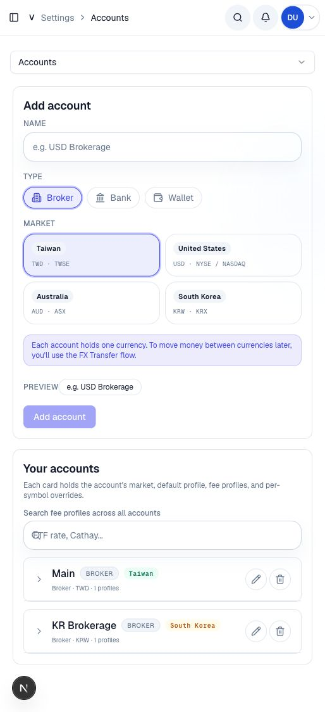
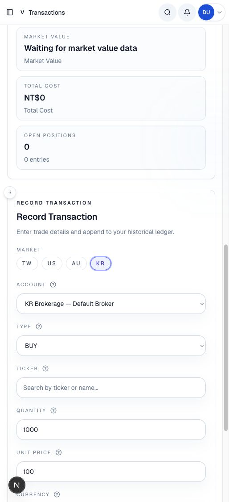
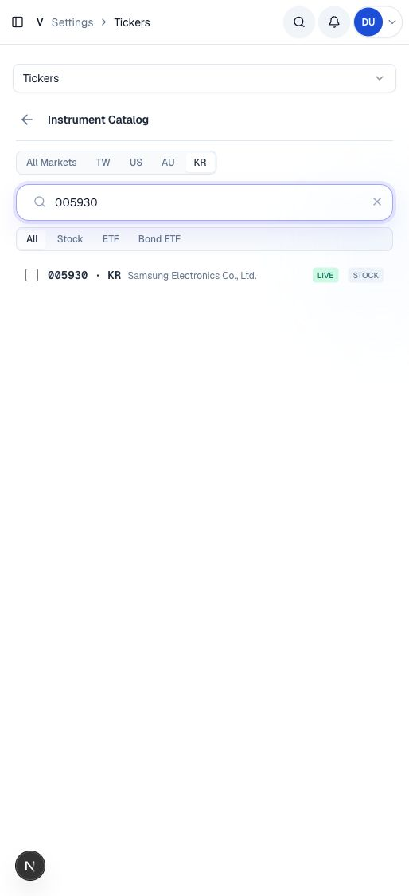
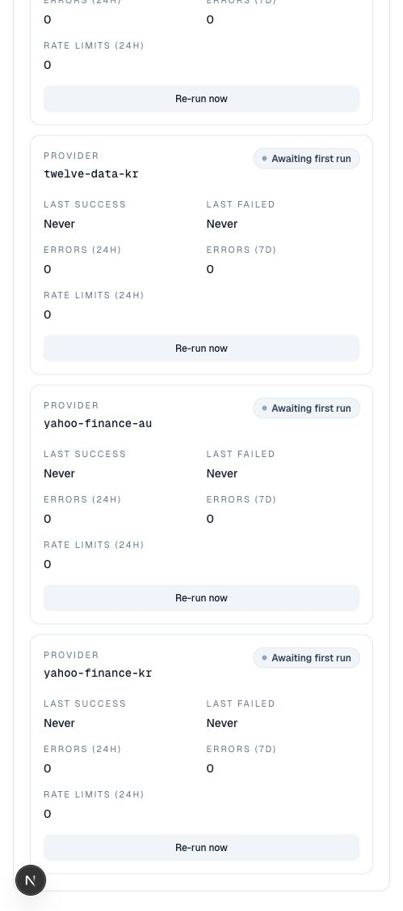

# KR Market UI Mockups

These mockups were captured from the local dev-bypass memory app using deterministic provider mocks. They show the KR surfaces added for full market parity.

## Accounts

The account creation flow exposes South Korea as a KRW/KRX market option and renders a KRW brokerage account alongside existing accounts.

## Transactions

Selecting the KR market filters the account list to KRW accounts and derives the transaction currency from the selected fee profile.

## Instrument Catalog

The instrument catalog includes a KR market filter. Live search keeps bare KRX tickers user-facing while provider suffixes remain internal.

## Provider Health

The provider health surface now includes the KR catalog and market-data providers.

