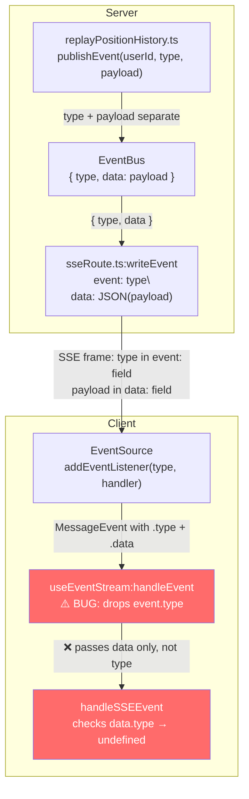
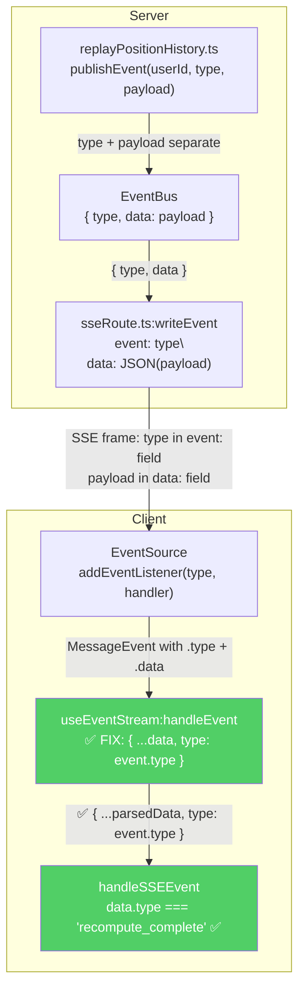

# Debate: SSE Event Type Mismatch Fix

**Date:** 2026-03-25
**Status:** Consensus reached — Option B (4-0)
**Contested Question:** What is the best concrete fix for the SSE event type mismatch bug — server-side payload enrichment, client-side event type forwarding, or both?

## Participants

| Role | Name | Model | Initial Position | Final Position |
|------|------|-------|-----------------|----------------|
| Architect | architect | opus | Option C (both, server primary) | Option B (updated) |
| Backend Engineer | backend | opus | Option B (client-side only) | Option B (held) |
| Frontend Engineer | frontend | sonnet | Option B (client-side only) | Option B (held) |
| QA Engineer | qa | sonnet | Option C (both, B primary) | Option B (updated) |

## Bug Summary

The SSE-driven recompute feedback loop is broken. `handleSSEEvent` in `useTransactionMutations.ts` (line 308-338) unconditionally clears the safety net timer when any SSE event arrives, then checks `event.type` on the parsed data payload. But `event.type` is `undefined` because:

1. The server publishes events via `eventBus.publishEvent(userId, "recompute_complete", { accountId, symbol, ... })` — payload has no `type` field
2. `RedisEventBus` wraps as `{ type, data: payload }` for Redis transport
3. `sseRoute.ts:writeEvent()` writes `event: recompute_complete\ndata: {"accountId":"..."}\n\n` — type is the SSE frame field, NOT in the JSON data
4. `useEventStream.ts:handleEvent()` parses `event.data` JSON and calls `onEventRef.current(data)` — does NOT pass `event.type`
5. `handleSSEEvent` checks `event.type === "recompute_complete"` on the data — always `undefined`, neither branch matches, UI stuck forever

## Consensus Decision

**Option B — Client-side fix in `useEventStream.ts:handleEvent`**

```ts
// useEventStream.ts:handleEvent, lines 71-72
// Before:
const data = JSON.parse(event.data);
onEventRef.current(data);

// After:
const data = JSON.parse(event.data);
onEventRef.current({ ...data, type: event.type });
```

### Required Companion
New `useEventStream.test.ts` test case verifying `onEvent` receives an object with `type` matching the SSE frame event name.

### Tracked Debt
Server-side self-describing payloads deferred — revisit if a non-SSE consumer (WebSocket, polling, service worker) is added.

### Non-Negotiable
EventBus `publishEvent(userId, type, payload)` contract and call sites remain untouched.

## Key Arguments That Drove Consensus

### 1. useEventStream is the adapter boundary
`useEventStream` is the adapter between SSE protocol and application domain types. The SSE protocol decomposes events (type → frame field, payload → data field). The adapter's job is to reassemble them for consumers. Currently it drops the type — that's the bug.

### 2. Single authoritative source
The SSE `event:` frame field is the single source of truth for event type. The browser's `EventSource` routes events to named listeners via this field. Forwarding `event.type` into the data object is *assembly from one source*, not duplication.

### 3. writeEvent injection has a heartbeat side effect (decisive concession)
The Architect's `writeEvent` injection approach would produce `{"type":"heartbeat"}` in heartbeat data frames, changing them from `{}`. This is a silent behavioral change to a system event — an unforced side effect on what should be a zero-risk fix. This was the argument that caused the Architect to update from Option C to Option B.

### 4. EventBus is already self-describing internally
`RedisEventBus.publishEvent()` wraps as `{ type, data: payload }` for Redis. The EventBus internal messages are already self-describing. The SSE route splits them for the wire format; the client hook should reassemble them. Transport independence is solved at the EventBus layer, not the SSE wire format.

## Arguments Considered and Rejected

### Server-side payload enrichment (Option A / part of Option C)
- **Self-describing payloads survive transport changes** — Valid in principle, but the EventBus layer already provides this. Any future non-SSE consumer subscribes via `eventBus.subscribe()` and receives `{ type, data }`.
- **Shared types declare `type` as required** — The Architect and QA argued `RecomputeCompleteEvent` is a producer contract. After cross-examination, both conceded the adapter pattern argument: the shared types describe consumer expectations, and the transport adapter is responsible for fulfilling them.
- **writeEvent computed redundancy can't disagree** — True (same source, two outputs), but the heartbeat side effect made this approach impractical without special-casing.
- **Contract violation** — QA withdrew this framing, accepting that the EventBus `publishEvent(userId, type, payload)` API intentionally separates type from payload.

## Concessions Log

| Who | Conceded | To Whom |
|-----|----------|---------|
| Frontend | `as` cast at line 317 is a genuine type-safety smell | QA |
| Backend | `writeEvent` injection is a valid alternative approach | Architect |
| QA | Contract-violation framing withdrawn; adapter pattern accepted | Backend, Frontend |
| Architect | Heartbeat payload side effect makes writeEvent injection impractical | Frontend |
| Architect | Updated from Option C to Option B | All |
| QA | Updated from Option C to Option B (A acceptable but not required) | All |

## Data Flow Diagram



### Fixed Flow



## Files Involved

| File | Change Required |
|------|----------------|
| `apps/web/hooks/useEventStream.ts` | **YES** — inject `event.type` into parsed data at line 72 |
| `apps/web/hooks/__tests__/useEventStream.test.ts` | **YES** — new test case for type forwarding |
| `apps/web/features/portfolio/hooks/useTransactionMutations.ts` | No change needed |
| `apps/api/src/services/replayPositionHistory.ts` | No change needed |
| `apps/api/src/routes/sseRoute.ts` | No change needed |
| `apps/api/src/events/redis.ts` | No change needed |
| `libs/shared-types/src/events.ts` | No change needed |
