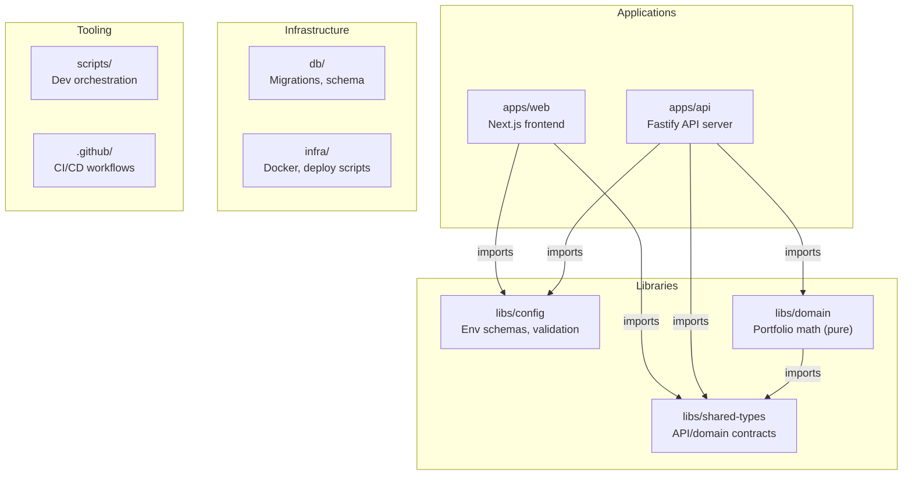
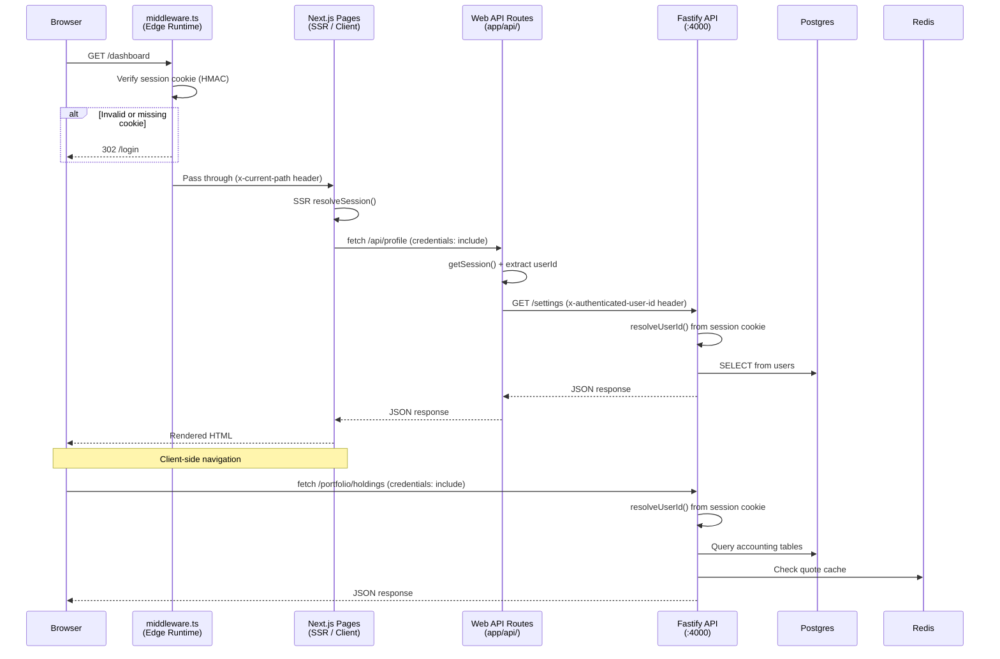
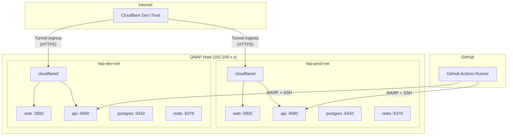
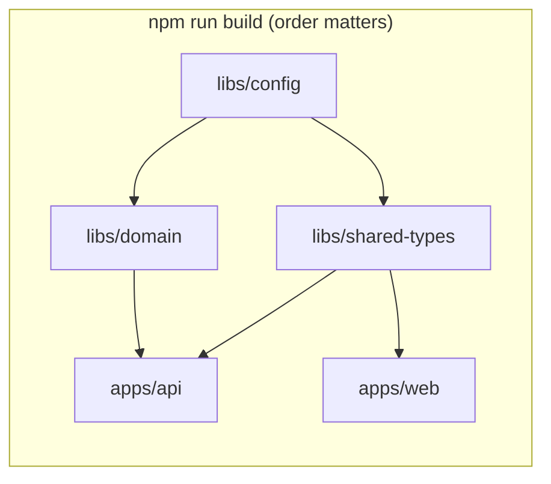

# System Architecture

This document describes the structural layout, data flow, and deployment topology of the tw-portfolio monorepo.

---

## Monorepo Structure

| Package | Purpose | Runtime |
|---------|---------|---------|
| `apps/api` | HTTP API: routes, auth, persistence orchestration | Fastify on Node.js |
| `apps/web` | UI: pages, components, middleware, SSR | Next.js (Node + Edge Runtime) |
| `libs/config` | Env loading, Zod schemas, validation helpers | Shared (Node + Edge) |
| `libs/domain` | Accounting math, fee calculation, lot allocation | Pure functions, no I/O |
| `libs/shared-types` | TypeScript type contracts between API and web | Types only, no runtime |
| `db` | SQL migrations, baseline schema | Postgres via migration runner |
| `infra` | Docker Compose files, deploy/validation scripts, Cloudflare config | Shell + Docker |
| `scripts` | Dev server orchestration, env setup, onboarding | Shell + TypeScript |

---

## Request Lifecycle

### Key Participants

| Component | File | Role |
|-----------|------|------|
| Middleware | `apps/web/proxy.ts` | Route protection, HMAC cookie verification (Edge Runtime) |
| SSR Auth | `apps/web/lib/auth.ts` | Server-side session resolution for React Server Components |
| Web API Routes | `apps/web/app/api/*/route.ts` | Proxy layer forwarding authenticated requests to Fastify API |
| API Auth | `apps/api/src/routes/registerRoutes.ts:resolveUserId()` | Session cookie verification, user identity extraction |
| Persistence | `apps/api/src/persistence/postgres.ts` | Postgres read/write, Redis caching/idempotency |

---

## Persistence Backends

The API supports two backends behind the `Persistence` interface:

| Backend | `PERSISTENCE_BACKEND` | Storage | Use case |
|---------|----------------------|---------|----------|
| Postgres | `postgres` | Postgres (data) + Redis (cache, idempotency) | Production, integration tests |
| Memory | `memory` | In-process Maps | Dev iteration, E2E tests |

### Postgres Write Paths

- **Incremental**: `savePostedTrade`, `savePostedDividend` — single-entity inserts within a transaction
- **Full-store rewrite**: `saveStore`, `saveAccountingStoreTx` — delete-and-reinsert for settings/accounting bulk operations

See [Backend DB and API Architecture Dossier](./backend-db-api-architecture-dossier.md) for the full table catalog and ER diagram.

---

## Deployment Topology

### Environment Tiers

| Tier | Compose File | Project Prefix | Network | Ingress |
|------|-------------|---------------|---------|---------|
| Local | `docker-compose.local.yml` | `twp-local` | `twp-local-net` | Direct localhost (ports 3300/4300) |
| Dev | `docker-compose.dev.yml` | `twp-dev` | `twp-dev-net` | Cloudflare Tunnel |
| Production | `docker-compose.prod.yml` | `twp-prod` | `twp-prod-net` | Cloudflare Tunnel |

### Port Mapping

| Service | Local (host:container) | Dev | Production |
|---------|----------------------|-----|------------|
| Web | 3300:3000 | internal:3000 | internal:3000 |
| API | 4300:4000 | internal:4000 | internal:4000 |
| Postgres | 5732:5432 | 5454:5432 | internal only |
| Redis | 6679:6379 | 6363:6379 | internal only |

Local ports use a +300 offset to avoid collision with bare-metal dev servers (3000/3333 + 4000).

### Container Resource Limits (Cloud)

| Service | Memory | CPU |
|---------|--------|-----|
| Web | 512 MB | 1.0 |
| API | 512 MB | 1.0 |
| Postgres | 512 MB | 1.0 |
| Redis | 256 MB | 0.5 |
| Cloudflared | 128 MB | 0.25 |

Host budget: ~1,920 MB / 3.75 vCPU total vs. ~8 GB / 4 cores available on QNAP.

---

## Build Model

- Workspace libraries are **not** built during `npm ci`. Run `npm run build` or `npm run onboard` to build them.
- CI runs explicit `npm run build -w ...` steps in dependency order.
- Docker images run `npm ci` then `npm run build -w ...` in the same order.
- Local dev scripts (`dev:local:*`) rebuild workspace libs when outputs are missing.

---

## Related Docs

- [Environment Variables](./environment-variables.md) — env schemas, validation, generation
- [Auth and Session](./auth-and-session.md) — OAuth, dev_bypass, demo mode, cookies
- [Backend Dossier](./backend-db-api-architecture-dossier.md) — DB schema, API routes, ER diagram
- [Web Frontend Architecture](./web-frontend-architecture.md) — component layering, auth middleware
- [CI/CD](./ci-cd.md) — GitHub Actions, deploy workflows, PR gate
- [Runbook](./runbook.md) — how to run, deploy, and troubleshoot
