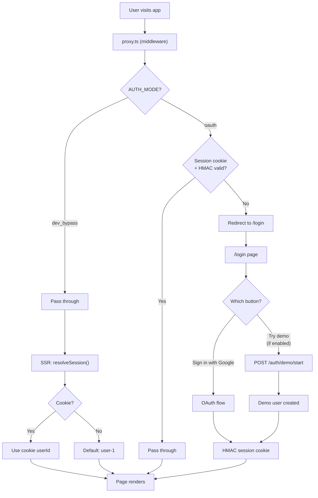
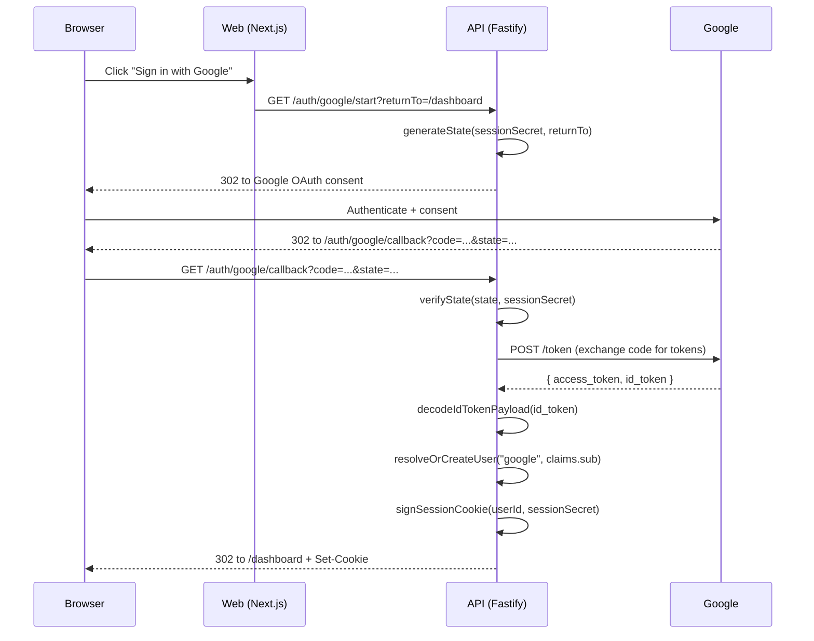
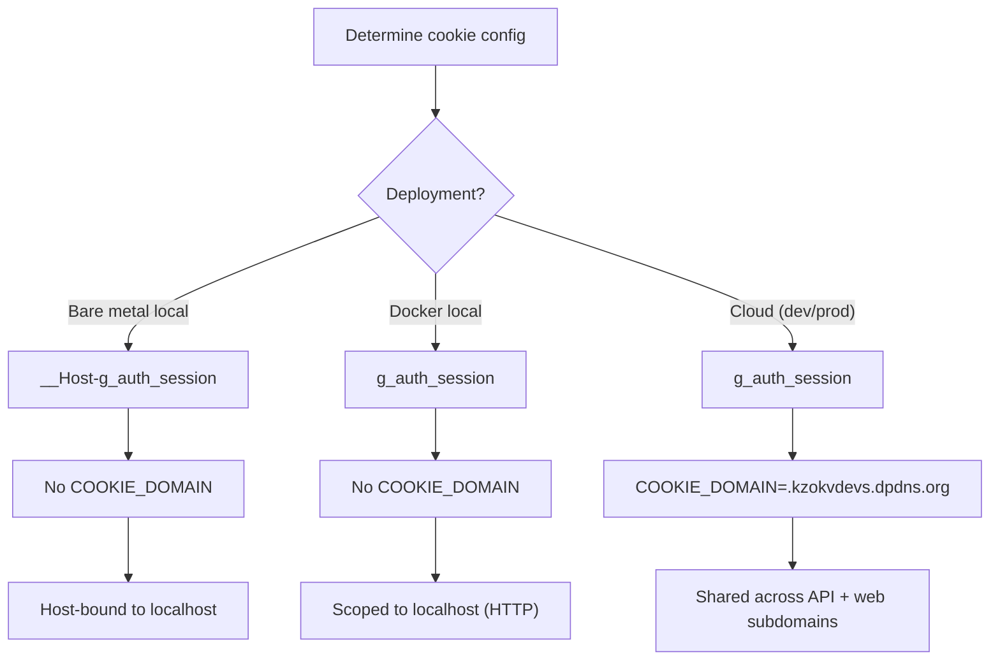
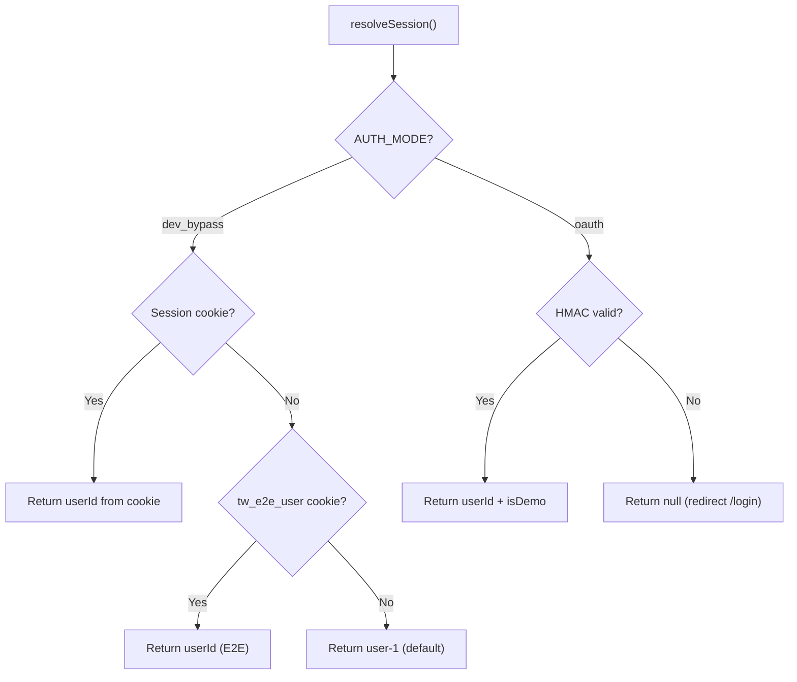
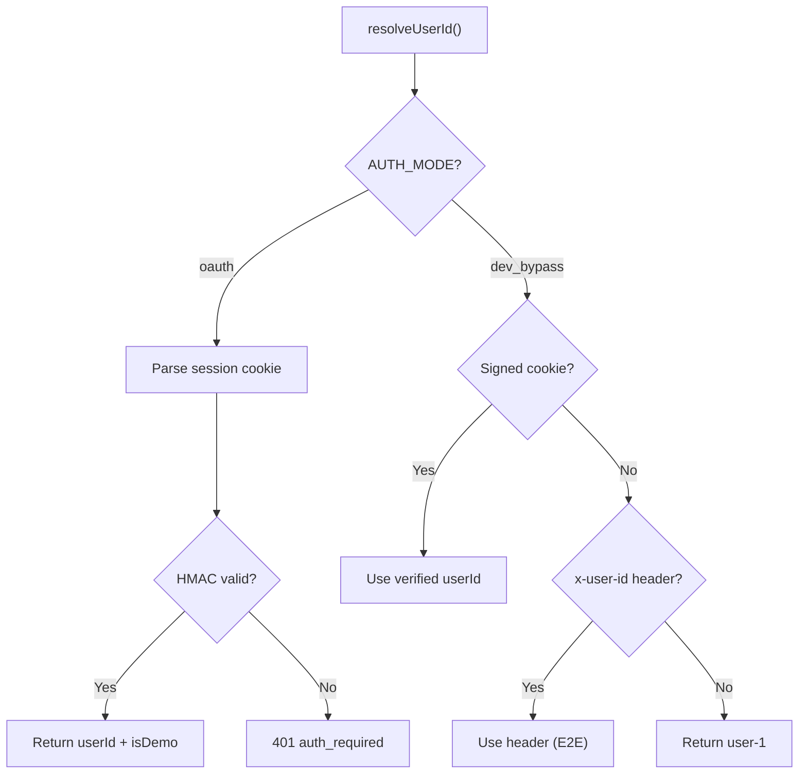
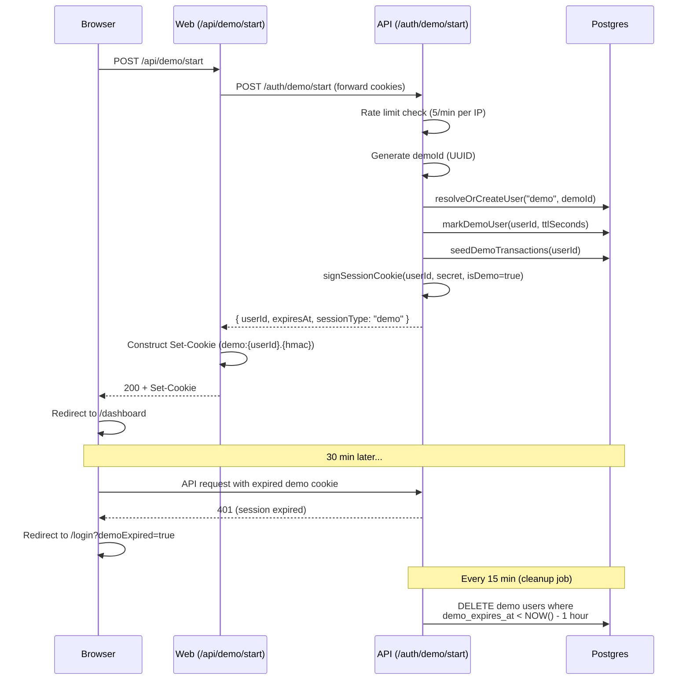
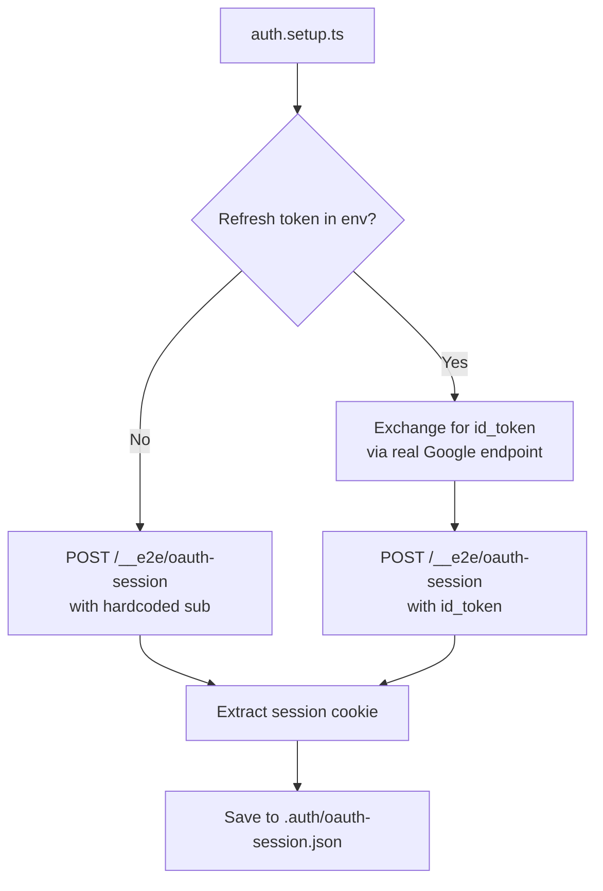

# Auth and Session

This document covers authentication modes, the Google OAuth flow, demo mode, session cookie mechanics, and the identity resolution chain.

---

## Auth Modes

The system supports two auth modes controlled by `AUTH_MODE`:

| Mode | Enforcement | Identity Source | Use Case |
|------|------------|----------------|----------|
| `dev_bypass` | None (pass-through) | Cookie > header > `"user-1"` fallback | Local dev, E2E tests |
| `oauth` | Full session enforcement | HMAC-signed session cookie (sole source) | Docker, cloud, production |

A third capability, **demo mode**, is a feature flag _within_ `oauth` mode (not a separate auth mode).

---

## Unified Auth Flow



---

## Google OAuth Flow

### Full Lifecycle



### Key Functions

| Function | File | Purpose |
|----------|------|---------|
| `generateState()` | `apps/api/src/auth/googleOAuth.ts` | CSRF state token with HMAC + optional returnTo |
| `verifyState()` | `apps/api/src/auth/googleOAuth.ts` | Validate state HMAC to prevent replay |
| `buildAuthorizationUrl()` | `apps/api/src/auth/googleOAuth.ts` | Construct Google consent URL |
| `exchangeCodeForTokens()` | `apps/api/src/auth/googleOAuth.ts` | Exchange auth code for access/ID tokens |
| `decodeIdTokenPayload()` | `apps/api/src/auth/googleOAuth.ts` | Decode JWT payload (no signature check; token came directly from Google) |
| `signSessionCookie()` | `apps/api/src/auth/googleOAuth.ts` | Create `{payload}.{hmac}` cookie value |
| `verifySessionCookie()` | `apps/api/src/auth/googleOAuth.ts` | Timing-safe HMAC verification |
| `resolveOrCreateUser()` | `apps/api/src/persistence/postgres.ts` | Upsert user by email + external identity mapping |

### OAuth Routes

| Route | Method | Purpose |
|-------|--------|---------|
| `/auth/google/start` | GET | Redirect to Google consent screen |
| `/auth/google/callback` | GET | Handle OAuth callback, create session |
| `/auth/logout` | GET | Clear session cookie, redirect to /login |
| `/auth/token/refresh` | POST | Refresh access token |

---

## Session Cookie

### Format

```
{payload}.{hmacSignature}
```

- **Regular OAuth**: payload = `{userId}` (e.g., `a1b2c3d4-...`)
- **Demo session**: payload = `demo:{userId}` (e.g., `demo:a1b2c3d4-...`)
- **HMAC**: SHA256 with `SESSION_SECRET`, hex-encoded

The `demo:` prefix is part of the signed payload, making it tamper-proof.

### Cookie Attributes

| Attribute | Value | Condition |
|-----------|-------|-----------|
| `Path` | `/` | Always |
| `HttpOnly` | `true` | Always |
| `SameSite` | `Lax` | Always |
| `Secure` | `true` | `NODE_ENV=production` or `__Host-` prefix |
| `Domain` | `COOKIE_DOMAIN` | Only when set (and no `__Host-` prefix) |
| `Max-Age` | `DEMO_SESSION_TTL_SECONDS` | Demo sessions only |

### Cookie Configuration by Deployment



**Incompatibility rule**: `__Host-` prefix and `COOKIE_DOMAIN` cannot coexist (RFC 6265bis). Validation in `validateCookieConfig()` enforces this.

---

## Identity Resolution

### Web Side (`apps/web/lib/auth.ts`)



| Function | File | Purpose |
|----------|------|---------|
| `getSession()` | `apps/web/lib/auth.ts` | Public API, returns `Session \| null` (cached per request) |
| `requireSession()` | `apps/web/lib/auth.ts` | Returns `Session` or redirects to `/login` |
| `resolveSession()` | `apps/web/lib/auth.ts` | Internal resolution (React.cache-wrapped) |

### API Side (`apps/api/src/routes/registerRoutes.ts`)



---

## Demo Mode

Demo is a feature flag within `oauth` mode, controlled by `DEMO_MODE_ENABLED`.

### Demo Session Lifecycle



### Demo Mode Components

| Component | File | Role |
|-----------|------|------|
| Login page | `apps/web/app/login/page.tsx` | Conditionally renders DemoButton |
| DemoButton | `apps/web/components/DemoButton.tsx` | Calls `/api/demo/start`, handles errors |
| Web route handler | `apps/web/app/api/demo/start/route.ts` | Forwards to API, constructs Set-Cookie |
| API endpoint | `apps/api/src/routes/registerRoutes.ts` | Creates demo user, seeds data, signs cookie |
| Demo banner | `apps/web/components/DemoBanner.tsx` | Amber bar on all pages for demo users |

### Demo User Data Model

| Column | Table | Purpose |
|--------|-------|---------|
| `is_demo` | `users` | Boolean flag for demo users |
| `demo_expires_at` | `users` | TTL marker for cleanup job |

Demo users get: 1 account, 1 fee profile, 12 seeded transactions across 5 TW stock/ETF symbols.

### Guards

- `DEMO_MODE_ENABLED=false` (or unset) => `/auth/demo/start` returns 404
- Rate limit: 5 requests/min per IP
- Cleanup: Postgres-only, every 15 min, deletes users whose `demo_expires_at` < NOW() - 1 hour

---

## Middleware Route Protection

File: `apps/web/proxy.ts`

**Protected**: All routes except `/login`, `/auth/error`, `/api/demo/*`, `/_next/*`, static assets.

In `oauth` mode:
1. No cookie => redirect to `/login?returnTo={path}`
2. Invalid HMAC => redirect to `/auth/error?reason=session_expired`
3. Valid cookie => pass through with `x-current-path` header

In `dev_bypass` mode: all requests pass through unchanged.

---

## E2E Test Auth

### Session Seeding

Route: `POST /__e2e/oauth-session` (guarded by `NODE_ENV !== "production"`)

| Path | Trigger | Identity |
|------|---------|----------|
| Local dev | `GOOGLE_OAUTH_REFRESH_TOKEN` in env | Exchange refresh token for real Google ID token |
| CI | No refresh token | Hardcoded E2E user (`e2e-ci-google-sub-001`) |

Both paths create a signed session cookie stored in `.auth/oauth-session.json` for Playwright.



---

## User Identity Tables

| Table | Purpose |
|-------|---------|
| `users` | Core identity (id, email, display_name, is_demo, demo_expires_at) |
| `user_external_identities` | Provider mapping (provider, provider_subject, linked_at, last_seen_at) |

`resolveOrCreateUser(provider, providerSubject, claims)`:
1. Upsert user by email (partial unique index)
2. Upsert external identity by `(provider, provider_subject)`
3. Seed default portfolio data on first creation

Supported providers: `"google"`, `"demo"`.

---

## Related Docs

- [Environment Variables](./environment-variables.md) — auth-related env vars and validation rules
- [Architecture](./architecture.md) — request lifecycle, deployment topology
- [Backend Dossier](./backend-db-api-architecture-dossier.md) — user/identity table schemas
- [Runbook](./runbook.md) — Google OAuth credential setup
