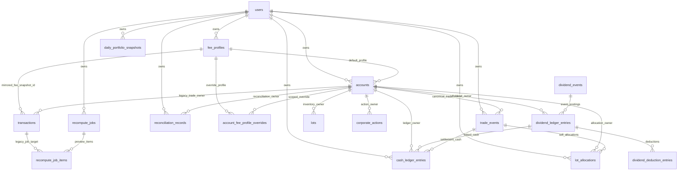
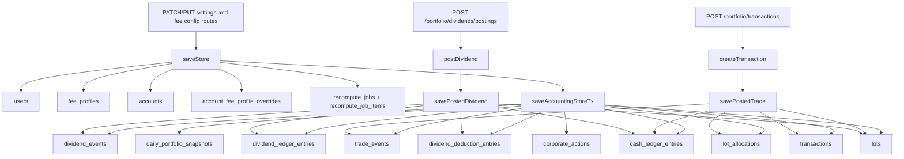
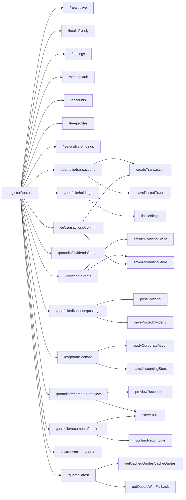
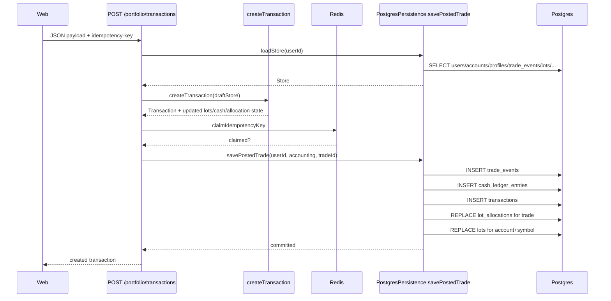
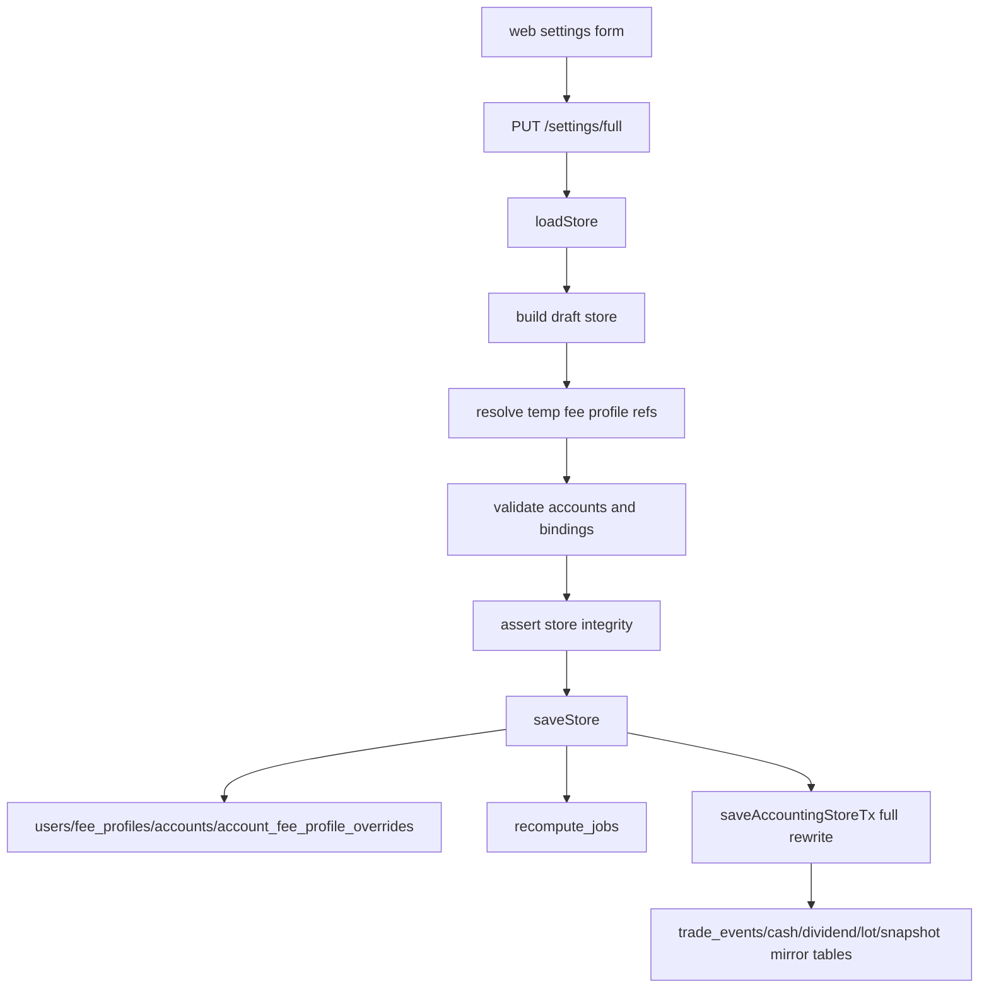

# Backend DB and API Architecture Dossier

This dossier documents the current backend runtime in `apps/api` and `db/migrations` as implemented in the repository on March 11, 2026.

Sources of truth used for this report:
- `db/migrations/*.sql`
- `apps/api/src/routes/registerRoutes.ts`
- `apps/api/src/app.ts`
- `apps/api/src/persistence/postgres.ts`
- `apps/api/src/persistence/memory.ts`
- `apps/api/src/services/*.ts`
- `apps/api/src/types/store.ts`
- `apps/api/test/integration/*.test.ts`
- `apps/web/lib/api.ts`
- `apps/web/features/*/services/*.ts`

The report covers:
- current Postgres schema, including compatibility and dormant tables
- current HTTP API surface and route dependencies
- cross-cutting data flow, dependency graphs, and drift findings

## Database

### Runtime storage model

The API supports two persistence backends behind `Persistence`:
- `postgres`: primary runtime path, backed by Postgres plus Redis
- `memory`: test/dev in-memory substitute with the same route surface but no SQL persistence

In the Postgres backend:
- Postgres stores user settings, fee configuration, accounting facts, projections, recompute jobs, and migration ledger state.
- Redis stores idempotency keys and quote cache entries.
- The API boot path runs migrations, seeds symbols, and ensures a default user/account/profile.

Current runtime write modes:
- incremental writes:
  - `savePostedTrade`
  - `savePostedDividend`
- full-store or full-accounting rewrites:
  - `saveStore`
  - `saveAccountingStore`

### Canonical vs compatibility data model

The runtime accounting source of truth is not the legacy `transactions` table.

Canonical trade/accounting reads come from:
- `trade_events`
- `cash_ledger_entries`
- `dividend_events`
- `dividend_ledger_entries`
- `dividend_deduction_entries`
- `lots`
- `lot_allocations`
- `corporate_actions`
- `daily_portfolio_snapshots`

Compatibility or workflow tables still matter:
- `transactions`: still written, not read by `loadStore`
- `recompute_jobs`
- `recompute_job_items`
- `schema_migrations`
- `reconciliation_records`: present in schema, unused by current runtime code

### Database relationship graph



Plain-text adjacency list:

```text
users
  -> fee_profiles.user_id
  -> accounts.user_id
  -> transactions.user_id
  -> trade_events.user_id
  -> cash_ledger_entries.user_id
  -> lot_allocations.user_id
  -> recompute_jobs.user_id
  -> daily_portfolio_snapshots.user_id
  -> reconciliation_records.user_id
  -> reconciliation_records.reviewer_id

fee_profiles
  -> accounts.fee_profile_id
  -> account_fee_profile_overrides.fee_profile_id
  -> transactions.fee_profile_id

accounts
  -> account_fee_profile_overrides.account_id
  -> transactions.account_id
  -> lots.account_id
  -> corporate_actions.account_id
  -> trade_events.account_id
  -> cash_ledger_entries.account_id
  -> lot_allocations.account_id
  -> dividend_ledger_entries.account_id
  -> reconciliation_records.account_id

trade_events
  -> cash_ledger_entries.related_trade_event_id
  -> lot_allocations.trade_event_id
  -> trade_events.reversal_of_trade_event_id

transactions
  -> recompute_job_items.transaction_id

dividend_events
  -> dividend_ledger_entries.dividend_event_id

dividend_ledger_entries
  -> cash_ledger_entries.related_dividend_ledger_entry_id
  -> dividend_deduction_entries.dividend_ledger_entry_id
  -> dividend_ledger_entries.reversal_of_dividend_ledger_entry_id

cash_ledger_entries
  -> cash_ledger_entries.reversal_of_cash_ledger_entry_id

recompute_jobs
  -> recompute_job_items.job_id
```

### Table catalog

#### `users`

Purpose:
- per-user settings and tenancy root

Fields:

| Column | Type / default | Constraints | Notes |
| --- | --- | --- | --- |
| `id` | `TEXT` | PK | tenant key |
| `email` | `TEXT` | `NOT NULL` | seeded as `<userId>@example.com` |
| `locale` | `TEXT DEFAULT 'en'` | `NOT NULL` | route layer restricts to `en` or `zh-TW` |
| `cost_basis_method` | `TEXT DEFAULT 'WEIGHTED_AVERAGE'` | `NOT NULL`, later check-constrained | migration `002` locks this to `WEIGHTED_AVERAGE` only |
| `quote_poll_interval_seconds` | `INTEGER DEFAULT 10` | `NOT NULL` | route layer caps at `86400` |

Read path:
- loaded in `loadStore`

Write path:
- updated by `saveStore`
- seeded by `ensureUserSeed`

#### `fee_profiles`

Purpose:
- broker fee/tax policy definitions used by accounts, overrides, and fee snapshots

Fields:

| Column | Type / default | Constraints | Notes |
| --- | --- | --- | --- |
| `id` | `TEXT` | PK | user-scoped in practice, globally keyed in schema |
| `user_id` | `TEXT` | `NOT NULL`, FK -> `users.id` | owner |
| `name` | `TEXT` | `NOT NULL` | profile label |
| `commission_rate_bps` | `INTEGER` | `NOT NULL` | raw commission rate |
| `commission_discount_percent` | `NUMERIC(5,2)` | `NOT NULL` | broker commission percent-off from board rate |
| `minimum_commission_amount` | `INTEGER` | `NOT NULL` | commission floor |
| `commission_currency` | `TEXT DEFAULT 'TWD'` | `NOT NULL` | fee-profile commission currency |
| `commission_rounding_mode` | `TEXT` | `NOT NULL` | `FLOOR`, `ROUND`, `CEIL` at route layer |
| `tax_rounding_mode` | `TEXT` | `NOT NULL` | `FLOOR`, `ROUND`, `CEIL` at route layer |
| `stock_sell_tax_rate_bps` | `INTEGER` | `NOT NULL` | stock sell tax |
| `stock_day_trade_tax_rate_bps` | `INTEGER` | `NOT NULL` | day-trade stock tax |
| `etf_sell_tax_rate_bps` | `INTEGER` | `NOT NULL` | ETF sell tax |
| `bond_etf_sell_tax_rate_bps` | `INTEGER` | `NOT NULL` | bond ETF sell tax |

Indexes:
- `idx_fee_profiles_user_id`

Read path:
- loaded into `Store.feeProfiles`

Write path:
- upserted and pruned by `saveStore`
- seeded with the default profile by `ensureUserSeed`

#### `accounts`

Purpose:
- account container for trades, lots, overrides, ledger rows, and corporate actions

Fields:

| Column | Type / default | Constraints | Notes |
| --- | --- | --- | --- |
| `id` | `TEXT` | PK | globally keyed in schema |
| `user_id` | `TEXT` | `NOT NULL`, FK -> `users.id` | owner |
| `name` | `TEXT` | `NOT NULL` | account label |
| `fee_profile_id` | `TEXT` | `NOT NULL`, FK -> `fee_profiles.id` | fallback fee profile |

Indexes and uniqueness:
- `idx_accounts_user_id`
- `ux_accounts_id_user_id` unique composite, added in migration `003`

Read path:
- loaded into `Store.accounts`

Write path:
- upserted and pruned by `saveStore`
- seeded with `Main` account by `ensureUserSeed`

#### `account_fee_profile_overrides`

Purpose:
- account+symbol specific fee profile overrides

Fields:

| Column | Type / default | Constraints | Notes |
| --- | --- | --- | --- |
| `account_id` | `TEXT` | PK part, FK -> `accounts.id ON DELETE CASCADE` | account scope |
| `symbol` | `TEXT` | PK part | uppercased ticker at route layer |
| `fee_profile_id` | `TEXT` | `NOT NULL`, FK -> `fee_profiles.id` | override target |

Indexes:
- PK `(account_id, symbol)`
- `idx_account_fee_profile_overrides_account_id`

Read path:
- loaded into `Store.feeProfileBindings`

Write path:
- fully replaced by `saveStore`

#### `symbols`

Purpose:
- supported tradable instruments and instrument type lookup

Fields:

| Column | Type / default | Constraints | Notes |
| --- | --- | --- | --- |
| `ticker` | `TEXT` | PK | symbol |
| `instrument_type` | `TEXT` | `NOT NULL` | `STOCK`, `ETF`, `BOND_ETF` in seeded data |

Read path:
- loaded into `Store.symbols`

Write path:
- seeded/upserted by `seedSymbols`

#### `transactions`

Purpose:
- legacy trade mirror used as compatibility debt, not canonical runtime read source

Fields:

| Column | Type / default | Constraints | Notes |
| --- | --- | --- | --- |
| `id` | `TEXT` | PK | mirrors canonical trade id |
| `user_id` | `TEXT` | `NOT NULL`, FK -> `users.id` | owner |
| `account_id` | `TEXT` | `NOT NULL`, FK -> `accounts.id` | account |
| `symbol` | `TEXT` | `NOT NULL` | ticker |
| `instrument_type` | `TEXT` | `NOT NULL` | instrument kind |
| `tx_type` | `TEXT` | `NOT NULL` | `BUY` or `SELL` in practice |
| `quantity` | `INTEGER` | `NOT NULL` | whole shares |
| `unit_price` | `INTEGER` | `NOT NULL` | unit price |
| `price_currency` | `TEXT DEFAULT 'TWD'` | `NOT NULL` | trade price currency |
| `trade_date` | `DATE` | `NOT NULL` | trade date |
| `commission_amount` | `INTEGER` | `NOT NULL` | booked commission |
| `tax_amount` | `INTEGER` | `NOT NULL` | booked tax |
| `is_day_trade` | `BOOLEAN DEFAULT false` | `NOT NULL` | day-trade flag |
| `fee_profile_id` | `TEXT` | `NOT NULL`, FK -> `fee_profiles.id` | copied from fee snapshot |
| `fee_snapshot_json` | `TEXT` | `NOT NULL` | serialized profile |
| `realized_pnl_amount` | `INTEGER` | nullable | mirrored realized PnL |
| `realized_pnl_currency` | `TEXT DEFAULT 'TWD'` | nullable | mirrored realized PnL currency |

Indexes:
- `idx_transactions_user_id`
- `idx_transactions_account_id`

Read path:
- not read by `loadStore`
- only used indirectly by `recompute_job_items.transaction_id`

Write path:
- inserted by `savePostedTrade`
- fully deleted/recreated by `saveAccountingStoreTx`

Finding:
- `transactions` is lossy relative to `trade_events`: it cannot represent `trade_timestamp`, `booking_sequence`, `source_type`, `source_reference`, `booked_at`, or trade reversals. It is still required because recompute job items target the legacy table, not `trade_events`.

#### `lots`

Purpose:
- weighted-average lot-capable inventory projection

Fields:

| Column | Type / default | Constraints | Notes |
| --- | --- | --- | --- |
| `id` | `TEXT` | PK | lot id |
| `account_id` | `TEXT` | `NOT NULL`, FK -> `accounts.id` | owner account |
| `symbol` | `TEXT` | `NOT NULL` | ticker |
| `open_quantity` | `INTEGER` | `NOT NULL` | remaining position |
| `total_cost_amount` | `INTEGER` | `NOT NULL` | weighted-average allocated cost |
| `cost_currency` | `TEXT DEFAULT 'TWD'` | `NOT NULL` | lot cost currency |
| `opened_at` | `DATE` | `NOT NULL` | lot opening date |
| `opened_sequence` | `INTEGER` | `NOT NULL`, check `> 0` | migration `004`/`005` ordering key |

Indexes and uniqueness:
- `idx_lots_account_symbol`
- `idx_lots_account_symbol_opened_order`
- `ux_lots_account_symbol_opened_order`

Read path:
- loaded into `accounting.projections.lots`

Write path:
- rewritten per trade/dividend symbol by incremental save methods
- fully deleted/recreated by `saveStore` and `saveAccountingStoreTx`

#### `corporate_actions`

Purpose:
- stored corporate actions against an account+symbol

Fields:

| Column | Type / default | Constraints | Notes |
| --- | --- | --- | --- |
| `id` | `TEXT` | PK | action id |
| `account_id` | `TEXT` | `NOT NULL`, FK -> `accounts.id` | owner account |
| `symbol` | `TEXT` | `NOT NULL` | ticker |
| `action_type` | `TEXT` | `NOT NULL` | `DIVIDEND`, `SPLIT`, `REVERSE_SPLIT` in app |
| `numerator` | `INTEGER` | `NOT NULL` | split ratio numerator |
| `denominator` | `INTEGER` | `NOT NULL` | split ratio denominator |
| `action_date` | `DATE` | `NOT NULL` | effective date |

Read path:
- loaded into `accounting.facts.corporateActions`

Write path:
- fully replaced by `saveStore` and `saveAccountingStoreTx`

#### `recompute_jobs`

Purpose:
- persisted preview/confirm workflow state, not an accounting fact table

Fields:

| Column | Type / default | Constraints | Notes |
| --- | --- | --- | --- |
| `id` | `TEXT` | PK | job id |
| `user_id` | `TEXT` | `NOT NULL`, FK -> `users.id` | owner |
| `account_id` | `TEXT` | nullable | account-limited recompute |
| `profile_id` | `TEXT` | `NOT NULL` | chosen profile or `account-fallback` |
| `status` | `TEXT` | `NOT NULL` | `PREVIEWED` or `CONFIRMED` in app |
| `created_at` | `TIMESTAMP` | `NOT NULL` | creation time |

Indexes:
- `idx_recompute_jobs_user_id`

Read path:
- loaded into `Store.recomputeJobs`

Write path:
- fully deleted/recreated by `saveStore`

#### `recompute_job_items`

Purpose:
- per-transaction fee/tax recompute preview rows

Fields:

| Column | Type / default | Constraints | Notes |
| --- | --- | --- | --- |
| `id` | `TEXT` | PK | `${jobId}:${transactionId}` in current writes |
| `job_id` | `TEXT` | `NOT NULL`, FK -> `recompute_jobs.id` | parent job |
| `transaction_id` | `TEXT` | `NOT NULL`, FK -> `transactions.id` | legacy trade reference |
| `previous_commission_amount` | `INTEGER` | `NOT NULL` | prior value |
| `previous_tax_amount` | `INTEGER` | `NOT NULL` | prior value |
| `next_commission_amount` | `INTEGER` | `NOT NULL` | previewed value |
| `next_tax_amount` | `INTEGER` | `NOT NULL` | previewed value |

Read path:
- loaded and grouped under `Store.recomputeJobs[].items`

Write path:
- fully deleted/recreated by `saveStore`

Finding:
- recompute workflow still couples to the legacy `transactions` mirror through FK, even though canonical trade reads are from `trade_events`.

#### `trade_events`

Purpose:
- canonical trade fact table

Fields:

| Column | Type / default | Constraints | Notes |
| --- | --- | --- | --- |
| `id` | `TEXT` | PK | trade event id |
| `user_id` | `TEXT` | `NOT NULL`, FK -> `users.id` | owner |
| `account_id` | `TEXT` | `NOT NULL`, FK -> `accounts.id`, composite FK with `user_id` | tenant/account integrity |
| `symbol` | `TEXT` | `NOT NULL` | ticker |
| `instrument_type` | `TEXT` | `NOT NULL` | resolved from `symbols` |
| `trade_type` | `TEXT` | `NOT NULL`, check in `BUY`,`SELL` | trade direction |
| `quantity` | `INTEGER` | `NOT NULL`, check `> 0` | share count |
| `unit_price` | `INTEGER` | `NOT NULL`, check `>= 0` | unit price |
| `price_currency` | `TEXT DEFAULT 'TWD'` | `NOT NULL` | trade price currency |
| `trade_date` | `DATE` | `NOT NULL` | logical trade date |
| `trade_timestamp` | `TIMESTAMP` | `NOT NULL` | precise booking-order time |
| `booking_sequence` | `INTEGER` | `NOT NULL`, check `> 0` | per-account/day uniqueness |
| `commission_amount` | `INTEGER DEFAULT 0` | `NOT NULL`, check `>= 0` | booked commission |
| `tax_amount` | `INTEGER DEFAULT 0` | `NOT NULL`, check `>= 0` | booked tax |
| `is_day_trade` | `BOOLEAN DEFAULT false` | `NOT NULL` | day-trade flag |
| `fee_snapshot_json` | `TEXT` | `NOT NULL` | serialized profile snapshot |
| `source_type` | `TEXT` | `NOT NULL` | origin channel |
| `source_reference` | `TEXT` | nullable | idempotent source reference |
| `booked_at` | `TIMESTAMP DEFAULT CURRENT_TIMESTAMP` | `NOT NULL` | persistence time |
| `reversal_of_trade_event_id` | `TEXT` | nullable, self-FK | trade reversal link |

Indexes and uniqueness:
- `idx_trade_events_user_id`
- `idx_trade_events_account_symbol_trade_date`
- `idx_trade_events_account_symbol_booking_order`
- `ux_trade_events_account_source_reference` partial on non-null `source_reference`
- `ux_trade_events_reversal_of_trade_event_id` partial on non-null reversal
- `ux_trade_events_account_trade_date_booking_sequence`

Read path:
- loaded into `accounting.facts.tradeEvents`

Write path:
- single-trade insert via `savePostedTrade`
- full delete/reinsert via `saveAccountingStoreTx`

#### `dividend_events`

Purpose:
- ex-date/payment-date dividend announcements, independent of account

Fields:

| Column | Type / default | Constraints | Notes |
| --- | --- | --- | --- |
| `id` | `TEXT` | PK | dividend event id |
| `symbol` | `TEXT` | `NOT NULL` | ticker |
| `event_type` | `TEXT` | `NOT NULL`, checked | `CASH`, `STOCK`, `CASH_AND_STOCK` |
| `ex_dividend_date` | `DATE` | `NOT NULL` | ex-date |
| `payment_date` | `DATE` | `NOT NULL`, check `>= ex_dividend_date` | payment date |
| `cash_dividend_per_share` | `NUMERIC(20, 6) DEFAULT 0` | `NOT NULL`, check `>= 0` | economic input |
| `cash_dividend_currency` | `TEXT DEFAULT 'TWD'` | `NOT NULL` | dividend cash currency |
| `stock_dividend_per_share` | `NUMERIC(20, 6) DEFAULT 0` | `NOT NULL`, check `>= 0` | economic input |
| `source_type` | `TEXT` | `NOT NULL` | source system |
| `source_reference` | `TEXT` | nullable | source key |
| `created_at` | `TIMESTAMP DEFAULT CURRENT_TIMESTAMP` | `NOT NULL` | creation time |

Indexes and uniqueness:
- `idx_dividend_events_symbol_ex_dividend_date`
- `idx_dividend_events_payment_date`
- `ux_dividend_events_symbol_source_reference` partial on non-null `source_reference`

Read path:
- loaded into `accounting.facts.dividendEvents`

Write path:
- upserted in `savePostedDividend`
- upserted in `saveAccountingStoreTx`

#### `dividend_ledger_entries`

Purpose:
- per-account posting/reconciliation state for a dividend event

Fields:

| Column | Type / default | Constraints | Notes |
| --- | --- | --- | --- |
| `id` | `TEXT` | PK | ledger id |
| `account_id` | `TEXT` | `NOT NULL`, FK -> `accounts.id` | owning account |
| `dividend_event_id` | `TEXT` | `NOT NULL`, FK -> `dividend_events.id` | source event |
| `eligible_quantity` | `INTEGER` | `NOT NULL`, check `>= 0` | shares eligible on ex-date |
| `expected_cash_amount` | `INTEGER DEFAULT 0` | `NOT NULL`, check `>= 0` | computed expectation |
| `expected_stock_quantity` | `INTEGER DEFAULT 0` | `NOT NULL`, check `>= 0` | computed expectation |
| `received_cash_amount` | `INTEGER DEFAULT 0` | `NOT NULL`, check `>= 0` | actual posted cash |
| `received_stock_quantity` | `INTEGER DEFAULT 0` | `NOT NULL`, check `>= 0` | actual posted stock |
| `posting_status` | `TEXT` | `NOT NULL`, checked | `expected`, `posted`, `adjusted` after migration `006` |
| `reconciliation_status` | `TEXT` | `NOT NULL`, checked | `open`, `matched`, `explained`, `resolved` |
| `booked_at` | `TIMESTAMP DEFAULT CURRENT_TIMESTAMP` | `NOT NULL` | posting time |
| `reversal_of_dividend_ledger_entry_id` | `TEXT` | nullable, self-FK | reversal chain |
| `superseded_at` | `TIMESTAMP` | nullable | migration `006` active-row support |

Legacy removed fields:
- `supplemental_insurance_ntd`
- `other_deduction_ntd`

Indexes and uniqueness:
- `idx_dividend_ledger_entries_account_id`
- `idx_dividend_ledger_entries_dividend_event_id`
- `idx_dividend_ledger_entries_reconciliation_status`
- `ux_dividend_ledger_entries_reversal_of_dividend_ledger_entry_id`
- `ux_dividend_ledger_entries_active_account_event` partial active-row uniqueness

Read path:
- loaded into `accounting.facts.dividendLedgerEntries`

Write path:
- inserted/updated by `savePostedDividend`
- full delete/reinsert by `saveAccountingStoreTx`

#### `dividend_deduction_entries`

Purpose:
- typed withholding and fee deductions attached to a dividend ledger row

Fields:

| Column | Type / default | Constraints | Notes |
| --- | --- | --- | --- |
| `id` | `TEXT` | PK | deduction id |
| `dividend_ledger_entry_id` | `TEXT` | `NOT NULL`, FK -> `dividend_ledger_entries.id` | parent ledger row |
| `deduction_type` | `TEXT` | `NOT NULL`, checked | typed deduction enum |
| `amount` | `INTEGER` | `NOT NULL`, check `> 0` | positive amount |
| `currency_code` | `TEXT DEFAULT 'TWD'` | `NOT NULL` | deduction currency code |
| `withheld_at_source` | `BOOLEAN DEFAULT true` | `NOT NULL` | gross-vs-net analysis |
| `source_type` | `TEXT` | `NOT NULL` | origin source |
| `source_reference` | `TEXT` | nullable | origin key |
| `note` | `TEXT` | nullable | explanation |
| `booked_at` | `TIMESTAMP DEFAULT CURRENT_TIMESTAMP` | `NOT NULL` | booking time |

Indexes:
- `idx_dividend_deduction_entries_dividend_ledger_entry_id`

Read path:
- loaded into `accounting.facts.dividendDeductionEntries`

Write path:
- replaced for a single dividend ledger row in `savePostedDividend`
- full delete/reinsert by `saveAccountingStoreTx`

#### `cash_ledger_entries`

Purpose:
- canonical cash movement ledger for trade settlement, dividends, deductions, reversals, and manual adjustments

Fields:

| Column | Type / default | Constraints | Notes |
| --- | --- | --- | --- |
| `id` | `TEXT` | PK | cash row id |
| `user_id` | `TEXT` | `NOT NULL`, FK -> `users.id` | owner |
| `account_id` | `TEXT` | `NOT NULL`, FK -> `accounts.id`, composite FK with `user_id` | account |
| `entry_date` | `DATE` | `NOT NULL` | ledger date |
| `entry_type` | `TEXT` | `NOT NULL`, checked | `TRADE_SETTLEMENT_IN`, `TRADE_SETTLEMENT_OUT`, `DIVIDEND_RECEIPT`, `DIVIDEND_DEDUCTION`, `MANUAL_ADJUSTMENT`, `REVERSAL` |
| `amount` | `INTEGER` | `NOT NULL`, non-zero plus sign checks | signed cash amount |
| `currency` | `TEXT DEFAULT 'TWD'` | `NOT NULL` | explicit cash currency |
| `related_trade_event_id` | `TEXT` | nullable, FK -> `trade_events.id` | trade link |
| `related_dividend_ledger_entry_id` | `TEXT` | nullable, FK -> `dividend_ledger_entries.id` | dividend link |
| `source_type` | `TEXT` | `NOT NULL` | source channel |
| `source_reference` | `TEXT` | nullable | source key |
| `note` | `TEXT` | nullable | explanation |
| `booked_at` | `TIMESTAMP DEFAULT CURRENT_TIMESTAMP` | `NOT NULL` | booking time |
| `reversal_of_cash_ledger_entry_id` | `TEXT` | nullable, self-FK | reversal chain |

Indexes and uniqueness:
- `idx_cash_ledger_entries_user_id`
- `idx_cash_ledger_entries_account_entry_date`
- `idx_cash_ledger_entries_related_trade_event_id`
- `idx_cash_ledger_entries_related_dividend_ledger_entry_id`
- `ux_cash_ledger_entries_account_source_reference` partial on non-null `source_reference`
- `ux_cash_ledger_entries_reversal_of_cash_ledger_entry_id` partial on reversal target

Important checks:
- sign is constrained by `entry_type`
- reversal rows must link to a target row
- trade-settlement rows must link trade only
- dividend rows must link dividend ledger only

Read path:
- loaded into `accounting.facts.cashLedgerEntries`

Write path:
- inserted with a trade in `savePostedTrade`
- replaced for a dividend ledger row in `savePostedDividend`
- full delete/reinsert by `saveAccountingStoreTx`

#### `reconciliation_records`

Purpose:
- schema exists for future/manual reconciliation workflows

Fields:

| Column | Type / default | Constraints | Notes |
| --- | --- | --- | --- |
| `id` | `TEXT` | PK | reconciliation id |
| `user_id` | `TEXT` | `NOT NULL`, FK -> `users.id` | owner |
| `account_id` | `TEXT` | `NOT NULL`, FK -> `accounts.id`, composite FK with `user_id` | account |
| `source_type` | `TEXT` | `NOT NULL` | source system |
| `source_reference` | `TEXT` | nullable | source key |
| `source_file_name` | `TEXT` | nullable | import artifact |
| `source_row_key` | `TEXT` | nullable | import row id |
| `target_entity_type` | `TEXT` | `NOT NULL`, checked | entity kind |
| `target_entity_id` | `TEXT` | nullable | target row |
| `reconciliation_status` | `TEXT` | `NOT NULL`, checked | workflow state |
| `difference_reason` | `TEXT` | `NOT NULL` | explanation |
| `reviewed_at` | `TIMESTAMP` | nullable | review time |
| `reviewer_id` | `TEXT` | nullable, FK -> `users.id` | reviewer |
| `note` | `TEXT` | nullable | notes |
| `created_at` | `TIMESTAMP DEFAULT CURRENT_TIMESTAMP` | `NOT NULL` | creation time |

Indexes:
- `idx_reconciliation_records_user_account_status`
- `idx_reconciliation_records_target_entity`
- `idx_reconciliation_records_source`

Read/write path:
- no current runtime code reads or writes this table

Finding:
- this is schema-only in the current implementation. It is part of the migrated surface but not part of the live application behavior.

#### `daily_portfolio_snapshots`

Purpose:
- stored daily projection snapshots for NAV-style portfolio summaries

Fields:

| Column | Type / default | Constraints | Notes |
| --- | --- | --- | --- |
| `id` | `TEXT` | PK | snapshot id |
| `user_id` | `TEXT` | `NOT NULL`, FK -> `users.id` | owner |
| `snapshot_date` | `DATE` | `NOT NULL` | snapshot date |
| `currency` | `TEXT DEFAULT 'TWD'` | `NOT NULL` | snapshot currency |
| `total_market_value_amount` | `INTEGER` | `NOT NULL` | gross market value |
| `total_cost_amount` | `INTEGER` | `NOT NULL` | portfolio cost basis |
| `total_unrealized_pnl_amount` | `INTEGER` | `NOT NULL` | unrealized PnL |
| `total_realized_pnl_amount` | `INTEGER` | `NOT NULL` | realized PnL |
| `total_dividend_received_amount` | `INTEGER` | `NOT NULL` | dividend total |
| `total_cash_balance_amount` | `INTEGER` | `NOT NULL` | cash balance |
| `total_nav_amount` | `INTEGER` | `NOT NULL` | NAV |
| `generated_at` | `TIMESTAMP DEFAULT CURRENT_TIMESTAMP` | `NOT NULL` | generation time |
| `generation_run_id` | `TEXT` | `NOT NULL` | batch/run identity |

Indexes and uniqueness:
- `ux_daily_portfolio_snapshots_user_date_run`
- `idx_daily_portfolio_snapshots_user_snapshot_date`
- `idx_daily_portfolio_snapshots_generation_run_id`

Read path:
- loaded into `accounting.projections.dailyPortfolioSnapshots`

Write path:
- deleted/reinserted by `saveAccountingStoreTx`

Finding:
- the schema and loader support this table, but no current route/service populates snapshots during normal runtime flows.

#### `lot_allocations`

Purpose:
- per-sell mapping from a trade event to contributing lots

Fields:

| Column | Type / default | Constraints | Notes |
| --- | --- | --- | --- |
| `id` | `TEXT` | PK | allocation id |
| `user_id` | `TEXT` | `NOT NULL`, FK -> `users.id` | owner |
| `account_id` | `TEXT` | `NOT NULL`, FK -> `accounts.id`, composite FK with `user_id` | account |
| `trade_event_id` | `TEXT` | `NOT NULL`, FK -> `trade_events.id` | parent sell trade |
| `symbol` | `TEXT` | `NOT NULL` | ticker |
| `lot_id` | `TEXT` | `NOT NULL` | references lot by id, but not FK-constrained |
| `lot_opened_at` | `DATE` | `NOT NULL` | lot order key |
| `lot_opened_sequence` | `INTEGER` | `NOT NULL`, check `> 0` | lot order key |
| `allocated_quantity` | `INTEGER` | `NOT NULL`, check `> 0` | quantity sold from lot |
| `allocated_cost_amount` | `INTEGER` | `NOT NULL`, check `>= 0` | cost allocation |
| `cost_currency` | `TEXT DEFAULT 'TWD'` | `NOT NULL` | allocation cost currency |
| `created_at` | `TIMESTAMP DEFAULT CURRENT_TIMESTAMP` | `NOT NULL` | creation time |

Indexes and uniqueness:
- `idx_lot_allocations_trade_event_id`
- `idx_lot_allocations_account_symbol`
- `ux_lot_allocations_trade_event_lot`

Read path:
- loaded into `accounting.projections.lotAllocations`

Write path:
- replaced per trade by `savePostedTrade`
- full delete/reinsert by `saveAccountingStoreTx`

#### `schema_migrations`

Purpose:
- migration ledger maintained by the runtime migration runner

Fields:

| Column | Type / default | Constraints | Notes |
| --- | --- | --- | --- |
| `name` | `TEXT` | PK | migration filename |
| `applied_at` | `TIMESTAMPTZ DEFAULT NOW()` | `NOT NULL` | application time |

Read/write path:
- maintained only by `runMigrations`

### Persistence write-path map



Plain-text write paths:

```text
saveStore
  updates users
  upserts/prunes fee_profiles
  upserts/prunes accounts
  replaces account_fee_profile_overrides
  replaces recompute_jobs and recompute_job_items
  delegates to saveAccountingStoreTx
  then rewrites lots and corporate_actions again

saveAccountingStoreTx
  deletes: cash_ledger_entries, dividend_deduction_entries, dividend_ledger_entries,
           lot_allocations, trade_events, daily_portfolio_snapshots, transactions,
           lots, corporate_actions
  inserts/reinserts: dividend_events, dividend_ledger_entries, dividend_deduction_entries,
                     trade_events, cash_ledger_entries, lot_allocations,
                     daily_portfolio_snapshots, transactions, lots, corporate_actions

savePostedTrade
  inserts one trade_events row
  inserts one cash_ledger_entries row
  inserts one mirrored transactions row
  replaces lot_allocations for that trade
  replaces lots for that account+symbol

savePostedDividend
  upserts dividend_events row
  inserts/updates one dividend_ledger_entries row
  replaces dividend_deduction_entries for that ledger row
  replaces linked cash_ledger_entries for that ledger row
  replaces lots for that account+symbol
```

Finding:
- `saveStore` redundantly rewrites `lots` and `corporate_actions` after `saveAccountingStoreTx` has already rewritten them. This is consistent but unnecessary work inside the same transaction.

### Data integrity invariants enforced in application code

In addition to SQL constraints, `validateStoreInvariants` and `validateAccountingStoreInvariants` enforce:
- every account belongs to the active store user
- every account references an existing fee profile
- every fee-profile binding points to an existing account and profile
- `accounting.policy.inventoryModel` must remain `LOT_CAPABLE`
- `accounting.policy.disposalPolicy` must remain `WEIGHTED_AVERAGE`
- booking sequences must be unique per `accountId + tradeDate`
- lot opened sequences must be unique per `accountId + symbol + openedAt`
- every dividend ledger row must reference an existing dividend event and valid account
- `expected` dividend rows must remain reconciliation-open
- only one active dividend ledger row may exist for `(accountId, dividendEventId)`
- every lot allocation must reference a known trade and lot
- every cash ledger dividend link must reference an existing dividend ledger row
- every dividend deduction must reference an existing dividend ledger row
- every dividend deduction must use a valid 3-letter currency code
- every dividend deduction currency must match the parent dividend event cash currency

### Database findings summary

- Canonical trade reads use `trade_events`, not `transactions`.
- `transactions` remains write-active and FK-significant because recompute items still point to it.
- `reconciliation_records` is migrated but dormant.
- `daily_portfolio_snapshots` is persisted in the model but not actively generated by current route/service flows.
- Full-store save paths mix canonical accounting rewrites with compatibility rewrites and workflow-state rewrites.
- Some tables use strong `(account_id, user_id)` composite integrity, while older projection tables like `lots` and `corporate_actions` still only key through `accounts(id)`.

## API

### HTTP runtime model

Framework and middleware:
- Fastify server
- CORS allowlist with local-dev fallback
- mutation-only in-memory rate limit bucket keyed by `ip + user + method + path`
- security headers on all responses
- Zod request validation at route boundary
- centralized error normalization

Auth/tenant resolution:
- `AUTH_MODE=oauth`
  - requires `x-authenticated-user-id`
  - missing header returns `401 auth_required`
- `AUTH_MODE=dev_bypass`
  - accepts optional `x-user-id`
  - defaults to `user-1` if missing

Mutation-only common behavior:
- `POST`, `PATCH`, `PUT`, `DELETE` share rate limiting
- `POST /portfolio/transactions` and `POST /portfolio/dividends/postings` require `idempotency-key`

Response/error conventions:
- validation failure: `400 { error: "validation_error", issues: [...] }`
- known route error: `statusCode + { error, message }`
- inferred client error from thrown message:
  - `not found` -> `404 not_found`
  - `invalid`, `missing`, `unsupported` -> `400 invalid_request`
- unhandled error -> `500 { error: "internal_error" }`

### Route dependency graph



Plain-text call graph:

```text
GET /health/live
  -> literal response

GET /health/ready
  -> app.persistence.readiness

GET/PATCH /settings
  -> loadStore
  -> saveStore on PATCH

PUT /settings/full
  -> loadStore
  -> in-memory draft reconciliation
  -> saveStore

GET /settings/fee-config
  -> loadStore
  -> getStoreIntegrityIssue

PUT /settings/fee-config
  -> loadStore
  -> ensureBindingsAreValid
  -> assertStoreIntegrity
  -> saveStore

GET/PATCH /accounts/:id
  -> loadStore
  -> saveStore on PATCH

GET/POST/PATCH/DELETE /fee-profiles
  -> loadStore
  -> listTradeEvents for delete safety
  -> saveStore on mutations

GET/PUT /fee-profile-bindings
  -> loadStore
  -> ensureBindingsAreValid
  -> saveStore on PUT

POST /portfolio/transactions
  -> loadStore
  -> assertStoreIntegrity
  -> createTransaction
  -> claimIdempotencyKey
  -> savePostedTrade
  -> releaseIdempotencyKey on failure

GET /portfolio/transactions
  -> loadStore
  -> listTradeEvents

GET /portfolio/holdings
  -> loadStore
  -> assertStoreIntegrity
  -> listHoldings

POST /dividend-events
  -> loadStore
  -> createDividendEvent
  -> saveAccountingStore

POST /portfolio/dividends/postings
  -> loadStore
  -> assertStoreIntegrity
  -> requireAccount
  -> postDividend
  -> claimIdempotencyKey
  -> savePostedDividend
  -> releaseIdempotencyKey on failure

POST /corporate-actions
  -> loadStore
  -> assertStoreIntegrity
  -> requireAccount
  -> applyCorporateAction
  -> saveAccountingStore

POST /portfolio/recompute/preview
  -> loadStore
  -> assertStoreIntegrity
  -> previewRecompute
  -> saveStore

POST /portfolio/recompute/confirm
  -> loadStore
  -> confirmRecompute
  -> saveStore

GET /quotes/latest
  -> getCachedQuotes
  -> getQuotesWithFallback if cache miss
  -> cacheQuotes

POST /ai/transactions/parse
  -> local text parser only

POST /ai/transactions/confirm
  -> loadStore
  -> assertStoreIntegrity
  -> repeated createTransaction
  -> saveAccountingStore
```

### Endpoint catalog

#### Health and auth placeholders

| Method | Path | Request shape | Response shape | Dependencies | Notes |
| --- | --- | --- | --- | --- | --- |
| `GET` | `/health/live` | none | `{ status: "ok" }` | none | liveness only |
| `GET` | `/health/ready` | none | `{ status, dependencies }` | `persistence.readiness()` | status is `ready` only when both Postgres and Redis are healthy |
| `GET` | `/auth/google/start` | none | `{ status: "todo", message }` | none | placeholder |
| `GET` | `/auth/google/callback` | none | `{ status: "todo", message }` | none | placeholder |

Finding:
- OAuth route surface exists only as placeholder endpoints. Real auth currently depends on header-based identity injection.

#### Settings and fee configuration

| Method | Path | Request shape | Response shape | Dependencies | Web usage |
| --- | --- | --- | --- | --- | --- |
| `GET` | `/settings` | none | `UserSettings` | `loadStore` | yes |
| `PATCH` | `/settings` | partial `{ locale?, costBasisMethod?, quotePollIntervalSeconds? }` | updated `UserSettings` | `loadStore`, `saveStore` | not used by shipped UI |
| `PUT` | `/settings/full` | `{ settings, feeProfiles, accounts, feeProfileBindings }` | `{ settings, accounts, feeProfiles, feeProfileBindings }` | draft merge, `saveStore` | yes |
| `GET` | `/settings/fee-config` | none | `{ accounts, feeProfiles, feeProfileBindings, integrityIssue }` | `loadStore`, integrity check | yes |
| `PUT` | `/settings/fee-config` | `{ accounts, feeProfileBindings }` | `{ accounts, feeProfileBindings }` | `loadStore`, validation, `saveStore` | not used by shipped UI |

Key validation:
- `costBasisMethod` is restricted to `WEIGHTED_AVERAGE`
- quote poll interval must be `1..86400`
- `settings/full` accepts temp profile ids and resolves them to persisted ids
- at least one fee profile must remain
- bindings are deduped by `accountId:symbol`

#### Accounts, fee profiles, and bindings

| Method | Path | Request shape | Response shape | Dependencies | Web usage |
| --- | --- | --- | --- | --- | --- |
| `GET` | `/accounts` | none | `Account[]` | `loadStore` | indirect via fee-config payload instead |
| `PATCH` | `/accounts/:id` | `{ name?, feeProfileId }` | updated `Account` | `loadStore`, `saveStore` | not used by shipped UI |
| `GET` | `/fee-profiles` | none | `FeeProfile[]` | `loadStore` | not used directly by shipped UI |
| `POST` | `/fee-profiles` | fee profile payload | created `FeeProfile` | `loadStore`, `saveStore` | not used directly by shipped UI |
| `PATCH` | `/fee-profiles/:id` | fee profile payload | updated `FeeProfile` | `loadStore`, `saveStore` | not used directly by shipped UI |
| `DELETE` | `/fee-profiles/:id` | none | `{ deletedId }` | `loadStore`, `listTradeEvents`, `saveStore` | not used directly by shipped UI |
| `GET` | `/fee-profile-bindings` | none | `FeeProfileBinding[]` | `loadStore` | not used directly by shipped UI |
| `PUT` | `/fee-profile-bindings` | `{ bindings }` | `FeeProfileBinding[]` | `loadStore`, `saveStore` | not used directly by shipped UI |

Delete protections for fee profiles:
- cannot delete the last remaining profile
- cannot delete a profile still used by any account
- cannot delete a profile referenced by any symbol override
- cannot delete a profile embedded in any historical trade fee snapshot

#### Portfolio trades and holdings

| Method | Path | Request shape | Response shape | Dependencies | Web usage |
| --- | --- | --- | --- | --- | --- |
| `POST` | `/portfolio/transactions` | `{ accountId, symbol, quantity, unitPrice, priceCurrency, tradeDate, tradeTimestamp?, bookingSequence?, commissionAmount?, taxAmount?, type, isDayTrade }` + `idempotency-key` header | created `Transaction` | `createTransaction`, Redis idempotency, `savePostedTrade` | yes |
| `GET` | `/portfolio/transactions` | none | `BookedTradeEvent[]` | `listTradeEvents` | not used by shipped UI, used heavily in tests |
| `GET` | `/portfolio/holdings` | none | `Holding[]` | `assertStoreIntegrity`, `listHoldings` | yes |

Trade posting behavior:
- resolves account default fee profile, then per-symbol override if present
- looks up instrument type from `symbols`
- calculates fees unless booked commission/tax is explicitly supplied
- enforces trade timestamp date alignment
- auto-assigns `bookingSequence` unless one is supplied
- rejects duplicate booking sequence for same account and trade date
- BUY updates lots directly
- SELL allocates against weighted-average lot projection and computes realized PnL

Finding:
- `/portfolio/transactions` uses the incremental persistence path with Redis-backed idempotency, while AI-confirmed trades do not.

#### Dividends and corporate actions

| Method | Path | Request shape | Response shape | Dependencies | Web usage |
| --- | --- | --- | --- | --- | --- |
| `GET` | `/dividend-events` | none | `DividendEvent[]` | `listDividendEvents` | not used by shipped UI |
| `POST` | `/dividend-events` | `{ symbol, eventType, exDividendDate, paymentDate, cashDividendPerShare, cashDividendCurrency, stockDividendPerShare, sourceType?, sourceReference? }` | created `DividendEvent` | `createDividendEvent`, `saveAccountingStore` | not used by shipped UI |
| `GET` | `/portfolio/dividends/ledger` | none | `DividendLedgerEntry[]` | `listDividendLedgerEntries` | not used by shipped UI |
| `POST` | `/portfolio/dividends/postings` | `{ accountId, dividendEventId, receivedCashAmount, receivedStockQuantity, deductions[] }` + `idempotency-key` header | `{ dividendEvent, dividendLedgerEntry, dividendDeductionEntries, linkedCashLedgerEntries, comparison }` | `postDividend`, Redis idempotency, `savePostedDividend` | not used by shipped UI |
| `GET` | `/corporate-actions` | none | `CorporateAction[]` | `listCorporateActions` | not used by shipped UI |
| `POST` | `/corporate-actions` | `{ accountId, symbol, actionType, numerator, denominator, actionDate }` | created `CorporateAction` | `applyCorporateAction`, `saveAccountingStore` | not used by shipped UI |

Dividend posting behavior:
- creates or reuses one active expected ledger row per `(accountId, dividendEventId)`
- materializes expected cash/stock from eligible quantity at ex-date
- writes deduction rows separately from the dividend ledger row
- writes linked cash ledger entries for receipt and deductions
- optionally creates a stock-dividend lot on payment date

Corporate action behavior:
- `DIVIDEND` only appends the action record
- `SPLIT` and `REVERSE_SPLIT` mutate open lot quantities in place using floor rounding

Finding:
- `POST /dividend-events` and `POST /corporate-actions` both persist through full-accounting rewrite, not focused incremental mutation.

#### Recompute and quote retrieval

| Method | Path | Request shape | Response shape | Dependencies | Web usage |
| --- | --- | --- | --- | --- | --- |
| `POST` | `/portfolio/recompute/preview` | `{ profileId?, accountId?, useFallbackBindings=true, forceProfileOnly=false }` | `RecomputeJob` | `previewRecompute`, `saveStore` | yes |
| `POST` | `/portfolio/recompute/confirm` | `{ jobId }` | `RecomputeJob` | `confirmRecompute`, `saveStore` | yes |
| `GET` | `/quotes/latest` | query `symbols=a,b,c` | `Quote[]` | Redis cache, market-data provider fallback | not used by shipped UI |

Recompute behavior:
- preview computes alternate commission/tax values against current trades
- confirm mutates trade fee/tax fields and rebuilds linked cash settlement rows
- both preview and confirm persist through full `saveStore`

Quote behavior:
- maximum 20 symbols per request
- cache-first via Redis keys `quote:<symbol>`
- cache TTL is 30 seconds
- provider chain is currently mock-only:
  - primary: `mock-primary`
  - fallback: `mock-fallback`

Finding:
- `/quotes/latest` is structurally production-like but still wired to mock providers, not a live market-data integration.

#### AI transaction endpoints

| Method | Path | Request shape | Response shape | Dependencies | Web usage |
| --- | --- | --- | --- | --- | --- |
| `POST` | `/ai/transactions/parse` | `{ text }` | `{ proposals }` | local parser only | not used by shipped UI |
| `POST` | `/ai/transactions/confirm` | `{ accountId, proposals[] }` | `{ created }` | repeated `createTransaction`, `saveAccountingStore` | not used by shipped UI |

AI parse behavior:
- tokenizes each non-empty line into `type symbol qty price tradeDate`
- caps at 200 proposals
- defaults to `BUY 2330 1 100 2026-01-01` shape if tokens are missing

AI confirm behavior:
- mutates one draft store across all proposals
- if any proposal fails, none are persisted
- persists by full accounting rewrite, not incremental idempotent trade posting

Finding:
- AI confirm and direct trade posting create the same domain objects but use different persistence strategies and different operational guarantees.

### Current web-consumed API surface

Shipped web code currently calls:
- `GET /settings`
- `GET /settings/fee-config`
- `GET /portfolio/holdings`
- `PUT /settings/full`
- `POST /portfolio/transactions`
- `POST /portfolio/recompute/preview`
- `POST /portfolio/recompute/confirm`

Defined server routes not currently called by the shipped web app:
- both health endpoints
- both auth placeholder endpoints
- `PATCH /settings`
- `PUT /settings/fee-config`
- `GET /accounts`
- `PATCH /accounts/:id`
- all standalone fee profile and binding CRUD endpoints
- all dividend endpoints
- all corporate action endpoints
- `GET /portfolio/transactions`
- `GET /quotes/latest`
- both AI endpoints

Finding:
- the server surface is substantially broader than the shipped UI surface. The primary user journey currently depends on dashboard bootstrap, full settings save, manual transaction posting, and recompute only.

## Cross-cutting Data Flow and Dependencies

### End-to-end transaction posting flow



Plain-text flow:

```text
web form
  -> apps/web/features/portfolio/services/portfolioService.submitTransaction
  -> POST /portfolio/transactions
  -> load canonical store from Postgres
  -> mutate in-memory accounting state via createTransaction
  -> claim Redis idempotency key
  -> incrementally persist trade, settlement cash, lot allocations, and lots
  -> mirror trade into legacy transactions
  -> return created trade event
```

### End-to-end settings save flow



Key effect:
- a settings save does not just update configuration tables; it rewrites workflow state and all persisted accounting state from the current in-memory `Store`.

Finding:
- configuration and accounting persistence are tightly coupled through `saveStore`. That gives atomicity, but it also means small settings changes pay the cost of broad persistence churn.

### End-to-end dividend posting flow

```text
POST /portfolio/dividends/postings
  -> loadStore
  -> validate store integrity and account existence
  -> postDividend
     -> create/reuse active expected dividend ledger row
     -> compute expected cash/stock from eligible quantity
     -> attach deduction rows
     -> generate linked cash ledger entries
     -> update lots for stock dividends
  -> claim Redis idempotency key
  -> savePostedDividend
     -> upsert dividend_events
     -> upsert dividend_ledger_entries
     -> replace dividend_deduction_entries for ledger
     -> replace linked cash_ledger_entries for ledger
     -> replace lots for account+symbol
```

### Dependency map by subsystem

#### Route layer

- `registerRoutes.ts`
  - depends on Zod schemas for boundary validation
  - depends on `resolveUserId` and `loadUserStore` for tenancy
  - depends on business services:
    - `accountingStore.ts`
    - `portfolio.ts`
    - `dividends.ts`
    - `recompute.ts`
  - depends on persistence interface methods
  - depends on `marketData.ts` for quote fetch fallback

#### Service layer

- `portfolio.ts`
  - depends on `@tw-portfolio/domain` fee and lot algorithms
  - depends on `accountingStore.ts` append/replace helpers

- `dividends.ts`
  - depends on `accountingStore.ts` list/upsert/replace helpers
  - depends on store facts and projections to compute expected entitlement

- `recompute.ts`
  - depends on `@tw-portfolio/domain` fee calculators
  - depends on `accountingStore.ts` trade lookup and cash entry replacement

- `accountingStore.ts`
  - pure store mutation and projection helpers
  - central place where holdings and realized PnL projections are recomputed

#### Persistence layer

- `postgres.ts`
  - depends on `pg`
  - depends on `redis`
  - depends on migrations in `db/migrations`
  - depends on service helpers for policy build, realized PnL derivation, and holding rebuild

- `memory.ts`
  - depends on `createStore`
  - mimics persistence API but skips SQL/Redis

### Cross-cutting findings summary

- The backend is organized around an in-memory `Store`/`AccountingStore` model that is mutated first and persisted second.
- Incremental persistence exists only for trade posting and dividend posting.
- Everything else important, including settings save, recompute, AI confirm, dividend-event creation, and corporate-action creation, goes through broad rewrite paths.
- The canonical accounting model is ahead of the compatibility model; `trade_events` is the real source of truth, while `transactions` still survives for legacy joins and workflow tables.
- API breadth exceeds current UI consumption. The implemented route surface contains admin-like and workflow endpoints not currently exercised by the shipped web app.
