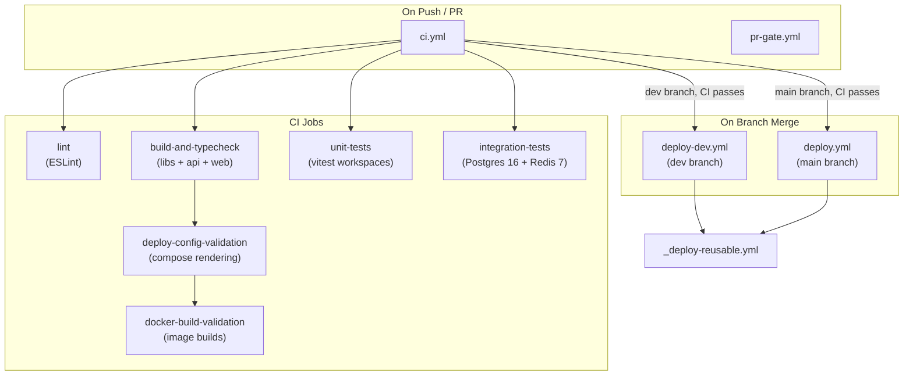
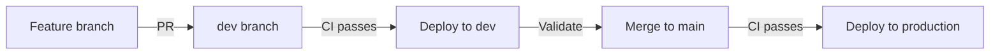
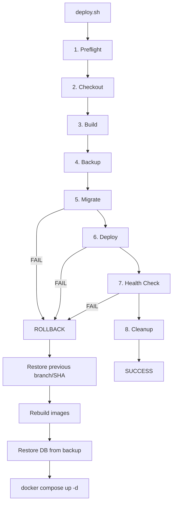

# CI/CD

GitHub Actions pipelines, deployment workflows, PR validation, and the deploy script.

---

## Pipeline Overview

---

## CI Pipeline (`ci.yml`)

Runs on every push and PR.

| Job | What It Does | Dependencies |
|-----|-------------|-------------|
| `lint` | `npx eslint .` across full project | None |
| `build-and-typecheck` | Build config, domain, shared-types, api; TypeScript type check | None |
| `unit-tests` | `vitest` across all workspaces | None |
| `integration-tests` | API integration tests with Postgres 16 + Redis 7 service containers | None |
| `deploy-config-validation` | Validates deploy.sh CLI and Docker Compose rendering for all envs | `build-and-typecheck` |
| `docker-build-validation` | Builds all Docker images including migrate profile | `deploy-config-validation` |

### Integration Test Services

CI provisions Postgres 16 and Redis 7 as GitHub Actions service containers. The `integration-tests` job runs with `RUN_POSTGRES_INTEGRATION=1`.

### Docker Build Validation

Catches Dockerfile dependency drift (e.g., missing workspace packages in COPY steps) before code reaches the deploy server. Builds all images with `--profile migrate`.

---

## PR Gate (`pr-gate.yml`)

Validates PR metadata and quality standards.

| Check | Rule |
|-------|------|
| Commit naming | `type(scope): LINEAR-TICKET: subject` pattern |
| PR metadata | Assignees required, primary labels (bug/enhancement/documentation) |
| PR body | Required sections: Problem, Solution, Testing, Risk/Rollback |
| Testing evidence | Testing section must have Evidence or Waiver with content |
| Waiver system | Naming violations allow waivers with Reason, Approved-by, Scope |

---

## Deploy Workflows

### Branch-to-Environment Mapping

| Branch | Workflow | Environment | Trigger |
|--------|----------|-------------|---------|
| `dev` | `deploy-dev.yml` | dev | Manual or on CI pass |
| `main` | `deploy.yml` | production | Automatic on CI pass |

### Promotion Flow

### Reusable Deploy Workflow (`_deploy-reusable.yml`)

Both deploy workflows call this shared workflow which:

1. Installs Cloudflare WARP on the GitHub runner
2. Enrolls into Zero Trust with a service token
3. Verifies SSH connectivity to the deploy host
4. Runs `deploy.sh` remotely via SSH
5. Collects failure diagnostics if deployment fails
6. Cleans up WARP credentials

---

## Deploy Script (`infra/scripts/deploy.sh`)

### Phases

| Phase | What It Does |
|-------|-------------|
| Preflight | Validate git, Docker, env file, compose config |
| Checkout | `git fetch` + checkout + reset to target SHA |
| Build | `docker compose --profile migrate build` |
| Backup | `pg_dump \| gzip` (pre-migration safety net) |
| Migrate | `docker compose run --rm migrate` + schema verification |
| Deploy | `docker compose up -d --remove-orphans` |
| Health Check | API `/health/live` (30s timeout) + Web `/` (20s timeout) |
| Cleanup | Remove old image tags |

### Options

| Flag | Description |
|------|-------------|
| `-e, --environment` | `dev` or `production` (required) |
| `-b, --branch` | Target branch (default: current) |
| `-t, --image-tag` | Docker image tag (default: git SHA) |
| `-f, --force` | Skip dirty-tree check |
| `-s, --select-branch` | Interactive branch selection |

### Logging

Deploy logs are written to `~/.local/state/tw-portfolio/{env}/logs/deploy/` with timestamped filenames.

---

## Validation Script (`infra/scripts/validate-local.sh`)

Validates the local Docker stack through 7 phases:

1. Preflight (docker, compose file, env file)
2. Build images (with migrate profile)
3. Start infrastructure (Postgres, Redis, wait for healthy)
4. Database migrations
5. Start applications (API, web)
6. Health checks (API at `/health/live`, web at `/`)
7. Summary + optional `--teardown`

Run via: `npm run dev:docker:validate` or `npm run dev:docker:validate:teardown`.

---

## Service Redeploy (`infra/scripts/redeploy-service.sh`)

Rebuild and restart a single service without full deployment:

| Flag | Description |
|------|-------------|
| `-e, --environment` | `local`, `dev`, or `production` |
| `--with-deps` | Also restart dependent services |
| `SERVICE` | `api` or `web` |

Runs: build target > restart > health check > report.

---

## GitHub Environment Secrets

Both `dev` and `production` environments need:

| Secret | Purpose |
|--------|---------|
| `CF_ACCESS_CLIENT_ID` | WARP service token Client ID |
| `CF_ACCESS_CLIENT_SECRET` | WARP service token Client Secret |
| `CF_TEAM_NAME` | Cloudflare Zero Trust team name |
| `DEPLOY_SSH_KEY` | Private SSH deploy key |
| `DEPLOY_KNOWN_HOSTS` | SSH host key fingerprint |
| `DEPLOY_HOST` | Private deploy host IP |
| `DEPLOY_USER` | SSH username |
| `DEPLOY_PATH` | Absolute repo path on deploy host |

`DEPLOY_PATH` must be absolute (not `~/...`) — the workflow quotes it in SSH commands where `~` doesn't expand.

---

## Related Docs

- [Runbook](./runbook.md) — first-time setup, Cloudflare prereqs, SSH target prep
- [Architecture](./architecture.md) — deployment topology diagram
- [Environment Variables](./environment-variables.md) — deploy-related env vars
