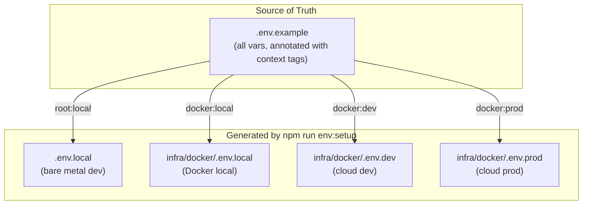
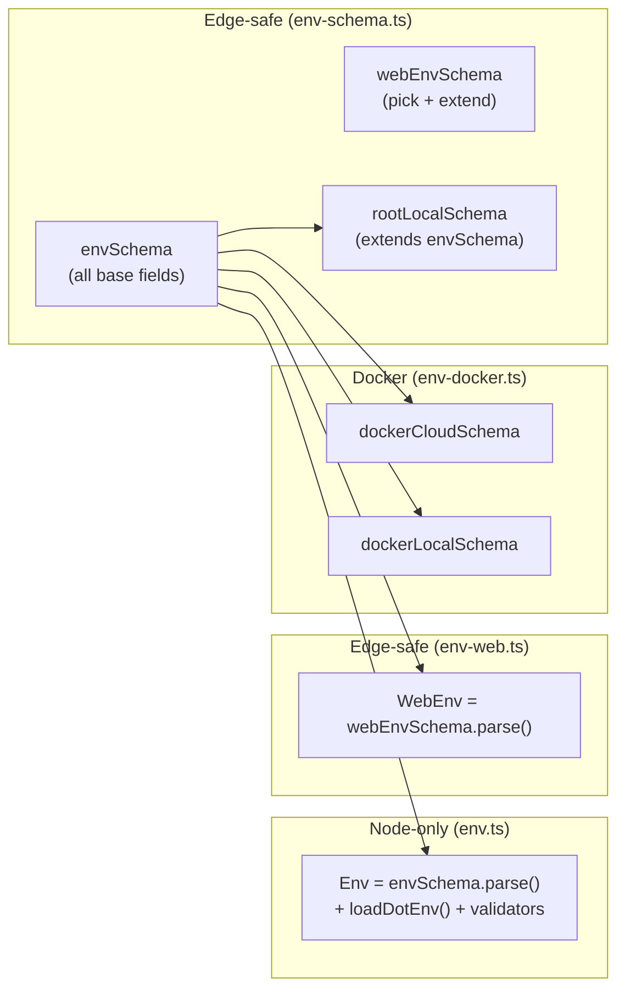
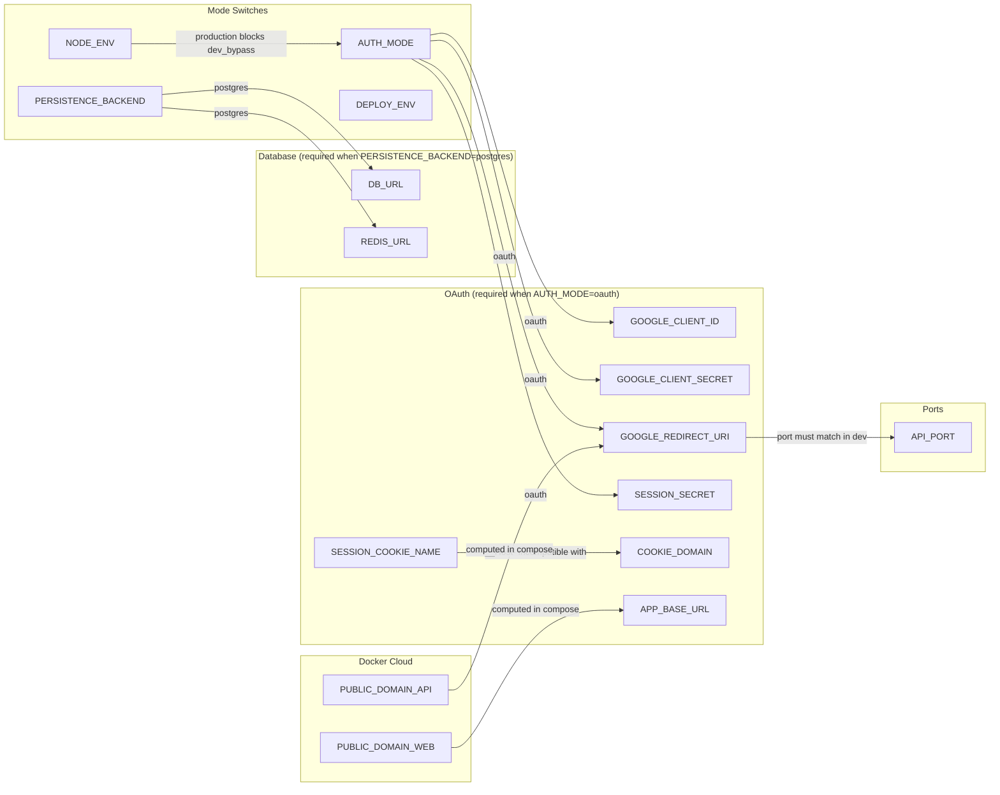
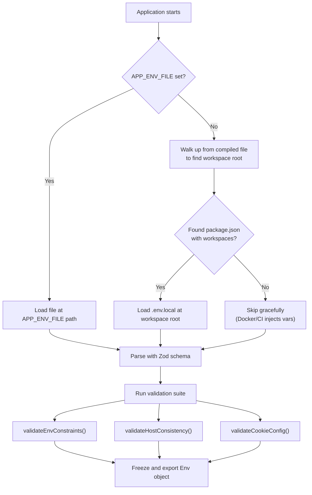
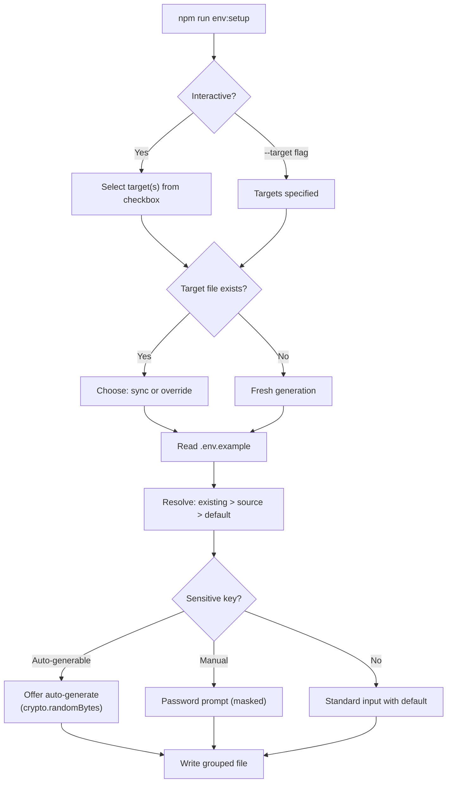

# Environment Variables

Definitive reference for all environment variables, schemas, validation rules, and the env file generation system.

---

## Env File Architecture

| Target ID | Output Path | Schema | Used By |
|-----------|-------------|--------|---------|
| `root:local` | `.env.local` | `rootLocalSchema` | Bare-metal dev (`dev:local:*`) |
| `docker:local` | `infra/docker/.env.local` | `dockerLocalSchema` | Local Docker stack |
| `docker:dev` | `infra/docker/.env.dev` | `dockerCloudSchema` | Cloud dev deployment |
| `docker:prod` | `infra/docker/.env.prod` | `dockerCloudSchema` | Production deployment |

All generated env files are **gitignored**. The `.env.example` at repo root is the single tracked reference.

---

## Schemas

Defined in `libs/config/src/`:

| Schema | File | Purpose |
|--------|------|---------|
| `envSchema` | `env-schema.ts` | Base app config (API + shared) |
| `webEnvSchema` | `env-schema.ts` | Edge Runtime subset for Next.js middleware/SSR |
| `rootLocalSchema` | `env-schema.ts` | Extends `envSchema` with `NEXT_PUBLIC_*` for bare-metal dev |
| `dockerCloudSchema` | `env-docker.ts` | Unified dev + prod Docker (domains, tunnel, infra creds) |
| `dockerLocalSchema` | `env-docker.ts` | Local Docker (no tunnel, no domains) |
| `e2eEnvSchema` | _(deferred)_ | Test-specific vars (refresh token, mock ports) |

### Import Boundary

`env-web.ts` imports only from `env-schema.ts` (Edge-safe). It must **never** import `env.ts` (uses `fs.readFileSync`). A CI guard grep check enforces this.

---

## Variable Reference

### Mode Switches

| Variable | Type | Default | Description |
|----------|------|---------|-------------|
| `NODE_ENV` | `"development"` \| `"production"` \| `"test"` | `"development"` | Runtime mode. All Docker contexts use `production` except local Docker (`test`). |
| `AUTH_MODE` | `"dev_bypass"` \| `"oauth"` | `"dev_bypass"` | Auth strategy. `dev_bypass` skips session enforcement. `oauth` requires Google OAuth. |
| `PERSISTENCE_BACKEND` | `"memory"` \| `"postgres"` | `"memory"` | Storage mode. `memory` for dev/test iteration; `postgres` for real data. |
| `DEPLOY_ENV` | `"dev"` \| `"production"` | _(Docker-only)_ | Cloud deployment tier. Distinct from `NODE_ENV`. |

### Ports

| Variable | Type | Default | Description |
|----------|------|---------|-------------|
| `API_PORT` | number | `4000` | API server listen port |
| `WEB_PORT` | number | `3000` | Next.js server listen port |
| `DB_PORT` | number | `5432` | Postgres mapped port (when `DB_URL` unset) |
| `REDIS_PORT` | number | `6379` | Redis mapped port (when `REDIS_URL` unset) |

### Database & Redis

| Variable | Type | Default | Description |
|----------|------|---------|-------------|
| `DB_URL` | string | _(computed from DB_PORT)_ | Postgres connection string. Required when `PERSISTENCE_BACKEND=postgres`. |
| `REDIS_URL` | string | _(computed from REDIS_PORT)_ | Redis connection string. Required when `PERSISTENCE_BACKEND=postgres`. |

### OAuth (required when `AUTH_MODE=oauth`)

| Variable | Type | Default | Description |
|----------|------|---------|-------------|
| `GOOGLE_CLIENT_ID` | string | _(none)_ | OAuth 2.0 client ID from Google Cloud Console |
| `GOOGLE_CLIENT_SECRET` | string | _(none)_ | OAuth 2.0 client secret |
| `GOOGLE_REDIRECT_URI` | string | _(none)_ | Callback URL. Computed in Docker compose from `PUBLIC_DOMAIN_API`. |
| `SESSION_SECRET` | string (>=32 chars) | _(none)_ | HMAC signing key for session cookies |
| `APP_BASE_URL` | string | _(none)_ | Post-login redirect base. Computed in Docker compose from `PUBLIC_DOMAIN_WEB`. |
| `GOOGLE_TOKEN_URL` | string | _(optional)_ | Override for Google token endpoint. Used by E2E mock OAuth server. |

### Cookie Configuration

| Variable | Type | Default | Description |
|----------|------|---------|-------------|
| `SESSION_COOKIE_NAME` | string | `"g_auth_session"` | Session cookie identifier. Use `__Host-` prefix only over HTTPS. |
| `COOKIE_DOMAIN` | string | _(optional)_ | Cross-subdomain cookie sharing. Required in `dockerCloudSchema` when `PUBLIC_DOMAIN_WEB != PUBLIC_DOMAIN_API`. |

### Demo Mode

| Variable | Type | Default | Description |
|----------|------|---------|-------------|
| `DEMO_MODE_ENABLED` | `"true"` \| `"false"` | `"false"` | Feature flag. Shows "Try demo" button on login page. |
| `DEMO_SESSION_TTL_SECONDS` | number | `1800` | Demo session lifetime (30 min). |
| `NEXT_PUBLIC_DEMO_MODE_ENABLED` | string | _(synced with DEMO_MODE_ENABLED)_ | Client-side rendering of demo button. |

### Security & CORS

| Variable | Type | Default | Description |
|----------|------|---------|-------------|
| `ALLOWED_ORIGINS` | string | `"http://localhost:3000"` | Comma-separated CORS allowlist |
| `RATE_LIMIT_WINDOW_MS` | number | `60000` | Rate limit window (ms) |
| `RATE_LIMIT_MAX_MUTATIONS` | number | `60` | Max write operations per window |

### Data Providers

| Variable | Type | Default | Description |
|----------|------|---------|-------------|
| `PRIMARY_PROVIDER` | string | `"twse"` | Primary market data source |
| `FALLBACK_PROVIDER` | string | `"yahoo"` | Fallback market data source |
| `DATA_PROVIDER_TIMEOUT_MS` | number | `10000` | Provider request timeout |

### Next.js (Web Only)

| Variable | Type | Description |
|----------|------|-------------|
| `NEXT_PUBLIC_AUTH_MODE` | string | Client-side auth mode. Must sync with `AUTH_MODE`. |
| `NEXT_PUBLIC_API_BASE_URL` | string | API base URL for client-side fetch. |
| `SERVER_API_BASE_URL` | string | API URL for server-side route handlers (Docker internal network). |

### Docker Cloud Only

| Variable | Type | Description |
|----------|------|-------------|
| `PUBLIC_DOMAIN_WEB` | string | Public hostname for web (e.g., `twp-web.kzokvdevs.dpdns.org`) |
| `PUBLIC_DOMAIN_API` | string | Public hostname for API (e.g., `twp-api.kzokvdevs.dpdns.org`) |
| `CLOUDFLARE_TUNNEL_TOKEN` | string | Token for Cloudflare Tunnel connector |
| `POSTGRES_USER` | string | Postgres superuser name |
| `POSTGRES_PASSWORD` | string | Postgres superuser password |
| `POSTGRES_DB` | string | Postgres database name |
| `REDIS_PASSWORD` | string | Redis AUTH password |
| `IMAGE_TAG` | string | Docker image tag (set by deploy script) |

### Sensitive Keys

These are masked during interactive prompts and should never be committed:

| Key | Auto-generable | Method |
|-----|---------------|--------|
| `POSTGRES_PASSWORD` | Yes | `openssl rand -hex 32` |
| `REDIS_PASSWORD` | Yes | `openssl rand -hex 32` |
| `SESSION_SECRET` | Yes | `openssl rand -hex 32` |
| `GOOGLE_CLIENT_SECRET` | No | Google Cloud Console |
| `CLOUDFLARE_TUNNEL_TOKEN` | No | Cloudflare dashboard |
| `GOOGLE_OAUTH_REFRESH_TOKEN` | No | `npm run auth:refresh-token` |

---

## Values Per Runtime Context

| Variable | bypass:mem | bypass:pg | oauth:mem | oauth:pg | Docker local | Cloud dev | Cloud prod |
|----------|-----------|-----------|-----------|----------|-------------|-----------|-----------|
| `NODE_ENV` | development | development | development | development | test | production | production |
| `DEPLOY_ENV` | -- | -- | -- | -- | -- | dev | production |
| `AUTH_MODE` | dev_bypass | dev_bypass | oauth | oauth | oauth | oauth | oauth |
| `PERSISTENCE_BACKEND` | memory | postgres | memory | postgres | postgres | postgres | postgres |
| `DB_URL` | -- | auto-built | -- | auto-built | compose-internal | compose-internal | compose-internal |
| `REDIS_URL` | -- | auto-built | -- | auto-built | compose-internal | compose-internal | compose-internal |
| `SESSION_COOKIE_NAME` | -- | -- | `__Host-g_auth_session` | `__Host-g_auth_session` | `g_auth_session` | `g_auth_session` | `g_auth_session` |
| `COOKIE_DOMAIN` | -- | -- | -- | -- | -- | `.kzokvdevs.dpdns.org` | `.kzokvdevs.dpdns.org` |

`--` = not applicable / not set.

---

## Validation Rules

Enforced at startup in `libs/config/src/env.ts`:

| Rule | Function | Description |
|------|----------|-------------|
| Port uniqueness | `validateEnvConstraints()` | API_PORT, WEB_PORT, DB_PORT, REDIS_PORT must all differ |
| dev_bypass restriction | `validateEnvConstraints()` | `dev_bypass` blocked when `NODE_ENV=production` (denylist) |
| OAuth required vars | `validateEnvConstraints()` | When `AUTH_MODE=oauth`: client ID, client secret, redirect URI, session secret all required |
| Hostname consistency | `validateHostConsistency()` | `APP_BASE_URL` and `GOOGLE_REDIRECT_URI` must use same hostname in development |
| Redirect port match | `validateHostConsistency()` | `GOOGLE_REDIRECT_URI` port must match `API_PORT` in development |
| Cookie prefix | `validateCookieConfig()` | `__Host-` prefix + `COOKIE_DOMAIN` is forbidden (RFC 6265bis) |
| Cross-subdomain cookie | `validateCookieDomainRequired()` | When `PUBLIC_DOMAIN_WEB != PUBLIC_DOMAIN_API`, `COOKIE_DOMAIN` must be set |

---

## Variable Dependency Graph

---

## Env Loading Flow

---

## Env File Generation Flow

Key files: `scripts/env-setup.ts` (entry), `scripts/env-setup/targets.ts` (target definitions), `scripts/env-setup/generator.ts` (file content), `scripts/env-setup/prompts.ts` (interactive input).

---

## Related Docs

- [Architecture](./architecture.md) — system structure, data flow, deployment topology
- [Auth and Session](./auth-and-session.md) — how auth variables are consumed at runtime
- [Runbook](./runbook.md) — operational guide with env setup commands
