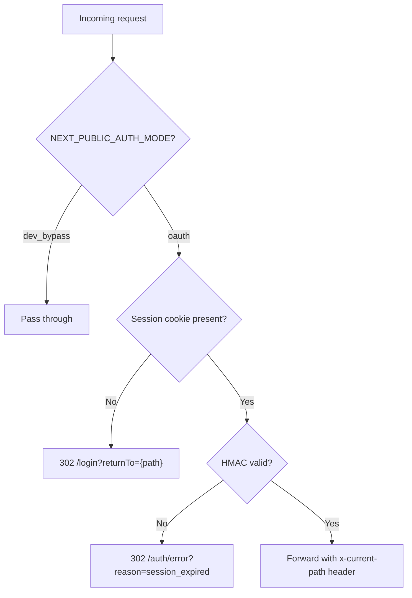

# Web Frontend Architecture

Component layering, auth middleware, session resolution, and review rules for the Next.js frontend (`apps/web`).

---

## Layering

| Layer | Location | Responsibility |
|-------|----------|---------------|
| UI primitives | `components/ui/*` | Reusable presentation (Radix UI) |
| Feature components | `components/*` (non-ui) | Presentational, consume feature hooks/models |
| Services | `features/*/services/*` | Endpoint paths, request/response contract mapping |
| Hooks | `features/*/hooks/*` | Workflow state, async orchestration, derived UI state |
| Mappers | `features/*/mappers/*` | Backend DTO to UI-facing model translation |
| Validators | `features/*/validators/*` | Pure validation logic |
| API client | `lib/api.ts` | Shared fetch wrapper |
| i18n | `lib/i18n.ts` | Feature-scoped i18n module composition |

---

## Auth Middleware

### Route Protection (`proxy.ts`)

File: `apps/web/proxy.ts` (exported as middleware via `apps/web/middleware.ts`)



**Protected**: All routes except `/login`, `/auth/error`, `/api/demo/*`, `/_next/*`, static assets.

**Edge Runtime**: `proxy.ts` runs in Edge Runtime. It imports only from `env-schema.ts` (via `env-web.ts`), never from `env.ts` (which uses `fs`).

### Session Resolution (`lib/auth.ts`)

| Function | Returns | Purpose |
|----------|---------|---------|
| `getSession()` | `Session \| null` | Public API, cached per request via `React.cache` |
| `requireSession()` | `Session` or redirects | For pages that must be authenticated |
| `resolveSession()` | `Session \| null` | Internal, mode-aware resolution |

In `dev_bypass` mode: returns cookie userId > `tw_e2e_user` cookie > `"user-1"` fallback.
In `oauth` mode: verifies HMAC signature, extracts userId and isDemo flag.

### Web API Route Handlers (`app/api/`)

Pattern: use `getSession()` + manual 401 JSON return. Never use `requireSession()` (which returns a 302 redirect, not JSON).

```
const session = await getSession(req);
if (!session) return NextResponse.json({ error: "auth_required" }, { status: 401 });
```

Forward auth to upstream API via: `headers: { "x-authenticated-user-id": session.userId }` or by forwarding the session cookie directly.

**`SERVER_API_BASE_URL`**: Server-side route handlers in Docker use the container network hostname (e.g., `http://twp-prod-api:4000`) to avoid hairpinning through Cloudflare.

### Key Auth Files

| File | Role |
|------|------|
| `proxy.ts` | Middleware: route protection, HMAC verification (Edge Runtime) |
| `lib/auth.ts` | Session resolution for Server Components and route handlers |
| `app/login/page.tsx` | Login page with Google OAuth + optional demo button |
| `app/auth/error/page.tsx` | Auth error display (invalid_state, oauth_error, session_expired) |

---

## Demo Mode Components

| Component | File | Behavior |
|-----------|------|----------|
| DemoButton | `components/DemoButton.tsx` | Calls `POST /api/demo/start`, handles rate limit (429), redirects to /dashboard |
| DemoBanner | `components/DemoBanner.tsx` | Amber bar on all protected pages when `session.isDemo=true` |
| Demo route handler | `app/api/demo/start/route.ts` | Forwards to API, constructs signed Set-Cookie on web side |
| SignInButton | `components/SignInButton.tsx` | Checks API health, navigates to `/auth/google/start` |

Demo banner shows "You're using a demo session" with TTL countdown. On session expiry (401), redirects to `/login?demoExpired=true`.

---

## `NEXT_PUBLIC_*` Build-Time vs Runtime

| Variable | Build-time (Dockerfile ARG) | Runtime (compose environment) |
|----------|---------------------------|------------------------------|
| `NEXT_PUBLIC_AUTH_MODE` | Baked into client JS bundle | Read by `proxy.ts` and `auth.ts` at runtime |
| `NEXT_PUBLIC_API_BASE_URL` | Baked into client JS bundle | Not read server-side (use `SERVER_API_BASE_URL`) |
| `NEXT_PUBLIC_DEMO_MODE_ENABLED` | Baked into client JS bundle | Controls login page demo button rendering |

Both build-time and runtime values must be set in Docker. The multi-stage build does not carry ARG/ENV to the runtime stage.

---

## Rules

- Page and layout components must not import `lib/api.ts` directly.
- Complex form components must not embed validation or API payload shaping inline.
- UI editing state should use feature models, not backend DTOs directly.
- New copy should live in feature-scoped i18n modules and be composed through `lib/i18n.ts`.

---

## Review Checklist

- Does the component own more than one responsibility?
- Does the UI know backend field names like `feeProfileRef` or `tempId`?
- Does validation live in a pure function that can be unit tested?
- Does the change add or preserve a test seam for non-trivial logic?
- Are `data-testid` selectors stable for E2E tests?

---

## Related Docs

- [Auth and Session](./auth-and-session.md) — full OAuth flow, cookie mechanics, demo lifecycle
- [Architecture](./architecture.md) — request lifecycle, build model
- [Environment Variables](./environment-variables.md) — `NEXT_PUBLIC_*` vars, web env schema
